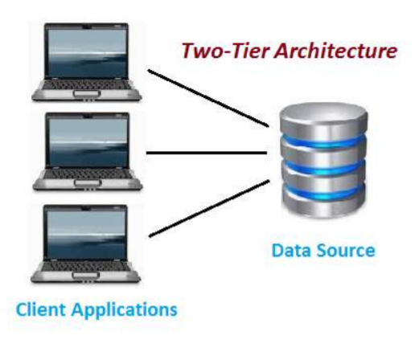
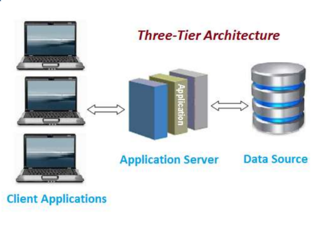

# 🚀 Day 01 - DBMS Terminology

> Placement & Interview Revision Notes

---

# 📌 What is DBMS?

DBMS (Database Management System) is software used to store, manage, retrieve, and update data efficiently.

### Interview Answer

A DBMS is software that acts as an interface between users and databases, allowing efficient storage, retrieval, and management of data.

---

# 📌 Why Do We Need DBMS?

Without DBMS:

* Data duplication increases
* Security becomes difficult
* Searching becomes slow
* Backup becomes difficult

### Advantages

* Reduced Redundancy
* Better Security
* Easy Data Retrieval
* Backup & Recovery
* Multi-user Access
* Data Consistency

### Interview Answer

DBMS is used to manage large amounts of data efficiently while ensuring security, consistency, and easy access.

---

# 📌 DBMS vs File System

| Feature      | DBMS      | File System |
| ------------ | --------- | ----------- |
| Redundancy   | Low       | High        |
| Security     | High      | Low         |
| Data Sharing | Easy      | Difficult   |
| Backup       | Available | Limited     |
| Scalability  | High      | Low         |

### Interview Answer

DBMS provides better security, consistency, and data management compared to traditional file systems.

---

# 📌 Schema

### Meaning

Schema = Structure of Database

### Example

```text
Student
├── StudentID
├── Name
└── Branch
```

### Interview Answer

Schema is the blueprint or design of a database that defines tables, columns, and relationships.

---

# 📌 Instance

### Meaning

Instance = Actual Data Present Right Now

### Example

| ID | Name  |
| -- | ----- |
| 1  | Om    |
| 2  | Rahul |

Tomorrow:

| ID | Name  |
| -- | ----- |
| 1  | Om    |
| 2  | Rahul |
| 3  | Aman  |

Data changed → Instance changed.

### Interview Answer

Instance is the current state of data stored in a database at a particular moment.

---

# 📌 Schema vs Instance

| Schema         | Instance           |
| -------------- | ------------------ |
| Structure      | Data               |
| Rarely Changes | Changes Frequently |
| Blueprint      | Current Records    |

### Memory Trick

Schema = Design

Instance = Data

### Interview Answer

Schema defines the structure of the database, whereas Instance represents the actual data stored in it.

---

# 📌 DBA (Database Administrator)

### Responsibilities

* Database Security
* Backup & Recovery
* User Management
* Performance Monitoring

### Interview Answer

A DBA is responsible for maintaining, securing, and managing databases.

---

# 📌 Two-Tier Architecture



```text
Client
   ↓
Database
```

Client directly communicates with the database.

### Advantages

* Simple
* Fast Communication

### Disadvantages

* Less Secure
* Less Scalable

### Interview Answer

In Two-Tier Architecture, the client directly communicates with the database server.

---

# 📌 Three-Tier Architecture



```text
Client
   ↓
Application Server
   ↓
Database
```

### Layers

1. Client Layer (UI)
2. Business Layer (Logic)
3. Data Layer (Database)

### Business Layer Contains

* Validation
* Authentication
* Business Logic
* Calculations

### Advantages

* Better Security
* Better Scalability
* Better Maintenance

### Interview Answer

In Three-Tier Architecture, the client communicates with the database through an application server.

---

# 📌 Two-Tier vs Three-Tier

| Feature         | Two-Tier | Three-Tier                |
| --------------- | -------- | ------------------------- |
| Layers          | 2        | 3                         |
| Security        | Low      | High                      |
| Scalability     | Low      | High                      |
| Database Access | Direct   | Through Application Layer |

---

# 🎯 Most Asked Interview Questions

### 1. What is DBMS?

Software used to manage databases efficiently.

### 2. Why do we need DBMS?

To reduce redundancy, improve security, and manage data efficiently.

### 3. What is Schema?

Schema is the structure or blueprint of a database.

### 4. What is Instance?

Instance is the current data stored in the database.

### 5. Difference between Schema and Instance?

Schema = Structure

Instance = Data

### 6. What is DBA?

Person responsible for database management and security.

### 7. What is Two-Tier Architecture?

Client directly communicates with the database.

### 8. What is Three-Tier Architecture?

Client communicates with the database through an application server.

### 9. Why is Three-Tier preferred?

Because it provides better security and scalability.

### 10. Difference between DBMS and File System?

DBMS provides security, consistency, and reduced redundancy.

---

# ⚡ Quick Revision

* DBMS = Manage Data
* Schema = Structure
* Instance = Current Data
* DBA = Database Manager
* Two-Tier = Client ↔ Database
* Three-Tier = Client ↔ Application ↔ Database
* Business Layer = Logic
* DBMS > File System
* Three-Tier > Two-Tier
