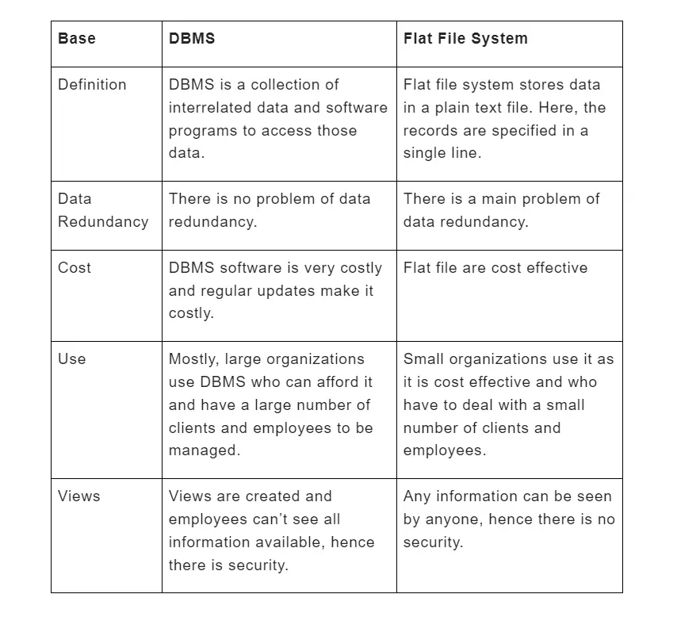

# 🚀 Day 01 - DBMS Terminology & Architecture

> Permanent DBMS Notes for Interviews, Revision, and Career Use

---

# 📌 What is DBMS?

## Definition

DBMS (Database Management System) is software used to store, manage, retrieve, update, and maintain data in a structured way.

It acts as an interface between user and database.

---

### Interview Answer

A DBMS is software that allows users and applications to efficiently store, retrieve, modify, and manage data while maintaining consistency, integrity, and security.

---

### One-Liner

```text
DBMS = software that manages databases
```

---

# 📌 Core Flow

```text
User
 ↓
DBMS
 ↓
Database
```

Image:



---

# 📌 Why DBMS?

Without DBMS:

❌ Data redundancy
❌ Data inconsistency
❌ Poor security
❌ Hard backup
❌ Difficult multi-user handling

With DBMS:

✅ Centralized storage
✅ Better security
✅ Consistency
✅ Easy backup
✅ Easy querying

---

# 📌 DBMS vs File System

| Feature     | DBMS   | File System |
| ----------- | ------ | ----------- |
| Redundancy  | Low    | High        |
| Security    | High   | Low         |
| Backup      | Easy   | Hard        |
| Consistency | Strong | Weak        |
| Querying    | Easy   | Hard        |

Memory:

```text
File System = raw storage
DBMS = smart storage
```

---

# 📌 Schema

Schema is the structure/blueprint of the database.

Defines:

* tables
* columns
* relationships
* constraints

Example:

```text
Student(ID, Name, Age)
```

One-liner:

```text
Schema = database structure
```

---

# 📌 Instance

Instance is actual data stored at a given time.

Example:

Today:

```text
1 Om
2 Rahul
```

Tomorrow:

```text
1 Om
2 Rahul
3 Aman
```

One-liner:

```text
Instance = current data snapshot
```

---

# 📌 Schema vs Instance

| Schema         | Instance           |
| -------------- | ------------------ |
| Structure      | Actual Data        |
| Rarely Changes | Frequently Changes |
| Blueprint      | Snapshot           |

Memory:

```text
Schema = Design
Instance = Live Data
```

---

# 📌 Worked Example

Schema:

```sql
CREATE TABLE Student(
 id INT,
 name VARCHAR(50),
 age INT
);
```

This is:

👉 Schema

Insert:

```sql
INSERT INTO Student VALUES (1,'Om',22);
INSERT INTO Student VALUES (2,'Rahul',21);
```

This becomes:

👉 Instance

---

# 📌 Subschema

Subschema = subset of schema.

Different users see different data.

Example:

Hospital:

Doctor sees:

* diagnosis
* history

Receptionist sees:

* contact
* billing

Memory:

```text
Subschema = personalized view
```

---

# 📌 DBA (Database Administrator)

Responsible for:

* Security
* Backup
* Recovery
* User control
* Performance optimization

One-liner:

```text
DBA = manager of database
```

---

# 📌 DBMS Architecture

---

# Two-Tier Architecture

Direct communication.

```text
Client
 ↓
Database
```

Image:


Advantages:

✅ Fast
✅ Simple

Disadvantages:

❌ Less secure
❌ Hard to scale

Example:

```text
Desktop App → MySQL
```

---

# Three-Tier Architecture

Modern architecture.

```text
Client
 ↓
Business Layer
 ↓
Database
```

Image:


---

## Layers

### Client Layer

UI Layer

Examples:

* React
* Angular
* Mobile Apps

---

### Business Layer

Contains:

* APIs
* validation
* authentication
* logic

Examples:

* Node.js
* Spring Boot
* Django

---

### Data Layer

Stores data.

Examples:

* MySQL
* PostgreSQL
* MongoDB

---

Advantages:

✅ Better security
✅ Better scalability
✅ Better maintainability

---

# Two-Tier vs Three-Tier

| Feature  | Two-Tier | Three-Tier      |
| -------- | -------- | --------------- |
| Layers   | 2        | 3               |
| Security | Low      | High            |
| Scaling  | Hard     | Easy            |
| Access   | Direct   | Through backend |

Memory:

```text
2-Tier = Direct DB
3-Tier = Through Backend
```

---

# 📌 Real World Mapping

Comsy Project:

```text
Frontend (Electron / HTML / JS)
        ↓
Backend (Node.js / Express)
        ↓
MongoDB
```

Mapping:

Frontend = Client Layer
Backend = Business Layer
MongoDB = Data Layer

This is a real 3-tier architecture.

---

# 📌 Interview Questions

### What is DBMS?

Software to manage databases.

---

### DBMS vs File System?

DBMS reduces redundancy and improves consistency.

---

### What is Schema?

Structure of database.

---

### What is Instance?

Current data snapshot.

---

### What is Subschema?

Subset of schema.

---

### What is DBA?

Person who manages database.

---

### Two-tier vs Three-tier?

Direct database communication vs backend-mediated communication.

---

# 📌 Quick Revision

```text
DBMS = manages database
Schema = structure
Instance = current data
Subschema = partial view
DBA = manager

2-Tier = Client → DB
3-Tier = Client → Backend → DB
```

---

# 🎯 Placement Focus

Must know:

⭐ DBMS vs File System
⭐ Schema vs Instance
⭐ DBA
⭐ 2-tier vs 3-tier

Next:

```text
Day-02 → ER Model
```
