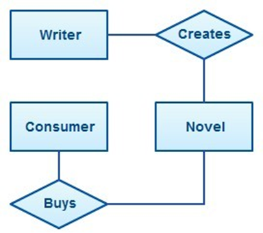
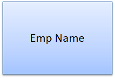
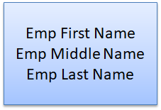

# 🚀 Day 02 - ER Model

> Permanent DBMS Notes for Interviews, Revision, and Career Use

---

# 📌 What is it?

## ER Model
The Entity-Relationship (ER) model is a conceptual data model used to describe a system in terms of entities, their attributes, and the relationships among them.

### Interview Answer
ER model helps us design a database at a high level before converting it into tables. It shows what entities exist, what properties they have, and how they are related.

### One-Liner
ER model = conceptual blueprint of database structure.

---

# 📌 Why does it matter?

ER model is used before writing tables because real systems are easier to design when we first understand the business objects and their connections.

It helps to:
- identify important data objects
- avoid missing relationships
- design a clean schema
- reduce confusion before table creation
- support better normalization later

If ER modeling is weak, the final database usually becomes messy, redundant, and hard to maintain.

---

# 📌 Core Idea

Start with the real world, extract entities, define their attributes, and connect them using relationships.

The ER model focuses on:
- what exists in the system
- what describes it
- how things are connected
- how many objects can be connected
- whether every object must participate or not

That is why ER modeling is a strong first step in database design.

---

# 📌 Key Concepts

## 1. Entity
An entity is a real-world object that can be uniquely identified.

Examples:
- Student
- Employee
- Book
- Order

### Strong Entity
Can be identified on its own.

### Weak Entity
Cannot be identified on its own and depends on another entity.

### Recursive Entity
An entity related to itself.

### Composite Entity
Used to resolve many-to-many relationships.

---

## 2. Entity Set
A collection of similar entities.

Example:
- all students = Student entity set
- all employees = Employee entity set

---

## 3. Attribute
An attribute describes an entity.

Example:
- Student → Name, Age, Address

### Types of Attributes
- **Simple** → cannot be divided further
- **Composite** → can be divided into parts
- **Derived** → calculated from other attributes
- **Multi-valued** → can hold more than one value

---

## 4. Relationship
A relationship shows how entities are connected.

Examples:
- Writer creates Novel
- Consumer buys Novel

---

## 5. Cardinality
Cardinality tells how many entities can participate in a relationship.

Types:
- one-to-one
- one-to-many
- many-to-one
- many-to-many

---

## 6. Participation
Participation tells whether all entities must participate in a relationship or not.

Types:
- **Total participation** → every entity must participate
- **Partial participation** → some entities may not participate

---

## 7. Generalization / Specialization / Aggregation
These are advanced ER features used when simple ER modeling is not enough.

- **Generalization** → combine similar lower-level entities into a higher-level entity
- **Specialization** → split a higher-level entity into sub-entities
- **Aggregation** → treat a relationship as a higher-level object

---

# 📌 Flow / Diagram / Table

## Basic ER Design Flow

```text
Real World Problem
        ↓
Identify Entities
        ↓
Identify Attributes
        ↓
Identify Relationships
        ↓
Add Cardinality / Participation
        ↓
Draw ER Diagram
        ↓
Convert to Tables
```

## ER Diagram Symbol Summary

| Concept | Symbol |
|---|---|
| Entity | Rectangle |
| Relationship | Diamond |
| Attribute | Oval |
| Weak Entity | Double Rectangle |
| Multi-valued Attribute | Double Oval |
| Derived Attribute | Dashed Oval |

---
## ER Model

**Definition:** ER Model (Entity Relationship Model) is a conceptual database design model used to represent entities, attributes, and relationships before creating database tables.



---

## Strong Entity

**Definition:** A strong entity can exist independently and has its own primary key.



---

## Weak Entity

**Definition:** A weak entity depends on another entity for identification and existence.



---

## Recursive Entity

**Definition:** A recursive entity has a relationship with itself.

**Example:** Employee manages Employee.


---

## Composite Entity

**Definition:** A composite entity (bridge entity) is created to resolve many-to-many relationships.


---

## Simple Attribute

**Definition:** An attribute that cannot be further divided.

**Example:** Age, Salary.


---

## Composite Attribute

**Definition:** An attribute that can be divided into smaller attributes.

**Example:** Name → First Name + Middle Name + Last Name.


---

## Derived Attribute

**Definition:** An attribute whose value is calculated from other attributes.

**Example:** Age derived from Date of Birth.


---

## Multi-Valued Attribute

**Definition:** An attribute that can store multiple values for a single entity.

**Example:** Phone Numbers, Skills.


---

## One-to-One Relationship (1:1)

**Definition:** One entity is associated with at most one entity of another set.

**Example:** Person ↔ Passport.


---

## One-to-Many Relationship (1:N)

**Definition:** One entity can be related to many entities.

**Example:** Department → Employees.


---

## Many-to-One Relationship (N:1)

**Definition:** Many entities can be associated with one entity.

**Example:** Employees → Department.


---

## Many-to-Many Relationship (M:N)

**Definition:** Multiple entities from both sides can be associated with each other.

**Example:** Students ↔ Courses.


---

## Total Participation

**Definition:** Every entity must participate in the relationship.

## Partial Participation

**Definition:** Participation in the relationship is optional.


---

## Generalization

**Definition:** Bottom-up approach where multiple similar entities are combined into a higher-level entity.


---

## Specialization

**Definition:** Top-down approach where one entity is divided into specialized entities.


---

## Aggregation

**Definition:** Treats a relationship set as a higher-level entity to represent relationships among relationships.


---

# 📌 Real-World Example

Think of a college database.

Entities:
- Student
- Teacher
- Course

Attributes:
- Student → Roll No, Name, Age
- Teacher → ID, Name, Subject
- Course → Code, Title

Relationships:
- Teacher teaches Course
- Student enrolls in Course

This is exactly how ER modeling helps design a real database before converting it into tables.

---

# 📌 Interview Questions

### Q1. What is an ER model?
ER model is a conceptual model used to represent entities, their attributes, and relationships in a database.

### Q2. What is an entity?
An entity is a real-world object that can be uniquely identified.

### Q3. What is a weak entity?
A weak entity cannot be uniquely identified by its own attributes and depends on another entity.

### Q4. What is an attribute?
An attribute is a property that describes an entity.

### Q5. What is a relationship in DBMS?
A relationship shows how two or more entities are associated.

### Q6. What is cardinality?
Cardinality defines the maximum number of entities that can be associated in a relationship.

### Q7. What is participation?
Participation defines whether all entities must take part in a relationship or only some.

### Q8. What is a recursive relationship?
A recursive relationship is a relationship between an entity and itself.

### Q9. What is a composite attribute?
A composite attribute can be divided into smaller subparts.

### Q10. What is a multivalued attribute?
A multivalued attribute can hold more than one value for the same entity.

### Q11. What is generalization?
Generalization combines lower-level entities into a higher-level entity based on common features.

### Q12. What is specialization?
Specialization splits a higher-level entity into smaller sub-entities.

### Q13. What is aggregation?
Aggregation treats a relationship as a higher-level entity so that it can participate in another relationship.

---

# 📌 Common Mistakes / Confusions

- Entity and entity set are not the same
- Attribute describes an entity, not a relationship
- Weak entity depends on a strong entity
- Cardinality and participation are different
- Recursive relationship means entity relates to itself
- Generalization and specialization are opposite concepts
- Multi-valued attribute is not the same as composite attribute

---

# 📌 Quick Revision

- ER model = conceptual database design
- Entity = real-world object
- Entity set = collection of similar entities
- Attribute = property of entity
- Relationship = association between entities
- Cardinality = how many can connect
- Participation = whether connection is mandatory
- Weak entity = depends on another entity
- Recursive relationship = entity relates to itself
- Generalization = bottom-up combine
- Specialization = top-down split
- Aggregation = relationship as object

---

# 📌 Interview One-Liners

- What is ER model? A conceptual model for database design.
- What is entity? A uniquely identifiable real-world object.
- What is attribute? A property of an entity.
- What is relationship? A connection between entities.
- What is cardinality? Maximum participation count in a relationship.
- What is participation? Mandatory or optional involvement in a relationship.
- What is weak entity? An entity that depends on another for identification.
- What is recursive relationship? An entity related to itself.
- What is generalization? Combining similar entities into one higher-level entity.
- What is specialization? Splitting an entity into sub-entities.
- What is aggregation? Treating a relationship as a higher-level unit.

---

# 📌 Practical / Industry Notes

ER modeling is useful in every real database design process.

In practice, it helps teams:
- understand business requirements
- design tables correctly
- prevent data duplication
- define relationships before coding
- communicate schema clearly across teams

In larger systems, ER diagrams are often reviewed before implementation because they reduce design errors early.

---

# 📌 Placement / Career Takeaway

- ER model is a core DBMS topic and appears in almost every interview path.
- Be strong in entity, attribute, relationship, cardinality, and participation.
- Do not memorize only definitions; understand how they connect in a design.
- Use one real-world example like college, hospital, or insurance.
- This chapter is the foundation for relational model and table mapping.
