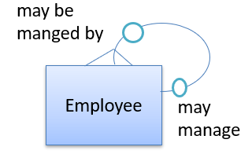
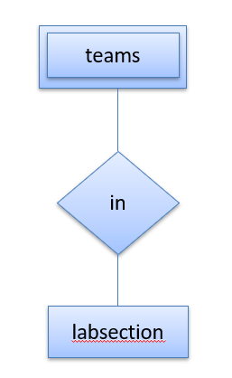
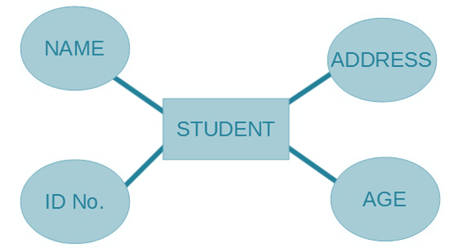
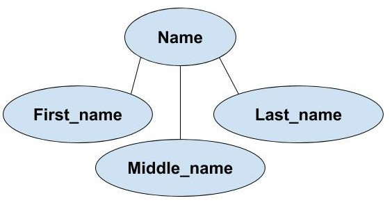
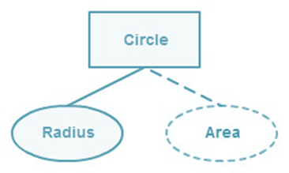
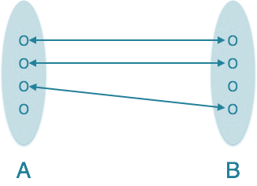
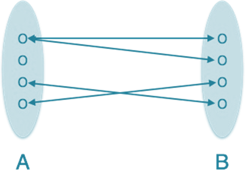
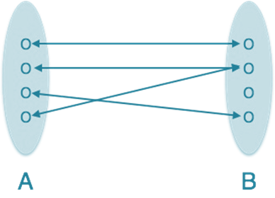
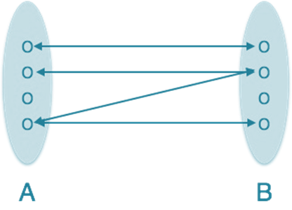
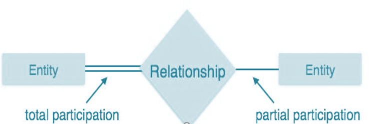

# 🚀 Day 02 - ER Model

> Permanent DBMS Notes for Interviews, Revision, and Career Use

---

# 📌 What is ER Model?

ER Model (Entity Relationship Model) is a conceptual database design model.

It represents:

* Entities
* Attributes
* Relationships

before converting them into tables.

---

### Interview Answer

ER model is used to design the structure of a database at a high level. It helps identify objects, their properties, and how they are related.

---

### One-Liner

```text
ER Model = blueprint of database design.
```

---

# 📌 Why does it matter?

Before writing SQL tables, we need to understand:

* what data exists
* how data connects
* what relationships exist

Without ER model:

* schema becomes messy
* redundancy increases
* relationships become hard to manage

ER modeling solves this.

---

# 📌 Core Idea

Think:

```text
Real World → Database
```

Steps:

1. Find entities
2. Find attributes
3. Find relationships
4. Define cardinality
5. Define participation
6. Convert to tables

---

# 📌 Full ER Model Diagram


---

# 📌 1. Entity

An entity is a real-world object that can be uniquely identified.

Examples:

* Student
* Employee
* Order
* Product

---

## Strong Entity

Independent entity.

Has its own primary key.


Example:

```text
Student(StudentID, Name)
```

Memory:

```text
Strong = Parent
```

---

## Weak Entity

Depends on another entity.

Cannot exist alone.


Example:

```text
Transaction(TransactionID, Amount)
```

Memory:

```text
Weak = Child
```

---

## Recursive Entity

Entity related to itself.

Example:

```text
Employee manages Employee
```



---

## Composite Entity

Used to break many-to-many relationships.

Acts like bridge entity.

Example:

```text
Enrollment(StudentID, CourseID)
```



---

# 📌 2. Entity Set

Collection of similar entities.

Example:

```text
All students = Student entity set
```

---

# 📌 3. Attribute

Properties of entities.

Example:

```text
Student → Name, Age, Address
```

---

## Simple Attribute

Cannot be divided.

Example:

```text
Age
```



---

## Composite Attribute

Can be divided.

Example:

```text
Name → First + Middle + Last
```



---

## Derived Attribute

Calculated from another attribute.

Example:

```text
Age from DOB
```



---

## Multi-Valued Attribute

Can have multiple values.

Example:

```text
Phone Numbers
```


---

# 📌 4. Relationship

Shows connection between entities.

Example:

```text
Student ENROLLS Course
Teacher TEACHES Course
```


---

# 📌 5. Cardinality

Defines how many entities participate.

---

## One-to-One (1:1)

Example:

```text
Person ↔ Passport
```



---

## One-to-Many (1:N)

Example:

```text
Department → Employees
```



---

## Many-to-One (N:1)

Example:

```text
Employees → Department
```



---

## Many-to-Many (M:N)

Example:

```text
Students ↔ Courses
```



Important:

M:N usually creates bridge table.

Example:

```text
Enrollment(StudentID, CourseID)
```

---

# 📌 6. Participation

Defines mandatory or optional involvement.

---

## Total Participation

Every entity must participate.

---

## Partial Participation

Participation is optional.



Memory:

```text
Total Participation = Must participate
Partial Participation = Optional
```

---

# 📌 Real World Example

College Database:

Entities:

* Student
* Teacher
* Course
* Department

Relationships:

```text
Student ENROLLS Course
Teacher TEACHES Course
Teacher BELONGS Department
```

Flow:

```text
Student ---- Enrolls ---- Course
Teacher ---- Teaches ---- Course
Teacher ---- Belongs ---- Department
```

---

# 📌 Interview Questions

### What is ER model?

Conceptual design of database.

---

### Strong vs Weak entity?

```text
Strong = independent
Weak = dependent
```

---

### What is attribute?

Property of entity.

---

### What is relationship?

Connection between entities.

---

### What is cardinality?

Defines relationship count.

---

### What is participation?

Defines mandatory/optional involvement.

---

### What is recursive entity?

Entity related to itself.

---

### What is composite entity?

Bridge entity for many-to-many.

---

# 📌 Common Mistakes

❌ Entity = Entity Set
✔ Entity is one object

❌ Cardinality = Participation
✔ Different concepts

❌ Weak Entity = Strong Entity
✔ Weak depends on strong

---

# 📌 Quick Revision

```text
ER Model = DB Blueprint
Entity = Object
Entity Set = Collection
Attribute = Property
Strong Entity = Independent
Weak Entity = Dependent
Recursive Entity = Self relation
Composite Entity = Bridge entity
Relationship = Connection
Cardinality = Count
Participation = Mandatory / Optional
```

---

# 🎯 Placement Focus

Must know:

⭐ Strong vs Weak Entity
⭐ Attribute Types
⭐ Relationship Types
⭐ Cardinality
⭐ Participation
⭐ Recursive Entity
⭐ Many-to-Many conversion

Next:

```text
Day-03 → Extended ER Model
```
