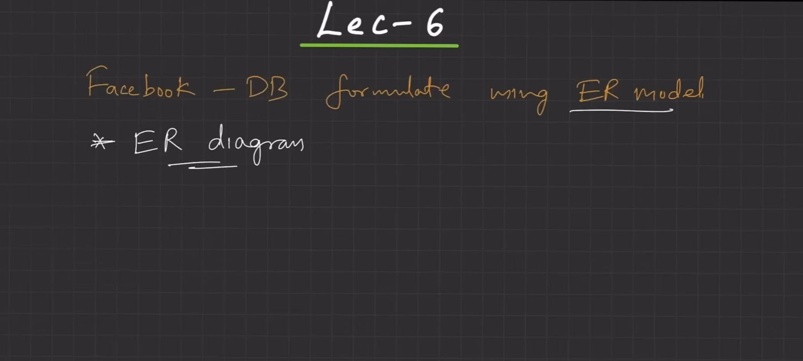

# 🚀 Day 05 - Facebook ER Diagram Case Study

> Real-world ER Design Practice

---

# 📌 Problem Statement

Design the database for Facebook.

Features:

* User profile
* Friend system
* Posts
* Likes
* Comments

This is how real companies start.

Not by tables.

By features.

---

# Step 1: Identify Features

System should support:

* User creates profile
* User adds friends
* User creates posts
* User likes posts
* User comments on posts

Stored:


---

# Step 2: Identify Entities

From features:

```text
User_Profile
User_Post
Post_Comment
Post_Like
```

Rule:

```text
Nouns = Entities
```

Stored:


---

# Step 3: Identify Attributes

---

## User_Profile

```text
User_ID
Name
Username
Email
Password
Contact_No
DOB
Age
```

---

## User_Post

```text
Post_ID
Text_Content
Image
Video
Created_At
Modified_At
```

---

## Post_Comment

```text
Comment_ID
Text_Content
Timestamp
```

---

## Post_Like

```text
Like_ID
Timestamp
```

Stored:




---

# Step 4: Identify Relationships

---

## Friendship

```text
User ↔ User
M:N
```

---

## Posts

```text
User → Post
1:N
```

---

## Comments

```text
User → Comment
1:N
Post → Comment
1:N
```

---

## Likes

```text
User → Like
1:N
Post → Like
1:N
```

Stored:


---

# Step 5: Final ER Diagram

Final combined diagram:

Stored:


---

# 📌 Learning Formula

Always solve like:

```text
Features
↓
Entities
↓
Attributes
↓
Relationships
↓
Cardinality
↓
Participation
↓
ER Diagram
```

This is the permanent process.

---

# 📌 System Design Connection

Facebook HLD:

```text
User Service
Post Service
Comment Service
Like Service
Friend Service
```

Entities become services.

---

Database tables:

```text
users
posts
comments
likes
friendships
```

Entities become tables.

---

LLD:

```java
class User
class Post
class Comment
class Like
```

Entities become classes.

---

# 📌 Interview Questions

### How do you start ER design?

Start with features.

---

### How do you identify entities?

Find nouns.

---

### How do you identify relationships?

Find actions.

---

### How do you identify cardinality?

Ask:

How many?

---

# 📌 Quick Revision

```text
Nouns = Entities
Properties = Attributes
Actions = Relationships
Numbers = Cardinality
Rules = Constraints
```

This is how engineers think.

---