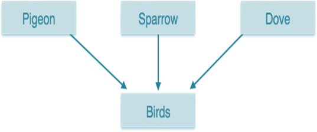
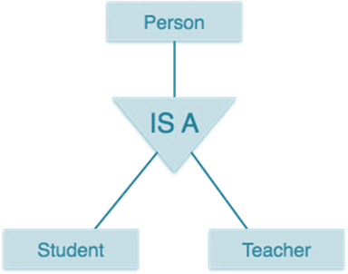
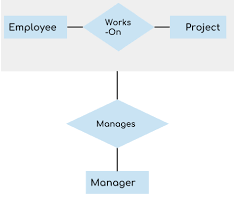
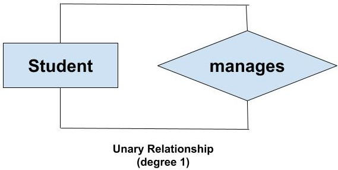
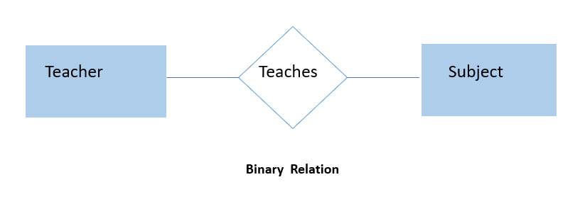
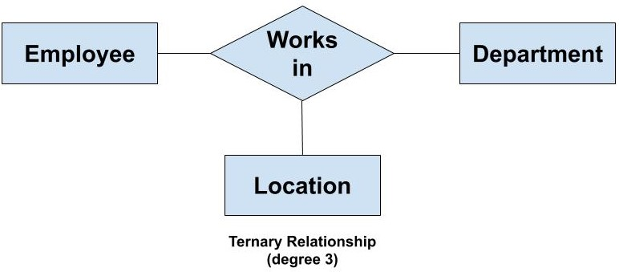
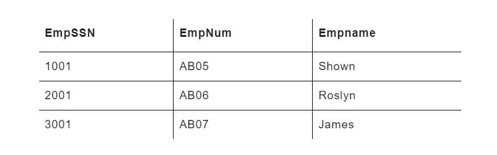
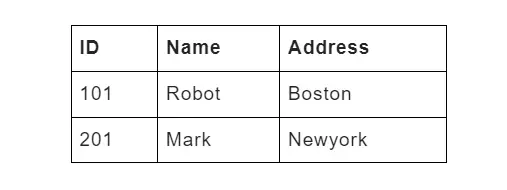
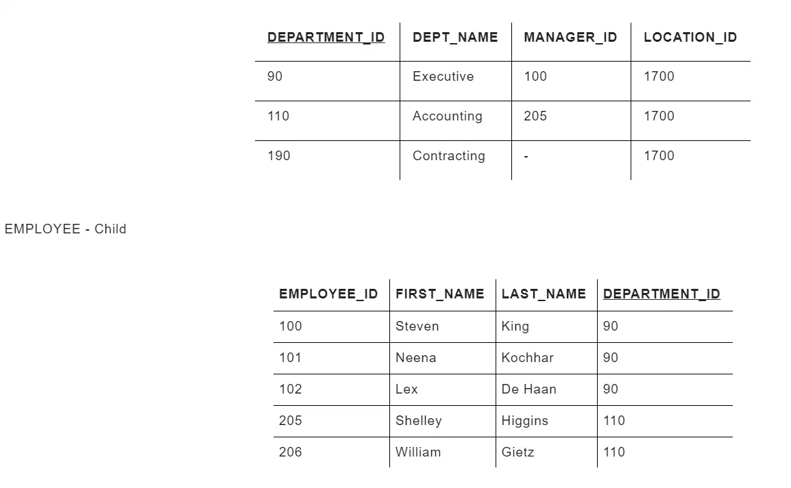

# 🚀 Day 04 - Extended ER Model

> Permanent DBMS Notes for Interviews, Revision, and Career Use

---

# 📌 What is Extended ER Model?

Extended ER Model (EER) is the advanced version of the ER model.

It introduces more abstraction to model complex systems.

ER → basic  
EER → advanced

Used when:

- hierarchy exists
- inheritance exists
- complex relationship exists

---

# 📌 Why does it matter?

Real systems are rarely flat.

Example:

A user can be:

- Customer
- Seller
- Admin

Simple ER cannot model this cleanly.

EER helps:

- reduce duplication
- improve abstraction
- improve scalability of schema design

---

# 📌 Core Concepts

EER mainly introduces:

- Generalization
- Specialization
- Aggregation
- Relationship Degree
- Keys Revision

---

# 📌 Generalization

Bottom-up approach.

Combines multiple lower-level entities into one higher-level entity.

Example:

Savings + Current → Account

---

## Diagram

---

### Quick Definition

Generalization = combine similar entities.

---

# 📌 Specialization

Top-down approach.

Break one entity into sub-entities.

Example:

Person → Student + Teacher

---

## Diagram

---

### Quick Definition

Specialization = divide one entity into more specific entities.

---

# 📌 Aggregation

Relationship treated as an entity.

Used when relationship itself has meaning.

Example:

Employee works on Project  
Manager manages this relationship

---

## Diagram

---

### Quick Definition

Aggregation = abstraction over relationship.

---

# 📌 Degree of Relationship

Degree = number of participating entities.

---

# Unary Relationship (Degree 1)

Entity related to itself.

Example:

Employee manages Employee

---

## Diagram

---

# Binary Relationship (Degree 2)

Two entities.

Example:

Teacher teaches Subject

---

## Diagram

---

# Ternary Relationship (Degree 3)

Three entities.

Example:

Employee works in Department at Location

---

## Diagram

---

# 📌 Keys Revision

Important before relational model.

---

# Super Key

Any attribute(s) that uniquely identifies rows.

May have extra attributes.

Example:

EmpID  
EmpID + Name

---

## Diagram

---

# Candidate Key

Minimal super key.

No unnecessary attribute.

---

## Diagram

---

# Primary Key

Chosen candidate key.

Rules:

- unique
- not null

---

# Foreign Key

Used to connect tables.

Maintains referential integrity.

---

## Diagram

---

# 📌 Interview Questions

## What is generalization?

Combining multiple similar entities into one generalized entity.

---

## Generalization vs Specialization?

Generalization → Bottom-up  
Specialization → Top-down

---

## What is aggregation?

Treating relationship as a higher-level entity.

---

## What is unary relation?

Relationship where entity relates to itself.

---

## Difference between super key and candidate key?

Super key may contain extra attributes.  
Candidate key is minimal.

---

# 📌 Common Mistakes

❌ Generalization = Specialization  
✔ Opposite

❌ Candidate key = Primary key  
✔ Primary key is selected candidate key

❌ Aggregation = Normal relationship  
✔ Aggregation is higher abstraction

---

# 📌 Quick Revision

- EER extends ER
- Generalization = Bottom-up
- Specialization = Top-down
- Aggregation = relationship abstraction
- Unary = self relation
- Binary = 2 entities
- Ternary = 3 entities
- Super key can have extra fields
- Candidate key is minimal
- Primary key cannot be null
- Foreign key connects tables

---

# 📌 Industry Notes

Used in:

- Banking systems
- HR systems
- E-commerce systems
- ERP systems

This directly helps in:

- database schema design
- backend architecture
- ORM relations
- system design

---

# 📌 Next

Next chapter:

➡ Day-05-Relational-Model

Important because:

ER → Relational mapping starts there.
SQL understanding becomes much easier after that.