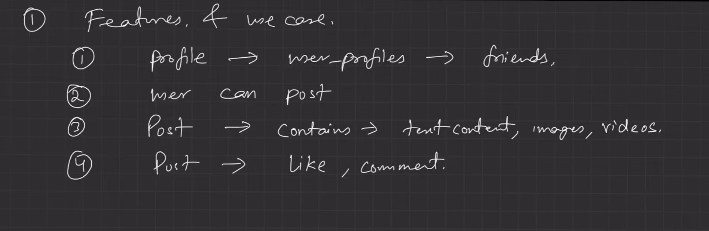
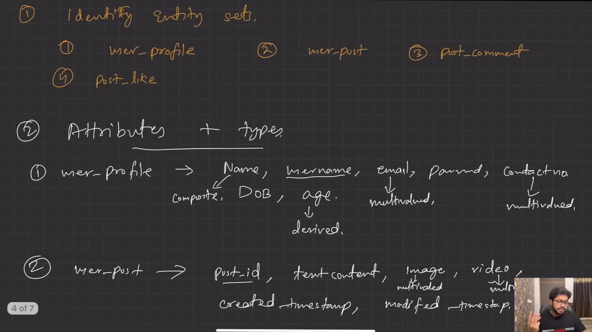
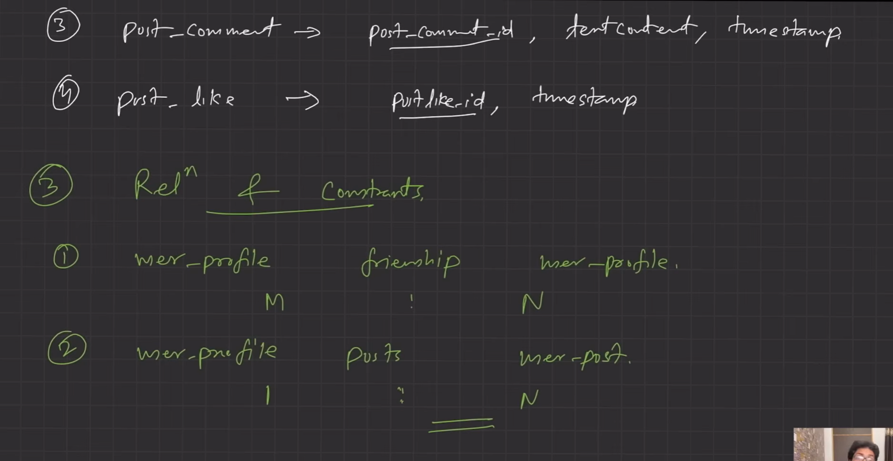
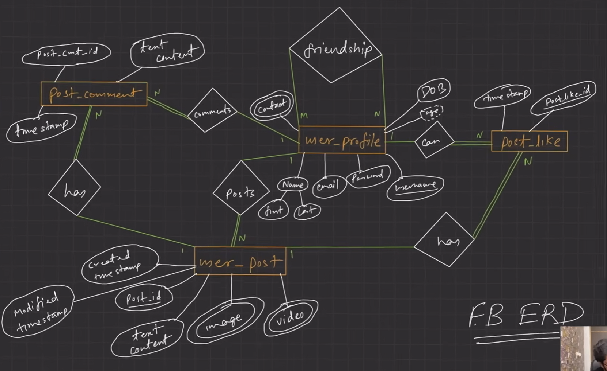

# 🚀 Day 04 - Facebook ER Diagram Case Study

> Applying EER concepts on real-world Facebook system

---

Flow:

```text
Features
↓
Entities
↓
Attributes
↓
Relationships
↓
Constraints
↓
Final ER Diagram
↓
Tables
↓
Backend APIs
```

---

# Step 1 - Features



---

# Step 2 - Entities + Attributes



---

# Step 3 - Relationships



---

# Step 4 - Final ERD



---

# 📌 System Design Mapping

```text
User Service
Post Service
Comment Service
Like Service
Friendship Service
```

Tables:

```text
users
posts
comments
likes
friendships
```

LLD:

```java
class User {}
class Post {}
class Comment {}
class Like {}
class Friendship {}
```

---

# Interview Learning

This is how backend engineers think:

```text
Problem
→ Features
→ Data
→ Relationships
→ Database
→ APIs
```

This is real-world DBMS + System Design bridge.
