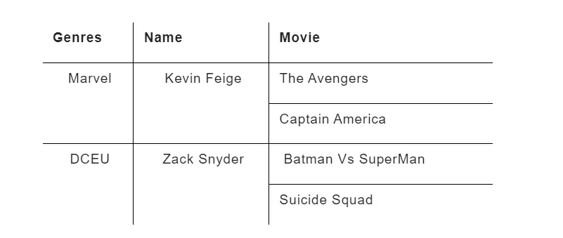
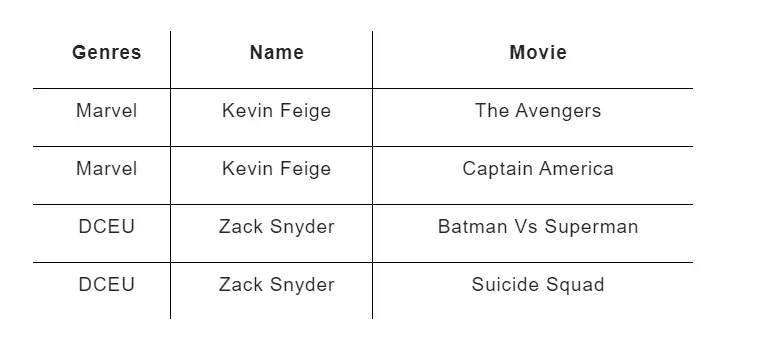
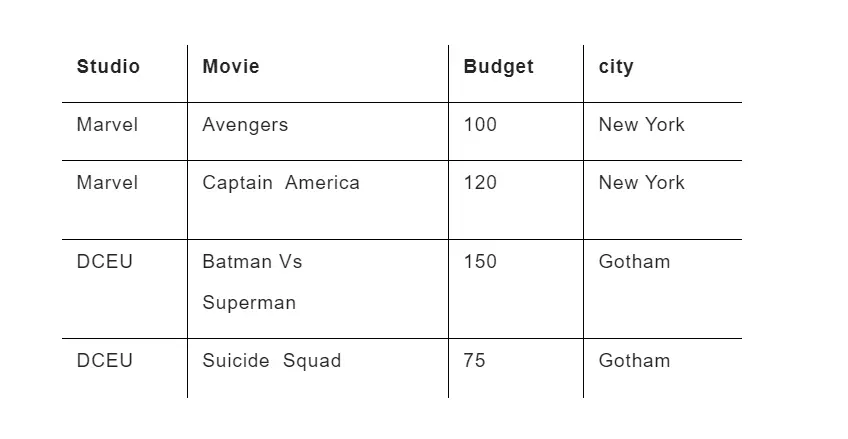
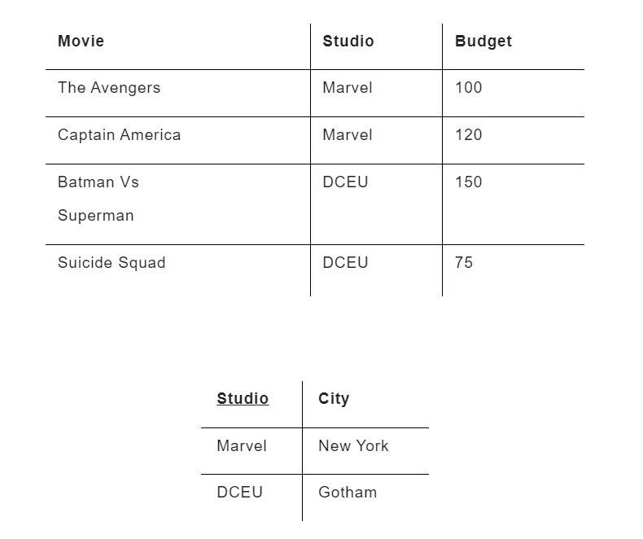
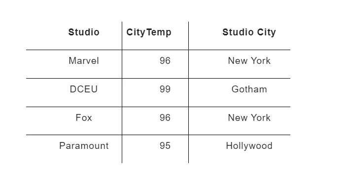
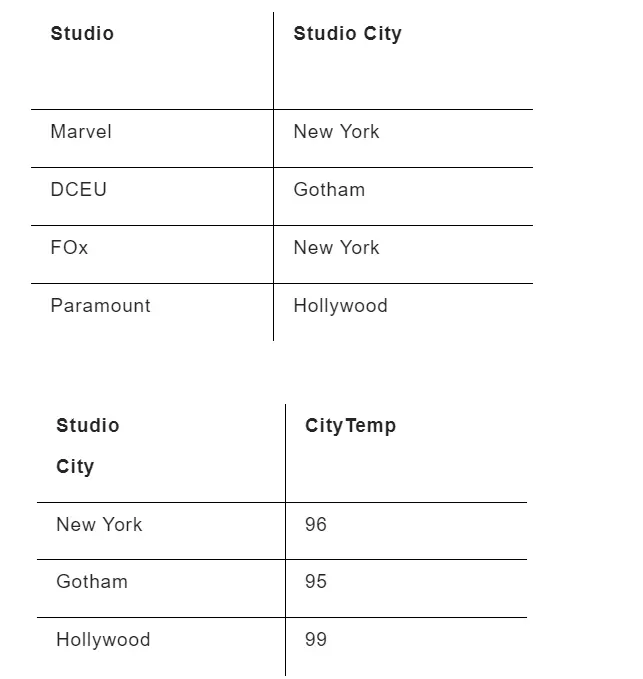
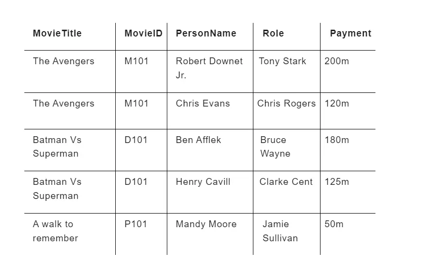
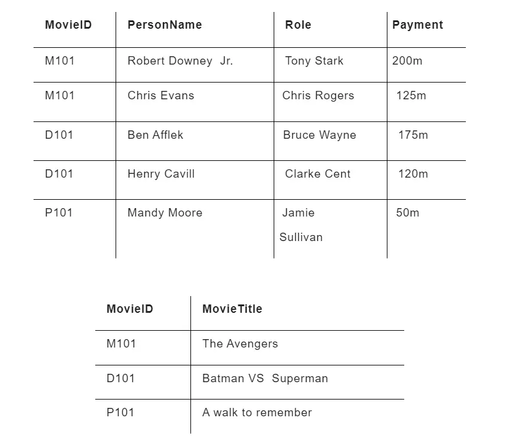
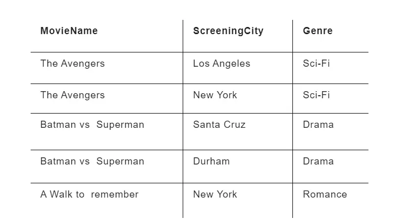

# 🚀 Day 06 - Normalization

> Removing redundancy, fixing anomalies, and designing optimized database schemas.

---

# 📌 What is Normalization?

Normalization is the process of breaking large tables into smaller related tables.

Goal:

✅ Reduce redundancy
✅ Remove anomalies
✅ Improve consistency
✅ Improve maintainability

Definition:

```text
Big Table → Smaller Related Tables
```

---

# 📌 Why Normalization?

Without normalization:

❌ Duplicate data
❌ Hard updates
❌ Data inconsistency
❌ Wasted storage

Example:

| Student_ID | Name | Course | Teacher |
| ---------- | ---- | ------ | ------- |
| 1          | Om   | DBMS   | Babbar  |
| 2          | Om   | SQL    | Babbar  |

Problem:

Name repeated.

Redundancy exists.

---

# 📌 Types of Anomalies

---

## Insertion Anomaly

Cannot insert data independently.

Example:

Cannot add Teacher unless student exists.

---

## Update Anomaly

Need multiple row updates.

Risk of inconsistency.

Example:

Teacher changes name.

Must update many rows.

---

## Deletion Anomaly

Deleting one row may remove useful data.

Example:

Deleting last student removes course info.

---

# 📌 Functional Dependency Revision

Normalization uses FD.

Syntax:

```text
X → Y
```

Meaning:

X determines Y.

Example:

```text
Student_ID → Name
```

Important:

* Trivial FD
* Non-Trivial FD
* Partial Dependency
* Transitive Dependency
* Multivalued Dependency

---

# 📌 First Normal Form (1NF)

Rule:

```text
Atomic values only
No repeating groups
```

Violation:



Problem:

Multiple values in one cell.

Solution:



Interview line:

1NF removes repeating groups.

---

# 📌 Second Normal Form (2NF)

Conditions:

* Must be in 1NF
* No partial dependency

Rule:

```text
Non-prime attribute must depend on FULL key
```

Violation:



Problem:

City depends only on Studio.

Solution:



Split:

```text
(Movie, Studio, Budget)
(Studio, City)
```

Interview line:

2NF removes partial dependency.

---

# 📌 Third Normal Form (3NF)

Conditions:

* Must be in 2NF
* No transitive dependency

Rule:

```text
Non-key depends only on primary key
```

Violation:



Problem:

```text
Studio → City
City → Temp
Studio → Temp
```

Indirect dependency.

Solution:



Split:

```text
(Studio, City)
(City, Temp)
```

Interview line:

3NF removes transitive dependency.

---

# 📌 BCNF

Rule:

```text
Every determinant must be candidate key
```

Stronger than 3NF.

Violation:



Solution:



Interview line:

BCNF removes candidate-key dependency issues.

---

# 📌 Fourth Normal Form (4NF)

Rule:

```text
No multivalued dependency
```

Violation:



Problem:

Movie has multiple cities and genres.

Solution:

Split:

```text
(MovieName, ScreeningCity)
(MovieName, Genre)
```

Interview line:

4NF removes multivalued dependency.

---

# 📌 Denormalization

Opposite of normalization.

Used for:

✅ Faster reads
❌ More redundancy

Used in:

* Analytics
* Reporting
* OLAP systems

Memory:

```text
Normalize until it hurts
Denormalize until it works
```

---

# 📌 Interview Questions

### Difference between 2NF and 3NF?

2NF removes partial dependency.

3NF removes transitive dependency.

---

### Difference between 3NF and BCNF?

BCNF is stricter.

---

### Why normalization?

To remove redundancy and anomalies.

---

### What is denormalization?

Adding redundancy for performance.

---

# 📌 Quick Revision

```text
1NF → Atomic
2NF → Remove Partial
3NF → Remove Transitive
BCNF → Determinant Candidate Key
4NF → Remove Multivalued
```

Memory:

```text
Atomic → Partial → Transitive → Candidate → Multi-value
```

---

# 🎯 Placement Focus

Must know:

⭐ Functional Dependency
⭐ Partial Dependency
⭐ Transitive Dependency
⭐ 1NF
⭐ 2NF
⭐ 3NF
⭐ BCNF
⭐ 4NF
⭐ Denormalization
