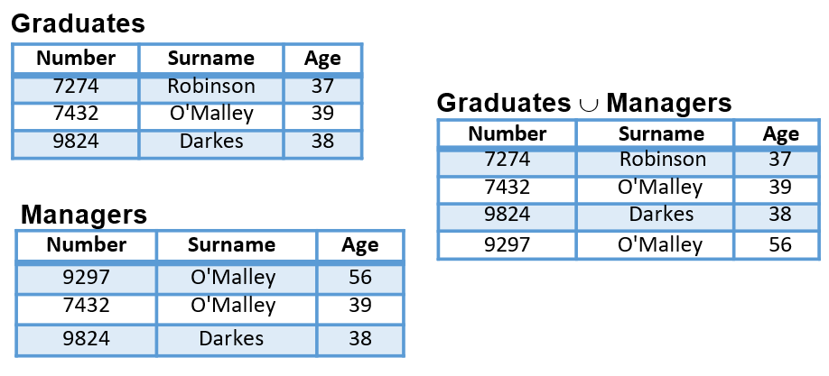
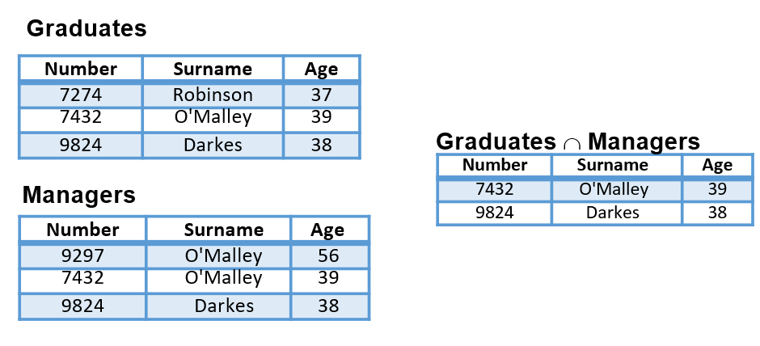
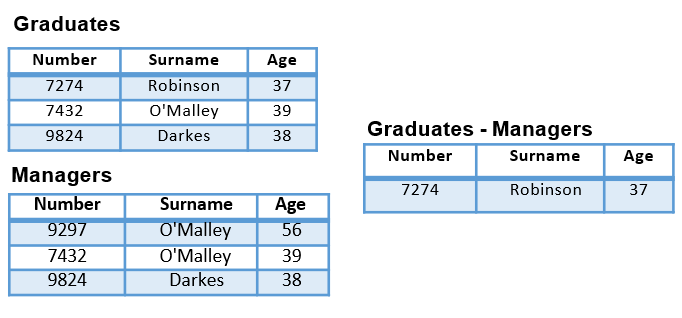
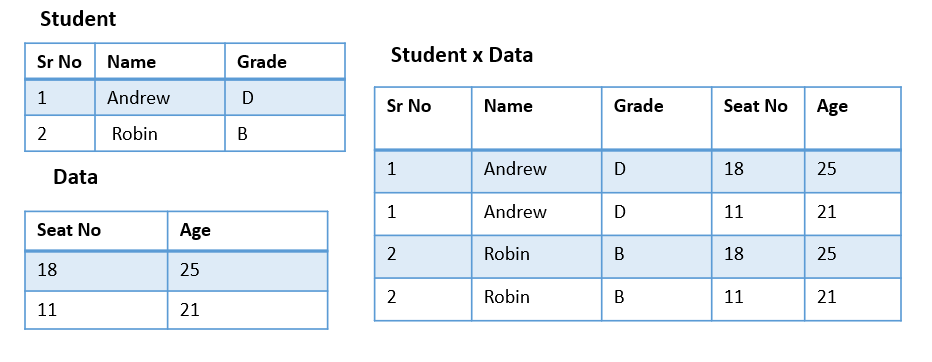
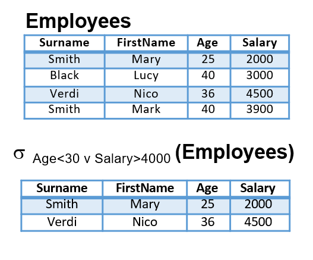
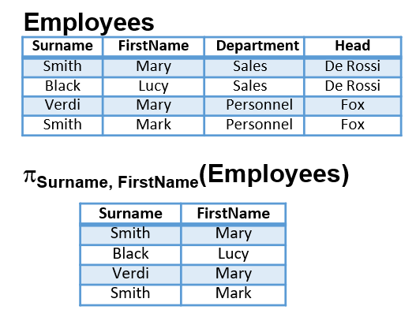
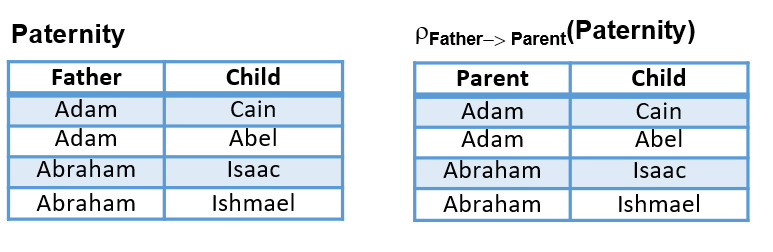
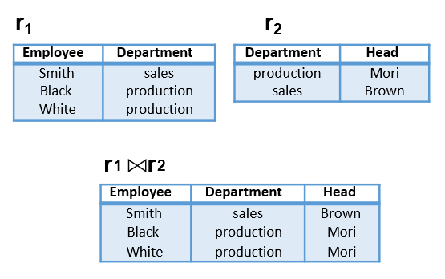

# 🚀 Day 07 - Relational Algebra

> Querying relational databases using mathematical operations.

---

# 📌 What is Relational Algebra?

Relational Algebra is a **procedural query language**.

It tells:

```text
What to retrieve
How to retrieve
```

Works on relations (tables).

Input:

```text
Relation
```

Output:

```text
Relation
```

Important property:

Every operation takes one or more relations and returns a relation.

---

# 📌 Types of Operations

Two categories:

## Unary Operations

Works on one relation.

* Select (σ)
* Project (π)
* Rename (ρ)

---

## Binary Operations

Works on two relations.

* Union (∪)
* Intersection (∩)
* Set Difference (-)
* Cartesian Product (×)
* Join (⋈)

---

# 📌 Set Operations

Relations must be **Union Compatible**

Means:

* Same number of attributes
* Same data type

---

# 1. Union (∪)

Combines tuples from both tables.

Formula:

```text
R ∪ S
```

Rules:

* Duplicate removed
* Union compatible required

Visual:



Interview line:

Union returns all unique tuples.

---

# 2. Intersection (∩)

Returns common tuples.

Formula:

```text
R ∩ S
```

Visual:



Shortcut:

```text
R ∩ S = R - (R - S)
```

Interview line:

Intersection returns common records.

---

# 3. Set Difference (-)

Returns tuples in first relation but not second.

Formula:

```text
R - S
```

Visual:



Interview line:

Difference subtracts tuples.

---

# 4. Cartesian Product (×)

Pairs every tuple of R with every tuple of S.

Formula:

```text
R × S
```

Visual:



Important:

If:

```text
R has m rows
S has n rows
```

Result:

```text
m × n rows
```

---

# 📌 Unary Operations

---

# 5. Select (σ)

Filters rows.

Works horizontally.

Formula:

```text
σ condition(R)
```

Visual:



Example:

```text
σ Age > 30 (Employees)
```

Returns rows satisfying condition.

Used operators:

```text
< > = <= >= !=
```

Interview line:

Selection filters tuples.

---

# 6. Project (π)

Selects columns.

Works vertically.

Formula:

```text
π attributes(R)
```

Visual:



Example:

```text
π Name, Salary (Employees)
```

Important:

Duplicates removed.

Interview line:

Projection filters attributes.

---

# 7. Rename (ρ)

Changes relation name.

Formula:

```text
ρ OldName → NewName
```

Visual:



Example:

```text
ρ Father → Parent(Paternity)
```

Interview line:

Used for temporary renaming.

---

# 📌 Join Operation (⋈)

Combines related tuples.

Very important.

Formula:

```text
R ⋈ S
```

Think:

```text
Cartesian Product + Select
```

Used heavily in SQL JOINs.

---

# Natural Join

Combines on common attributes automatically.

Visual:



Rule:

Duplicate common columns removed.

Interview line:

Natural join uses same attribute names.

---

# Theta Join

Join using condition.

Formula:

```text
R ⋈ condition S
```

Condition:

```text
< <= > >= = !=
```

Example:

```text
Employee.salary > Department.salary
```

Interview line:

Theta join uses explicit condition.

---

# 📌 Quick Comparison

| Operator          | Works On | Filters         |
| ----------------- | -------- | --------------- |
| Select            | Rows     | Horizontal      |
| Project           | Columns  | Vertical        |
| Union             | Rows     | Combine         |
| Intersection      | Rows     | Common          |
| Difference        | Rows     | Subtract        |
| Cartesian Product | Rows     | Multiply        |
| Join              | Rows     | Combine related |

---

# 📌 SQL Mapping

Relational Algebra → SQL

```text
σ → WHERE
π → SELECT columns
∪ → UNION
∩ → INTERSECT
− → EXCEPT
× → CROSS JOIN
⋈ → JOIN
ρ → ALIAS
```

Very important for interviews.

---

# 📌 Interview Questions

### Difference between Select and Project?

Select:

Filters rows.

Project:

Filters columns.

---

### Difference between Natural Join and Theta Join?

Natural Join:

Automatic common attributes.

Theta Join:

Manual condition.

---

### What is Cartesian Product?

Combines every tuple with every tuple.

---

### Why is Relational Algebra important?

Foundation of SQL query execution.

---

# 📌 Quick Revision

```text
σ = Select (Rows)
π = Project (Columns)
ρ = Rename

∪ = Union
∩ = Intersection
− = Difference
× = Cartesian Product
⋈ = Join
```

Memory:

```text
Select = Horizontal
Project = Vertical
Join = Combine
```

---

# 🎯 Placement Focus

Must know:

- ⭐ Select vs Project
- ⭐ Union compatibility
- ⭐ Join types
- ⭐ Cartesian product
- ⭐ Natural Join
- ⭐ Theta Join
- ⭐ SQL mapping

Next:

```text
Day-08 → SQL Basics (DDL + DML)
```
