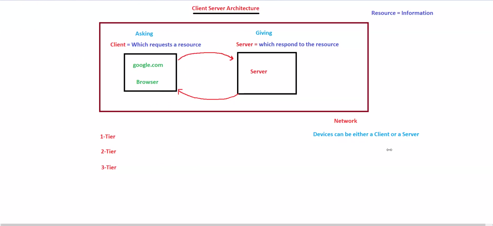
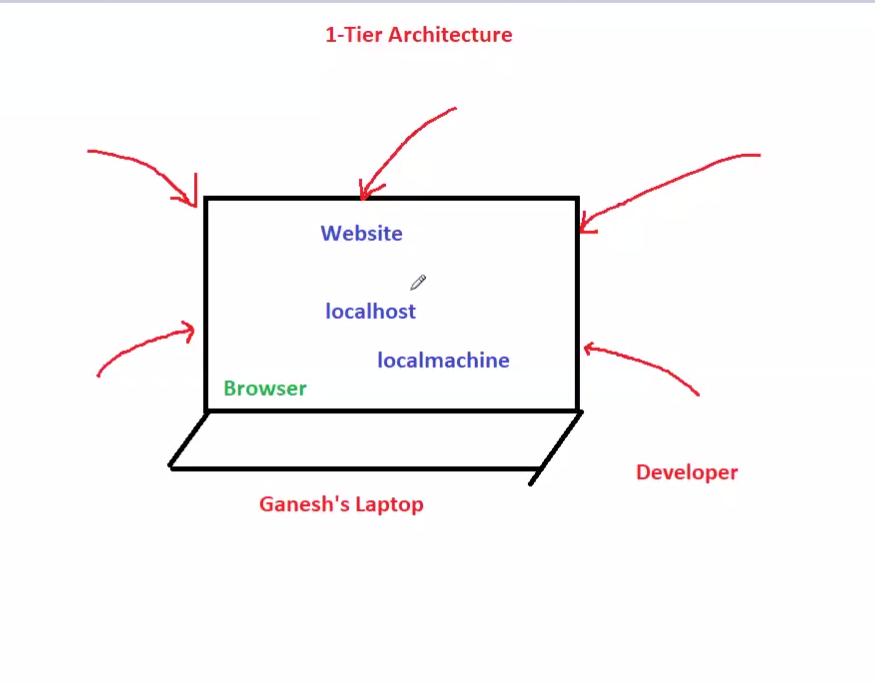
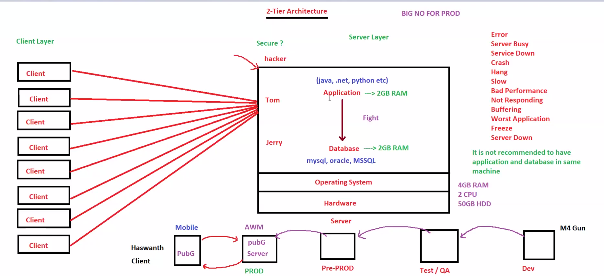
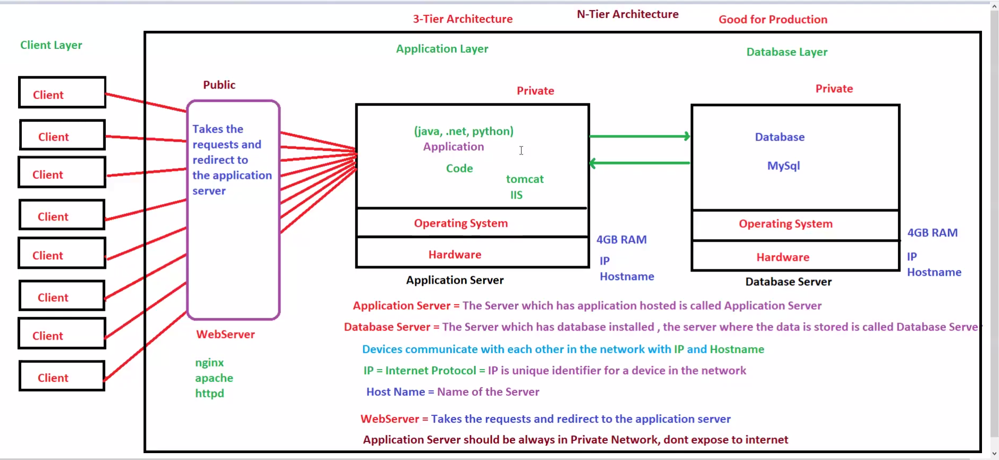

# ☁️ Day 01 - Architecture Fundamentals

## 📌 Goal

Understand how applications are built, scaled, and structured before deploying them on AWS.

This module covers:

* Client-Server Architecture
* 1-Tier Architecture
* 2-Tier Architecture
* 3-Tier Architecture

These are the foundation for:

* AWS SAA
* DevOps
* System Design
* Backend Development
* Production Architecture

---

# 🧠 Big Picture First

Before learning AWS, understand how requests travel:

```text
User
 ↓
DNS
 ↓
Load Balancer
 ↓
Application Server
 ↓
Database
```

This is the backbone of almost every system.

---

# 1. Client-Server Architecture

## What is it?

The basic communication model between users and applications.

Two parts:

* Client → Sends request
* Server → Processes and responds

---

## Flow

```text
Client → Request → Server → Response → Client
```

Example:

```text
Browser → Google Server → Response
```

---

## Real World Example

When opening:

* YouTube
* Amazon
* Google

Your browser acts as client.

---

## Architecture Diagram



---

## AWS Mapping

| Layer    | AWS Service      |
| -------- | ---------------- |
| Client   | Browser / Mobile |
| DNS      | Route53          |
| Server   | EC2              |
| Delivery | CloudFront       |

---

## Problem

Good for basics.

But not scalable.

---

# 2. Single Tier Architecture

## What is it?

Everything runs in one machine:

* UI
* Backend
* Database

---

## Flow

```text
User
 ↓
Single Machine
(UI + App + DB)
```

---

## Example

Laptop app:

* XAMPP
* Localhost project

---

## Architecture Diagram



---

## Advantages

* Simple
* Cheap
* Easy setup

---

## Problems

* Single point of failure
* Hard to scale
* Hard backup
* Performance issues

---

## AWS Example

One EC2:

* React
* Node
* MySQL

all inside same server.

---

# 3. Two Tier Architecture

## What is it?

Application and Database separated.

---

## Flow

```text
User
 ↓
Application Server
 ↓
Database Server
```

---

## Architecture Diagram



---

## Benefits

* Better security
* Better maintenance
* Better data handling

---

## Problem Solved from 1-Tier

Database load separated.

App server becomes lighter.

---

## Problems

Still:

* App server bottleneck
* Single app server failure

---

## AWS Mapping

Application:

* EC2

Database:

* RDS

---

# 4. Three Tier Architecture

## What is it?

Application divided into:

* Presentation Layer
* Application Layer
* Database Layer

---

## Flow

```text
User
 ↓
Frontend
 ↓
Backend
 ↓
Database
```

---

## Full Production Flow

```text
User
 ↓
Route53
 ↓
CloudFront
 ↓
Load Balancer
 ↓
EC2
 ↓
RDS
```

This is actual AWS production flow.

---

## Architecture Diagram



---

## Why better?

Separation gives:

* Better scaling
* Better security
* Better deployment
* Better fault isolation

---

## AWS Mapping

Presentation:

* Route53
* CloudFront

Application:

* ALB
* EC2
* Auto Scaling

Database:

* RDS

---

# Evolution of Architecture

This is very important:

```text
1 Tier → Everything together
2 Tier → App + DB separated
3 Tier → Frontend + App + DB separated
```

Memory:

```text
More separation = More scalability
```

---

# Architecture Comparison

| Feature      | 1-Tier | 2-Tier   | 3-Tier |
| ------------ | ------ | -------- | ------ |
| Cost         | Low    | Medium   | High   |
| Complexity   | Low    | Medium   | High   |
| Security     | Low    | Better   | High   |
| Scalability  | Poor   | Moderate | High   |
| Availability | Poor   | Better   | High   |

---

# System Design Thinking

When traffic grows:

Example:

```text
100 users → 1 server
1000 users → 2-tier
10000 users → 3-tier + Load Balancer
100000 users → Auto Scaling + CDN + Cache
```

This is how systems evolve.

---

# Interview Questions

## Why not use 1-tier in production?

Because:

* Single point of failure
* Hard scaling

---

## Why 3-tier is preferred?

Because:

* Separation of concerns
* Easy scaling
* Better maintenance

---

## Where does Load Balancer fit?

Between:

```text
Users → Load Balancer → EC2
```

Used for traffic distribution.

---

## Which architecture is most common in AWS?

3-tier architecture.

---

# 🎯 Key Takeaways

✅ Client-server is the base of all applications
✅ 1-tier is for local/simple apps
✅ 2-tier separates app and DB
✅ 3-tier is production-ready
✅ AWS uses 3-tier heavily
✅ This is the foundation of HLD

---

# 🧠 Memory Formula

```text
Request → Process → Store
```

AWS Mapping:

```text
Request = Route53 + CloudFront
Process = EC2 + ALB
Store = RDS
```

---

# 🏁 Final Summary

Day 01 is the base of everything.

Without understanding architecture:

* AWS services feel random
* System design becomes hard
* Scaling becomes confusing

Master this first.

Everything later (EC2, ELB, Auto Scaling, RDS, VPC) builds on this.
