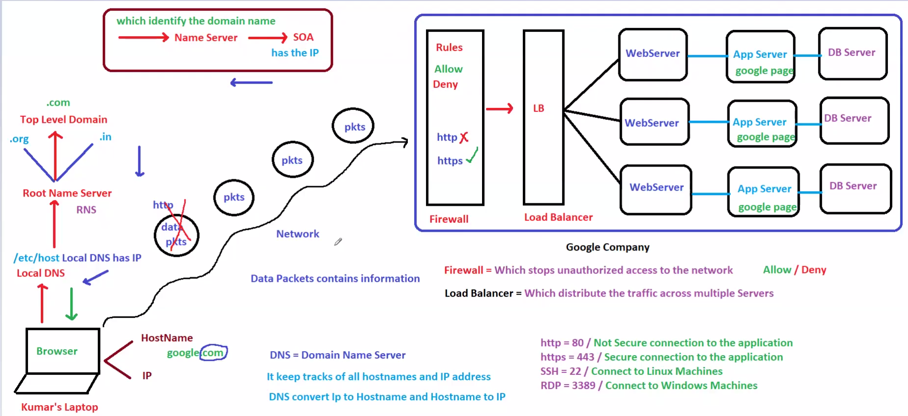
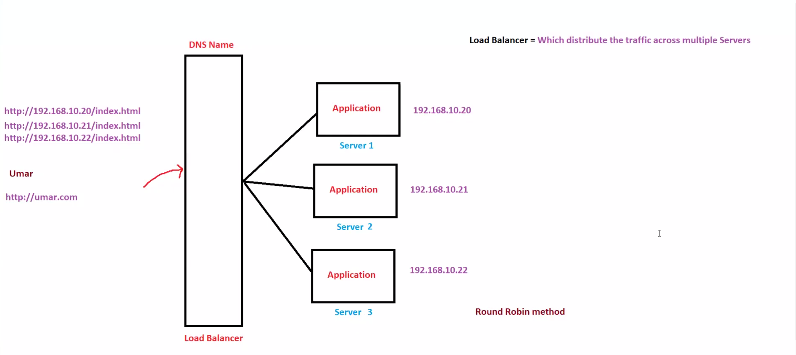

# 🌐 Day 2: Networking Fundamentals - DNS & Load Balancers

## 📖 Overview

Networking is the base of every cloud application.  
Before learning AWS services deeply, it is important to understand how domain names are resolved and how traffic is distributed across servers.

This module covers:

- DNS (Domain Name System)
- Load Balancers
- Traffic Distribution
- AWS mapping for Route 53 and ALB/NLB

---

## 🎯 Learning Objectives

- Understand what DNS does
- Learn how a domain name becomes an IP address
- Understand why load balancers are used
- Know how traffic is shared across servers
- Map these concepts to AWS services

---

## 🧠 1) DNS (Domain Name System)

DNS converts a human-readable domain name into an IP address.

### Why it exists
People remember names like `google.com`, not numeric IP addresses.

### How it works
1. User types a domain name in the browser
2. Browser asks DNS resolver
3. DNS returns the IP address
4. Browser connects to that server
5. Website loads

### AWS Mapping
- **Route 53** is AWS’s DNS service

### Diagram



---

## 🧩 2) Load Balancer

A load balancer distributes incoming traffic across multiple servers.

### Why it exists
If only one server handles all requests, it may become slow or fail under heavy traffic.

### Benefits
- Better availability
- Better performance
- Easier scaling
- Fault tolerance

### Common Strategies
- Round Robin
- Least Connections
- Weighted Distribution

### AWS Mapping
- **ALB** for HTTP/HTTPS web applications
- **NLB** for TCP/UDP and high performance

### Diagram



---

## 🔄 DNS + Load Balancer Together

1. User enters the domain name
2. DNS resolves it to the load balancer
3. Load balancer receives the request
4. Load balancer sends it to a healthy server
5. Server responds back to the user

This is a very common production flow in AWS.

---

## 🏗️ AWS Architecture View

```text
User
  ↓
Route 53
  ↓
Application Load Balancer
  ↓
EC2 Instance 1 / EC2 Instance 2 / EC2 Instance 3
  ↓
Shared Database
