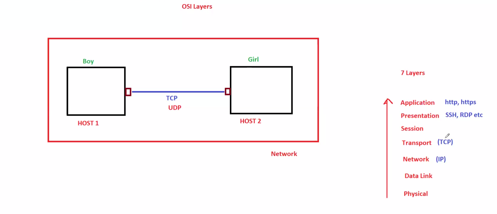
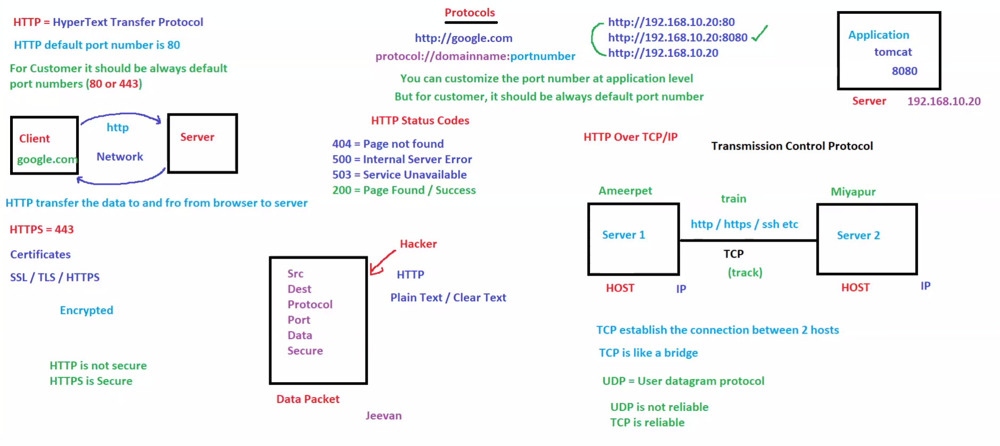
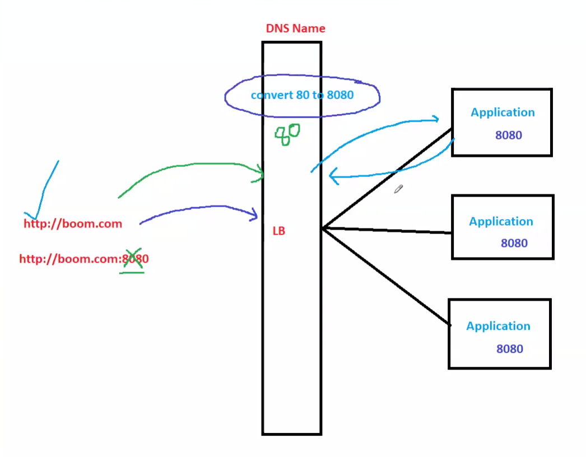

# 🌐 Day 03: Network Protocols & OSI Model

## 📖 Overview

Network communication is the foundation of cloud computing.

Before learning AWS networking services such as VPC, Security Groups, Route Tables, Load Balancers, and Transit Gateway, it is important to understand how devices communicate over a network.

This module covers:

* OSI Model
* Network Protocols
* TCP vs UDP
* HTTP vs HTTPS
* Port Numbers
* Load Balancer Port Mapping

These concepts are frequently asked in AWS SAA, DevOps, Linux, Networking, and Cloud interviews.

---

# 🎯 Learning Objectives

After completing this module, you should be able to:

✅ Explain all 7 layers of the OSI Model

✅ Understand how protocols communicate

✅ Differentiate between TCP and UDP

✅ Understand HTTP and HTTPS

✅ Identify common networking ports

✅ Explain load balancer port forwarding

---

# 🧠 OSI Model (7 Layers)

The OSI (Open Systems Interconnection) Model explains how data travels from one device to another across a network.

---

## Easy Memory Trick (Boy & Girl Example)

> 🧠 Memory Trick Only:
>
> This example is used only to remember the OSI layers easily.
> For interviews and AWS certification exams, always explain the actual technical definition.

Imagine:

```text
Boy wants to communicate with Girl
```

Communication happens layer by layer.

### Layer 7 - Application

```text
Boy: Hi 👋
```

User starts communication.

Protocols:

* HTTP
* HTTPS
* FTP
* SMTP
* DNS

### Layer 6 - Presentation

```text
Choose language
```

Ensures both sides understand the data.

Functions:

* Encryption
* Compression
* Encoding

### Layer 5 - Session

```text
Conversation starts
```

Creates and manages communication sessions.

### Layer 4 - Transport

```text
How should message be delivered?
```

Protocols:

* TCP
* UDP

### Layer 3 - Network

```text
Find girl's address
```

Uses IP addresses.

### Layer 2 - Data Link

```text
Find exact house
```

Uses MAC addresses.

### Layer 1 - Physical

```text
Deliver message physically
```

Uses cables, fiber, and wireless signals.

---

## OSI Layer Summary

| Layer | Name         | Responsibility        | Example       |
| ----- | ------------ | --------------------- | ------------- |
| 7     | Application  | User Interaction      | HTTP, HTTPS   |
| 6     | Presentation | Encryption & Encoding | SSL/TLS       |
| 5     | Session      | Session Management    | Login Session |
| 4     | Transport    | Reliable Delivery     | TCP, UDP      |
| 3     | Network      | Routing               | IP            |
| 2     | Data Link    | Local Delivery        | MAC Address   |
| 1     | Physical     | Signal Transmission   | Cable, Fiber  |

---

## OSI Layer Devices

| Layer   | Device        |
| ------- | ------------- |
| Layer 3 | Router        |
| Layer 2 | Switch        |
| Layer 1 | Cable / Fiber |

---

## Architecture Diagram



---

# 🌐 Common Network Protocols

Protocols define rules for communication between systems.

## TCP (Transmission Control Protocol)

### Characteristics

* Connection Oriented
* Reliable
* Ordered Delivery
* Error Checking

### Examples

* HTTP
* HTTPS
* SSH
* FTP

### Use Cases

* Banking Applications
* E-Commerce
* Database Communication

---

## UDP (User Datagram Protocol)

### Characteristics

* Connectionless
* Faster
* No Delivery Guarantee

### Examples

* DNS
* Video Streaming
* Voice Calls
* Online Gaming

### Use Cases

* Real-Time Applications

---

## TCP vs UDP

| Feature        | TCP      | UDP          |
| -------------- | -------- | ------------ |
| Reliable       | Yes      | No           |
| Fast           | No       | Yes          |
| Error Checking | Yes      | Limited      |
| Connection     | Required | Not Required |
| Usage          | Web Apps | Streaming    |

---

## Protocol Diagram



---

# 🔐 HTTP vs HTTPS

## HTTP

Port:

```text
80
```

Features:

* Unencrypted
* Less Secure

Example:

```text
http://example.com
```

---

## HTTPS

Port:

```text
443
```

Features:

* SSL/TLS Encryption
* Secure Communication

Example:

```text
https://example.com
```

---

# 🚪 Important Ports

| Service    | Port  |
| ---------- | ----- |
| HTTP       | 80    |
| HTTPS      | 443   |
| SSH        | 22    |
| DNS        | 53    |
| FTP        | 21    |
| SMTP       | 25    |
| RDP        | 3389  |
| MySQL      | 3306  |
| PostgreSQL | 5432  |
| MongoDB    | 27017 |

---

# ⚖️ Port Mapping & Load Balancer Conversion

Example:

```text
User Request
     ↓
Port 80
     ↓
Load Balancer
     ↓
Application Port 8080
```

This process is called:

* Port Mapping
* Port Translation
* Port Forwarding

---

## Why It Is Used

* Hide internal ports
* Improve security
* Enable load balancing
* Support multiple applications

---

## Architecture Diagram



---

# ☁️ AWS Mapping

| Networking Concept     | AWS Service     |
| ---------------------- | --------------- |
| DNS                    | Route 53        |
| Layer 4 Load Balancing | NLB             |
| Layer 7 Load Balancing | ALB             |
| Firewall Rules         | Security Groups |
| Network Firewall       | NACL            |
| Routing                | Route Tables    |
| Private Networking     | VPC             |

---

# 🎤 Interview Questions

### What is the OSI Model?

A 7-layer framework that explains network communication between systems.

### Which OSI Layer uses IP Address?

Layer 3 - Network Layer.

### Which OSI Layer uses MAC Address?

Layer 2 - Data Link Layer.

### Difference Between TCP and UDP?

TCP is reliable and connection-oriented.

UDP is faster but does not guarantee delivery.

### Difference Between HTTP and HTTPS?

HTTP is unencrypted.

HTTPS uses SSL/TLS encryption.

### What Port Does HTTPS Use?

443

### What Port Does SSH Use?

22

---

# 📝 AWS SAA Notes

### ALB

* Layer 7
* HTTP / HTTPS

### NLB

* Layer 4
* TCP / UDP

### Route 53

* Managed DNS Service

### Security Groups

* Instance Level Firewall

### NACL

* Subnet Level Firewall

---

# 📌 Key Takeaways

* OSI Model explains network communication.
* TCP provides reliable communication.
* UDP provides fast communication.
* HTTP uses Port 80.
* HTTPS uses Port 443.
* SSH uses Port 22.
* Load balancers use port mapping to route traffic.
* These concepts are heavily used in AWS networking.

---

# 🚀 Next Module

Day 04: Migration Concepts

Topics:

* Physical to Virtual (P2V)
* Virtual to Virtual (V2V)
* Cloud Migration Strategies
* AWS Migration Services

---

# 🏆 Summary

Network protocols define how systems communicate.

The OSI Model provides a structured framework for understanding networking, while TCP, UDP, HTTP, HTTPS, and port mapping form the foundation of AWS networking services such as Route 53, ALB, NLB, VPC, and Security Groups.
