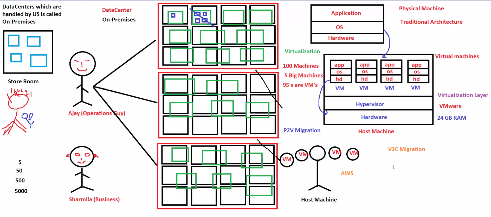

# ☁️ Day 04 - Migration Concepts

## 📌 Goal

Understand how companies move workloads from traditional infrastructure into virtualized environments and cloud platforms like AWS.

This module covers:

* On-Premises Infrastructure
* Virtualization
* Hypervisor
* P2V Migration
* V2V Migration
* V2C Migration
* AWS Migration Services

These concepts are important for:

* AWS SAA
* DevOps
* Cloud Engineer
* Infrastructure Engineer
* System Design

---

# 🧠 Big Picture First

Think about company growth:

```text
10 Servers
↓
50 Servers
↓
200 Servers
↓
500 Servers
```

Problems increase:

* Hardware cost
* Electricity
* Cooling
* Maintenance
* Scaling
* Backup

Then company asks:

```text
How do we modernize?
```

Answer:

```text
Migration
```

---

# 1. Traditional On-Premises Infrastructure

Before AWS, companies owned everything.

Architecture:

```text
Company
   ↓
Own Data Center
   ↓
Servers + Storage + Network
```

Responsibilities:

* Buy hardware
* Install servers
* Setup network
* Manage storage
* Replace failed parts
* Take backups

---

## Problems

As company grows:

```text
More users
↓
More servers
↓
More cost
↓
More maintenance
```

Main issues:

* Expensive
* Hard scaling
* Hardware failures
* Complex backups

---

# Real Example

Imagine:

```text
Netflix in early days
```

More users:

```text
Need more servers
Need more racks
Need more storage
Need more maintenance
```

Hard to manage.

---

# 2. Virtualization

Instead of:

```text
1 Server = 1 Application
```

Use:

```text
1 Server
 ↓
Multiple Virtual Machines
 ↓
Multiple Applications
```

This improves resource usage.

---

## Why Virtualization?

Without virtualization:

```text
CPU usage = 10%
Remaining 90% wasted
```

With virtualization:

Same server can run:

* App1
* App2
* App3

---

## Benefits

* Better utilization
* Lower cost
* Easy deployment
* Better management

---

# Architecture



---

# 3. Hypervisor

Hypervisor creates and manages Virtual Machines.

Examples:

* VMware ESXi
* Hyper-V
* KVM

Architecture:

```text
Applications
     ↓
Operating System
     ↓
Virtual Machines
     ↓
Hypervisor
     ↓
Physical Hardware
```

Think:

```text
Hypervisor = VM manager
```

---

## Real Example

One physical server:

```text
64 GB RAM
16 CPU
```

Can host:

```text
VM1 → Linux
VM2 → Windows
VM3 → Database
```

All managed by Hypervisor.

---

# 4. Migration Types

---

# P2V (Physical to Virtual)

Physical Server → Virtual Machine

Flow:

```text
Physical Machine
      ↓
Virtual Machine
```

Purpose:

* Remove hardware dependency
* Easy backup
* Better utilization

Example:

Old company server becomes VMware VM.

---

# V2V (Virtual to Virtual)

Move VM between hypervisors.

Flow:

```text
VMware
   ↓
Hyper-V
```

Purpose:

* Cost reduction
* Standardization
* Platform change

---

# V2C (Virtual to Cloud)

Move VM into AWS.

Flow:

```text
VMware VM
      ↓
AWS EC2
```

This is common.

Benefits:

* Elastic scaling
* High availability
* No hardware management

---

# Full Migration Flow

Real-world journey:

```text
Physical Server
      ↓
P2V
      ↓
Virtual Machine
      ↓
V2C
      ↓
AWS EC2
```

This is how most companies migrate.

---

# Architecture Diagram


---

# Why Companies Move to AWS

Old way:

```text
Buy server
Install hardware
Maintain racks
Replace failed disks
Handle power
```

AWS way:

```text
Launch EC2
Scale when needed
Pay only for usage
AWS handles hardware
```

Huge difference.

---

# Real Company Example

Company has:

```text
500 Physical Servers
```

Problems:

* Huge electricity bill
* Cooling
* Hardware failures
* Space

Migration:

```text
500 Physical Servers
      ↓
P2V
      ↓
VM Infrastructure
      ↓
V2C
      ↓
AWS Cloud
```

Result:

* Lower cost
* Better scaling
* Faster deployments

---

# AWS Migration Services

| Service         | Purpose              |
| --------------- | -------------------- |
| AWS MGN         | Server Migration     |
| AWS DMS         | Database Migration   |
| AWS DataSync    | Data Transfer        |
| AWS Snowball    | Large Data Migration |
| Storage Gateway | Hybrid Storage       |

---

# System Design Connection

When scaling:

Before:

```text
Users
 ↓
Physical Server
```

After AWS:

```text
Users
 ↓
Load Balancer
 ↓
EC2 Auto Scaling
 ↓
RDS
```

Migration makes this possible.

---

# Interview Questions

## What is On-Premises?

Infrastructure managed by company.

---

## What is Virtualization?

Running multiple VMs on one physical server.

---

## What is Hypervisor?

Software managing VMs.

---

## What is P2V?

Physical → Virtual

---

## What is V2V?

Virtual → Virtual

---

## What is V2C?

Virtual → Cloud

---

## Why move to AWS?

* Lower cost
* Better scaling
* High availability
* Less management

---

# AWS SAA Notes

Remember:

P2V:

```text
Physical → Virtual
```

V2V:

```text
Virtual → Virtual
```

V2C:

```text
Virtual → AWS Cloud
```

AWS Tools:

```text
MGN → Server Migration
DMS → Database Migration
DataSync → File Transfer
Snowball → Large Offline Transfer
```

---

# 🎯 Key Takeaways

✅ On-prem is expensive
✅ Virtualization improves resource usage
✅ Hypervisor manages VMs
✅ P2V modernizes old servers
✅ V2V changes platforms
✅ V2C moves workloads to AWS
✅ Migration is the first step toward cloud adoption

---

# 🧠 Memory Formula

```text
Physical → Virtual → Cloud
```

Think:

```text
Old → Better → Modern
```

---

# 🏁 Final Summary

Day 04 teaches how companies evolve.

Journey:

```text
On-Prem → Virtualization → Cloud
```

This is one of the most important real-world cloud concepts.

Without understanding migration:

* MGN won’t make sense
* DMS won’t make sense
* DataSync won’t make sense
* Hybrid cloud won’t make sense

This is a strong AWS foundation.
