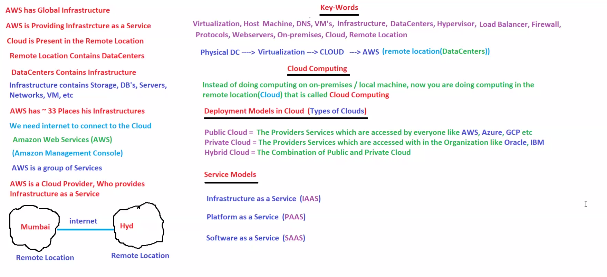

# ☁️ Day 05: Cloud Computing Fundamentals

## 📖 Overview

Cloud Computing is the delivery of computing services over the internet.

Instead of purchasing and maintaining physical servers, organizations can rent infrastructure, storage, databases, networking, and software from cloud providers such as AWS.

Cloud Computing is the foundation of Amazon Web Services (AWS) and is one of the most important topics for AWS SAA, DevOps, and Cloud interviews.

This module covers:

- What is Cloud Computing
- On-Premises vs Cloud
- AWS Global Infrastructure
- Cloud Deployment Models
- Cloud Service Models
- Infrastructure as a Service (IaaS)
- Platform as a Service (PaaS)
- Software as a Service (SaaS)

---

# 🎯 Learning Objectives

After completing this module, you should be able to:

✅ Explain Cloud Computing

✅ Understand how AWS provides infrastructure

✅ Differentiate between On-Premises and Cloud

✅ Understand Public, Private, and Hybrid Cloud

✅ Explain IaaS, PaaS, and SaaS

✅ Understand AWS's role as a Cloud Provider

---

# 🧠 What is Cloud Computing?

Cloud Computing means using computing resources through the internet instead of managing everything locally.

Traditional Approach:

```text
Buy Servers
Manage Hardware
Maintain Network
Handle Storage
Pay Upfront
```

Cloud Approach:

```text
Internet
    ↓
AWS Cloud
    ↓
Use Resources On Demand
```

---

# 🏢 On-Premises Infrastructure

On-Premises means infrastructure is owned and managed by the organization.

Example:

```text
Company
   ↓
Own Data Center
   ↓
Servers
Storage
Network
Database
```

Challenges:

- High Cost
- Hardware Maintenance
- Limited Scalability
- Infrastructure Management

---

# ☁️ Cloud Infrastructure

Cloud Providers manage infrastructure for customers.

Example:

```text
AWS Data Centers
       ↓
Servers
Storage
Networking
Databases
       ↓
Available through Internet
```

Users consume resources without managing hardware.

---

# 🖼️ Architecture Diagram



---

# 🌎 AWS Global Infrastructure

AWS operates data centers across multiple locations worldwide.

Components:

## Region

A geographical location containing AWS infrastructure.

Examples:

- Mumbai
- Hyderabad
- Ohio
- Singapore

---

## Availability Zone (AZ)

One or more isolated data centers inside a region.

Example:

```text
Mumbai Region
├── AZ-A
├── AZ-B
└── AZ-C
```

---

## Edge Location

Used for content delivery and caching.

Example Service:

- CloudFront

---

# ☁️ Cloud Deployment Models

## Public Cloud

Infrastructure owned by cloud providers and shared among customers.

Examples:

- AWS
- Microsoft Azure
- Google Cloud

Benefits:

- Low Cost
- Highly Scalable
- Easy Access

---

## Private Cloud

Infrastructure dedicated to a single organization.

Examples:

- VMware
- Oracle Private Cloud

Benefits:

- More Control
- More Security

---

## Hybrid Cloud

Combination of Public Cloud and Private Cloud.

Example:

```text
On-Premises
      ↕
AWS Cloud
```

Benefits:

- Flexibility
- Gradual Migration

---

# 🏗️ Cloud Service Models

Cloud services are generally divided into three categories.

---

## IaaS (Infrastructure as a Service)

Provider gives infrastructure resources.

You manage:

- Operating System
- Applications
- Data

Provider manages:

- Hardware
- Storage
- Networking

Examples:

- Amazon EC2
- EBS
- VPC

---

## PaaS (Platform as a Service)

Provider manages infrastructure and operating system.

You manage:

- Application Code
- Data

Examples:

- AWS Elastic Beanstalk
- Heroku

---

## SaaS (Software as a Service)

Complete software delivered through internet.

Users simply use the application.

Examples:

- Gmail
- Zoom
- Microsoft 365
- Salesforce

---

# 📊 Service Model Comparison

| Feature | IaaS | PaaS | SaaS |
|----------|------|------|------|
| Hardware | AWS | AWS | AWS |
| OS | User | AWS | AWS |
| Application | User | User | AWS |
| Management Effort | High | Medium | Low |

---

# 🏢 Real-World Example

Imagine you want to start an online business.

### Traditional Method

```text
Buy Server
Setup Network
Install OS
Maintain Hardware
```

### Cloud Method

```text
Create AWS Account
Launch EC2
Deploy Application
Start Using
```

Result:

- Faster Deployment
- Lower Cost
- Better Scalability

---

# ☁️ AWS Mapping

| Concept | AWS Service |
|----------|-------------|
| Compute | EC2 |
| Storage | S3 |
| Database | RDS |
| Networking | VPC |
| CDN | CloudFront |
| DNS | Route 53 |

---

# 🎤 Interview Questions

## What is Cloud Computing?

Delivery of computing resources over the internet on demand.

---

## What is On-Premises Infrastructure?

Infrastructure owned and managed by the organization.

---

## Difference Between On-Premises and Cloud?

On-Premises requires managing hardware.

Cloud providers manage infrastructure.

---

## What is Public Cloud?

Infrastructure shared and managed by cloud providers.

---

## What is Hybrid Cloud?

Combination of Public Cloud and Private Cloud.

---

## What is IaaS?

Infrastructure provided as a service.

Example: Amazon EC2.

---

## What is PaaS?

Platform provided for application development.

Example: Elastic Beanstalk.

---

## What is SaaS?

Software delivered through internet.

Example: Gmail.

---

# 📝 AWS SAA Notes

Remember:

### AWS

```text
Infrastructure as a Service Provider
```

### Public Cloud

```text
AWS
Azure
GCP
```

### IaaS

```text
EC2
EBS
VPC
```

### PaaS

```text
Elastic Beanstalk
```

### SaaS

```text
Gmail
Zoom
Salesforce
```

---

# 📌 Key Takeaways

- Cloud Computing provides resources over the internet.
- AWS manages global infrastructure.
- Public Cloud is shared infrastructure.
- Private Cloud is dedicated infrastructure.
- Hybrid Cloud combines both.
- IaaS provides infrastructure.
- PaaS provides application platform.
- SaaS provides complete software solutions.

---

# 🚀 Next Module

Day 06: AWS Shared Responsibility Model

Topics:

- Security in AWS
- Customer Responsibilities
- AWS Responsibilities
- Shared Responsibility Model

---

# 🏆 Summary

Cloud Computing allows organizations to consume computing resources without managing physical infrastructure.

AWS provides scalable, reliable, and globally distributed cloud services through Public Cloud infrastructure while supporting different deployment models and service models such as IaaS, PaaS, and SaaS.
