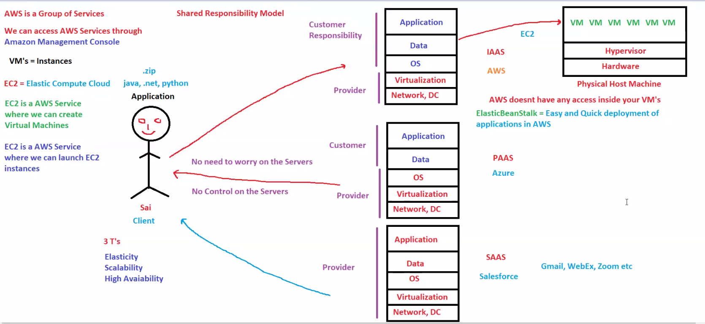

# 🔐 Day 06: AWS Shared Responsibility Model

## 📖 Overview

Security is one of the most important concepts in AWS.

A common misconception is that AWS handles all security responsibilities. In reality, AWS follows a Shared Responsibility Model where some responsibilities belong to AWS and others belong to the customer.

Understanding this model is critical for:

- AWS Solutions Architect Associate (SAA)
- DevOps Engineer
- Cloud Engineer
- Security Engineer

This topic is one of the most frequently asked AWS interview and certification concepts.

---

# 🎯 Learning Objectives

After completing this module, you should be able to:

✅ Explain the AWS Shared Responsibility Model

✅ Understand AWS responsibilities

✅ Understand customer responsibilities

✅ Differentiate responsibilities in IaaS, PaaS, and SaaS

✅ Explain EC2 security ownership

✅ Answer AWS security interview questions

---

# 🧠 What is the Shared Responsibility Model?

AWS security responsibilities are divided between:

```text
AWS (Provider)
        +
Customer
```

Both parties contribute to overall security.

AWS calls this:

```text
Security OF the Cloud
        +
Security IN the Cloud
```

---

# ☁️ Security OF the Cloud (AWS Responsibility)

AWS is responsible for protecting the infrastructure that runs AWS services.

AWS manages:

- Physical Data Centers
- Physical Servers
- Networking Infrastructure
- Storage Infrastructure
- Hypervisors
- Availability Zones
- Global Infrastructure

```text
Customer
    ↓
Uses AWS Services

AWS
    ↓
Protects Infrastructure
```

---

# 👨‍💻 Security IN the Cloud (Customer Responsibility)

Customers are responsible for everything they deploy inside AWS.

Examples:

- Applications
- Operating Systems
- User Access
- IAM Policies
- Security Groups
- Application Data
- Database Configuration

```text
Your EC2 Instance
       ↓
OS
Application
Users
Data

These are your responsibility.
```

---

# 🖼️ Architecture Diagram



---

# 🏗️ Responsibility in Different Service Models

Responsibilities change depending on the cloud service model.

---

## IaaS (Infrastructure as a Service)

Example:

- Amazon EC2

Customer manages:

- Applications
- Data
- Operating System

AWS manages:

- Virtualization
- Hardware
- Networking
- Data Centers

### Example

```text
EC2 Instance
      ↓
Install Linux
Install Nginx
Configure Firewall

Customer Responsibility
```

---

## PaaS (Platform as a Service)

Example:

- AWS Elastic Beanstalk

Customer manages:

- Application Code
- Data

AWS manages:

- OS
- Runtime
- Infrastructure

### Example

```text
Upload Application
AWS Handles Deployment
```

---

## SaaS (Software as a Service)

Examples:

- Gmail
- Zoom
- Salesforce
- Microsoft 365

Customer manages:

- User Data
- Access

Provider manages:

- Application
- Platform
- Infrastructure

### Example

```text
Open Gmail
Use Service

No Server Management Required
```

---

# 📊 Responsibility Comparison

| Layer | IaaS | PaaS | SaaS |
|---------|---------|---------|---------|
| Application | Customer | Customer | Provider |
| Data | Customer | Customer | Provider |
| OS | Customer | Provider | Provider |
| Virtualization | Provider | Provider | Provider |
| Hardware | Provider | Provider | Provider |
| Networking | Provider | Provider | Provider |

---

# ⚡ AWS Benefits (3 Important Concepts)

AWS provides:

### Elasticity

Automatically increase or decrease resources based on demand.

Example:

```text
100 Users
      ↓
1000 Users
      ↓
AWS Automatically Scales
```

---

### Scalability

Ability to handle growth.

Example:

```text
1 Server
      ↓
10 Servers
```

---

### High Availability

Applications remain available even when failures occur.

Example:

```text
Multiple Availability Zones
      ↓
One Fails
      ↓
Application Continues Running
```

---

# ☁️ AWS Mapping

| Concept | AWS Service |
|----------|-------------|
| Compute | EC2 |
| PaaS | Elastic Beanstalk |
| Identity Management | IAM |
| Monitoring | CloudWatch |
| Storage | S3 |
| Database | RDS |

---

# 🎤 Interview Questions

## What is the AWS Shared Responsibility Model?

A security model where AWS and customers share security responsibilities.

---

## What does AWS manage?

AWS manages:

- Hardware
- Hypervisor
- Networking
- Physical Security
- Data Centers

---

## What does the Customer manage in EC2?

Customer manages:

- Operating System
- Applications
- Users
- Data
- Security Configuration

---

## Who is responsible for patching EC2 OS?

Customer.

---

## Who is responsible for patching AWS Data Centers?

AWS.

---

## What is Security OF the Cloud?

Infrastructure protection managed by AWS.

---

## What is Security IN the Cloud?

Resources deployed by customers inside AWS.

---

# 📝 AWS SAA Notes

Remember:

### EC2

```text
AWS → Hardware
You → Operating System
```

---

### Elastic Beanstalk

```text
AWS → Platform
You → Application Code
```

---

### Gmail / Zoom

```text
Provider Manages Everything
```

---

### Shared Responsibility

```text
AWS = Security OF the Cloud

Customer = Security IN the Cloud
```

---

# 📌 Key Takeaways

- AWS and customers share security responsibilities.
- AWS secures infrastructure.
- Customers secure applications and data.
- Responsibilities vary by service model.
- IaaS gives the customer the most control.
- SaaS gives the customer the least responsibility.
- Shared Responsibility Model is heavily tested in AWS certifications.

---

# 🚀 Next Module

Day 07: AWS Global Infrastructure

Topics:

- Regions
- Availability Zones
- Edge Locations
- Global Network Design
- High Availability

---

# 🏆 Summary

The AWS Shared Responsibility Model defines how security responsibilities are divided between AWS and customers.

AWS secures the underlying infrastructure, while customers secure the resources they deploy in the cloud. Understanding this model is essential for designing secure AWS environments and successfully clearing AWS certification and DevOps interviews.
