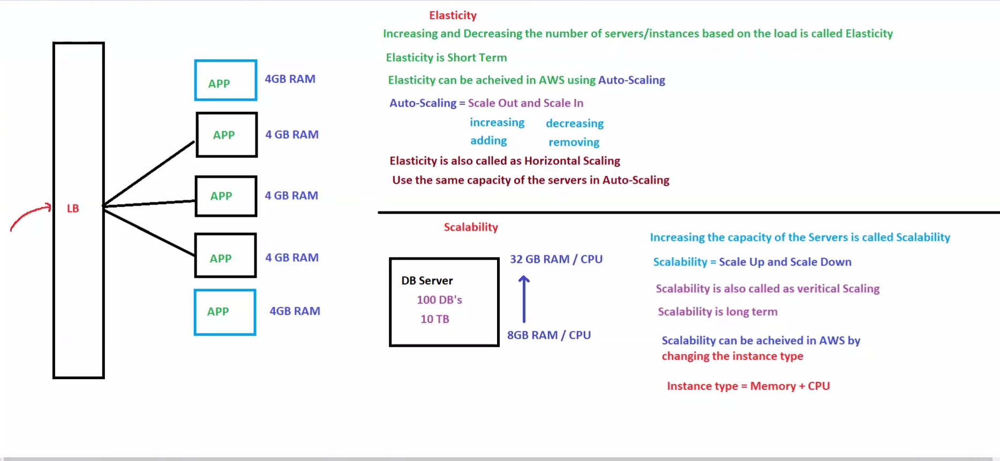
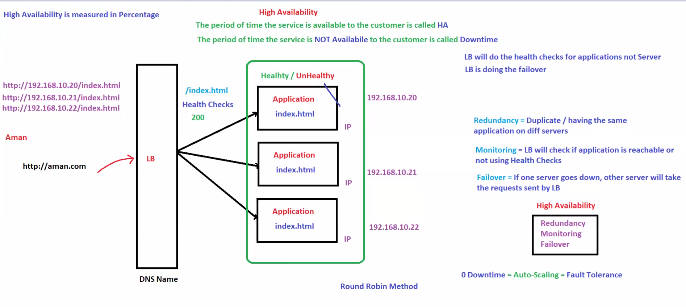

# 🚀 Day 07 - Elasticity, Scalability & High Availability

## 📌 Goal

Understand how AWS applications handle traffic growth, failures, and changing workloads.

This module covers:

* Elasticity
* Scalability
* Vertical Scaling
* Horizontal Scaling
* High Availability
* Fault Tolerance
* Health Checks
* Redundancy

These concepts are important for:

* AWS SAA
* DevOps
* Cloud Engineering
* System Design
* Production Architecture

---

# 🧠 Big Picture First

Imagine:

```text
Normal Traffic → 100 Users
Festival Traffic → 10,000 Users
Server Failure → 1 Server Down
```

Questions:

```text
How to handle sudden traffic?
How to survive failures?
How to keep app running?
```

Answer:

```text
Elasticity
Scalability
High Availability
```

These are the backbone of cloud systems.

---

# 1. What is Elasticity?

Elasticity means automatically increasing or decreasing resources based on demand.

Think:

```text
Morning → Low Traffic
Afternoon → High Traffic
Night → Low Traffic
```

Resources change automatically.

Flow:

```text
2 Servers
   ↓
10 Servers
   ↓
2 Servers
```

This is Elasticity.

---

## Real-Life Example

Food delivery app:

Normal:

```text
100 Orders
```

Festival:

```text
1000 Orders
```

AWS launches more servers.

After festival:

```text
1000 Orders
   ↓
100 Orders
```

AWS removes extra servers.

This saves money.

---

## AWS Service

```text
Auto Scaling Group (ASG)
```

---

## Architecture Diagram



---

# 2. What is Scalability?

Scalability means increasing system capacity to handle growth.

Think:

```text
100 Users
   ↓
1000 Users
   ↓
10000 Users
```

System must grow.

Difference:

```text
Elasticity = Dynamic
Scalability = Growth
```

---

# Types of Scalability

---

# Vertical Scaling (Scale Up)

Increase server size.

Example:

```text
4 GB RAM
   ↓
16 GB RAM
```

```text
2 CPU
   ↓
8 CPU
```

AWS:

```text
t2.micro
   ↓
t3.large
```

Think:

```text
Bigger machine
```

Problem:

* Limited
* Downtime possible

---

# Horizontal Scaling (Scale Out)

Add more servers.

Example:

```text
1 Server
   ↓
5 Servers
```

Flow:

```text
Load Balancer
      ↓
EC2
EC2
EC2
EC2
```

Think:

```text
More machines
```

Benefits:

* Better fault tolerance
* Better scaling
* No downtime

AWS best practice.

---

# Vertical vs Horizontal Scaling

| Feature              | Vertical | Horizontal       |
| -------------------- | -------- | ---------------- |
| Increase Server Size | Yes      | No               |
| Add More Servers     | No       | Yes              |
| Downtime             | Possible | No               |
| Limit                | Fixed    | Almost Unlimited |
| AWS Preferred        | Limited  | Best             |

---

# 3. High Availability (HA)

High Availability means application stays online even during failures.

Goal:

```text
Maximum Uptime
Minimum Downtime
```

Example:

```text
Server 1 fails
    ↓
Server 2 serves users
```

Users should not notice.

---

# Components of High Availability

---

# Redundancy

Duplicate resources.

Example:

```text
Server A
Server B
Server C
```

Same application on all.

Purpose:

```text
Backup ready
```

---

# Health Checks

System checks:

```text
Is server alive?
```

If unhealthy:

```text
Stop sending traffic
```

Very important.

AWS:

```text
ALB Health Checks
```

---

# Failover

Traffic shifts automatically.

Example:

```text
Server A fails
   ↓
Traffic → Server B
```

No interruption.

---

## Architecture Diagram



---

# 4. Fault Tolerance

Fault Tolerance means application continues running even when parts fail.

Think:

```text
One server down
App still running
```

Goal:

```text
Zero downtime
```

Difference:

```text
HA = Recover fast
Fault Tolerance = Continue without stopping
```

Important interview question.

---

# Real World Example

Banking Application:

Needs:

```text
24/7 uptime
```

If one server fails:

```text
Other server takes over immediately
```

This is fault tolerance.

---

# AWS Services Used

| Requirement          | AWS Service           |
| -------------------- | --------------------- |
| Elasticity           | Auto Scaling          |
| Horizontal Scaling   | ASG                   |
| Traffic Distribution | ALB                   |
| Monitoring           | CloudWatch            |
| Health Checks        | ALB Health Checks     |
| High Availability    | Multi-AZ              |
| Fault Tolerance      | Multi-AZ + Redundancy |

---

# System Design Connection

Production flow:

```text
User
 ↓
Route53
 ↓
CloudFront
 ↓
ALB
 ↓
EC2 (Auto Scaling)
 ↓
RDS Multi-AZ
```

Traffic grows:

```text
ASG adds EC2
```

EC2 fails:

```text
ALB sends traffic to healthy EC2
```

AZ fails:

```text
Other AZ handles traffic
```

This is real production architecture.

---

# Real Scaling Journey

Startup:

```text
100 users → 1 EC2
```

Growth:

```text
1000 users → ALB + 2 EC2
```

Scale:

```text
10000 users → ASG + Multi-AZ
```

Enterprise:

```text
100000+ users → Full HA + Fault Tolerance
```

This is how systems evolve.

---

# Interview Questions

## What is Elasticity?

Automatic resource adjustment.

---

## What is Scalability?

Ability to handle growth.

---

## Elasticity vs Scalability?

Elasticity:

```text
Scale up/down automatically
```

Scalability:

```text
Handle long-term growth
```

---

## Vertical Scaling?

Increase machine size.

---

## Horizontal Scaling?

Add more machines.

---

## High Availability?

Keep app online with minimum downtime.

---

## Fault Tolerance?

Keep app running even during failures.

---

## AWS service for Elasticity?

```text
Auto Scaling Group
```

---

## AWS service for traffic distribution?

```text
Application Load Balancer
```

---

# AWS SAA Notes

Elasticity:

```text
Scale Out
Scale In
Automatic
```

Scalability:

```text
Growth handling
```

Vertical:

```text
More CPU/RAM
```

Horizontal:

```text
More EC2
```

High Availability:

```text
Minimal downtime
```

Fault Tolerance:

```text
Near-zero downtime
```

Best Practice:

```text
ALB + ASG + Multi-AZ
```

---

# 🎯 Key Takeaways

✅ Elasticity adjusts resources automatically
✅ Scalability handles growth
✅ Vertical = Bigger server
✅ Horizontal = More servers
✅ High Availability reduces downtime
✅ Fault Tolerance keeps app alive during failures
✅ AWS uses ALB + ASG + Multi-AZ for production

---

# 🧠 Memory Formula

```text
Grow → Scale → Protect → Recover
```

Mapping:

```text
Grow = Scalability
Scale = Elasticity
Protect = High Availability
Recover = Fault Tolerance
```

---

# 🏁 Final Summary

Day 07 builds the scaling foundation of AWS.

Without this:

* Auto Scaling won’t make sense
* Load Balancer won’t make sense
* Multi-AZ won’t make sense
* Production architecture won’t make sense

These are some of the most important cloud concepts for AWS and System Design.
