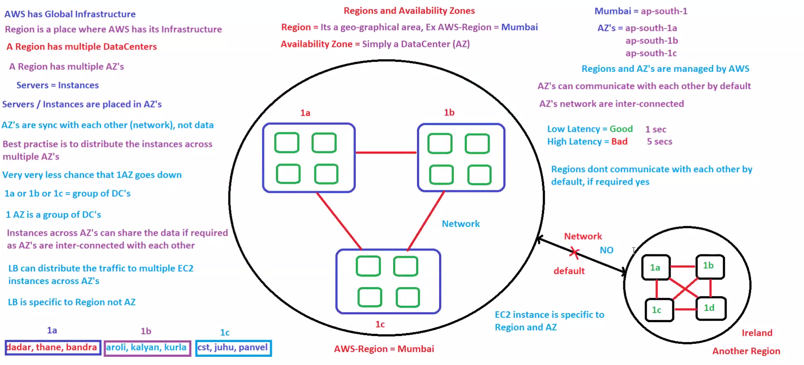
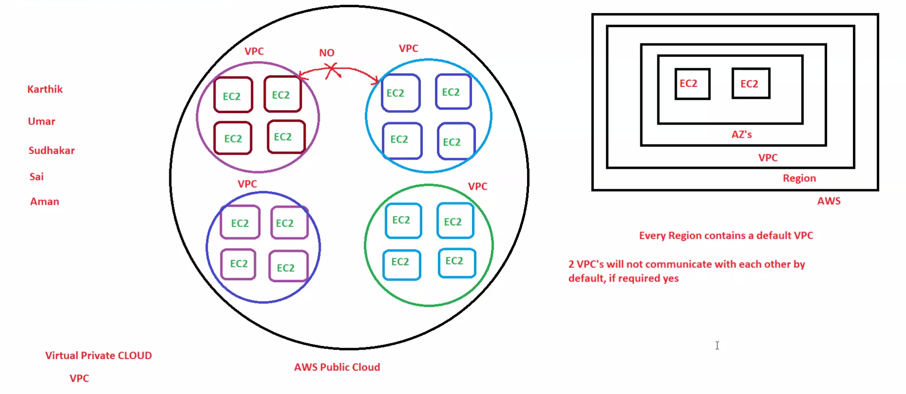

# 🌎 Day 08 - AWS Global Infrastructure & VPC Fundamentals

## 📌 Goal

Understand how AWS organizes its infrastructure globally and how VPC provides private networking inside AWS.

This module covers:

* AWS Global Infrastructure
* Regions
* Availability Zones (AZ)
* Data Centers
* Multi-AZ Architecture
* Virtual Private Cloud (VPC)
* Default VPC
* VPC Communication

These concepts are important for:

* AWS SAA
* DevOps
* Cloud Engineering
* System Design
* Infrastructure Design

---

# 🧠 Big Picture First

Before AWS, companies used:

```text id="d8p1a1"
Own Data Center
 ↓
Own Servers
 ↓
Own Network
```

Problem:

* Expensive
* Hard to scale
* Hard to maintain

AWS solves this using:

```text id="d8p1a2"
Global Infrastructure
 ↓
Regions
 ↓
Availability Zones
 ↓
VPC
 ↓
Resources
```

This is how AWS works.

---

# 1. AWS Global Infrastructure

AWS has data centers worldwide.

Structure:

```text id="d8p1a3"
World
 ↓
Regions
 ↓
Availability Zones
 ↓
Data Centers
```

Think:

```text id="d8p1a4"
Country → State → City
```

AWS uses:

```text id="d8p1a5"
Region → AZ → Data Center
```

This helps:

* High Availability
* Low Latency
* Disaster Recovery

---

# 2. What is a Region?

A Region is a physical geographic location where AWS provides services.

Examples:

```text id="d8p1a6"
Mumbai → ap-south-1
Hyderabad → ap-south-2
Ohio → us-east-2
Singapore → ap-southeast-1
```

Think:

```text id="d8p1a7"
Big area
```

Each region has:

* Multiple Availability Zones
* Independent infrastructure
* Regional services

Important:

```text id="d8p1a8"
Most AWS services are regional
```

Example:

EC2 launched in Mumbai stays in Mumbai region.

---

# Real Example

Suppose your users are in India:

Best region:

```text id="d8p1a9"
Mumbai
```

Reason:

```text id="d8p1b1"
Lower latency
```

If users are in Europe:

Best region:

```text id="d8p1b2"
Ireland
```

This is region selection.

---

# Architecture Diagram



---

# 3. What is Availability Zone (AZ)?

AZ is one or more isolated data centers inside a region.

Example:

```text id="d8p1b3"
Mumbai Region
│
├── ap-south-1a
├── ap-south-1b
└── ap-south-1c
```

Each AZ is isolated.

Meaning:

If one AZ fails:

```text id="d8p1b4"
Other AZ keeps running
```

Benefits:

* Fault isolation
* High availability
* Better disaster recovery

---

# Easy Memory Trick

Think:

```text id="d8p1b5"
India → Maharashtra → Pune
```

AWS:

```text id="d8p1b6"
Region → AZ → Data Center
```

Simple.

---

# Region vs Availability Zone

| Feature        | Region          | AZ                |
| -------------- | --------------- | ----------------- |
| Size           | Large           | Smaller           |
| Scope          | Geographic Area | Data Center Group |
| Failure Impact | Bigger          | Smaller           |
| Example        | Mumbai          | ap-south-1a       |

Remember:

```text id="d8p1b7"
Region contains AZ
AZ contains Data Centers
```

---

# 4. Multi-AZ Architecture

AWS best practice:

Deploy resources in multiple AZs.

Example:

```text id="d8p1b8"
ALB
 ↓
AZ-1 → EC2
AZ-2 → EC2
```

If AZ-1 fails:

```text id="d8p1b9"
Traffic → AZ-2
```

Users don’t feel downtime.

This gives:

* High Availability
* Fault Tolerance

Very important.

---

# Real Production Example

Banking app:

Wrong:

```text id="d8p1c1"
1 EC2 in 1 AZ
```

Problem:

```text id="d8p1c2"
AZ fails → App down
```

Correct:

```text id="d8p1c3"
2 EC2 in 2 AZ
```

Result:

```text id="d8p1c4"
One fails → Other works
```

This is Multi-AZ.

---

# 5. What is VPC?

VPC means:

```text id="d8p1c5"
Virtual Private Cloud
```

VPC is your private network inside AWS.

Think:

```text id="d8p1c6"
Your private data center in AWS
```

Everything runs inside VPC.

Example resources:

* EC2
* RDS
* ALB
* NAT Gateway

Without VPC:

```text id="d8p1c7"
No network isolation
```

---

# Easy Memory Trick

Think AWS is an apartment:

```text id="d8p1c8"
AWS = Building
VPC = Your Flat
```

Other users have:

```text id="d8p1c9"
Their own flats
```

Isolation exists.

---

# Architecture Diagram



---

# 6. Default VPC

Every region has:

```text id="d8p1d1"
1 Default VPC
```

Default VPC includes:

* Public Subnets
* Route Table
* Internet Gateway
* Security Group

Purpose:

```text id="d8p1d2"
Quick resource launch
```

Best for:

* Beginners
* Testing
* Practice

Production:

```text id="d8p1d3"
Use Custom VPC
```

---

# 7. VPC Communication

By default:

```text id="d8p1d4"
VPC-A X VPC-B
```

No communication.

Need:

* VPC Peering
* Transit Gateway
* VPN

Flow:

```text id="d8p1d5"
VPC-A
 ↓
Peering
 ↓
VPC-B
```

Used in enterprise.

---

# AWS Mapping

| Concept               | AWS Service        |
| --------------------- | ------------------ |
| Global Infrastructure | Regions            |
| Data Center Groups    | Availability Zones |
| Networking            | VPC                |
| High Availability     | Multi-AZ           |
| VPC Connectivity      | VPC Peering        |
| Large Connectivity    | Transit Gateway    |

---

# System Design Connection

Production architecture:

```text id="d8p1d6"
User
 ↓
Route53
 ↓
CloudFront
 ↓
ALB
 ↓
EC2 in AZ-1
EC2 in AZ-2
 ↓
RDS Multi-AZ
```

Important:

```text id="d8p1d7"
All inside VPC
```

This is real-world AWS design.

---

# Interview Questions

## What is AWS Region?

Geographic location of AWS infrastructure.

---

## What is Availability Zone?

Isolated data centers inside a region.

---

## Why multiple AZs?

For:

* High Availability
* Fault Tolerance
* Disaster Recovery

---

## What is VPC?

Private network inside AWS.

---

## How many default VPCs per region?

```text id="d8p1d8"
One
```

---

## Can VPCs communicate by default?

```text id="d8p1d9"
No
```

Need:

* Peering
* Transit Gateway
* VPN

---

## Why Multi-AZ?

To reduce downtime.

---

# AWS SAA Notes

Region:

```text id="d8p1e1"
Geographic area
```

AZ:

```text id="d8p1e2"
Isolated data centers
```

VPC:

```text id="d8p1e3"
Private network
```

Default VPC:

```text id="d8p1e4"
One per region
```

Multi-AZ:

```text id="d8p1e5"
High availability
```

Best Practice:

```text id="d8p1e6"
Deploy across multiple AZs
```

---

# 🎯 Key Takeaways

✅ AWS uses Regions and AZs globally
✅ Region = Geographic location
✅ AZ = Isolated data centers
✅ Multi-AZ improves availability
✅ VPC is private networking inside AWS
✅ Default VPC exists in every region
✅ VPCs are isolated by default
✅ These concepts are core for AWS networking

---

# 🧠 Memory Formula

```text id="d8p1e7"
Global → Region → AZ → VPC → Resources
```

Remember:

```text id="d8p1e8"
Region = Place
AZ = Protection
VPC = Private Network
```

---

# 🏁 Final Summary

Day 08 builds your AWS infrastructure foundation.

Without this:

* VPC won’t make sense
* Subnets won’t make sense
* Route Tables won’t make sense
* NAT Gateway won’t make sense
* Multi-AZ won’t make sense

This is one of the most important AWS networking foundations for DevOps and AWS SAA.
