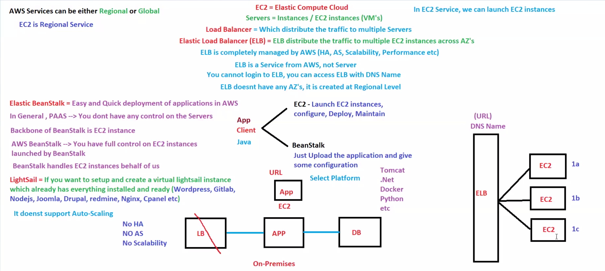
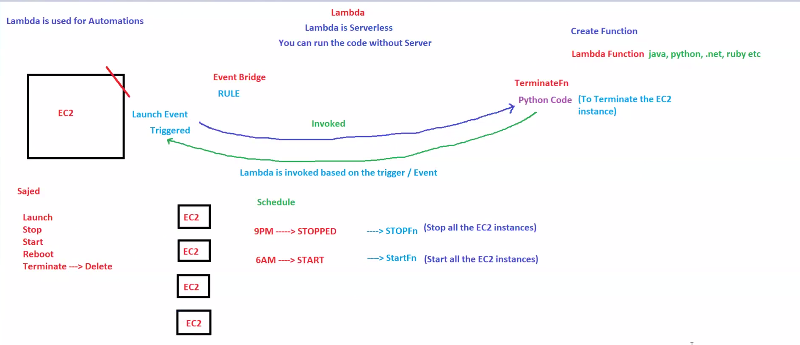

# ☁️ Day 09: Compute & Serverless Services

## 📖 Overview

Compute services are the backbone of AWS.

This module covers the most important AWS compute services used to run, deploy, scale, and automate applications.

Topics covered:

* Amazon EC2
* Elastic Load Balancer (ELB)
* Auto Scaling
* Elastic Beanstalk
* AWS Lambda
* Event-Driven Automation

These services are frequently asked in AWS SAA, DevOps, Cloud Engineer, and Solution Architect interviews.

---

# 🎯 Learning Objectives

After completing this module, you should be able to:

✅ Understand Amazon EC2

✅ Understand Elastic Load Balancing

✅ Understand Auto Scaling

✅ Understand Elastic Beanstalk

✅ Understand AWS Lambda

✅ Understand Event-Driven Architectures

---

# 🖥️ Amazon EC2 (Elastic Compute Cloud)

EC2 is AWS's virtual machine service.

Think of EC2 as:

```text
Your Own Server
Running Inside AWS
```

Instead of buying physical hardware, AWS provides virtual machines on demand.

---

## EC2 Benefits

* Launch virtual machines quickly
* Pay only for usage
* Multiple instance sizes
* Easy scaling
* Secure and highly available

---

## EC2 Instance Lifecycle

```text
Launch
   ↓
Running
   ↓
Stop / Start
   ↓
Terminate
```

---

# ⚖️ Elastic Load Balancer (ELB)

Load Balancer distributes traffic across multiple EC2 instances.

Without Load Balancer:

```text
User
 ↓
EC2
```

Problem:

```text
If EC2 fails
Application fails
```

---

With Load Balancer:

```text
User
 ↓
ELB
 ↓
EC2-1
EC2-2
EC2-3
```

Benefits:

* High Availability
* Fault Tolerance
* Better Performance
* Traffic Distribution

---

# 📈 Auto Scaling

Auto Scaling automatically adds or removes EC2 instances based on traffic.

---

## Example

Normal Traffic

```text
2 EC2 Instances
```

High Traffic

```text
5 EC2 Instances
```

Low Traffic

```text
2 EC2 Instances
```

---

## Benefits

* Cost Optimization
* High Availability
* Elasticity
* Automatic Scaling

---

# 🚀 Elastic Beanstalk

Elastic Beanstalk is a Platform as a Service (PaaS).

You only upload your application.

AWS automatically manages:

* EC2
* Load Balancer
* Deployment
* Monitoring
* Scaling

---

## Developer Focus

```text
Write Code
      ↓
Upload Code
      ↓
AWS Deploys Application
```

---

## Supported Platforms

* Java
* Python
* Node.js
* .NET
* Docker
* PHP

---

## Architecture Diagram



---

# ⚡ AWS Lambda

AWS Lambda is a Serverless Compute Service.

You run code without managing servers.

---

## How Lambda Works

```text
Event Occurs
      ↓
Lambda Triggered
      ↓
Code Executes
      ↓
Task Completed
```

---

## Example

EventBridge Schedule:

```text
9 PM
 ↓
Stop EC2 Instances

6 AM
 ↓
Start EC2 Instances
```

Lambda performs automation without requiring a server.

---

## Benefits

* No Server Management
* Automatic Scaling
* Pay Per Request
* Event Driven

---

## Architecture Diagram



---

# 🔄 Event-Driven Architecture

In AWS, services communicate using events.

Example:

```text
EventBridge
      ↓
Lambda
      ↓
EC2 Action
```

Common Use Cases:

* Scheduled Tasks
* Notifications
* Resource Cleanup
* Automation Workflows

---

# ☁️ AWS Service Classification

| Service           | Type       |
| ----------------- | ---------- |
| EC2               | IaaS       |
| Elastic Beanstalk | PaaS       |
| Lambda            | Serverless |
| ELB               | Networking |
| Auto Scaling      | Management |

---

# 🎤 Interview Questions

## What is EC2?

Amazon EC2 is a virtual machine service that allows users to launch and manage servers in AWS.

---

## What is Elastic Beanstalk?

Elastic Beanstalk is a PaaS service that automatically deploys and manages applications.

---

## What is AWS Lambda?

AWS Lambda is a serverless compute service that runs code in response to events.

---

## Difference Between EC2 and Lambda?

| EC2                       | Lambda                  |
| ------------------------- | ----------------------- |
| Manage Server             | No Server Management    |
| Long Running Applications | Short Event-Based Tasks |
| Fixed Resources           | Auto Scaling            |
| Pay for Running Time      | Pay per Execution       |

---

## What is Auto Scaling?

A service that automatically increases or decreases EC2 instances based on demand.

---

## Why Use Load Balancer?

To distribute traffic across multiple servers and improve availability.

---

# 📝 AWS SAA Notes

### EC2

* Regional Service
* Virtual Machine
* Compute Service

### ELB

* Traffic Distribution
* High Availability

### Auto Scaling

* Elasticity
* Cost Optimization

### Elastic Beanstalk

* Platform as a Service (PaaS)

### Lambda

* Serverless
* Event Driven

---

# 📌 Key Takeaways

* EC2 provides virtual servers.
* ELB distributes traffic.
* Auto Scaling adds and removes servers automatically.
* Elastic Beanstalk simplifies deployment.
* Lambda enables serverless automation.
* Event-driven architecture is heavily used in AWS.

---

# 🚀 Next Module

## Day 10: AWS Storage Fundamentals

Topics:

* Amazon S3
* Amazon EBS
* Object Storage
* Block Storage
* Storage Concepts

---

# 🏆 Summary

AWS Compute Services help run and scale applications efficiently.

EC2 provides virtual machines, ELB distributes traffic, Auto Scaling manages capacity, Elastic Beanstalk simplifies deployments, and Lambda enables serverless automation.

Together, these services form the foundation of modern AWS application architectures. 🚀
