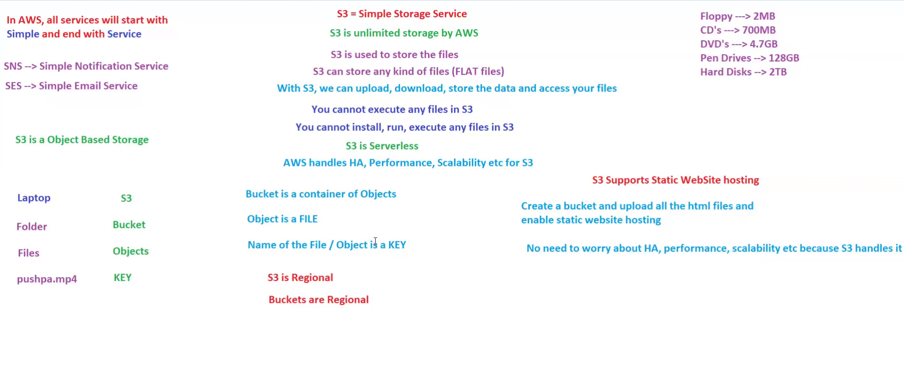
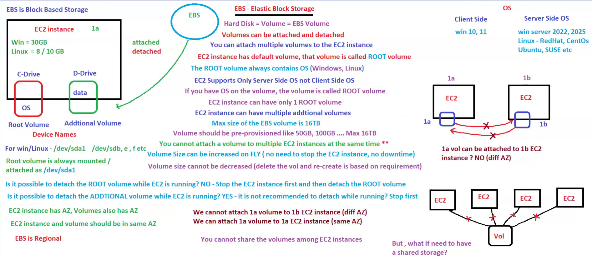

# 💾 Day 10: AWS Storage Fundamentals

## 📖 Overview

Storage is one of the core building blocks of AWS.

Applications need storage for:

* Files
* Images
* Videos
* Databases
* Backups
* Logs

This module covers the two most important AWS storage services:

* Amazon S3
* Amazon EBS

These services are frequently used in AWS architectures and are commonly asked in AWS SAA, DevOps, and Cloud interviews.

---

# 🎯 Learning Objectives

After completing this module, you should be able to:

✅ Understand Amazon S3

✅ Understand Amazon EBS

✅ Differentiate Object Storage and Block Storage

✅ Understand Buckets and Objects

✅ Understand EBS Volumes

✅ Choose the correct AWS storage service

---

# 🪣 Amazon S3 (Simple Storage Service)

Amazon S3 is AWS's Object Storage Service.

Think of S3 as:

```text
Google Drive
Dropbox
Cloud Storage
```

but built for applications and enterprises.

---

## Easy Memory Trick

```text
Laptop
   ↓
Folder
   ↓
Files
```

AWS S3:

```text
Bucket
   ↓
Objects
```

---

## S3 Terminology

### Bucket

A container that stores objects.

Examples:

```text
company-backup
project-data
employee-documents
```

---

### Object

Any file stored inside a bucket.

Examples:

```text
image.png
video.mp4
resume.pdf
backup.zip
```

---

### Key

Unique path/name of an object.

Example:

```text
images/profile.png
```

---

# 📦 S3 Features

### Unlimited Storage

Store:

* Documents
* Images
* Videos
* Backups
* Logs

---

### High Availability

AWS automatically manages storage infrastructure.

---

### High Durability

Designed for:

```text
99.999999999%
(11 Nines)
```

Durability.

---

### Serverless

No server management required.

---

### Regional Service

Buckets are created inside a specific AWS Region.

Examples:

```text
ap-south-1
us-east-1
eu-west-1
```

---

# 💽 Amazon EBS (Elastic Block Store)

Amazon EBS provides Block Storage for EC2 instances.

Think of EBS as:

```text
Hard Disk
For EC2
```

---

## Easy Memory Trick

Physical Computer:

```text
CPU
RAM
Hard Disk
```

AWS:

```text
EC2
 ↓
EBS Volume
```

---

# 📦 EBS Features

### Persistent Storage

Data remains even after instance reboot.

---

### High Performance

Suitable for:

* Databases
* Enterprise Applications
* Production Workloads

---

### Snapshots

Create backups of EBS volumes.

```text
EBS Volume
      ↓
Snapshot
      ↓
S3 Storage
```

---

### Multiple Volumes

One EC2 instance can have:

```text
Root Volume
+
Additional Volume
```

---

## Root Volume

Contains:

```text
Operating System
System Files
Boot Files
```

Examples:

```text
Windows C:
Linux /
```

---

## Additional Volume

Used for:

```text
Application Data
Logs
Database Files
```

---

# 🖼️ Visual Learning

## Amazon S3 Storage Fundamentals

This diagram explains how Amazon S3 stores objects inside buckets and provides highly durable object storage.



---

## Amazon EBS Block Storage

This diagram explains how Amazon EBS acts as block storage attached to EC2 instances.



---

# ⚖️ S3 vs EBS

| Feature       | S3                     | EBS                         |
| ------------- | ---------------------- | --------------------------- |
| Storage Type  | Object Storage         | Block Storage               |
| Used With     | Multiple AWS Services  | EC2                         |
| Scalability   | Virtually Unlimited    | Volume Based                |
| Access Method | API Access             | Attached to EC2             |
| Durability    | Very High              | High                        |
| Use Case      | Files, Images, Backups | Operating System, Databases |

---

# ☁️ AWS Service Classification

| Service  | Category       |
| -------- | -------------- |
| S3       | Object Storage |
| EBS      | Block Storage  |
| Snapshot | Backup Service |

---

# 🎤 Interview Questions

## What is Amazon S3?

Amazon S3 is an object storage service used to store files, backups, logs, images, videos, and application data.

---

## What is Amazon EBS?

Amazon EBS is a block storage service that acts as a virtual hard disk for EC2 instances.

---

## Difference Between S3 and EBS?

S3 stores objects.

EBS provides block storage attached to EC2 instances.

---

## Can EBS Be Attached to Multiple EC2 Instances?

Generally No.

One EBS volume is attached to one EC2 instance at a time.

---

## Where Are EBS Snapshots Stored?

```text
Amazon S3
```

---

# 📝 AWS SAA Notes

### Amazon S3

* Object Storage
* Regional Service
* Unlimited Storage
* Highly Durable
* Serverless

### Amazon EBS

* Block Storage
* Attached to EC2
* AZ Specific
* Supports Snapshots

---

# 📌 Key Takeaways

* S3 is AWS Object Storage.
* Buckets contain objects.
* S3 is highly durable and scalable.
* EBS acts as a hard disk for EC2.
* EBS supports snapshots and persistent storage.
* S3 and EBS solve different storage problems.

---

# 🚀 Next Module

## Day 11: AWS Storage & Database Services

Topics:

* Amazon RDS
* DynamoDB
* ElastiCache
* EFS
* FSx
* Glacier
* Snow Family
* Storage Gateway

---

# 🏆 Summary

Amazon S3 and Amazon EBS are the two foundational AWS storage services.

S3 provides scalable object storage for files, backups, and static websites, while EBS provides block storage for EC2 instances and databases.

Understanding the difference between Object Storage and Block Storage is essential for AWS Solution Architect and DevOps interviews. 🚀
