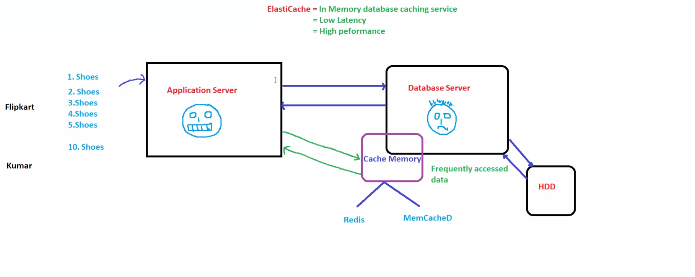
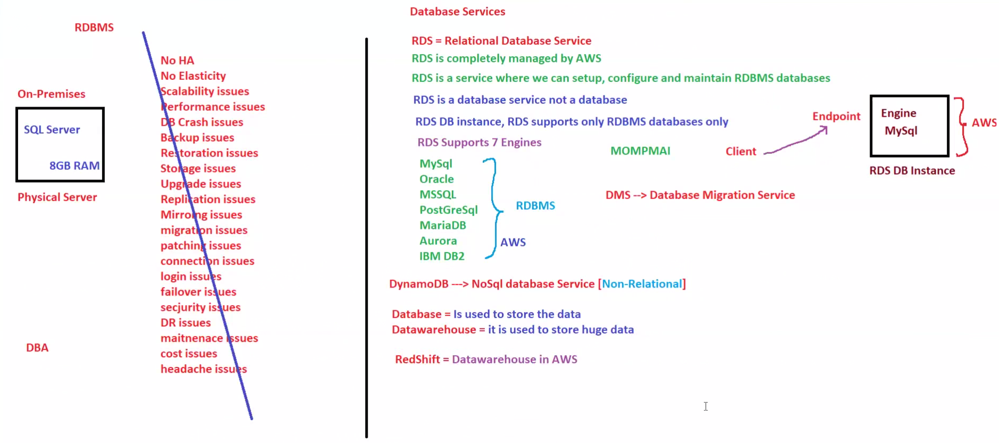
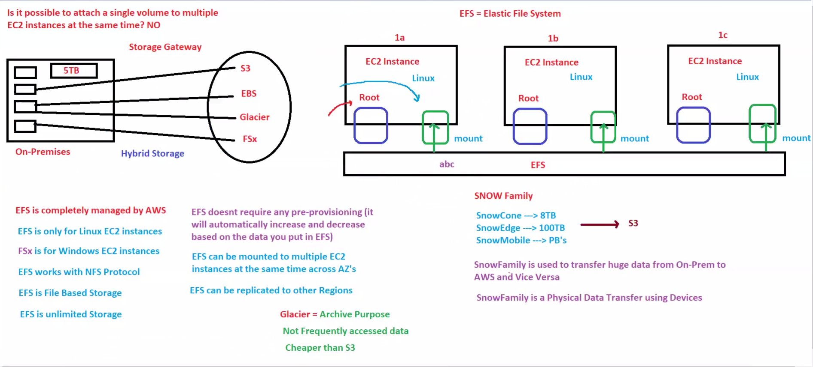
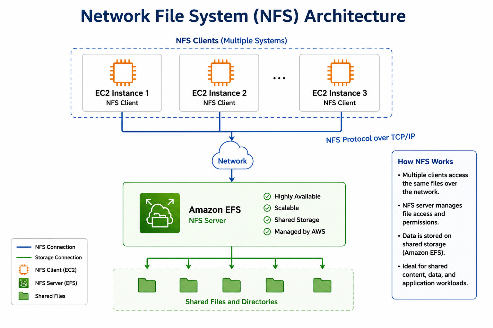

# 🗄️ Day 11: AWS Storage & Database Services

## 📖 Overview

AWS provides multiple storage and database services designed for different application requirements.

Some applications need relational databases, some require NoSQL databases, while others need caching, shared file storage, archival storage, or large-scale data migration.

This module covers:

* Amazon ElastiCache
* Amazon RDS
* Amazon DynamoDB
* AWS DMS
* Amazon Redshift
* Amazon EFS
* Amazon FSx
* AWS Snow Family
* Amazon Glacier
* AWS Storage Gateway
* NFS Concepts

These services are commonly used in AWS architectures and frequently appear in AWS SAA, Cloud, and DevOps interviews.

---

# 🎯 Learning Objectives

After completing this module, you should be able to:

✅ Understand AWS Database Services

✅ Understand AWS Storage Services

✅ Understand Caching Concepts

✅ Understand File Storage Services

✅ Understand Data Migration Services

✅ Choose the correct service for different workloads

---

# ⚡ Amazon ElastiCache

Amazon ElastiCache is a fully managed in-memory caching service.

Supported Engines:

* Redis
* Memcached

---

## Why Use Cache?

Without Cache:

```text
User
 ↓
Database
```

Database becomes slow under heavy load.

---

With Cache:

```text
User
 ↓
Cache
 ↓
Database
```

Frequently accessed data is served much faster.

---

## Benefits

* Low Latency
* High Performance
* Reduced Database Load
* Faster Applications

---

# 🖼️ Visual Learning

## Amazon ElastiCache

This diagram explains how Redis and Memcached are used to improve application performance through caching.



---

# 🗄️ AWS Database Services

AWS offers multiple database solutions based on application requirements.

---

## Amazon RDS

Amazon RDS (Relational Database Service) is a managed relational database service.

Supported Engines:

* MySQL
* PostgreSQL
* MariaDB
* Oracle
* SQL Server

---

### Use Cases

* Banking Applications
* ERP Systems
* E-Commerce Platforms
* Business Applications

---

## Amazon DynamoDB

Amazon DynamoDB is a fully managed NoSQL database service.

Characteristics:

* Serverless
* Highly Scalable
* Low Latency
* Automatic Scaling

---

### Use Cases

* Mobile Applications
* Gaming Applications
* Real-Time Systems

---

## AWS DMS

AWS Database Migration Service (DMS) helps migrate databases into AWS.

Example:

```text
On-Prem Database
        ↓
AWS DMS
        ↓
Amazon RDS
```

---

## Amazon Redshift

Amazon Redshift is AWS's data warehouse service.

Used for:

* Analytics
* Reporting
* Business Intelligence
* Large Dataset Processing

---

# 🖼️ Visual Learning

## AWS Database Services

This diagram provides an overview of AWS database offerings including RDS, DynamoDB, DMS, and Redshift.



---

# 📁 AWS Storage Services

Different applications require different storage solutions.

AWS provides file storage, archive storage, hybrid storage, and data transfer services.

---

## Amazon EFS

Amazon Elastic File System (EFS) is a managed shared file storage service.

Features:

* Shared Storage
* Multiple EC2 Access
* Linux Compatible
* Elastic Capacity

---

## Amazon FSx

Amazon FSx provides managed file systems.

Available Options:

* FSx for Windows File Server
* FSx for Lustre

---

## Amazon Glacier

Amazon Glacier is a low-cost archive storage service.

Best For:

* Long-Term Backups
* Compliance Data
* Archival Storage

---

## AWS Snow Family

AWS Snow Family provides physical devices for transferring massive datasets into AWS.

Examples:

* Snowcone
* Snowball
* Snowmobile

---

### When to Use

```text
Large Data
+
Slow Internet
=
Snow Family
```

---

## AWS Storage Gateway

Storage Gateway connects on-premises environments with AWS storage services.

Example:

```text
On-Premises Server
         ↔
Storage Gateway
         ↔
AWS Cloud
```

---

# 🖼️ Visual Learning

## AWS Storage Services

This diagram explains EFS, FSx, Glacier, Snow Family, and Storage Gateway.



---

# 🌐 NFS (Network File System)

NFS (Network File System) allows multiple servers to access the same shared storage over a network.

In AWS, Amazon EFS uses the NFS protocol, allowing multiple EC2 instances to read and write the same files simultaneously.

Example:

```text
EC2 Instance 1
        \
         \
          Amazon EFS (NFS)
         /
        /
EC2 Instance 2
```

Benefits:

* Shared Storage
* Centralized Files
* Multi-Instance Access
* Highly Scalable

---

# 🖼️ Visual Learning

## Network File System (NFS)

This diagram shows multiple EC2 instances accessing the same shared file system using the NFS protocol.



---

# 🎯 Which Service Should I Use?

| Requirement                | AWS Service     |
| -------------------------- | --------------- |
| Cache Frequently Used Data | ElastiCache     |
| Relational Database        | RDS             |
| NoSQL Database             | DynamoDB        |
| Data Warehouse             | Redshift        |
| Shared Linux File Storage  | EFS             |
| Windows File Storage       | FSx             |
| Long-Term Archive          | Glacier         |
| Transfer PB-Scale Data     | Snow Family     |
| Hybrid Storage             | Storage Gateway |

---


# 🎤 Interview Questions

## What is Amazon ElastiCache?

A managed caching service that improves application performance using Redis or Memcached.

---

## Difference Between RDS and DynamoDB?

| RDS                 | DynamoDB            |
| ------------------- | ------------------- |
| Relational Database | NoSQL Database      |
| SQL Queries         | Key-Value Queries   |
| Structured Data     | Flexible Data Model |
| Fixed Schema        | Schema-less         |

---

## What is Amazon Glacier?

A low-cost archival storage service used for long-term backups and compliance storage.

---

## What is AWS Snowball?

A physical device used to transfer large amounts of data into AWS.

---

## What is Storage Gateway?

A hybrid cloud service that connects on-premises storage with AWS cloud storage.

---

# 📝 AWS SAA Notes

### ElastiCache

* Redis
* Memcached
* In-Memory Cache

### RDS

* Managed Relational Database
* Multi-AZ Support

### DynamoDB

* NoSQL
* Serverless
* Auto Scaling

### Redshift

* Data Warehouse
* Analytics

### EFS

* Shared File Storage
* Linux Based

### Glacier

* Archive Storage
* Low Cost

### Snow Family

* Offline Data Transfer

### Storage Gateway

* Hybrid Cloud Storage

---

# 📌 Key Takeaways

* ElastiCache improves application speed.
* RDS provides managed relational databases.
* DynamoDB is AWS's NoSQL solution.
* Redshift handles analytics workloads.
* EFS provides shared file storage.
* Glacier is used for archival data.
* Snow Family transfers large datasets physically.
* Storage Gateway connects on-premises environments to AWS.

---

# 🚀 Next Module

## Day 12: AWS Security & IAM Fundamentals

Topics:

* IAM Users
* IAM Groups
* IAM Roles
* IAM Policies
* Authentication & Authorization

---

# 🏆 Summary

AWS provides specialized services for databases, caching, storage, migration, analytics, and hybrid cloud architectures.

Understanding when to use RDS, DynamoDB, ElastiCache, EFS, Glacier, Snow Family, and Storage Gateway is critical for designing scalable AWS solutions and successfully clearing AWS SAA and DevOps interviews. 🚀
