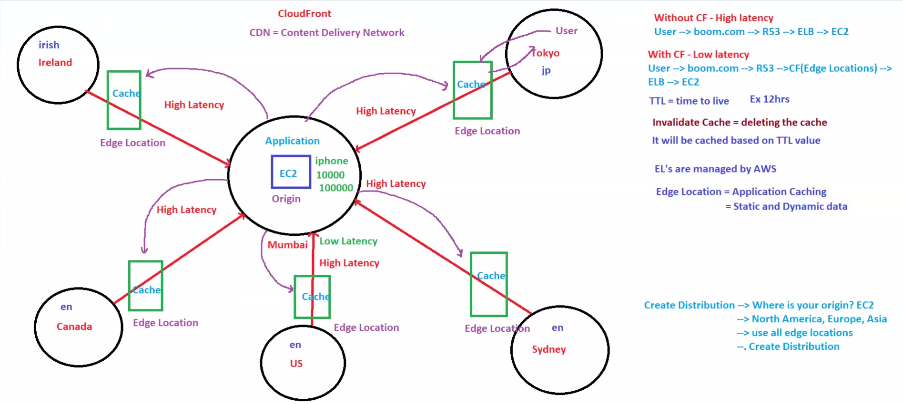
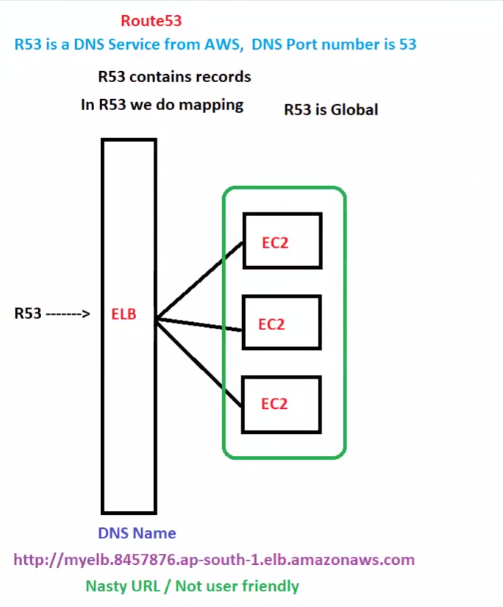
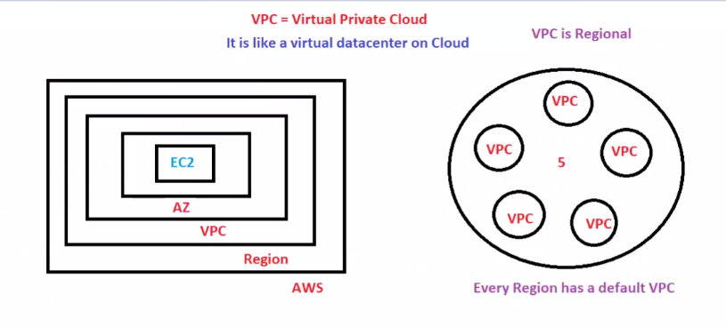
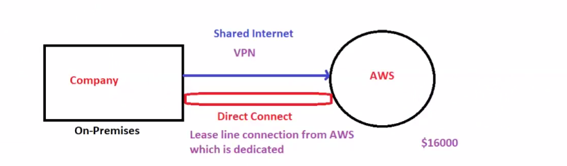
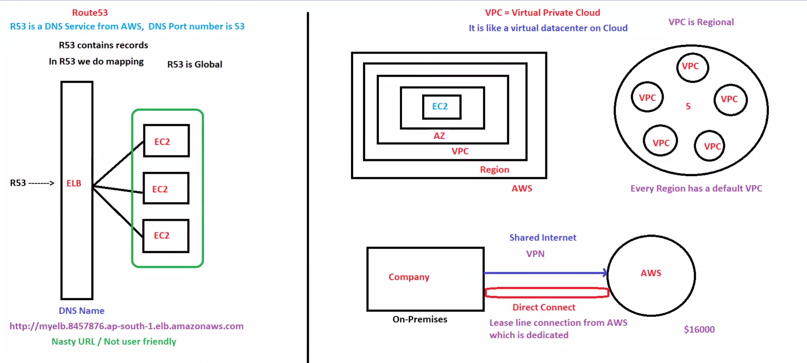

# ☁️ Day 12 - AWS Networking, Delivery & DNS Fundamentals

## 📌 Goal

Understand how AWS applications are delivered globally, routed using DNS, cached for low latency, and secured inside private cloud networks.

This module covers:

* Amazon CloudFront
* Amazon Route53
* VPC Basics
* AWS Direct Connect

These are core for:

* AWS SAA
* DevOps
* System Design
* Scalability
* Production Architecture

---

# 🧠 Big Picture First

Understand the real production flow first:

```text
User
 ↓
Route53 (Find server)
 ↓
CloudFront (Deliver fast)
 ↓
ELB (Balance traffic)
 ↓
EC2 (Run app)
 ↓
Database / Storage
```

If company has on-premises infrastructure:

```text
On-Prem
 ↓
Direct Connect
 ↓
AWS VPC
```

This is how real cloud systems work.

---

# 1. Amazon CloudFront

## What is CloudFront?

CloudFront is AWS CDN.

CDN = Content Delivery Network.

Purpose:

* Reduce latency
* Cache content near users
* Speed up delivery globally

---

## Problem Without CloudFront

Example:

Your application server is in Mumbai.

Users are from:

* Japan
* Ireland
* Canada
* Sydney

Without CloudFront:

```text
User → Route53 → ELB → EC2
```

Problem:

* Every request travels far
* High latency
* Slow website

---

## Solution With CloudFront

CloudFront stores cache at Edge Locations.

Flow:

```text
User → Route53 → CloudFront → ELB → EC2
```

Benefits:

* Faster response
* Reduced server load
* Better user experience

---

## Architecture



---

## Important Terms

| Term          | Meaning                  |
| ------------- | ------------------------ |
| CDN           | Content Delivery Network |
| Edge Location | Cache server near users  |
| Origin        | Main source server       |
| Cache         | Stored content copy      |
| TTL           | Cache expiry time        |

---

## Important Concepts

### TTL (Time To Live)

TTL decides how long CloudFront stores cache.

Example:

```text
TTL = 12 Hours
```

Until TTL expires:

```text
CloudFront serves cached data
```

---

### Cache Invalidation

Removes cache before TTL ends.

Used when:

* Website updated
* New image uploaded
* CSS changed

---

## Interview Questions

### What is CloudFront?

AWS CDN for low-latency content delivery.

### What is Edge Location?

AWS cache server close to users.

### What is Origin?

Main application source.

---

# 2. Amazon Route53

## What is Route53?

AWS DNS Service.

Port:

```text
53
```

Purpose:

Maps domain names to AWS resources.

Example:

```text
google.com → IP
myapp.com → ELB
```

---

## Flow

```text
User → Route53 → ELB → EC2
```

Route53 finds.

ELB balances.

EC2 processes.

---

## Architecture



---

## Record Types

| Record | Purpose              |
| ------ | -------------------- |
| A      | Domain → IPv4        |
| AAAA   | Domain → IPv6        |
| CNAME  | Alias                |
| MX     | Mail Server          |
| Alias  | AWS Resource Mapping |

---

## Routing Policies

* Simple
* Weighted
* Latency Based
* Failover
* Geolocation

Important for interviews.

---

## Interview Questions

### Why is Route53 global?

Because DNS must resolve worldwide.

### What is Alias Record?

AWS-native mapping to ELB, S3, CloudFront.

---

# 3. VPC (Virtual Private Cloud)

## What is VPC?

VPC is your private network inside AWS.

Think:

```text
Private Datacenter in Cloud
```

Everything runs inside this.

---

## Flow

```text
Region
 ↓
VPC
 ↓
Availability Zone
 ↓
Public / Private Subnet
 ↓
EC2 / RDS
```

---

## Architecture



---

## Main Components

### Subnet

Network inside VPC.

Types:

* Public Subnet
* Private Subnet

---

### Route Table

Controls traffic.

Example:

```text
0.0.0.0/0 → Internet Gateway
```

---

### Internet Gateway

Allows internet access.

---

### NAT Gateway

Allows private subnet outbound internet.

---

### Security Group

Instance firewall.

Stateful.

---

### NACL

Subnet firewall.

Stateless.

---

## Security Group vs NACL

| Security Group   | NACL         |
| ---------------- | ------------ |
| Instance level   | Subnet level |
| Stateful         | Stateless    |
| Allow rules only | Allow + Deny |

---

## Interview Questions

### Security Group vs NACL?

Security Group:

* Instance level
* Stateful

NACL:

* Subnet level
* Stateless

---

# 4. AWS Direct Connect

## What is Direct Connect?

Dedicated private connection between:

```text
Company → AWS
```

Used in enterprise.

---

## Why Needed?

VPN uses public internet.

Problems:

* Slower
* Less stable
* Public route

Direct Connect:

* Dedicated
* Faster
* Stable
* Private

---

## Architecture



---

## Flow

```text
On-Prem Datacenter
        ↓
Direct Connect
        ↓
AWS VPC
```

---

## Direct Connect vs VPN

| Feature   | VPN    | Direct Connect |
| --------- | ------ | -------------- |
| Internet  | Yes    | No             |
| Speed     | Medium | High           |
| Stability | Medium | High           |
| Security  | Medium | High           |
| Cost      | Lower  | Higher         |

---

## Use Cases

* Hybrid Cloud
* Enterprise Networking
* Large Data Transfers
* Private Connectivity

---

# 🔥 Combined Architecture

This connects all services:



---

# Full Production Flow

```text
User
 ↓
Route53
 ↓
CloudFront
 ↓
ELB
 ↓
EC2
 ↓
RDS / S3
```

Hybrid:

```text
Company Servers
 ↓
Direct Connect
 ↓
AWS VPC
 ↓
Application
```

---

# 🎯 Key Takeaways

✅ Route53 finds resources
✅ CloudFront delivers faster
✅ ELB balances traffic
✅ VPC protects infrastructure
✅ Direct Connect links on-prem to AWS
✅ These are core HLD building blocks

---

# 🧠 Memory Formula

```text
Find → Deliver → Balance → Process → Protect → Connect
```

AWS Mapping:

```text
Find = Route53
Deliver = CloudFront
Balance = ELB
Process = EC2
Protect = VPC
Connect = Direct Connect
```

---

# 🏁 Final Summary

Day 12 builds the networking backbone of AWS.

This directly helps in:

* AWS SAA
* DevOps
* System Design
* HLD
* Scaling Applications
* Production Deployments

These services appear in almost every real-world AWS architecture. This is foundational knowledge.
