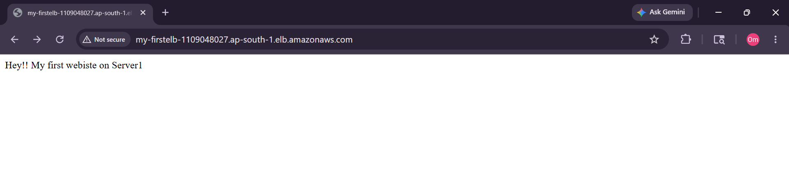
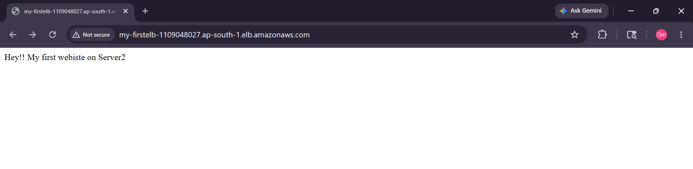
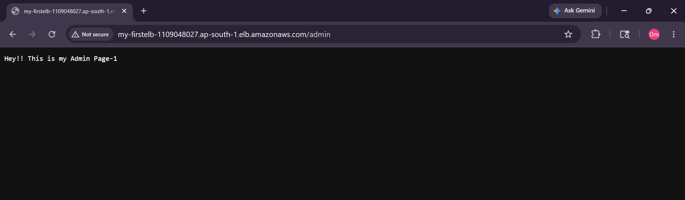
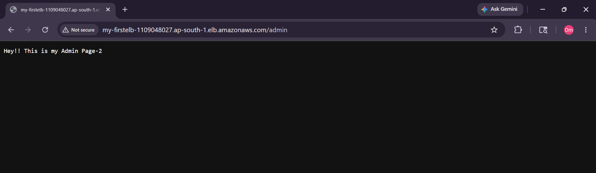

# AWS Application Load Balancer (ALB) Path-Based Routing Mini Project 🚀

## 📌 Project Overview

This mini project demonstrates how to configure an AWS Application Load Balancer (ALB) with multiple EC2 instances and implement Path-Based Routing using Target Groups.

The setup distributes incoming traffic across multiple EC2 instances and routes requests dynamically based on URL paths.

---

# 🏗️ Architecture Diagram


---

# ⚙️ AWS Services Used

- Amazon EC2
- Application Load Balancer (ALB)
- Target Groups
- Security Groups
- Apache HTTP Server (`httpd`)
- Health Checks
- Listener Rules
- Path-Based Routing

---

# 🖥️ EC2 Instance Setup

## 🔹 Main Application Servers (TG1)

| Instance | Availability Zone | Page          |
| -------- | ----------------- | ------------- |
| Server-1 | ap-south-1a       | `/index.html` |
| Server-2 | ap-south-1b       | `/index.html` |

### User Data Script

```bash
#!/bin/bash
yum install httpd -y
service httpd start
chkconfig httpd on

echo 'Hey!! My first website on Server1' > /var/www/html/index.html
```

---

## 🔹 Admin Application Servers (TG2)

| Instance | Availability Zone | Page     |
| -------- | ----------------- | -------- |
| Server-3 | ap-south-1a       | `/admin` |
| Server-4 | ap-south-1b       | `/admin` |

### User Data Script

```bash
#!/bin/bash
yum install httpd -y
service httpd start
chkconfig httpd on

echo 'Hey!! This is my Admin Page-1' > /var/www/html/admin
```

---

# 🔐 Security Group Configuration

## Inbound Rules

| Type | Port | Source    |
| ---- | ---- | --------- |
| HTTP | 80   | 0.0.0.0/0 |
| SSH  | 22   | My IP     |

---

# 🎯 Target Group Configuration

## TG1 - My-App

- Protocol: HTTP
- Port: 80
- Health Check Path:

```text
/index.html
```

---

## TG2 - Admin-PageTG

- Protocol: HTTP
- Port: 80
- Health Check Path:

```text
/admin
```

---

# ⚖️ Load Balancer Configuration

## Listener

- HTTP : 80

---

## Listener Rules

| Path     | Forward To   |
| -------- | ------------ |
| `/`      | My-App       |
| `/admin` | Admin-PageTG |

---

# 🌐 Testing

## Main Application

```text
http://ALB-DNS
```

### Output

```text
Hey!! My first website on Server1
Hey!! My first website on Server2
```

### Screenshots

#### Server 1 Response



#### Server 2 Response



---

## Admin Application

```text
http://ALB-DNS/admin
```

### Output

```text
Hey!! This is my Admin Page-1
Hey!! This is my Admin Page-2
```

### Screenshots

#### Admin Page 1



#### Admin Page 2



---

# 📸 Project Demo

## ✅ Load Balancer Working

Traffic successfully distributed between:

- Server-1
- Server-2

## ✅ Path-Based Routing Working

`/admin` requests routed successfully to:

- Server-3
- Server-4

## ✅ Health Checks

All targets showing:

```text
Healthy
```

---

# 🎥 Demo Video

[▶️ Watch Demo Video](./Project_Demo/FirstMiniTaskProject.mp4)

---

# 📚 Concepts Learned

- Launching EC2 instances
- Installing Apache Web Server
- Configuring Security Groups
- Creating Application Load Balancer
- Creating Target Groups
- Registering Targets
- Configuring Health Checks
- Multi-AZ Architecture
- Listener Rules
- Path-Based Routing
- AWS Networking Basics

---

# 🧹 Cleanup

After completing the project:

- Terminated EC2 instances
- Deleted ALB
- Deleted Target Groups
- Verified no unused EBS volumes remained

This helps avoid unnecessary AWS charges.

---

# ✅ Conclusion

This project successfully demonstrated how AWS Application Load Balancer distributes traffic and performs Path-Based Routing across multiple EC2 instances deployed in different Availability Zones.

```

```
