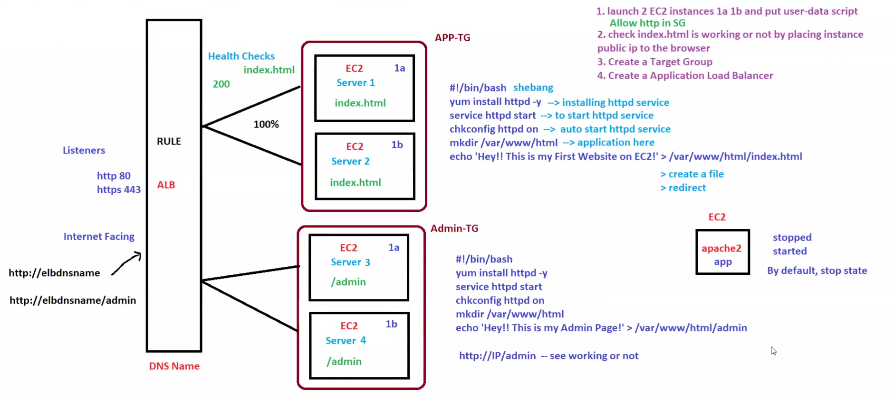

# AWS Application Load Balancer (ALB) Path-Based Routing Mini Project 🚀

## 📌 Project Overview

This mini project demonstrates how to configure an AWS Application Load Balancer (ALB) with multiple EC2 instances and implement Path-Based Routing using Target Groups.

The setup distributes incoming traffic across multiple EC2 instances and routes requests dynamically based on URL paths.

---

# 🏗️ Architecture Diagram



---

# ⚙️ AWS Services Used

- Amazon EC2
- Application Load Balancer (ALB)
- Target Groups
- Security Groups
- Apache HTTP Server (`httpd`)
- Health Checks
- Listener Rules
- Path-Based Routing

---

# 🖥️ EC2 Instance Setup

## 🔹 Main Application Servers (TG1)

| Instance | Availability Zone | Page |
|----------|-------------------|------|
| Server-1 | ap-south-1a | `/index.html` |
| Server-2 | ap-south-1b | `/index.html` |

### User Data Script

```bash
#!/bin/bash

yum install httpd -y
service httpd start
chkconfig httpd on

echo 'Hey!! My first website on Server1' > /var/www/html/index.html
```

---

## 🔹 Admin Application Servers (TG2)

| Instance | Availability Zone | Page |
|----------|-------------------|------|
| Server-3 | ap-south-1a | `/admin` |
| Server-4 | ap-south-1b | `/admin` |

### User Data Script

```bash
#!/bin/bash

yum install httpd -y
service httpd start
chkconfig httpd on

echo 'Hey!! This is my Admin Page-1' > /var/www/html/admin
```

---

# 🔐 Security Group Configuration

## Inbound Rules

| Type | Port | Source |
|------|------|---------|
| HTTP | 80 | 0.0.0.0/0 |
| SSH | 22 | My IP |

---

# 🎯 Target Group Configuration

## TG1 - My-App

- Protocol: HTTP
- Port: 80

### Health Check Path

```text
/index.html
```

---

## TG2 - Admin-PageTG

- Protocol: HTTP
- Port: 80

### Health Check Path

```text
/admin
```

---

# ⚖️ Load Balancer Configuration

## Listener

- HTTP : 80

---

## Listener Rules

| Path | Forward To |
|------|-------------|
| `/` | My-App |
| `/admin` | Admin-PageTG |

---

# 🌐 Testing

## ✅ Main Application

```text
http://ALB-DNS
```

### Example Output

```text
Hey!! My first website on Server1
Hey!! My first website on Server2
```

---

## 📷 Main Application Screenshots

### 🔹 Server-1 Response


### 🔹 Server-2 Response


---

# 🌐 Admin Application Testing

```text
http://ALB-DNS/admin
```

### Example Output

```text
Hey!! This is my Admin Page-1
Hey!! This is my Admin Page-2
```

---

## 📷 Admin Page Screenshots

### 🔹 Admin Page-1


### 🔹 Admin Page-2


---

# 📸 Project Highlights

## ✅ Load Balancer Working

Traffic distributed successfully between:

- Server-1
- Server-2

---

## ✅ Path-Based Routing Working

Requests to `/admin` routed successfully to:

- Server-3
- Server-4

---

## ✅ Health Checks Working

All EC2 targets showing:

```text
Healthy
```

---

# 🎥 Demonstration Recording

This project includes a full demonstration video.

## ▶️ Watch Project Demo

[](./Project_Demo/FirstMiniTaskProject.mp4)

Click the image above to watch the project demonstration video.

---

# 📚 Concepts Learned

- Launching EC2 Instances
- Installing Apache HTTP Server
- Configuring Security Groups
- Creating Application Load Balancer
- Creating Target Groups
- Registering Targets
- Configuring Health Checks
- Listener Rules
- Path-Based Routing
- Multi-AZ Architecture
- AWS Networking Basics

---

# 🧹 Cleanup

After completing the project:

- Terminated EC2 instances
- Deleted ALB
- Deleted Target Groups
- Verified unused resources were removed

This helps avoid unnecessary AWS charges.

---

# 🎯 Project Outcome

Successfully:

- Configured AWS Application Load Balancer
- Implemented Path-Based Routing
- Distributed traffic across EC2 instances
- Configured Target Groups & Health Checks
- Built a Multi-AZ web infrastructure
- Understood AWS networking workflow

---
