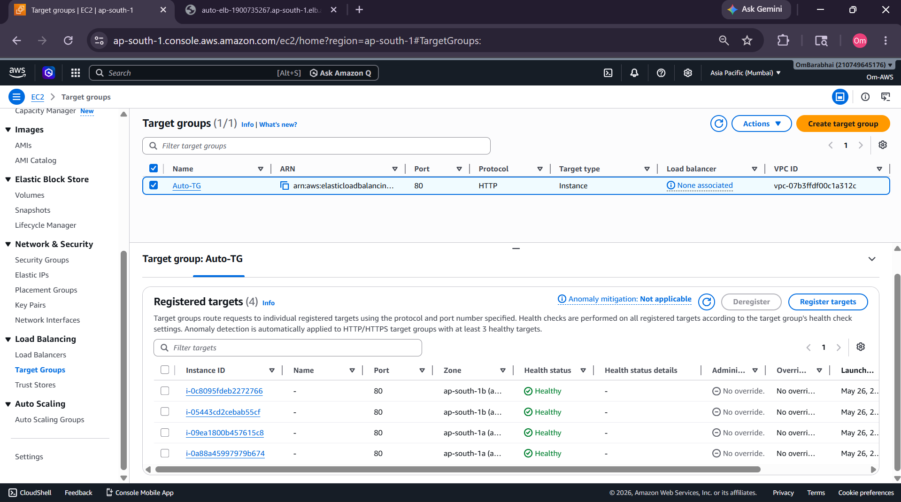
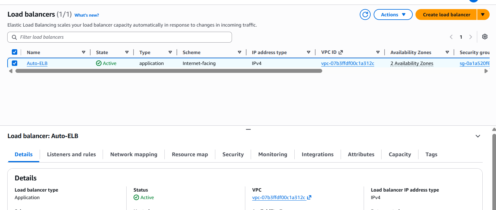
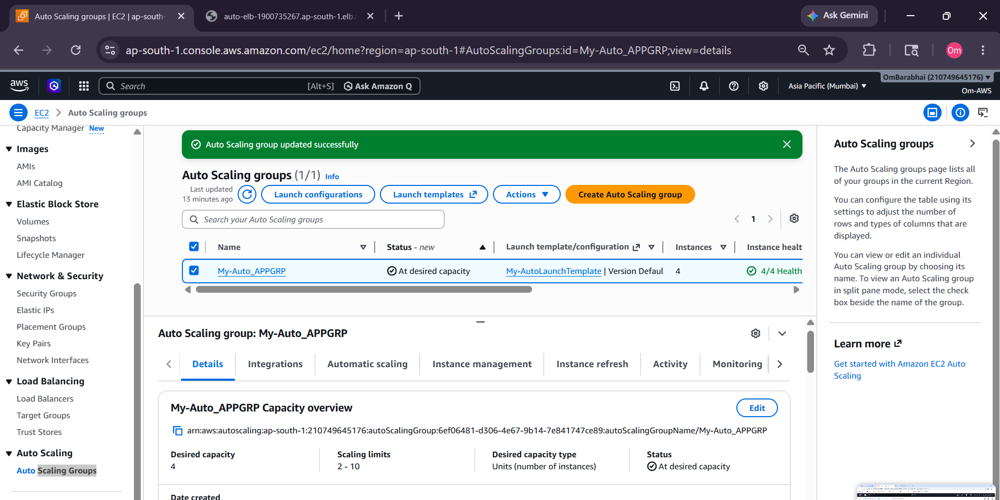
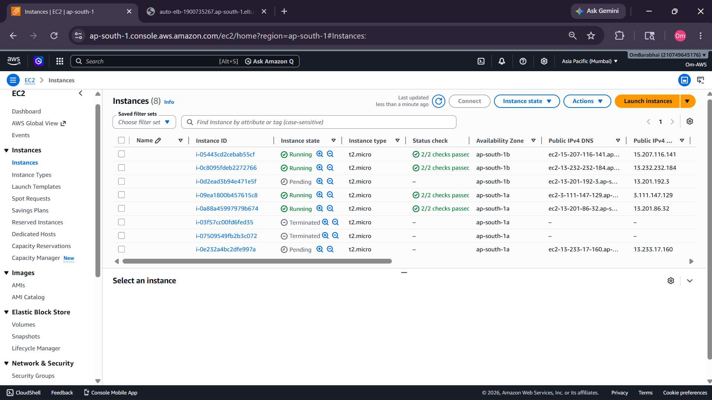
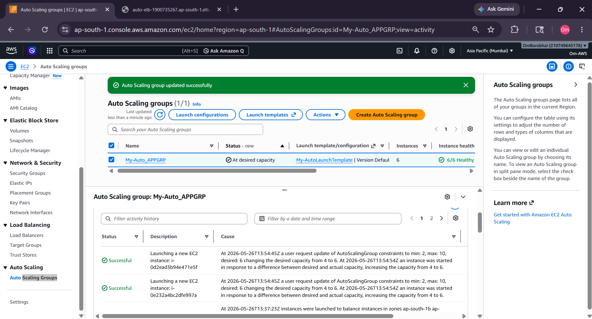
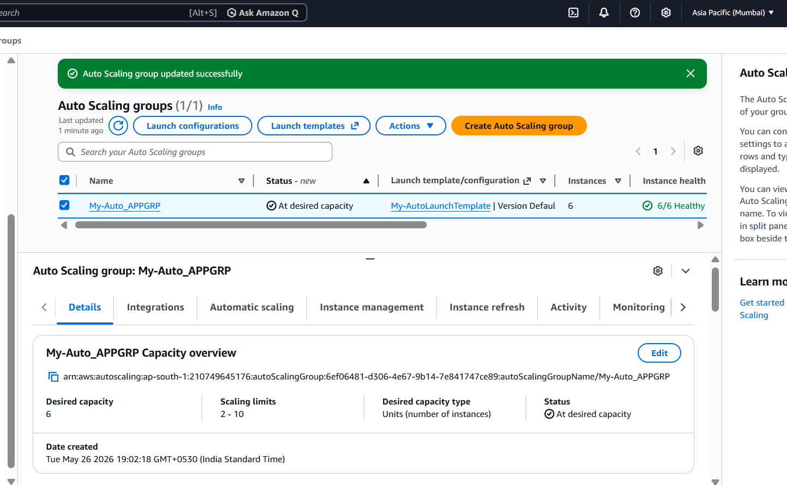
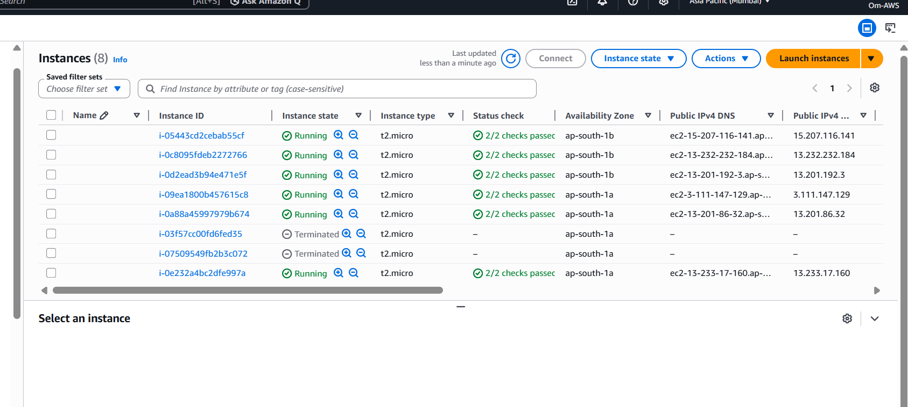
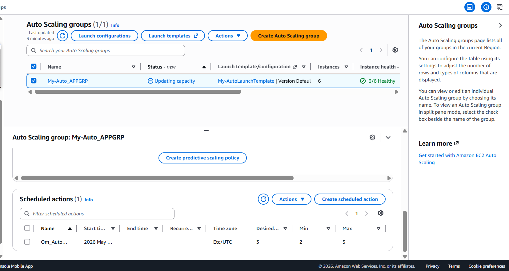
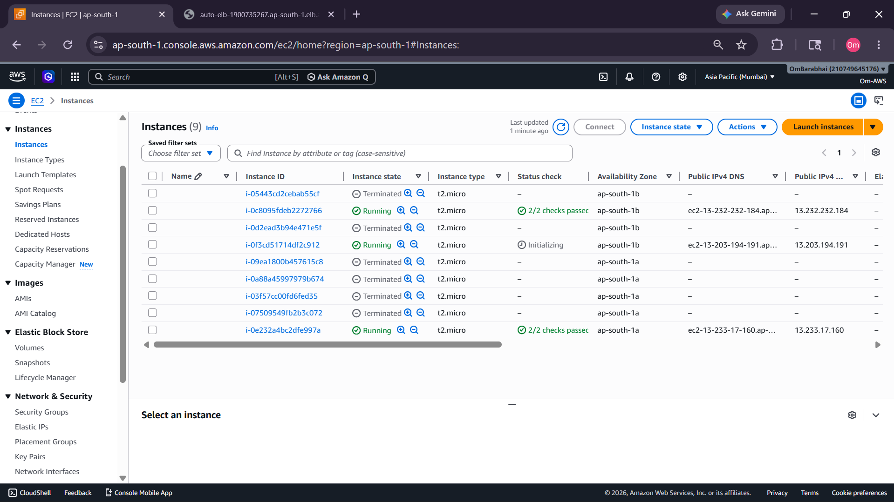

# 🚀 AWS Auto Scaling + Elastic Load Balancer Project


---

# 📌 Project Overview

This project demonstrates how to build a **highly available and self-healing infrastructure** on AWS using:

- EC2 Instances
- Launch Template
- Application Load Balancer (ELB)
- Target Groups
- Auto Scaling Group (ASG)
- Health Checks
- Manual Scaling
- Scheduled Scaling
- Instance Refresh
- Self Healing Infrastructure

The infrastructure automatically:
- distributes traffic,
- maintains healthy instances,
- replaces failed instances,
- and scales based on demand.

---

# 🏗️ Architecture Diagram

```text
                     ┌────────────────────┐
                     │      Users         │
                     └─────────┬──────────┘
                               │
                               ▼
                  ┌────────────────────────┐
                  │ Application Load       │
                  │ Balancer (ELB)         │
                  └─────────┬──────────────┘
                            │
                            ▼
                 ┌─────────────────────────┐
                 │      Target Group       │
                 │    Health Checks        │
                 └─────────┬───────────────┘
                           │
         ┌─────────────────┼─────────────────┐
         ▼                 ▼                 ▼

 ┌────────────┐   ┌────────────┐   ┌────────────┐
 │ EC2        │   │ EC2        │   │ EC2        │
 │ Instance   │   │ Instance   │   │ Instance   │
 └────────────┘   └────────────┘   └────────────┘

                Auto Scaling Group
          (Automatic Launch & Replace)
```

---

# 🛠️ AWS Services Used

| Service | Purpose |
|---|---|
| EC2 | Virtual Machines |
| Launch Template | Instance Configuration |
| Auto Scaling Group | Automatic Scaling |
| ELB | Load Balancing |
| Target Group | Route Traffic |
| Security Group | Firewall Rules |

---

# 📜 User Data Script

This script automatically installs Apache HTTP server while launching EC2 instances.

```bash
#!/bin/bash
yum install httpd -y
service httpd start
chkconfig httpd on
mkdir /var/www/html
echo 'Hey!! This is my Website with AutoScaling GRP!' > /var/www/html/index.html
```

---

# ⚙️ Project Steps

---

# 1️⃣ Create Target Group

- Created empty target group
- Configured HTTP health checks
- Registered EC2 instances automatically

📸 Screenshot:



---

# 2️⃣ Create Application Load Balancer (ELB)

- Created Internet Facing ELB
- Attached target group
- Configured listener on Port 80

📸 Screenshot:



---

# 3️⃣ Create Launch Template

Configured:
- AMI
- Instance Type (`t2.micro`)
- Security Group
- User Data Script
- Key Pair

---

# 4️⃣ Create Auto Scaling Group

Configured:

| Setting | Value |
|---|---|
| Min Capacity | 2 |
| Desired Capacity | 4 |
| Max Capacity | 10 |

📸 Screenshot:



---

# 5️⃣ Verify Healthy Instances

All instances became healthy in Target Group.

📸 Screenshot:


---

# 6️⃣ Website Verification

Successfully accessed website using ELB DNS.

📸 Screenshot:


---

# 📈 Manual Scaling

Increased Desired Capacity manually from:

```text
4 → 6
```

Result:
- Auto Scaling Group launched additional EC2 instances automatically.

📸 Screenshot:



---

# 📊 Auto Scaling Capacity Updated

ASG updated desired capacity successfully.

📸 Screenshot:



---

# 📊 Auto Scaling Overview

Verified updated desired capacity and healthy instances.

📸 Screenshot:



---

# 🖥️ EC2 Instances Increased

New instances launched automatically after scaling.

📸 Screenshot:



---

# ⏰ Scheduled Scaling

Created scheduled scaling action.

Result:
- ASG automatically adjusted capacity at scheduled time.

📸 Screenshot:



---

# 🔄 Instance Refresh + Self Healing

Manually terminated EC2 instances.

Result:
- Auto Scaling Group automatically launched replacement instances.

This demonstrates:
- self-healing infrastructure
- high availability

📸 Screenshot:



---

# ✅ Features Demonstrated

- High Availability
- Elastic Scaling
- Self Healing
- Load Balancing
- Health Checks
- Automated EC2 Provisioning
- Scheduled Scaling
- Infrastructure Automation

---

# 📚 Key Learnings

Through this project I learned:

- Working of Auto Scaling Group
- Launch Templates
- ELB & Target Groups
- Health Checks
- Manual Scaling
- Scheduled Scaling
- Self Healing Infrastructure
- Instance Refresh
- AWS Networking Basics

---

# 🧹 Cleanup Performed

To avoid AWS charges, deleted:

- Auto Scaling Group
- Launch Template
- EC2 Instances
- ELB
- Target Group
- Volumes
- Elastic IPs

---
