# 🚀 AWS EC2 Automation & Monitoring Project

## Using EC2, Lambda, CloudWatch, EventBridge & SNS


---

# 🚀 Project Overview

This project demonstrates how to automate and monitor AWS EC2 instances using multiple AWS services.

The system can:

* Automatically stop/start EC2 instances
* Monitor CPU utilization using CloudWatch
* Trigger alarms based on thresholds
* Send email notifications using SNS
* Schedule EC2 operations using EventBridge
* Create CloudWatch Dashboards
* Use Lambda for automation
* Maintain centralized monitoring and logging

---

# 🧰 AWS Services Used

| Service              | Purpose             |
| -------------------- | ------------------- |
| EC2                  | Virtual Servers     |
| Lambda               | Automation Logic    |
| IAM                  | Roles & Permissions |
| CloudWatch           | Monitoring & Alarms |
| EventBridge          | Scheduling & Events |
| SNS                  | Email Notifications |
| CloudWatch Dashboard | Visualization       |
| CloudWatch Logs      | Log Management      |

---

# 🏗️ Complete Project Workflow

This project follows a real AWS automation workflow.

## Step-by-Step Flow

### 🔹 Step 1 — Create EC2 Instance

First, EC2 instances are launched which act as servers.

### 🔹 Step 2 — Create IAM Role for Lambda

An IAM Role is created with:

* Trusted Entity = Lambda
* Permissions = Start/Stop EC2
* CloudWatch Logs permissions

⚠️ Instead of using `AmazonEC2FullAccess`, an inline custom policy is used for better security.

### 🔹 Step 3 — Create Lambda Functions

Two Lambda functions are created:

* Start EC2 Function
* Stop EC2 Function

These functions automate EC2 operations.

### 🔹 Step 4 — Create EventBridge Schedule

EventBridge Rules are used to trigger Lambda functions automatically.

Example:

| Time | Action    |
| ---- | --------- |
| 9 PM | Stop EC2  |
| 6 AM | Start EC2 |

### 🔹 Step 5 — Configure CloudWatch Monitoring

CloudWatch continuously monitors:

* CPU Utilization
* Network Usage
* Disk Usage
* Status Checks
* Logs

### 🔹 Step 6 — Create CloudWatch Alarm

An alarm is configured when:

```text
CPU Utilization < 10%
```

CloudWatch can:

* Send SNS Notification
* Stop EC2
* Terminate EC2
* Trigger Lambda

### 🔹 Step 7 — SNS Email Notifications

SNS sends real-time notifications for:

* EC2 Launch
* EC2 Stop
* Alarm Triggered
* Instance State Changes

---

# 🏗️ Architecture Diagram

````text
                         ┌──────────────────────┐
                         │      EventBridge     │
                         │   (Schedule Rules)   │
                         └──────────┬───────────┘
                                    │
                   ┌────────────────┴────────────────┐
                   │                                 │
                   ▼                                 ▼
         ┌──────────────────┐              ┌──────────────────┐
         │  Lambda Function │              │  Lambda Function │
         │    Start EC2     │              │    Stop EC2      │
         └────────┬─────────┘              └────────┬─────────┘
                  │                                 │
                  └──────────────┬──────────────────┘
                                 │
                                 ▼
                    ┌────────────────────────┐
                    │      EC2 Instances     │
                    │   Application Servers  │
                    └──────────┬─────────────┘
                               │
                               ▼
                    ┌────────────────────────┐
                    │      CloudWatch        │
                    │ Metrics + Monitoring   │
                    └──────────┬─────────────┘
                               │
                 ┌─────────────┴─────────────┐
                 │                           │
                 ▼                           ▼
      ┌────────────────────┐     ┌────────────────────┐
      │  CloudWatch Alarm  │     │  CloudWatch Logs   │
      │ CPU / Status Check │     │  Centralized Logs  │
      └──────────┬─────────┘     └────────────────────┘
                 │
                 ▼
      ┌────────────────────┐
      │    SNS Topic       │
      │ Email Notification │
      └────────────────────┘

````

---
 ```text
EC2 Instance
      ↓
CloudWatch Metrics
      ↓
CloudWatch Alarm
      ↓
SNS Notification
      ↓
Lambda Function
      ↓
Start / Stop EC2
```
---

# 📸 CloudWatch Concepts

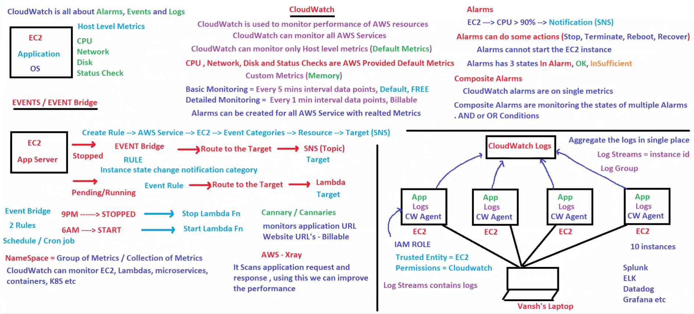

---

# 📸 Project Notes & Revision Diagrams

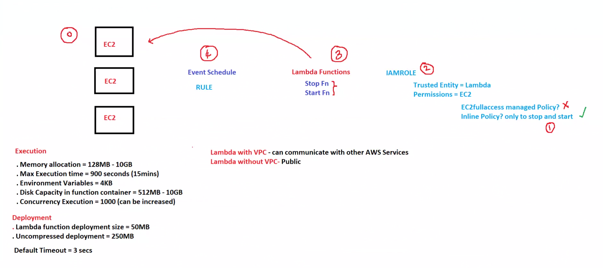

---

# 📂 Project Structure

````bash
AWS-CloudWatch-Automation/
│
├── README.md
├── Lambda/
│   ├── lambda_function.py
│   └── policy.json
│
├── Demo/
│   ├── 2.0.LambdaPolicy.png
│   ├── 3.0.StopFUnct.png
│   ├── DashBoard.png
│   └── FinalMonitoringDashboardCW.png
│
└── Notes/
    ├── CloudWatch.png
    └── ProjectAutomateSTOPSTART.png

````

---

# 🔐 IAM Role & Policy

## IAM Role

Trusted Entity:

```text
Lambda
```

Permissions:

```text
EC2 Start & Stop
CloudWatch Logs
```

---

# 📄 IAM Policy JSON

```json
{
  "Version": "2012-10-17",
  "Statement": [
    {
      "Effect": "Allow",
      "Action": [
        "logs:CreateLogGroup",
        "logs:CreateLogStream",
        "logs:PutLogEvents"
      ],
      "Resource": "arn:aws:logs:*:*:*"
    },
    {
      "Effect": "Allow",
      "Action": [
        "ec2:StartInstances",
        "ec2:StopInstances"
      ],
      "Resource": "*"
    }
  ]
}
```

---

# 🧠 Why Inline Policy Instead of EC2FullAccess?

✅ Better Security
✅ Principle of Least Privilege
✅ Only required actions allowed
✅ Professional AWS Practice

❌ Avoid giving unnecessary permissions like:

```text
AmazonEC2FullAccess
```

---

# ⚡ Lambda Automation Logic

## Python Code

```python
import boto3

region = 'ap-south-1'

instances = [
    'i-01d070ed01c9b02a5',
    'i-0087a935e64cbd7e2'
]

ec2 = boto3.client('ec2', region_name=region)

def lambda_handler(event, context):

    ec2.stop_instances(InstanceIds=instances)

    print('Stopped instances: ' + str(instances))
```

---

# 📸 Complete AWS Implementation Steps

The following screenshots demonstrate the full AWS workflow from EC2 creation to monitoring, scheduling, alarms, and notifications.

✅ Image names and folder locations are preserved exactly as configured in the project.

---

---

## 1️⃣ Create Secure IAM Inline Policy

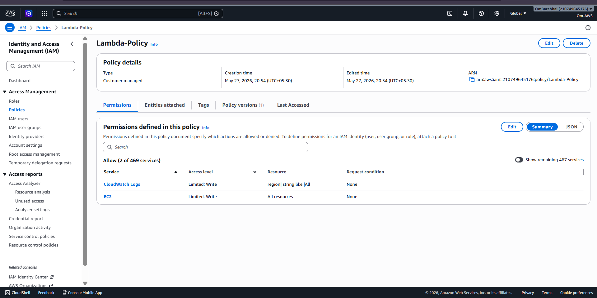

---

## 2️⃣ Create IAM Role for Lambda

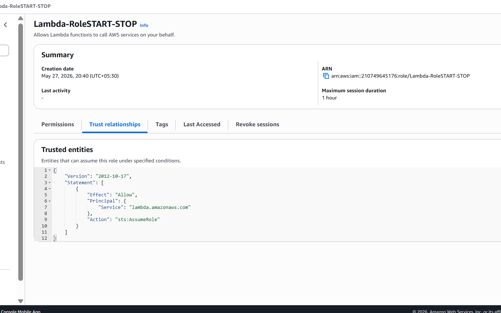

---

## 3️⃣ Attach Permissions to IAM Role


---

## 4️⃣ Create Lambda Function

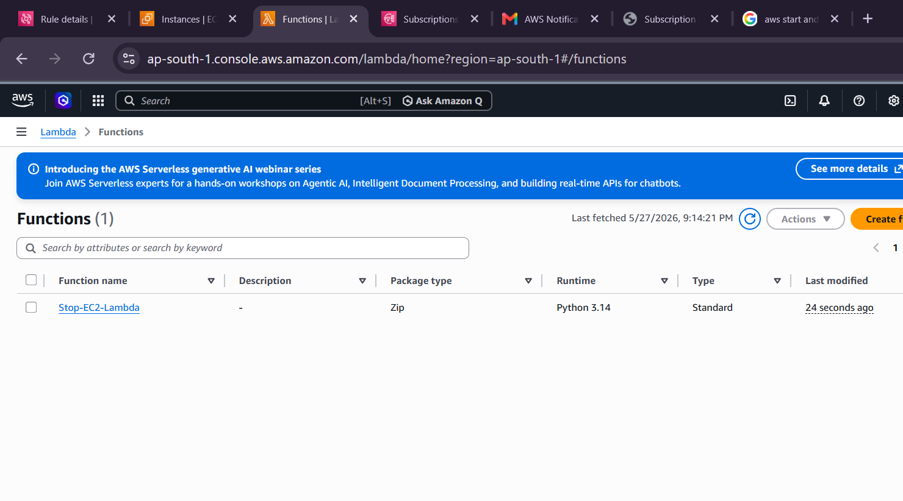

---

## 5️⃣ Verify Lambda Configuration

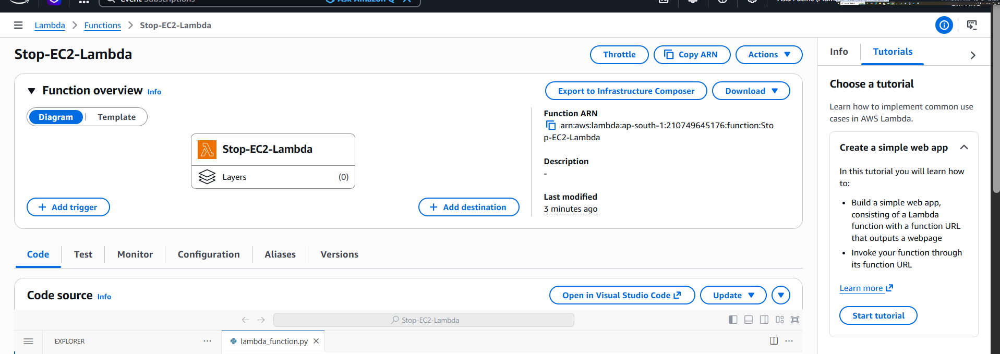

---

## 6️⃣ Create EventBridge Scheduler Rule

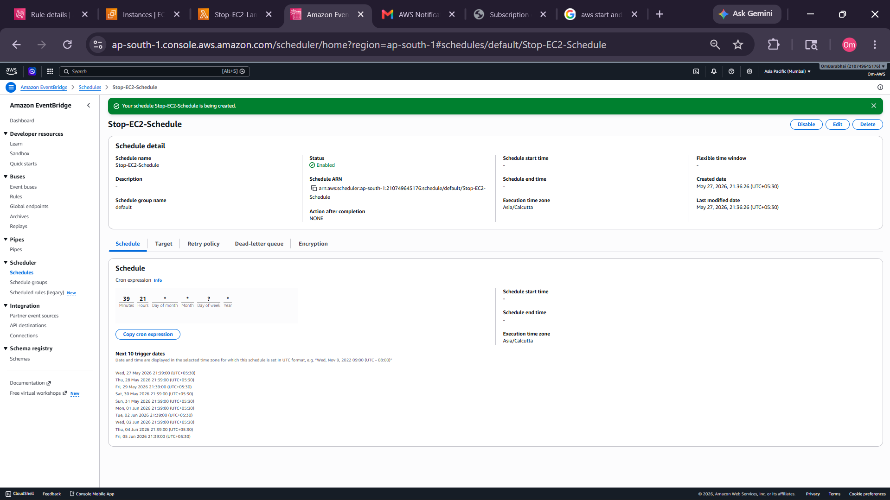

---

## 7️⃣ Automatically Stop EC2 Using Scheduler

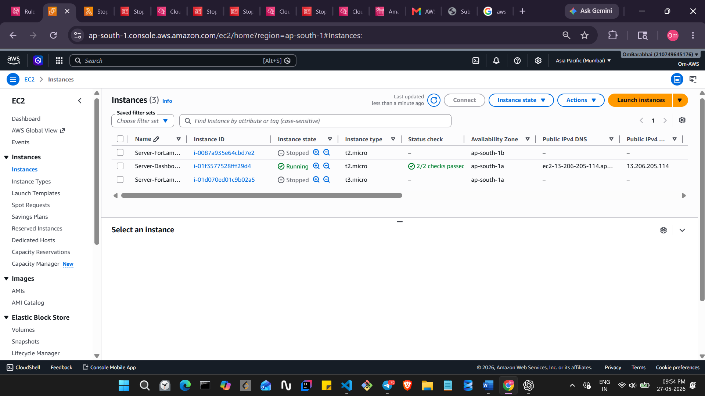

---

## 8️⃣ Configure CloudWatch Alarm Action


---

## 9️⃣ Create CloudWatch Dashboard


---

## 🔟 CloudWatch Alarm Successfully Created

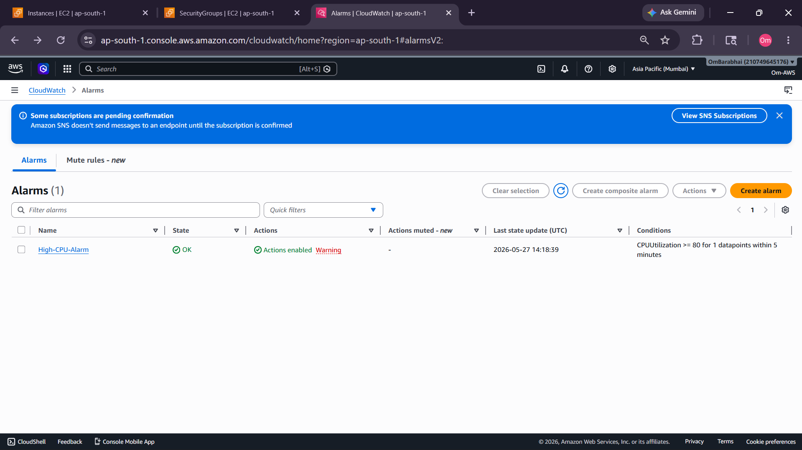

---

## 1️⃣1️⃣ Monitor Metrics in Dashboard


---

## 1️⃣2️⃣ Final Monitoring Dashboard


---

## 1️⃣3️⃣ Initial Alarm State


---

## 1️⃣4️⃣ Alarm Triggered State

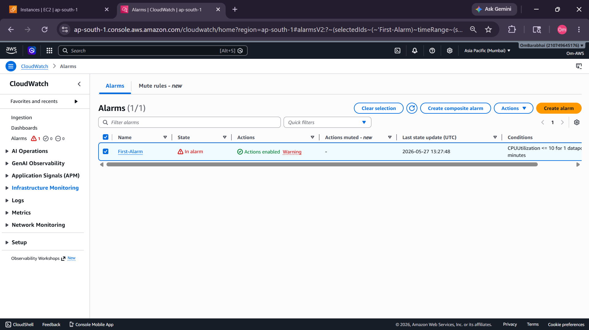

---

## 1️⃣5️⃣ SNS Launch Email Notification

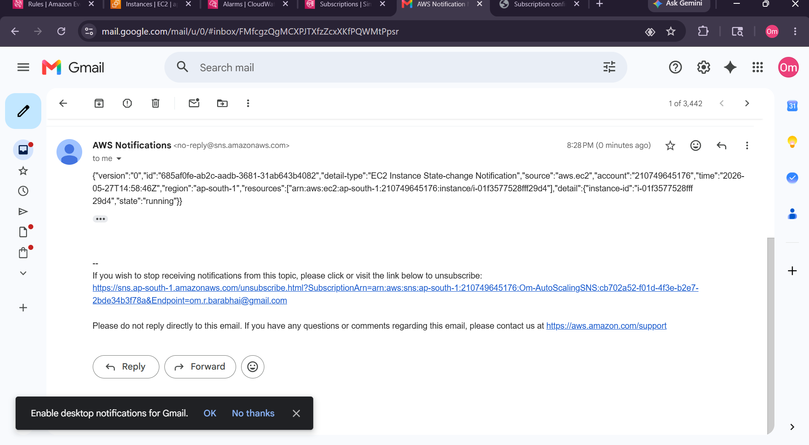

---

## 1️⃣6️⃣ EventBridge Launch Rule


---

## 1️⃣7️⃣ SNS Stop Notification


---

## 1️⃣8️⃣ EC2 Stopped Using Alarm

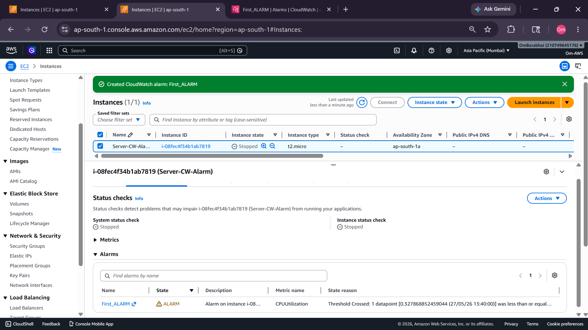

---

## 1️⃣9️⃣ EventBridge Stop Rule

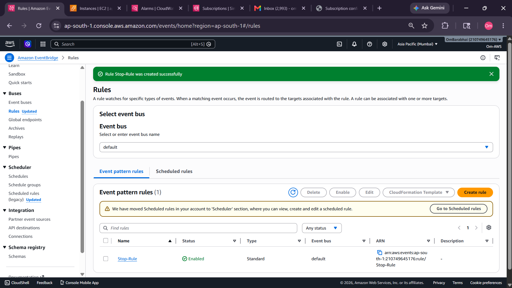

---

## 2️⃣0️⃣ EC2 Terminated Using Alarm


---

# ⏰ EventBridge Scheduler

EventBridge Scheduler is used to automate EC2 start/stop operations.

## Example Schedule

| Time | Action    |
| ---- | --------- |
| 9 PM | Stop EC2  |
| 6 AM | Start EC2 |

---

# 📊 CloudWatch Monitoring

CloudWatch monitors:

* CPU Utilization
* Network Metrics
* Disk Metrics
* Status Checks
* Logs

---

# 🚨 CloudWatch Alarm

Alarm created when:

```text
CPU Utilization < 10%
```

Actions:

* Stop Instance
* Terminate Instance
* Send Notification

---

# 📧 SNS Email Notifications

SNS sends email notifications when:

* EC2 launches
* EC2 stops
* Alarm triggers

---

# 📦 CloudWatch Logs

CloudWatch Logs helps centralize logs from:

* EC2 Instances
* Lambda Functions
* Applications

Important Concepts:

* Log Groups
* Log Streams

---

# 📈 Additional AWS Concepts

## Composite Alarms

Composite alarms help monitor multiple alarms together using:

* AND Conditions
* OR Conditions

---

## Namespace

Namespace = Collection of Metrics

Example:

````text
AWS/EC2
AWS/EC2
````

---

---

## CloudWatch Agent

Used to collect:

* Memory Metrics
* Disk Metrics
* Application Logs

---

# 🧹 Cleanup

After completing the project, delete unused AWS resources to avoid unnecessary billing:

* EC2 Instances
* Lambda Functions
* EventBridge Rules
* CloudWatch Alarms
* SNS Topics
* Dashboards

---

# 📚 Key AWS Concepts Covered

* EC2 Automation
* IAM Roles & Policies
* Lambda Functions
* EventBridge Scheduling
* CloudWatch Monitoring
* CloudWatch Alarms
* SNS Notifications
* CloudWatch Dashboards
* CloudWatch Logs
* AWS Security Best Practices

---

# 🔮 Future Improvements

* Terraform Automation
* CloudFormation Templates
* Slack Notifications
* Auto Scaling Monitoring
* Memory Monitoring
* Grafana Integration
* Prometheus Integration

---

# 💼 Resume Description

```text
Built an AWS cloud monitoring and automation system using EC2, Lambda, CloudWatch, EventBridge, and SNS to automate EC2 lifecycle operations, monitoring dashboards, alarms, scheduling, and email notifications.
```

---

# 🏁 Final Outcome

This project demonstrates practical AWS DevOps concepts including:

* Infrastructure monitoring
* Automation
* Event-driven architecture
* Cloud security
* Serverless computing
* Alerting systems

It is a strong beginner-to-intermediate AWS DevOps showcase project suitable for:

* GitHub portfolio
* Resume projects
* Interviews
* AWS practice labs
