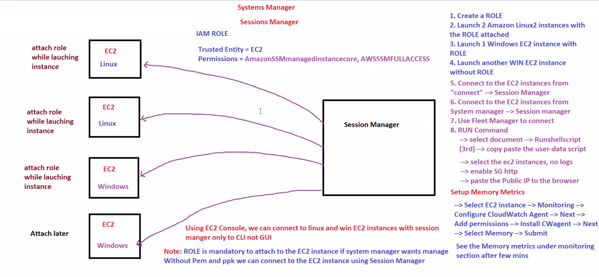
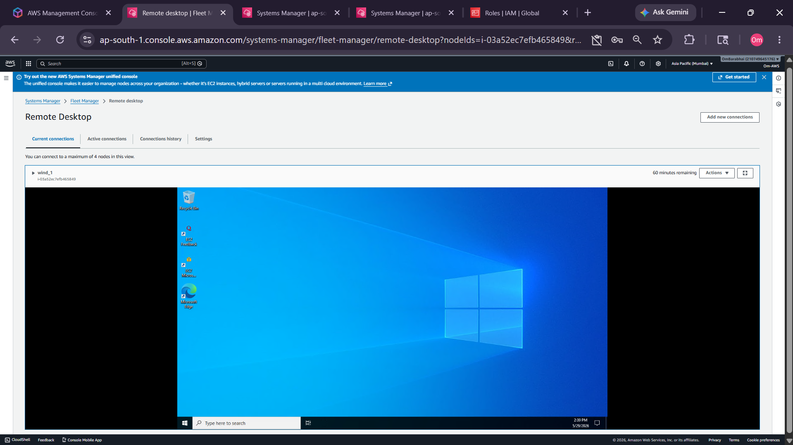
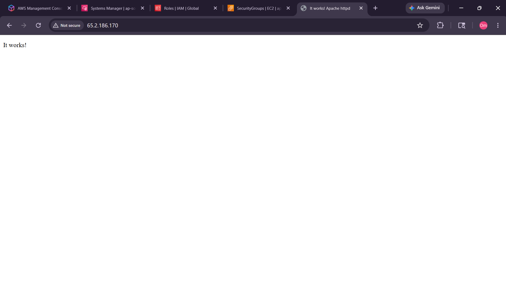
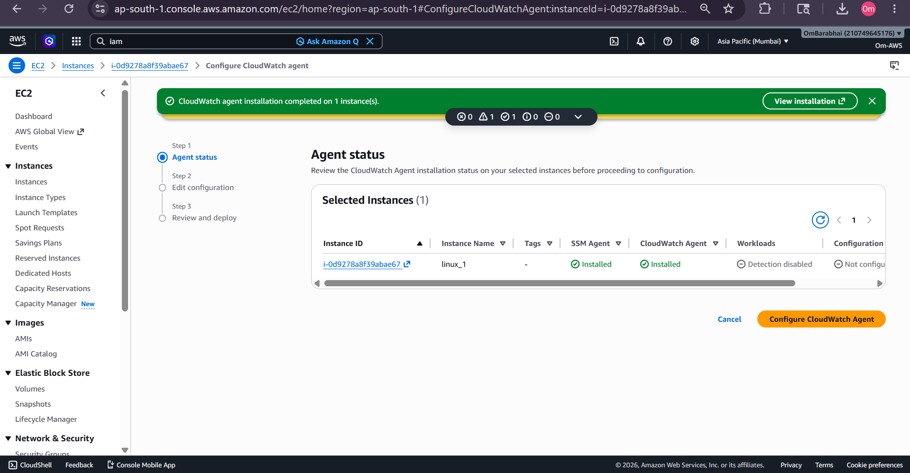
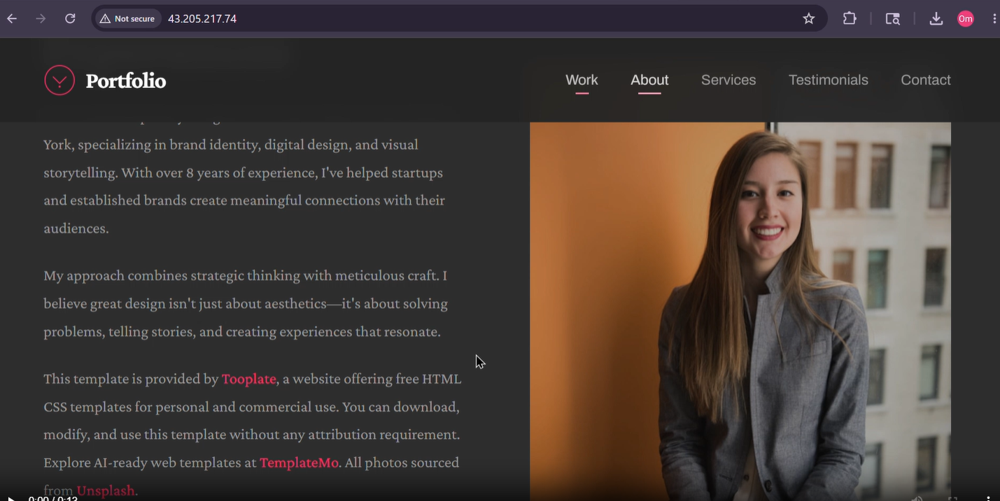
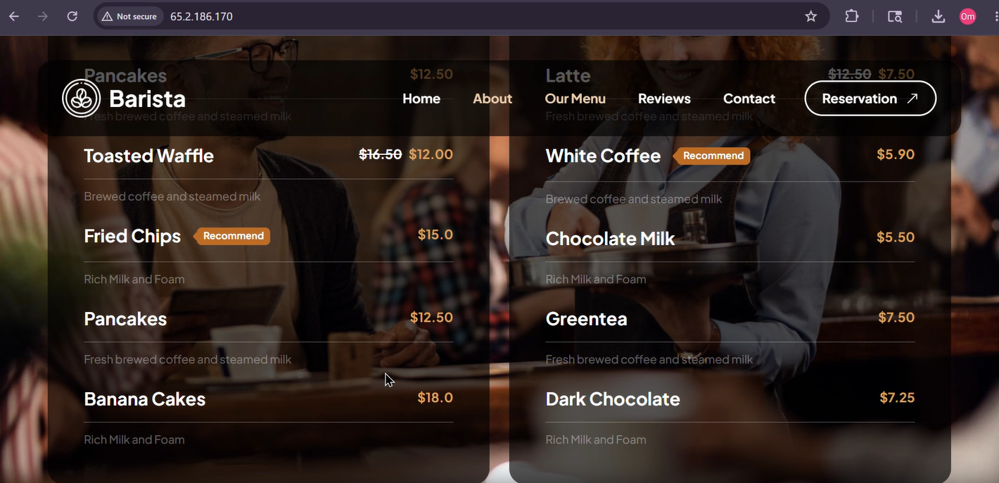
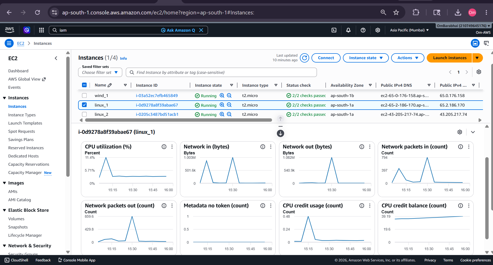
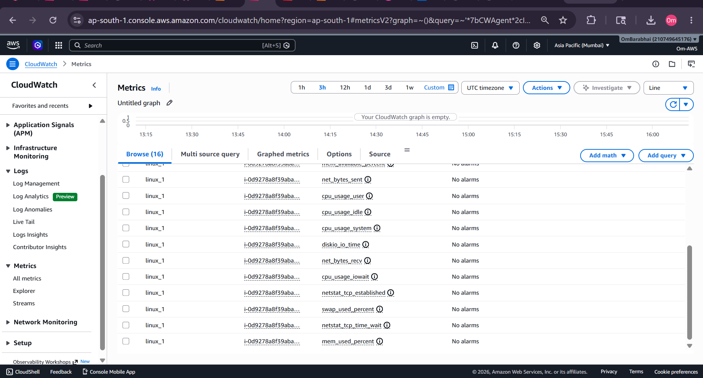

# 🚀 AWS EC2 Frontend Deployment using Systems Manager + CloudWatch

This project demonstrates:

* Creating Linux & Windows EC2 instances
* Creating and attaching IAM Roles
* Managing EC2 using AWS Systems Manager
* Using Session Manager & Fleet Manager
* Deploying frontend templates on Linux EC2
* Configuring CloudWatch Agent
* Monitoring EC2 metrics

---

# 📌 Architecture Overview

## AWS Systems Manager + CloudWatch Architecture

```text id="hy9t9x"
                    ┌─────────────────────────────┐
                    │         IAM ROLE           │
                    │────────────────────────────│
                    │ AmazonSSMManagedInstance  │
                    │ AmazonSSMFullAccess       │
                    │ CloudWatchAgentPolicy     │
                    └─────────────┬─────────────┘
                                  │
                                  ▼
                  ┌──────────────────────────────┐
                  │        EC2 INSTANCES         │
                  │──────────────────────────────│
                  │  Linux EC2 Instance          │
                  │  Windows EC2 Instance        │
                  └─────────────┬────────────────┘
                                │
          ┌─────────────────────┼─────────────────────┐
          │                     │                     │
          ▼                     ▼                     ▼
┌────────────────┐   ┌──────────────────┐   ┌─────────────────┐
│ Session Manager│   │  Fleet Manager   │   │   Run Command   │
│────────────────│   │──────────────────│   │─────────────────│
│ Browser CLI    │   │ Windows GUI      │   │ Remote Commands │
│ Linux Access   │   │ Remote Access    │   │ Deployment      │
└────────────────┘   └──────────────────┘   └─────────────────┘
                                │
                                ▼
                    ┌────────────────────────┐
                    │  Frontend Deployment   │
                    │────────────────────────│
                    │ Apache HTTP Server     │
                    │ HTML/CSS Templates     │
                    │ Static Website Hosting │
                    └─────────────┬──────────┘
                                  │
                                  ▼
                    ┌────────────────────────┐
                    │   CloudWatch Agent     │
                    │────────────────────────│
                    │ CPU Metrics            │
                    │ Memory Metrics         │
                    │ Disk Metrics           │
                    │ Network Metrics        │
                    └─────────────┬──────────┘
                                  │
                                  ▼
                    ┌────────────────────────┐
                    │      CloudWatch        │
                    │────────────────────────│
                    │ Monitoring Dashboard   │
                    │ Metrics Visualization  │
                    │ Infrastructure Health  │
                    └────────────────────────┘
```

---

# 📷 Project Screenshots

## ✅ Systems Manager Architecture



---

## ✅ Fleet Manager Remote Desktop

Connected to Windows EC2 using Fleet Manager GUI.



---

## ✅ Apache Web Server Deployment

Verified Apache HTTP Server installation successfully.



---

## ✅ CloudWatch Agent Installation

CloudWatch Agent installed successfully on Linux EC2.



---

## ✅ Portfolio Frontend Deployment

Frontend template deployed successfully on Linux EC2.

Template:
2154 Split Portfolio



---

## ✅ Cafe Frontend Deployment

Cafe frontend template deployed successfully on Linux EC2.

Template:
2137 Barista Cafe



---

## ✅ CloudWatch Memory Metrics

### Before Adding Memory Metrics



### After Adding Memory Metrics



---

# 🎥 Demonstration Recordings

This project includes complete deployment demonstration videos.

---

## 🚀 Linux EC2 Frontend Deployment — Portfolio Website

[](./Demo2/3rdDeploymentEC2lx2.mp4)

▶ Click the image above to watch the portfolio deployment demonstration.

---

## ☕ Linux EC2 Frontend Deployment — Cafe Website

[](./Demo2/2ndDeploymentEC2lx1.mp4)

▶ Click the image above to watch the cafe deployment demonstration.

---

# 🛠️ Technologies Used

* AWS EC2
* IAM
* AWS Systems Manager
* Session Manager
* Fleet Manager
* CloudWatch
* Linux
* Apache HTTP Server
* HTML/CSS Templates

---

# ⚙️ Step-by-Step Setup

# 1️⃣ Create IAM Role

Trusted Entity:

```text id="e8cqew"
EC2
```

Attach Policies:

```text id="73dglg"
AmazonSSMManagedInstanceCore
AmazonSSMFullAccess
CloudWatchAgentServerPolicy
```

---

# 2️⃣ Launch EC2 Instances

Created:

* Linux EC2 instances
* Windows EC2 instances

Attached IAM role during instance launch.

---

# 3️⃣ Connect using Systems Manager

Navigate:

```text id="gqwd3l"
EC2 → Connect → Session Manager
```

Benefits:

* No SSH keys required
* Browser-based Linux access
* Secure instance management

---

# 4️⃣ Frontend Deployment on Linux EC2

## Install Apache + Required Packages

```bash id="6m2c8s"
sudo -s

yum install -y httpd wget unzip

systemctl start httpd
systemctl enable httpd
```

---

## Download Frontend Template

```bash id="l5r3hn"
cd /tmp

wget https://www.tooplate.com/zip-templates/2154_split_portfolio.zip
```

---

## Extract Template

```bash id="ow0ehn"
unzip 2154_split_portfolio.zip
```

---

## Copy Files to Apache Web Root

```bash id="ty5mvl"
cp -r 2154_split_portfolio/* /var/www/html/
```

---

## Restart Apache Server

```bash id="pklxhi"
systemctl restart httpd
```

---

# 5️⃣ Access Website

Open browser:

```text id="im8mks"
http://PUBLIC-IP
```

---

# 6️⃣ Configure CloudWatch Agent

Navigate:

```text id="o4urxk"
EC2 → Monitoring → Configure CloudWatch Agent
```

Configured Metrics:

* CPU Usage
* Memory Usage
* Disk Usage
* Network Metrics

---

# 7️⃣ View Metrics

Navigate:

```text id="j3k9sv"
CloudWatch
   → Metrics
      → CWAgent
```

---

# 🧠 Project Understanding

## Session Manager

Used for browser-based Linux terminal access.

Benefits:

* No SSH required
* No PEM key required
* Secure AWS-managed access

---

## Fleet Manager

Used for GUI-based Windows instance management.

Benefits:

* Remote desktop-like experience
* Browser-based management
* Centralized instance control

---

## Run Command

Used to execute Linux commands remotely.

Example tasks:

* Install Apache
* Download templates
* Restart services
* Deploy websites

---

## Frontend Deployment Flow

```text id="u6n8ia"
Download Template
        ↓
Extract ZIP
        ↓
Copy Files to /var/www/html
        ↓
Restart Apache
        ↓
Website Live
```

---

## CloudWatch Monitoring

CloudWatch Agent monitors:

* CPU metrics
* Memory metrics
* Disk usage
* Network traffic

Metrics are pushed to CloudWatch every 60 seconds.

---

# 📚 Key Learnings

- ✅ IAM Role Creation
- ✅ AWS Systems Manager
- ✅ Session Manager Access
- ✅ Fleet Manager Access
- ✅ Frontend Deployment on EC2
- ✅ Apache HTTP Server Setup
- ✅ CloudWatch Agent Configuration
- ✅ EC2 Monitoring & Metrics
---

# 🎯 Project Outcome

Successfully:

* Managed EC2 without SSH keys
* Connected Linux & Windows instances
* Deployed frontend templates
* Configured infrastructure monitoring
* Learned AWS Systems Manager workflow
* Understood CloudWatch monitoring architecture

---
