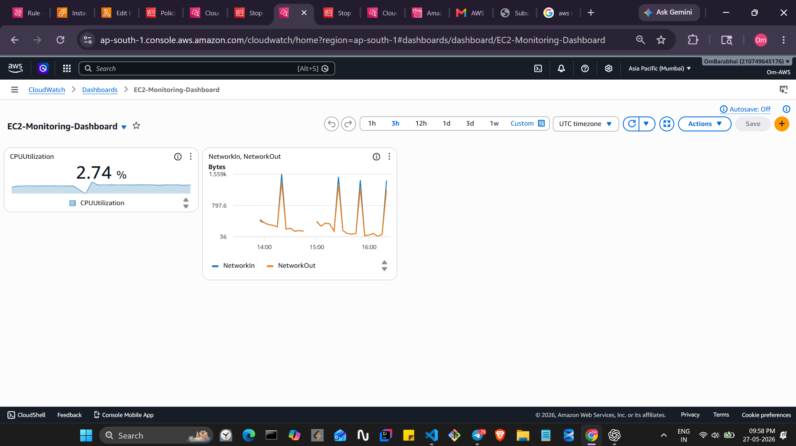
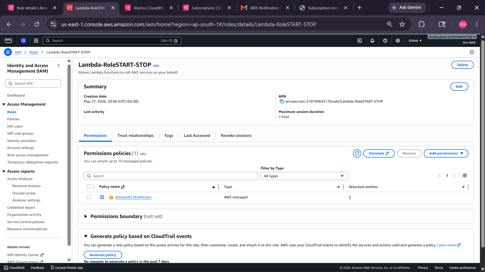
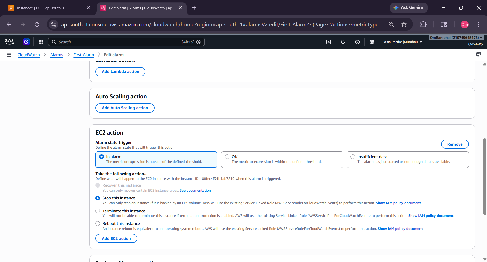
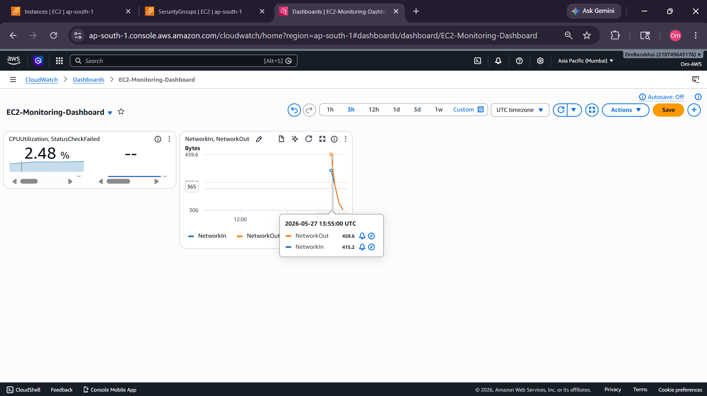
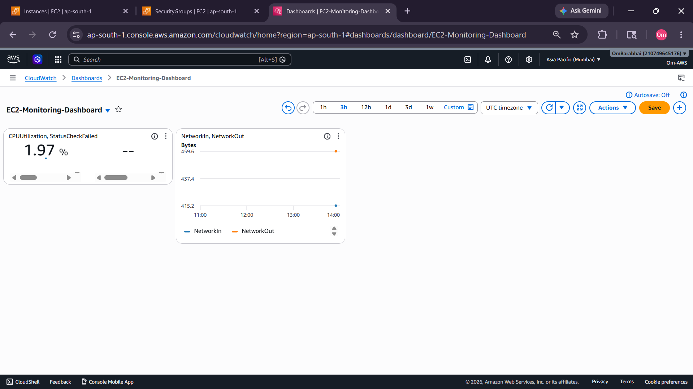
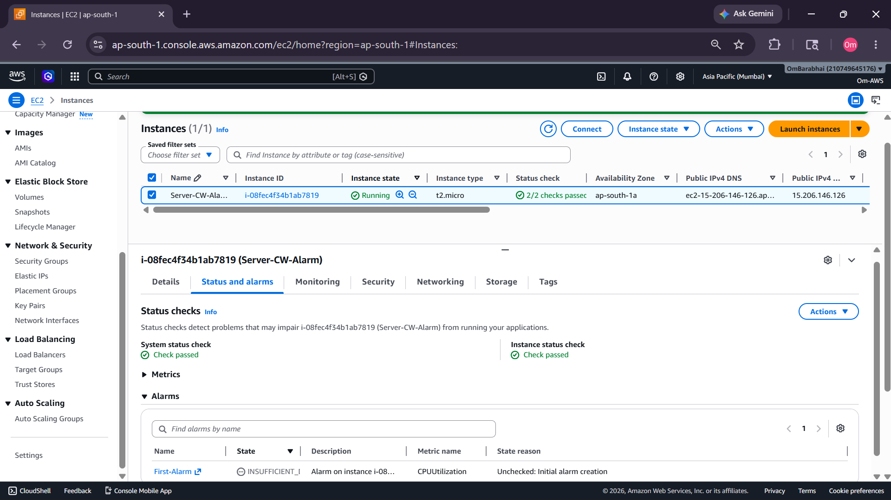
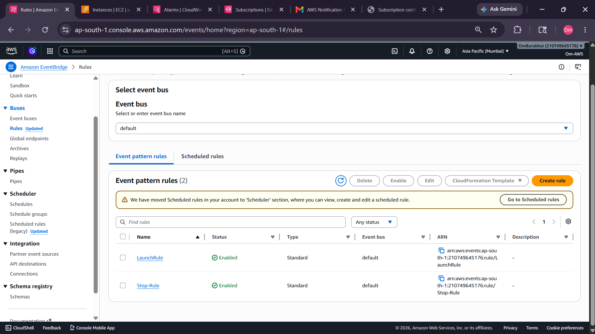
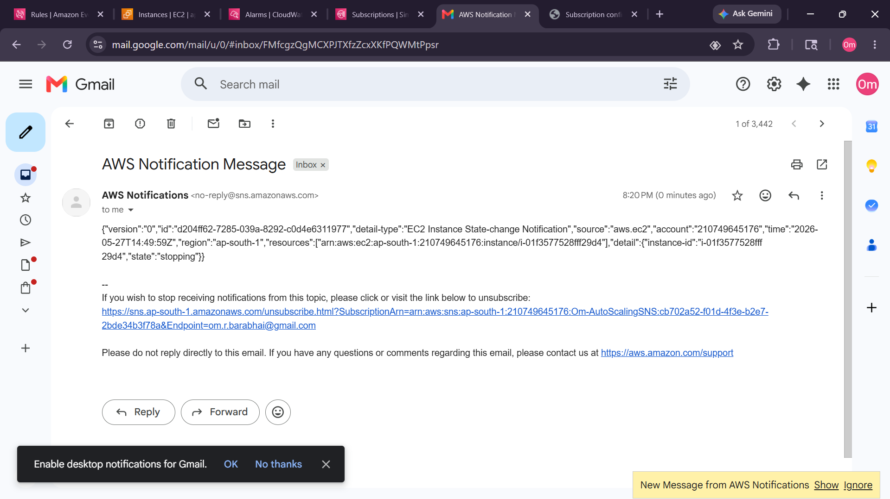
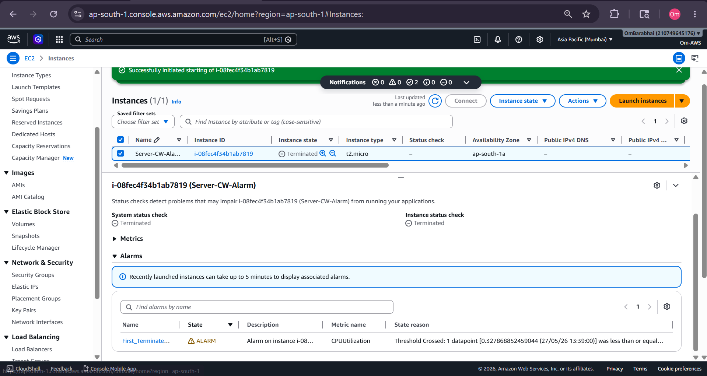

# AWS EC2 Automation & Monitoring using CloudWatch, Lambda & EventBridge



---

# 🚀 Project Overview

This project demonstrates how to automate and monitor AWS EC2 instances using multiple AWS services.

The system can:

- Automatically stop/start EC2 instances
- Monitor CPU utilization using CloudWatch
- Trigger alarms based on thresholds
- Send email notifications using SNS
- Schedule EC2 operations using EventBridge
- Create CloudWatch Dashboards
- Use Lambda for automation
- Maintain centralized monitoring and logging

---

# 🧰 AWS Services Used

| Service | Purpose |
|---|---|
| EC2 | Virtual Servers |
| Lambda | Automation Logic |
| IAM | Roles & Permissions |
| CloudWatch | Monitoring & Alarms |
| EventBridge | Scheduling & Events |
| SNS | Email Notifications |
| CloudWatch Dashboard | Visualization |
| CloudWatch Logs | Log Management |

---

# 🏗️ Architecture Flow

```text
EC2 Instance
      ↓
CloudWatch Metrics
      ↓
CloudWatch Alarm
      ↓
SNS Notification
      ↓
Lambda Function
      ↓
Stop / Start EC2
```

---

# 📸 CloudWatch Concepts


---

# 📸 Lambda + EventBridge Architecture


---

# 📂 Project Structure

```bash
AWS-CloudWatch-Automation/
│
├── README.md
├── DEMO.md
├── Lambda/
│   ├── lambda_function.py
│   ├── policy.json
│
├── Demo/
│   ├── all screenshots
│
└── Notes/
```

---

# 🔐 IAM Role & Policy

## IAM Role

Trusted Entity:

```text
Lambda
```

Permissions:

```text
EC2 Start & Stop
CloudWatch Logs
```

---

# 📄 IAM Policy JSON

```json
{
  "Version": "2012-10-17",
  "Statement": [
    {
      "Effect": "Allow",
      "Action": [
        "logs:CreateLogGroup",
        "logs:CreateLogStream",
        "logs:PutLogEvents"
      ],
      "Resource": "arn:aws:logs:*:*:*"
    },
    {
      "Effect": "Allow",
      "Action": [
        "ec2:StartInstances",
        "ec2:StopInstances"
      ],
      "Resource": "*"
    }
  ]
}
```

---

# 🧠 Why Inline Policy Instead of EC2FullAccess?

✅ Better Security  
✅ Principle of Least Privilege  
✅ Only required actions allowed  
✅ Professional AWS Practice  

❌ Avoid giving unnecessary permissions like:

```text
AmazonEC2FullAccess
```

---

# ⚡ Lambda Function

## Python Code

```python
import boto3

region = 'ap-south-1'

instances = [
    'i-01d070ed01c9b02a5',
    'i-0087a935e64cbd7e2'
]

ec2 = boto3.client('ec2', region_name=region)

def lambda_handler(event, context):

    ec2.stop_instances(InstanceIds=instances)

    print('Stopped instances: ' + str(instances))
```

---

# 📸 Project Demonstration

---

## 1. Lambda Policy


---

## 2. IAM Role Trusted Entity


---

## 3. IAM Role Permissions



---

## 4. Lambda Function Created


---

## 5. Lambda Function Overview


---

## 6. EventBridge Scheduler Created


---

## 7. EC2 Automatically Stopped


---

## 8. CloudWatch Alarm Action



---

## 9. Dashboard Created



---

## 10. CloudWatch Alarm Successfully Created


---

## 11. CloudWatch Dashboard



---

## 12. Final Monitoring Dashboard


---

## 13. First Alarm State



---

## 14. Alarm Triggered


---

## 15. EC2 Launch Email Notification


---

## 16. EventBridge Launch Rule



---

## 17. Stop Notification Email



---

## 18. EC2 Stopped Using Alarm


---

## 19. EventBridge Stop Rule


---

## 20. EC2 Terminated Using Alarm



---

# ⏰ EventBridge Scheduler

EventBridge Scheduler is used to automate EC2 start/stop operations.

## Example Schedule

| Time | Action |
|---|---|
| 9 PM | Stop EC2 |
| 6 AM | Start EC2 |

---

# 📊 CloudWatch Monitoring

CloudWatch monitors:

- CPU Utilization
- Network Metrics
- Disk Metrics
- Status Checks
- Logs

---

# 🚨 CloudWatch Alarm

Alarm created when:

```text
CPU Utilization < 10%
```

Actions:

- Stop Instance
- Terminate Instance
- Send Notification

---

# 📧 SNS Email Notifications

SNS sends email notifications when:

- EC2 launches
- EC2 stops
- Alarm triggers

---

# 📦 CloudWatch Logs

CloudWatch Logs helps aggregate logs from:

- EC2 Instances
- Applications
- Lambda Functions

Concepts:

- Log Groups
- Log Streams

---

# 📈 Additional Concepts Learned

## Composite Alarms

Monitor multiple alarms together using:

- AND conditions
- OR conditions

---

## Namespace

Namespace = Collection of Metrics

Example:

```text
AWS/EC2
```

---

## AWS X-Ray

Used for:

- Request tracing
- Performance analysis
- Debugging distributed applications

---

## CloudWatch Agent

Used to collect:

- Memory Metrics
- Disk Metrics
- Application Logs

---

# 🧹 Cleanup Steps

After completing the project:

Deleted:

- EC2 Instances
- Lambda Functions
- IAM Policies
- EventBridge Rules
- Scheduler
- CloudWatch Alarms
- SNS Topics
- Dashboards
- Logs

This helps avoid unnecessary AWS billing.

---

# 📚 What I Learned

- AWS IAM Roles & Policies
- Lambda Automation
- EventBridge Scheduling
- CloudWatch Monitoring
- EC2 Automation
- SNS Notifications
- CloudWatch Dashboards
- CloudWatch Alarms
- AWS Security Best Practices
- Infrastructure Cleanup

---

# 🔮 Future Improvements

- Terraform Automation
- CloudFormation Templates
- Slack Notifications
- Auto Scaling Monitoring
- Memory Monitoring
- Grafana Integration
- Prometheus Integration

---

# 💼 Resume Description

```text
Built an AWS cloud monitoring and automation system using EC2, Lambda, CloudWatch, EventBridge, and SNS to automate EC2 lifecycle operations, monitoring dashboards, alarms, scheduling, and email notifications.
```

---

# 🏁 Conclusion

This project demonstrates practical AWS DevOps concepts including:

- Infrastructure monitoring
- Automation
- Event-driven architecture
- Cloud security
- Serverless computing
- Alerting systems

It is a strong beginner-to-intermediate AWS DevOps showcase project suitable for:

- GitHub portfolio
- Resume projects
- Interviews
- AWS practice labs

