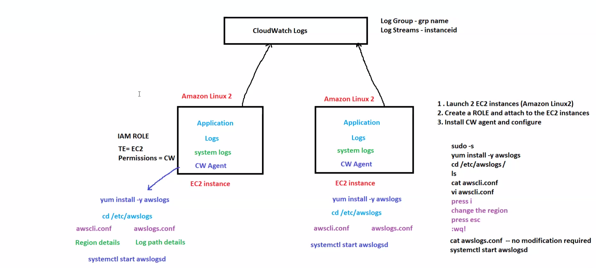
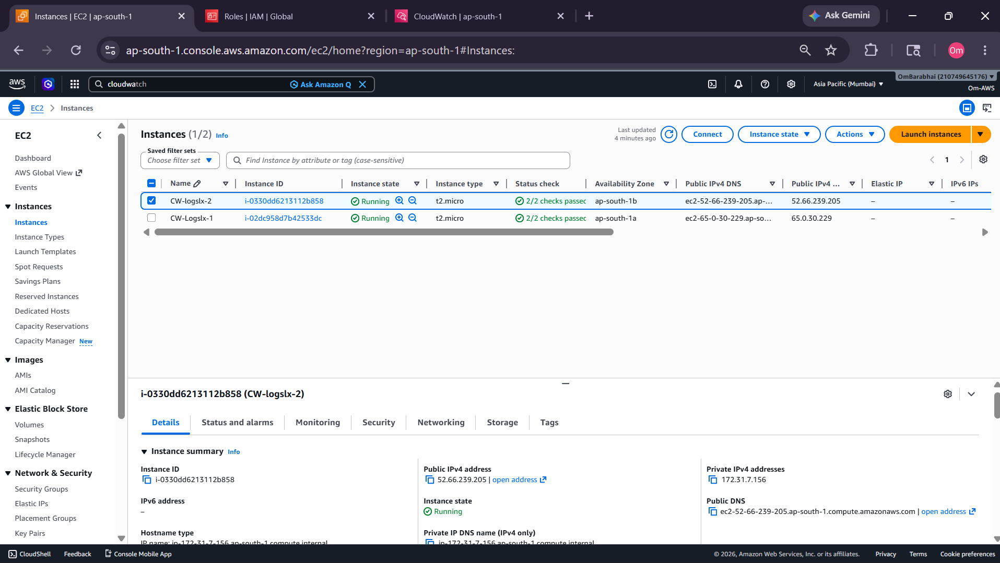
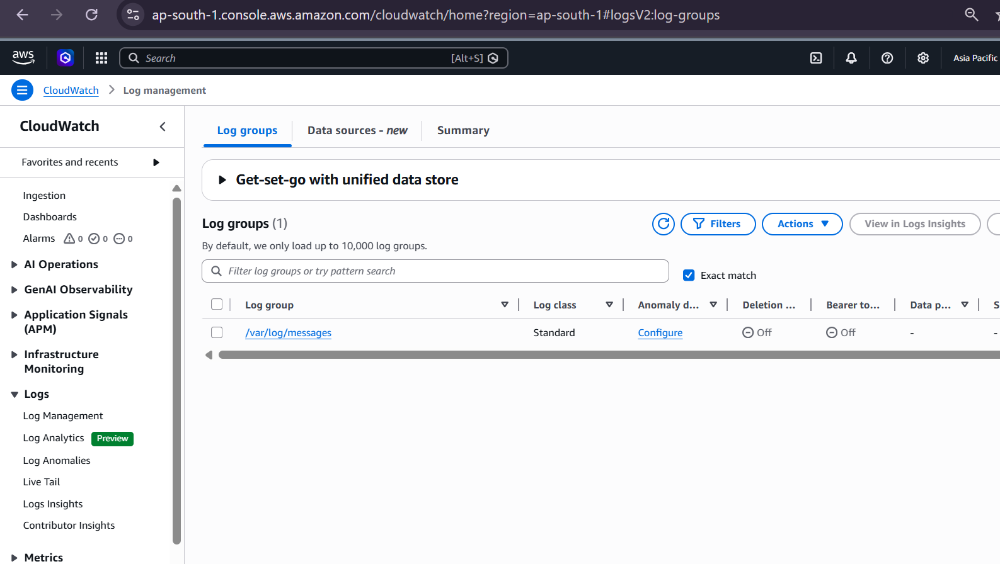
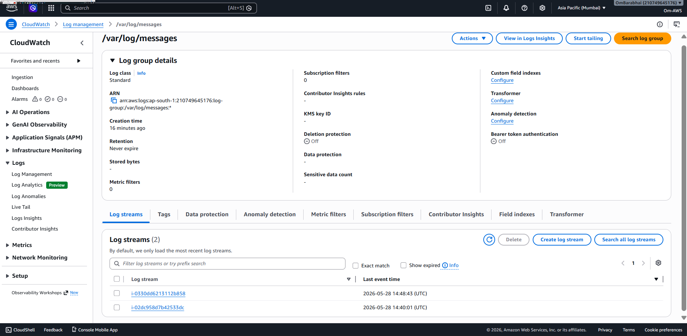
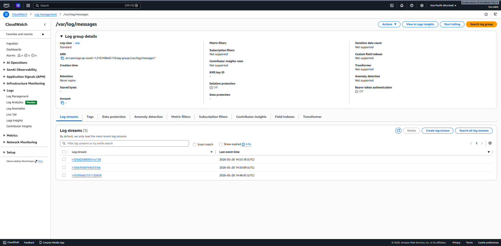
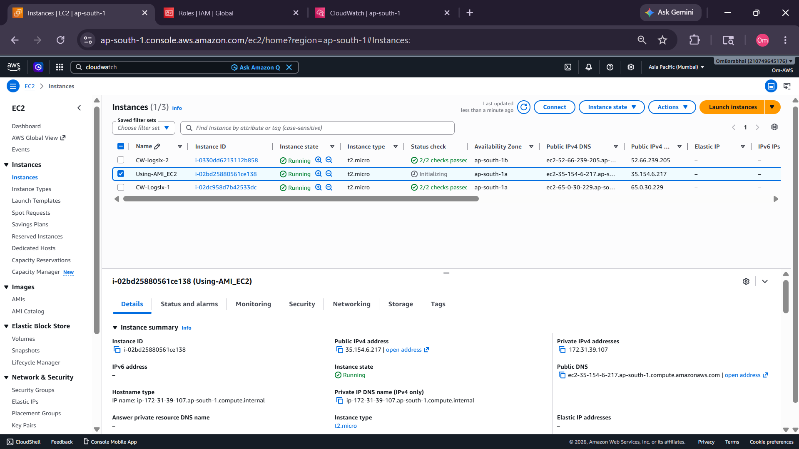

# 🌩️ AWS CloudWatch Logs Practical
## Centralized Logging with EC2, IAM Roles, AWS Logs Agent & CloudWatch Logs



---

# 📌 Project Overview

This practical demonstrates centralized logging on AWS by sending logs from Amazon EC2 instances to Amazon CloudWatch Logs using the AWS Logs Agent (`awslogs`).

The goal of this hands-on work was to understand:

- How to create and launch EC2 instances
- How to attach IAM roles for CloudWatch Logs access
- How to install and configure the AWS Logs Agent
- How to view log groups and log streams in CloudWatch
- How to create an AMI from a configured EC2 instance
- How to reuse the AMI to launch another log-enabled EC2 instance

---

# 🏗️ Architecture Diagram

```text
                     ┌──────────────────────┐
                     │   CloudWatch Logs    │
                     │  Log Group / Streams │
                     └──────────┬───────────┘
                                ▲
                ┌───────────────┼───────────────┐
                │                               │
                ▼                               ▼
        ┌────────────────┐               ┌────────────────┐
        │  EC2 Instance   │               │  EC2 Instance   │
        │ Amazon Linux 2  │               │ Amazon Linux 2  │
        │ awslogs Agent   │               │ awslogs Agent   │
        └────────┬───────┘               └────────┬───────┘
                 │                                 │
                 └──────────────┬──────────────────┘
                                │
                                ▼
                         ┌──────────────┐
                         │  IAM Role    │
                         │ CloudWatch   │
                         └──────────────┘
```

---

# 🧰 AWS Services Used

| Service | Purpose |
|---|---|
| Amazon EC2 | Generate system logs |
| IAM Role | Secure access to CloudWatch Logs |
| CloudWatch Logs | Centralized log storage |
| AWS Logs Agent (`awslogs`) | Push logs from EC2 to CloudWatch |
| Amazon Linux 2 | Operating system used in EC2 |
| AMI | Reusable configured EC2 image |

---

# 🚀 Practical Workflow

## 1️⃣ Launch EC2 Instances

Created Amazon Linux 2 EC2 instances to generate and send logs.

📸 Screenshot:



---

## 2️⃣ Create IAM Role for EC2

Created an IAM role and attached CloudWatch permissions so the EC2 instance can publish logs securely to CloudWatch.

Trusted Entity:

```text
EC2
```

Permissions:

```text
CloudWatch Logs
```

---

## 3️⃣ Install AWS Logs Agent

Installed the AWS Logs Agent on the EC2 instance.

### Commands Used

```bash
sudo -s
yum install -y awslogs
```

---

## 4️⃣ Configure AWS Logs Agent

Moved into the logs configuration directory and updated the required configuration files.

### Commands Used

```bash
cd /etc/awslogs/
```

Configured:

- `awscli.conf`
- `awslogs.conf`
- AWS Region
- Log file path: `/var/log/messages`

### Start the service

```bash
systemctl start awslogsd
systemctl enable awslogsd
```

### Check service status

```bash
systemctl status awslogsd
```

📸 Notes / reference image:


---

## 5️⃣ Verify Log Groups in CloudWatch

After configuration, CloudWatch created the log group successfully.

📸 Log Group:



---

## 6️⃣ Verify Log Streams

Each EC2 instance created its own log stream inside the CloudWatch log group.

📸 Log Streams:



---

## 7️⃣ Create AMI from Configured EC2

Created a custom AMI from the configured EC2 instance so the same logging setup can be reused later.

📸 AMI / source instance setup:



---

## 8️⃣ Launch New EC2 Using AMI

Launched a new EC2 instance from the custom AMI.

The new instance also started sending logs to CloudWatch automatically.

📸 New EC2 using AMI:



---

# 📸 Practical Results

## CloudWatch Log Group Created


## Multiple Log Streams Visible


## AMI-Based Reusable Setup


## New Instance Successfully Sending Logs


---

# ✅ Final Outcome

This practical successfully demonstrated:

- Centralized logging from EC2 to CloudWatch Logs
- Log Group and Log Stream creation
- IAM role-based access control
- AWS Logs Agent configuration
- Reusable AMI-based logging setup
- Monitoring and troubleshooting workflow on AWS

---

# 📚 Key Learnings

- How CloudWatch Logs works
- How to attach IAM roles to EC2 securely
- How to install and configure `awslogs`
- How log groups and log streams are organized
- How to create and reuse AMIs for faster deployment
- How centralized logging helps in monitoring and debugging

---

# 💼 Resume Summary

```text
Implemented centralized logging on AWS using EC2, IAM Roles, AWS Logs Agent, and CloudWatch Logs to collect system logs from multiple instances, verify log groups and log streams, and reuse a custom AMI for faster deployment.
```

---

# 🏁 Conclusion

This was a successful CloudWatch Logs hands-on practical. It improved my understanding of AWS monitoring, centralized logging, EC2 log management, IAM permissions, and reusable infrastructure setup.

