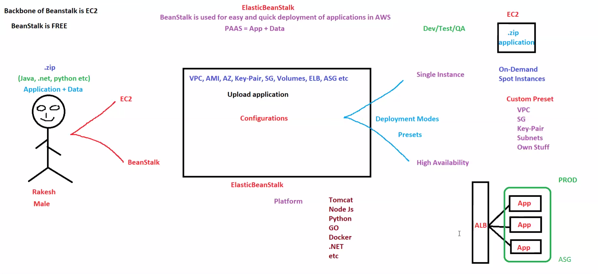
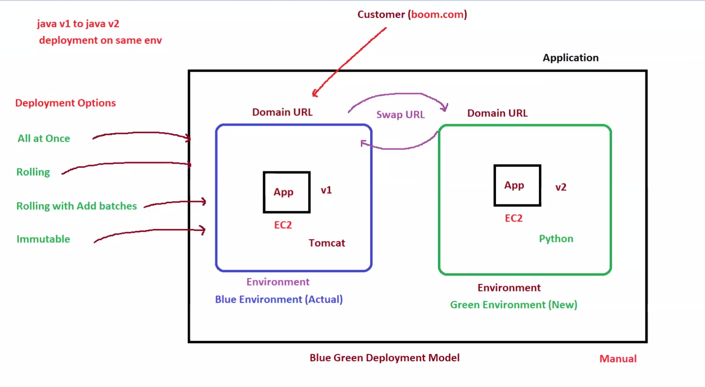
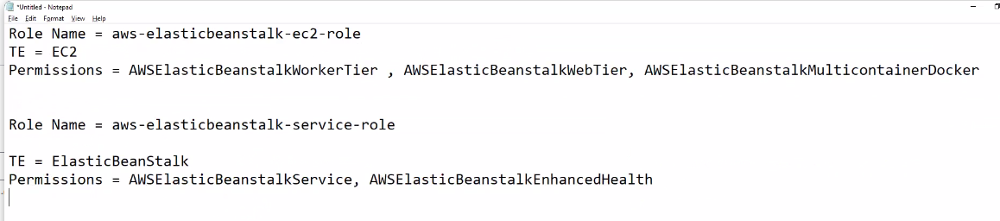
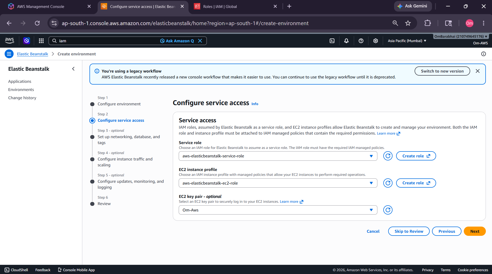
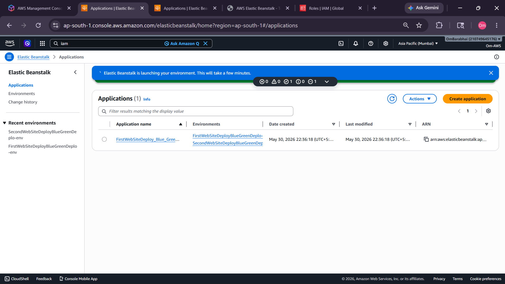
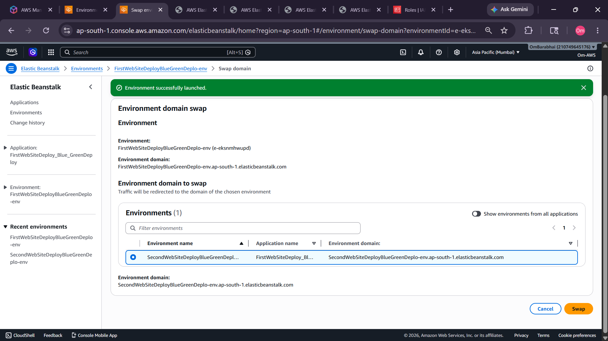
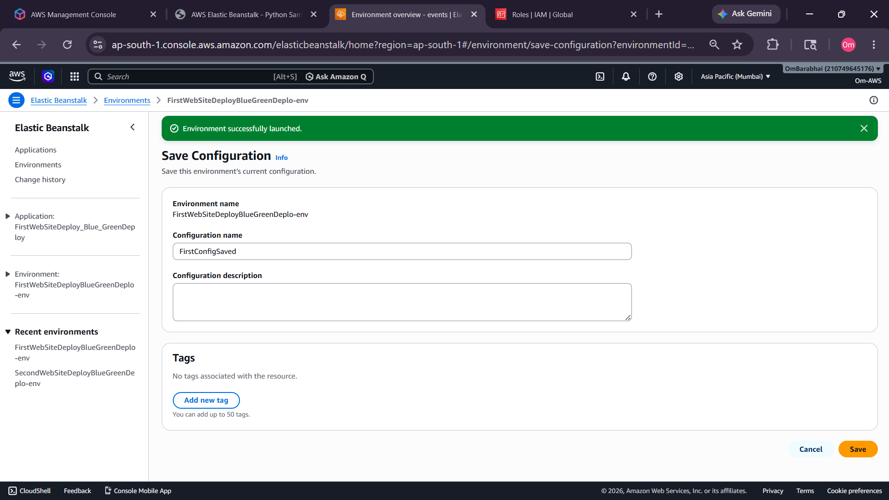
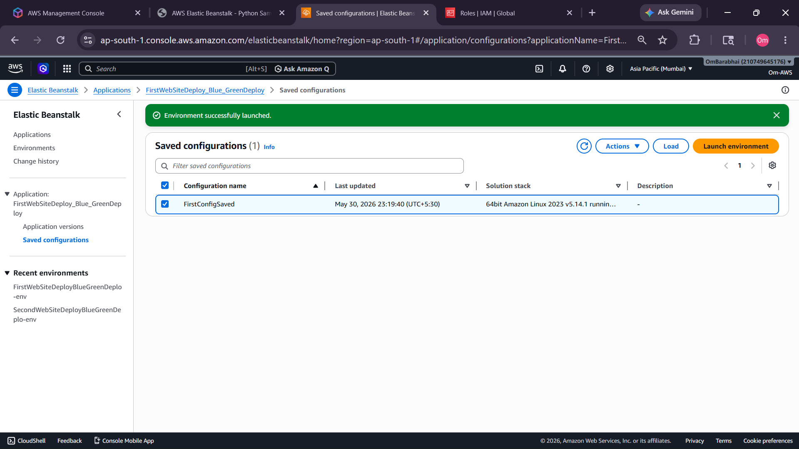
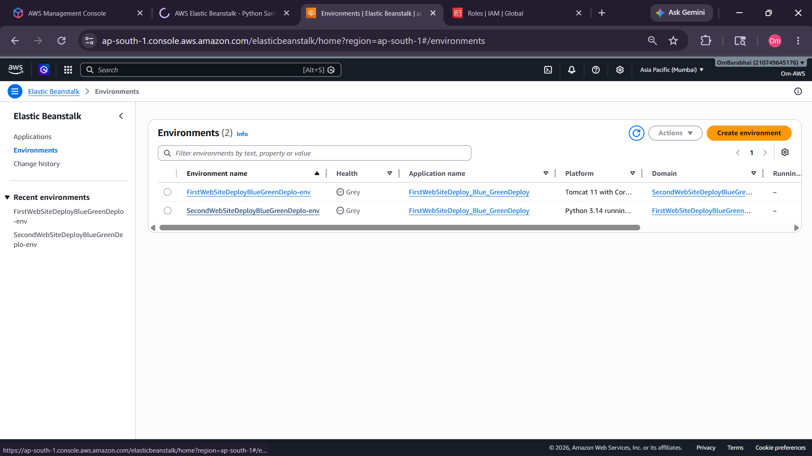
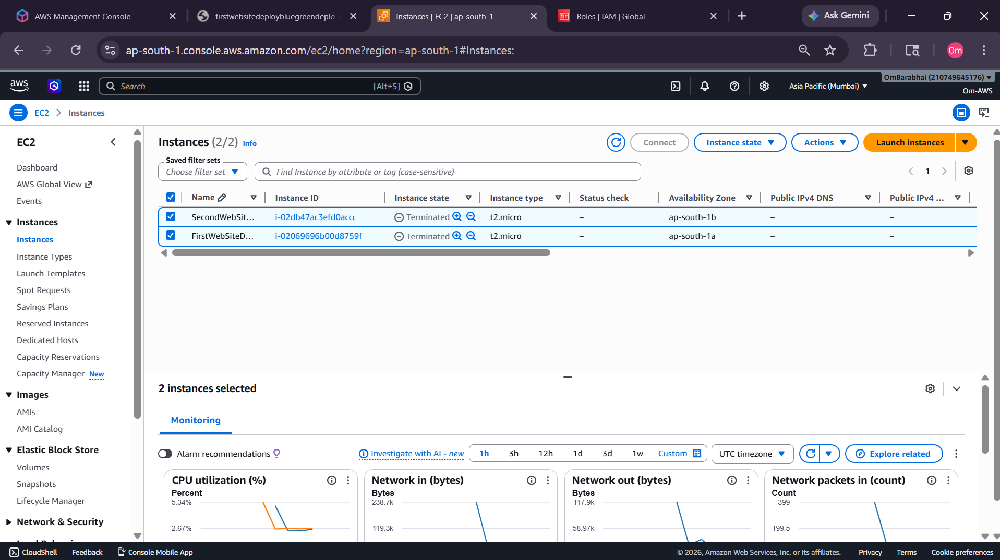

# 🚀 AWS Elastic Beanstalk Blue-Green Deployment Project

## 📌 Project Overview

This project demonstrates how to perform a **Blue-Green Deployment** using **AWS Elastic Beanstalk** with minimal downtime.

The project includes:

* Creating IAM Roles for Elastic Beanstalk
* Deploying applications using Elastic Beanstalk
* Creating Blue & Green environments
* Swapping environment URLs
* Performing Zero-Downtime Deployment
* Saving environment configurations
* Cleaning up AWS resources

This hands-on project helped in understanding how real-world production deployments work in cloud environments.

---

# 🏗️ Elastic Beanstalk Architecture

## 📷 Elastic Beanstalk Overview



---

# 🔵🟢 Blue-Green Deployment Architecture

## 📷 Blue-Green Deployment Flow



---

# 🔐 IAM Roles & Permissions

## 📷 IAM Roles Used



---

# ⚙️ AWS Services Used

| Service               | Purpose                     |
| --------------------- | --------------------------- |
| Elastic Beanstalk     | Application Deployment      |
| EC2                   | Compute Infrastructure      |
| IAM                   | Access Management           |
| Auto Scaling          | Scaling Environment         |
| Elastic Load Balancer | Traffic Distribution        |
| CloudWatch            | Monitoring                  |
| Security Groups       | Firewall Rules              |
| Tomcat Platform       | Java Application Platform   |
| Python Platform       | Python Application Platform |

---

# 🧠 Blue-Green Deployment Concept

## 🔵 Blue Environment

Current production/live environment.

```text
Users are actively accessing this environment.
```

---

## 🟢 Green Environment

New application version deployed separately for testing.

```text
Used before switching live production traffic.
```

---

## 🔄 Environment Swap

Traffic switches from:

```text
Blue Environment → Green Environment
```

without downtime.

---

# 📂 Project Demonstration

---

# 1️⃣ Creating IAM Roles & Access

Configured:

* Service Role
* EC2 Instance Profile
* Required Elastic Beanstalk Policies

## 📷 Screenshot



---

# 2️⃣ First Website Deployment

Initial Elastic Beanstalk environment deployed successfully.

## 🎥 Deployment Demonstration


---

# 3️⃣ Creating & Attaching New Environment

Created second environment for Blue-Green deployment strategy.

## 📷 Screenshot



---

# 4️⃣ Second Website Deployment

Deployed second application version successfully.

## 🎥 Second Deployment Demo


---

# 5️⃣ Swapping Environment URLs

Performed Blue-Green URL swap operation.

Traffic redirected successfully to the new environment.

## 📷 Screenshot



---

# 6️⃣ Successful Blue-Green Swap

Verified successful traffic switch after swap operation.

## 🎥 Swap Demonstration


---

# 7️⃣ Saving Environment Configuration

Saved Elastic Beanstalk configuration for reuse.

## 📷 Screenshot



---

# 8️⃣ Viewing & Reusing Saved Configurations

Verified saved Elastic Beanstalk configurations successfully.

Saved configurations can be reused when:

* deployment changes break the application
* environment becomes unstable
* configuration mistakes occur
* rollback is required for high availability

Using saved configurations helps quickly restore previous working infrastructure settings without rebuilding the environment manually.

This is an important production-level recovery and rollback practice used in real-world cloud deployments.

## 📷 Screenshot



---

# 🔄 Configuration Rollback & Availability Concept

If the newly deployed application fails after updates:

```text
Load Previously Saved Configuration
        ↓
Restore Stable Environment
        ↓
Application Becomes Available Again
```

Benefits:

✅ Faster rollback
✅ Reduced downtime
✅ Better application availability
✅ Safer production deployments
✅ Easier disaster recovery

---

# 9️⃣ Environment Cleanup

Deleted environments and unused AWS resources.

## 📷 Screenshot



---

# 🗑️ EC2 Auto-Created Resource Cleanup

Elastic Beanstalk automatically created EC2 instances during environment deployment.

After completing the Blue-Green deployment practice, all auto-created EC2 instances were terminated successfully to avoid unnecessary AWS charges.

## 📷 Cleanup Verification



---

# 💰 Cost Optimization Practice

Performed cleanup for:

* EC2 Instances
* Elastic Beanstalk Environments
* Auto Scaling Groups
* Load Balancers
* Related Networking Resources

This helped in understanding:

✅ AWS resource lifecycle
✅ Infrastructure cleanup best practices
✅ Cloud cost optimization
✅ Production environment maintenance

---

# 🛠️ Deployment Strategies Learned

| Deployment Strategy           | Description                               |
| ----------------------------- | ----------------------------------------- |
| All at Once                   | Deploys to all instances simultaneously   |
| Rolling                       | Gradual deployment in batches             |
| Rolling with Additional Batch | Safer rolling deployment                  |
| Immutable                     | Creates fresh instances before deployment |
| Blue-Green                    | Zero-downtime deployment                  |

---

# ⚙️ Elastic Beanstalk Roles Used

## EC2 Instance Profile

```text
aws-elasticbeanstalk-ec2-role
```

### Attached Policies

```text
AWSElasticBeanstalkWebTier
AWSElasticBeanstalkWorkerTier
AWSElasticBeanstalkMulticontainerDocker
```

---

## Elastic Beanstalk Service Role

```text
aws-elasticbeanstalk-service-role
```

### Attached Policies

```text
AWSElasticBeanstalkService
AWSElasticBeanstalkEnhancedHealth
```

---

# 🚀 Environment Configuration

| Configuration     | Value                     |
| ----------------- | ------------------------- |
| Environment Type  | Single Instance           |
| Platforms Used    | Tomcat & Python           |
| Monitoring        | Enhanced Health Reporting |
| Deployment Method | Blue-Green Deployment     |

---

# 🌍 Real-World Use Case

Blue-Green Deployment is commonly used in production systems where downtime is unacceptable.

Examples:

* E-commerce applications
* Banking systems
* SaaS platforms
* Healthcare applications
* High-traffic web platforms

This deployment strategy helps release new application versions safely while maintaining application availability for users.

---
# ❓ Why Blue-Green Deployment?

Traditional deployments directly update the live server.

Problem:

```text
Application Update Fails
        ↓
Production Website Goes Down
```

Blue-Green Deployment solves this problem by:

* deploying new versions separately
* testing before release
* switching traffic only after verification
* allowing fast rollback if failure occurs

This reduces deployment risk significantly.

---

# 📚 Key Learnings

- ✅ Elastic Beanstalk Fundamentals
- ✅ Blue-Green Deployment
- ✅ Zero Downtime Deployment
- ✅ Environment URL Swapping
- ✅ IAM Role Management
- ✅ Deployment Strategies
- ✅ Auto Scaling Basics
- ✅ Elastic Beanstalk Configurations
- ✅ Monitoring & Health Checks
- ✅ AWS Infrastructure Cleanup

---

# 🎯 Project Outcome

Successfully:

* Created Elastic Beanstalk environments
* Deployed multiple application versions
* Performed Blue-Green deployment
* Swapped live production traffic
* Achieved zero downtime deployment
* Saved reusable environment configurations
* Understood production-style deployment workflows

---

# 🧹 Cleanup Performed

After project completion:

* Deleted Elastic Beanstalk environments
* Removed EC2 resources
* Deleted Load Balancers
* Removed Auto Scaling Groups
* Avoided unnecessary AWS billing charges

---

# ✅ Conclusion

This project successfully demonstrated how AWS Elastic Beanstalk simplifies modern cloud application deployment using Blue-Green Deployment strategies.

The workflow provided practical experience with:

* deployment automation
* traffic switching
* environment management
* zero downtime release process
* production deployment strategies

This project also improved understanding of real-world DevOps deployment workflows used in cloud infrastructure environments.
