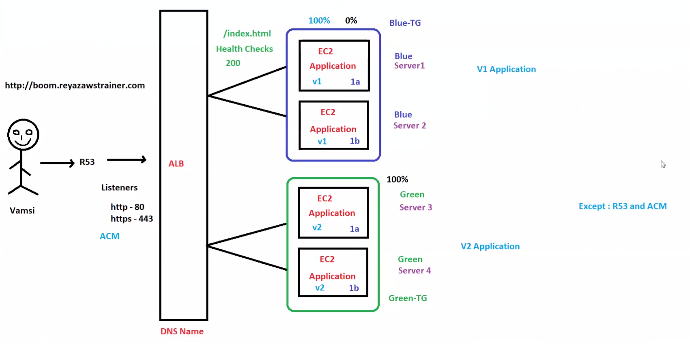
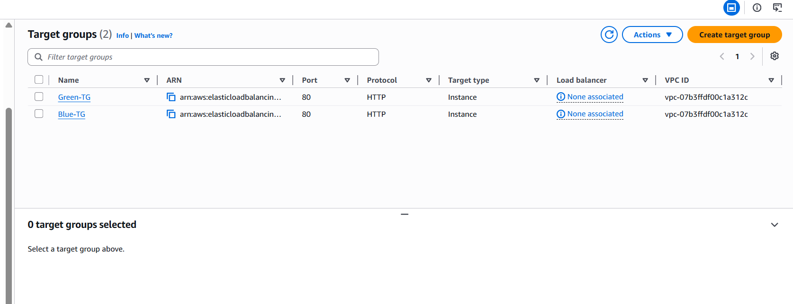
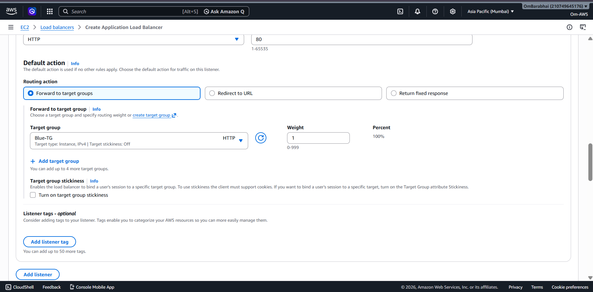
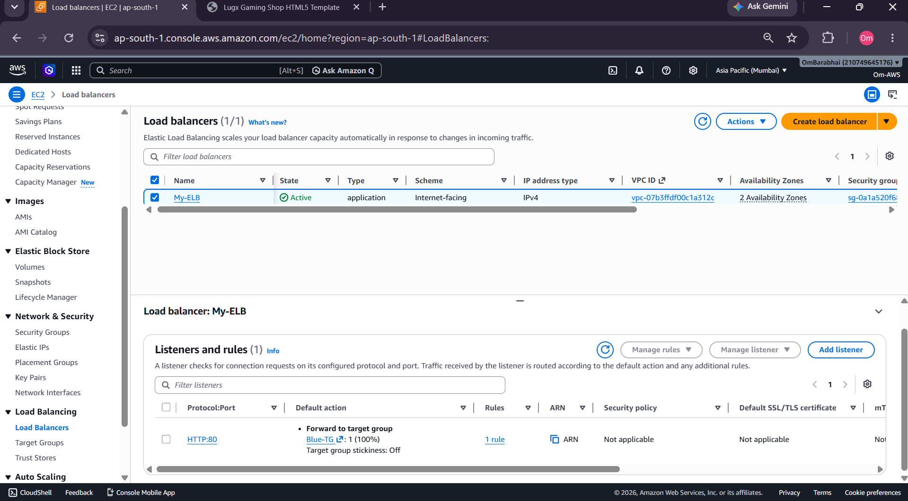
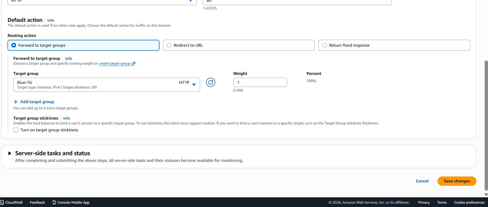
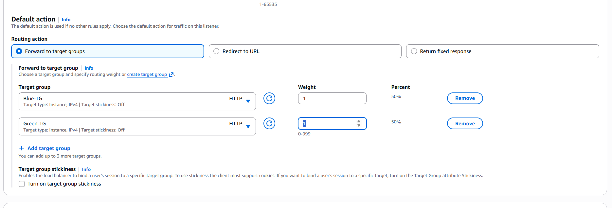
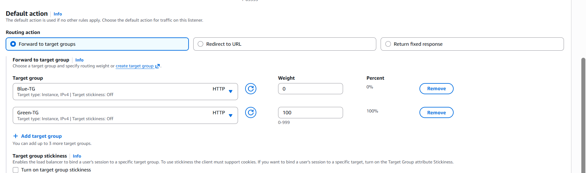

# 🚀 AWS Blue-Green Deployment Using EC2 + ALB + Target Groups

## 📌 Project Overview

This project demonstrates a complete Blue-Green Deployment implementation on AWS using:

* Amazon EC2
* Application Load Balancer (ALB)
* Target Groups
* Apache HTTP Server
* User Data Automation
* Security Groups
* Listener Rules
* Traffic Switching
* Weighted Routing
* Zero/Low Downtime Deployment

The main goal of this project was to practically understand how real production deployments and rollback strategies work in cloud environments.

---

# 🧠 What is Blue-Green Deployment?

Blue-Green Deployment is a deployment strategy where:

* **Blue Environment** → Current Stable Production Version
* **Green Environment** → Newly Deployed Application Version

Instead of directly replacing the running production server:

* a new environment is created separately
* the new version is tested safely
* traffic is switched gradually using ALB
* rollback becomes faster if failures occur

This helps achieve:

✅ Safer deployments
✅ High availability
✅ Reduced downtime
✅ Easier rollback
✅ Better production stability
✅ Controlled deployment workflow

---

# 🏗️ Architecture Diagram

## 📷 Blue-Green Deployment Architecture



---

# ☁️ AWS Services Used

| AWS Service               | Purpose                               |
| ------------------------- | ------------------------------------- |
| Amazon EC2                | Host Blue & Green application servers |
| Application Load Balancer | Distribute and control traffic        |
| Target Groups             | Group backend EC2 instances           |
| Security Groups           | Control inbound/outbound traffic      |
| Apache HTTP Server        | Serve frontend application            |
| User Data                 | Automate EC2 provisioning             |
| Listener Rules            | Route traffic between environments    |

---

# 🏗️ Complete Deployment Flow

```text
User
   ↓
Application Load Balancer
   ↓
Listener Rules
   ↓
Target Groups
   ↓
Blue Environment / Green Environment
   ↓
Apache Web Server
   ↓
Website Response
```

---

# 🔵 Blue Environment Setup

Created the first EC2 instance as the stable production environment.

Tasks performed:

* launched EC2 instance
* configured security groups
* installed Apache HTTP server
* deployed website automatically
* verified website accessibility
* registered instance into Blue Target Group

---

## 📷 Blue Environment Deployment


---

# 🟢 Green Environment Setup

Created another EC2 instance for the new application version.

Tasks performed:

* launched Green EC2 instance
* deployed new frontend version
* configured Apache server
* tested deployment separately
* attached instance into Green Target Group

---

## 📷 Green Environment Deployment


---

# ⚙️ User Data Automation

User Data scripts were used to automate server provisioning during EC2 launch.

Automation included:

* Apache installation
* package installation
* template download
* website deployment
* Apache service startup

This removed the need for manual server configuration.

---

# 📄 User Data Script

```bash
#!/bin/bash

yum install -y httpd wget unzip

systemctl start httpd
systemctl enable httpd

cd /tmp

wget "https://templatemo.com/download/templatemo_622_clearwave"

mv templatemo_622_clearwave templatemo_622_clearwave.zip

unzip -o templatemo_622_clearwave.zip

cp -r templatemo_622_clearwave/* /var/www/html/

systemctl restart httpd
```

---

# 🧠 User Data Deployment Workflow

```text
Launch EC2
      ↓
User Data Executes Automatically
      ↓
Install Apache + Dependencies
      ↓
Download Website Files
      ↓
Deploy Website
      ↓
Start Apache Service
      ↓
Website Ready
```

---

# 🎯 Target Groups Configuration

Separate Target Groups were created for:

* Blue Environment
* Green Environment

Both environments were isolated independently.

This enabled:

* safer deployments
* independent testing
* traffic isolation
* controlled traffic routing

---

## 📷 Target Groups



---

# 🔐 Security Group Configuration

Configured inbound rules:

| Port | Purpose          |
| ---- | ---------------- |
| 22   | SSH Access       |
| 80   | HTTP Web Traffic |

Security Groups controlled public access to EC2 instances and ALB.

---

# 🌐 Application Load Balancer Setup

Configured an Application Load Balancer to:

* receive client requests
* distribute traffic
* forward requests to target groups
* support Blue-Green deployment strategy
* improve availability

---

## 📷 ALB Configuration



---

# 🔀 Listener Rules & Traffic Routing

Configured ALB Listener Rules for:

* Blue Target Group
* Green Target Group
* weighted routing
* traffic switching

Traffic weights were adjusted to control rollout strategy.

---

## 📷 Listener Rules



---

# ➕ Adding Additional Target Groups

Attached both Blue and Green Target Groups to the ALB.

This enabled:

* multiple environment support
* traffic balancing
* gradual rollout
* deployment flexibility

---

## 📷 Adding Additional Target Group



---

# 📈 Weighted Traffic Routing

Implemented weighted routing using ALB forwarding rules.

Example:

| Target Group | Traffic Weight |
| ------------ | -------------- |
| Blue-TG      | 50%            |
| Green-TG     | 50%            |

Weighted routing helps:

* gradual deployments
* canary-style testing
* controlled rollout
* production validation

---

## 📷 Weighted Routing



---

# 🔵➡️🟢 Traffic Switching (Blue to Green)

Successfully switched live traffic from:

```text
Blue Environment → Green Environment
```

using Application Load Balancer listener forwarding rules.

This demonstrated real production deployment switching workflow.

---

## 📷 Traffic Switching



---

# ✅ Final Green Deployment

After successful testing:

* production traffic fully redirected
* Green environment became live
* Blue environment remained available for rollback
* deployment completed successfully

---

## 📷 Final Deployment


---

# 🔄 Manual Rollback & Recovery

One major advantage of Blue-Green deployment is instant rollback capability.

If the Green deployment fails:

```text
Switch Traffic Back
        ↓
Blue Environment Becomes Live Again
```

Unlike direct deployments:

* old environment remains available
* rollback becomes easier
* production downtime is minimized

---

# 🧠 Manual EC2 Recovery Concept

This project implemented rollback manually using:

* EC2 instances
* ALB Listener Rules
* Target Groups
* Traffic Switching

instead of managed deployment services.

---

# 🏗️ Recovery Workflow

```text
Blue Environment = Stable Version
Green Environment = New Version

Deploy on Green
        ↓
Test Green Environment
        ↓
Switch Traffic to Green
        ↓
If Failure Happens
        ↓
Redirect Traffic Back to Blue
        ↓
Application Restored
```

---

# 📷 Recovery & Rollback


---

# 🧠 High Availability Concept

Keeping both environments active separately provides:

✅ High availability
✅ Reduced downtime
✅ Safer deployments
✅ Faster rollback
✅ Better production stability
✅ Easier recovery

This deployment strategy is commonly used in real-world cloud production systems.

---

# 🧠 Real DevOps Concepts Learned

During this project, the following production-level concepts were practiced:

* Infrastructure provisioning
* Automated deployments
* Traffic routing
* Load balancing
* High availability
* Deployment isolation
* Rollback strategies
* Environment management
* Weighted traffic routing
* Blue-Green deployment workflow
* User Data automation
* Zero/Low downtime deployment concepts

---

# 📂 Project Structure

```text
Day_33/
│
├── Demo/
│   ├── Blue_Deploy.gif
│   ├── Green_Deploy.gif
│   ├── ELB_BLUE_DEPLOYMENT.gif
│   ├── FINAL_SWAPPEDDONEBLUETOGREEN.gif
│   ├── SWAPPING_BLUE_TO_GREEN.png
│   ├── ADDING_ANOTHER_TG.png
│   ├── ADDED_GREEN_TG.png
│   ├── TargetGRP.png
│   ├── Listeners_AND_Rules.png
│   └── EDIT_RULE.png
│
├── Notes/
│   └── ProjectBlue_Green_Deploy_EC2.png
│
└── README.md
```

---

# 🏗️ Deployment Lifecycle Practiced

```text
Create Infrastructure
        ↓
Launch Blue Environment
        ↓
Deploy Application
        ↓
Create Green Environment
        ↓
Attach Target Groups
        ↓
Configure ALB
        ↓
Switch Traffic
        ↓
Verify Deployment
        ↓
Rollback if Needed
```

---

# 📚 Key Learnings

* learned practical AWS deployment workflow
* understood Blue-Green deployment architecture
* practiced production traffic switching
* worked with ALB and target groups
* configured listener rules
* automated deployments using User Data
* implemented manual rollback workflow
* understood high availability concepts
* practiced production-style deployment strategy

---

# 🎯 Project Outcome

Successfully implemented:

✅ Blue-Green Deployment on AWS
✅ Traffic Switching using ALB
✅ EC2 Automation using User Data
✅ Weighted Traffic Routing
✅ Manual Rollback Workflow
✅ High Availability Deployment Architecture
✅ Production-Style Cloud Deployment Strategy

---

# 👨‍💻 Author

Om Barabhai

Aspiring Full Stack & DevOps Engineer
