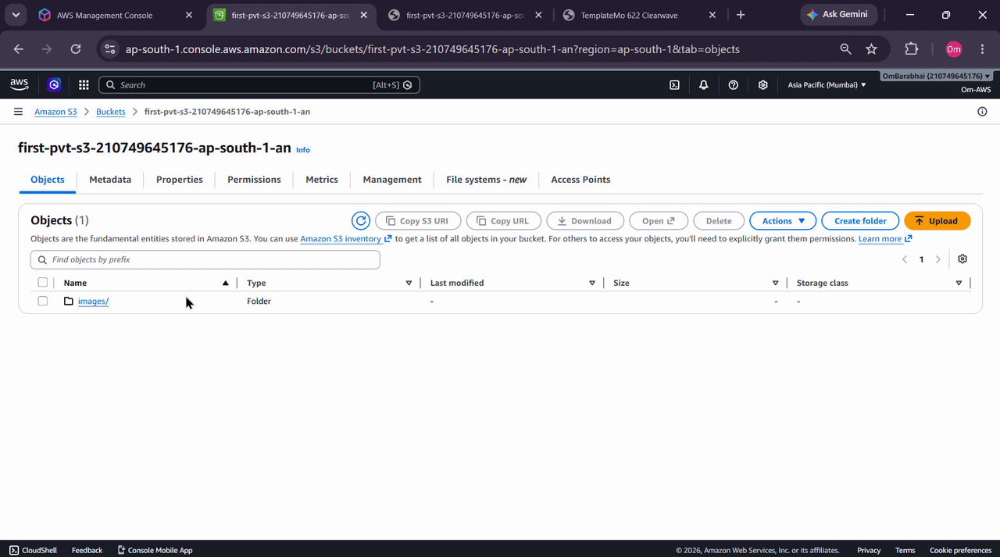
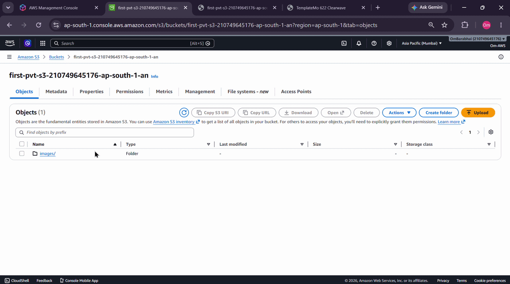
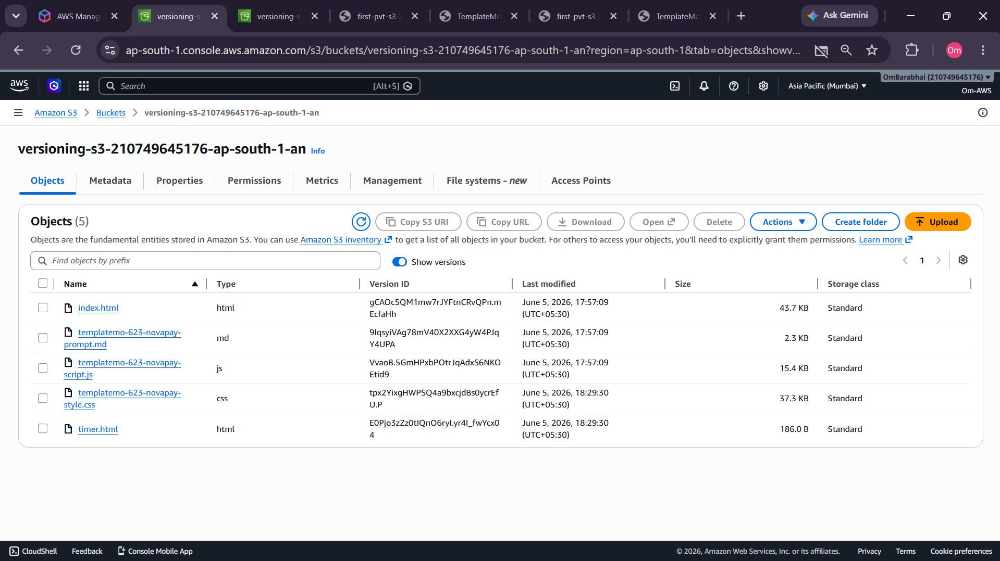
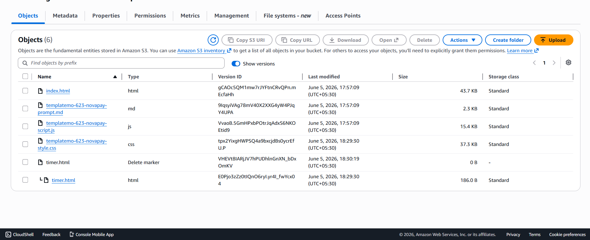
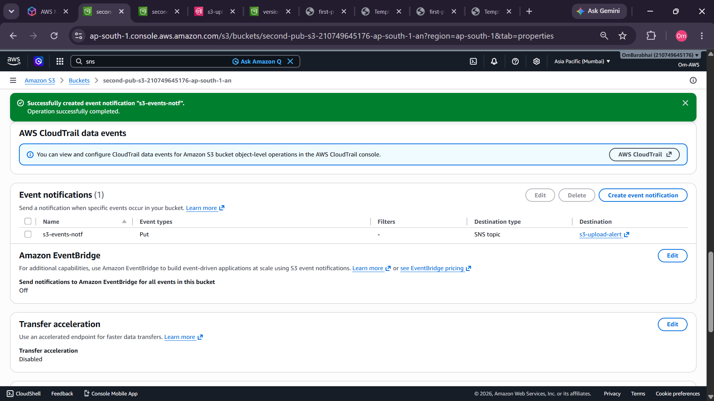
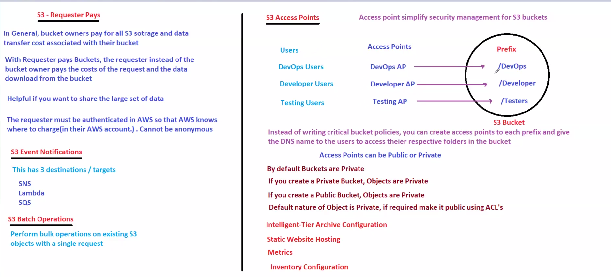

# ☁️ AWS S3 Practical — Simple Storage Service

# 📌 Objective

Learn and perform hands-on practicals on Amazon S3 including:

- Private Bucket
- Public Bucket
- Versioning
- S3 Events
- SNS Notifications
- Server Access Logs
- Static Website Hosting

---

# 🧠 What is Amazon S3?

Amazon S3 (Simple Storage Service) is an object storage service provided by AWS.

It is used to:

- Store files
- Host static websites
- Backup data
- Store logs
- Media storage
- Big data storage

---

# 🏗️ S3 Basic Terminologies

| Term                   | Meaning                                   |
| ---------------------- | ----------------------------------------- |
| Bucket                 | Container used to store objects           |
| Object                 | Actual file stored in S3                  |
| Key                    | Unique name/path of object                |
| Versioning             | Keeps multiple versions of files          |
| Endpoint               | Public URL of bucket                      |
| URI                    | S3 internal path                          |
| Static Website Hosting | Hosting frontend website directly from S3 |

---

# 🔗 Difference Between S3 URL and URI

## ✅ URL

Starts with:

```bash
http://
https://
```

Example:

```bash
https://bucket-name.s3.amazonaws.com/image.png
```

Used for:

- Browser access
- Public file access

---

## ✅ URI

Starts with:

```bash
s3://
```

Example:

```bash
s3://bucket-name/image.png
```

Used for:

- AWS CLI
- Internal AWS references

---

# 🔐 Presigned URL

Used to temporarily share private objects.

Example:

- Share object for:

  - 5 minutes
  - 1 hour
  - 24 hours

Used when:

- Bucket is private
- Need temporary access

---

# 🔒 MFA Delete (Security Layer)

MFA Delete adds extra protection.

It requires:

- Multi-Factor Authentication (OTP)
- Before:

  - deleting object versions
  - changing versioning state

Configured mainly using:

- AWS CLI

---

# 📊 CloudTrail Event Types

## 1️⃣ Management Events

Capture:

- AWS resource management operations

Examples:

- Create bucket
- Delete bucket
- IAM changes

---

## 2️⃣ Data Events

Capture:

- Operations performed inside resources

Examples:

- Upload object
- Delete object
- Read object

---

## 3️⃣ Insights Events

Used to detect:

- Unusual activity
- Abnormal API usage
- Suspicious behavior

---

## 4️⃣ Network Activity Events

Capture:

- Resource operations performed using VPC endpoints

---

# 🧪 PRACTICAL TASKS

---

# ✅ TASK 1 — Create Private Bucket

## Steps

1. Open AWS Console
2. Go to S3
3. Create Bucket
4. Keep:

   - Block Public Access = ON

5. Upload objects

---

## Result

Bucket becomes private.

Objects cannot be accessed publicly.

---

# 📷 Private Bucket



---

# ✅ TASK 2 — Create Public Bucket

## Steps

1. Create new bucket
2. Disable:

   - Block Public Access

3. Upload objects
4. Select objects
5. Click:

```bash
Actions → Make Public
```

---

## Access Using Endpoint

Example:

```bash
https://bucket-name.s3.ap-south-1.amazonaws.com/file.png
```

---

# 📷 Public Bucket Practical



---

> 📂 Open Demo File:  
> [View Public & Private Bucket Demo](./Demo/Public_And_PVT.gif)

---

# ✅ TASK 3 — Enable Versioning

## What is Versioning?

Versioning stores:

- old versions
- modified versions
- deleted versions

of objects.

---

## Steps

1. Open Bucket

2. Properties

3. Enable:

   - Bucket Versioning

4. Upload same file multiple times

---

## Result

AWS stores multiple versions.

---

# 📷 Versioning



---

# ✅ TASK 4 — Suspend Versioning

## Steps

1. Go to:

   - Bucket Properties

2. Suspend Versioning
3. Upload/Delete files

---

## Understanding

Old versions remain.

New uploads may not generate versions.

Delete creates:

- Delete Marker

---

# 📷 Delete Marker



---

# ✅ TASK 5 — S3 Event Notification

## Objective

Receive notification whenever:

- object uploaded
- object deleted

---

# 🏗️ Architecture

```text
S3 Bucket
   ↓
S3 Event
   ↓
SNS Topic
   ↓
Email Notification
```

---

# 🔧 Steps

## Step 1 — Create SNS Topic

Go to:

- SNS
- Create Topic

Choose:

- Standard Topic

Topic Name:

```bash
s3-upload-alert
```

---

## Step 2 — Create Subscription

Protocol:

- Email

Endpoint:

- Your Email

Confirm subscription from email inbox.

---

## Step 3 — Create S3 Event

Go to:

- S3 Bucket
- Properties
- Event Notifications
- Create Event Notification

Choose:

- PUT Event

Destination:

- SNS Topic

Select:

- s3-upload-alert

---

## Result

Whenever file uploaded:

- email notification received.

---

# 📷 Event Notification



---

# 📷 Notification Demo


---

> ⚠️ If GIF preview is not loading on GitHub,  
> [Click Here To Open Demo](./Demo/NotificationDemo.gif)

---

# ✅ TASK 6 — Enable Server Access Logs

## Purpose

Track:

- who accessed bucket
- requests made
- API calls

---

# 🔧 Steps

1. Open Bucket

2. Properties

3. Enable:

   - Server Access Logging

4. Select destination bucket

5. Save changes

---

## Important

Logs may take:

- few minutes to appear

---

# 🧠 Understanding

AWS automatically creates:

- log files

inside destination bucket.

---

# 📷 Server Access Logging



---

# ✅ TASK 7 — Static Website Hosting

## Objective

Host frontend website directly using S3.

---

# 🏗️ Architecture

```text
Browser
   ↓
S3 Website Endpoint
   ↓
HTML / CSS / JS / Images
```

---

# 🔧 Steps

## Step 1 — Create Public Bucket

Disable:

- Block Public Access

---

## Step 2 — Upload Website Files

Upload:

- index.html
- css
- js
- images

---

## Step 3 — Make Objects Public

Select all objects:

```bash
Actions → Make Public
```

---

## Step 4 — Enable Static Website Hosting

Go to:

- Properties
- Static Website Hosting

Enable:

- Host Static Website

Index Document:

```bash
index.html
```

Error Document:

```bash
error.html
```

---

## Step 5 — Open Website Endpoint

AWS generates endpoint like:

```bash
http://bucket-name.s3-website-ap-south-1.amazonaws.com
```

---

# 📷 Static Website Hosting


---

> ⚠️ If GIF preview is not loading on GitHub,  
> [Click Here To Open Demo](./Demo/HostingStaticWeb.gif)

---

# 📷 Website Files


---

> 📂 Open Demo File:  
> [View Website Files Demo](./Demo/WebsiteFilesStatic3.gif)

---

# 📷 S3 Static Website Endpoint


---

> 📂 Open Demo File:  
> [View Website Files Demo](./Demo/WebsiteFilesStatic.gif)

---

# 📷 Event Notification Created


---

> 📂 Open Screenshot:  
> [View Event Notification Screenshot](./Demo/EventNotif.png)

---

# 📷 S3 Event Success


---

> 📂 Open Screenshot:  
> [View Event Notification Screenshot](./Demo/EventNotif.png)

---

# 📷 Static Website Hosting Enabled


---

> 📂 Open Demo File:  
> [View Hosting Static Website Demo](./Demo/HostingStaticWeb.gif)

---

# 📷 Bucket Website Endpoint


---

> 📂 Open Demo File:  
> [View Website Files Demo](./Demo/WebsiteFilesStatic.gif)

---

# 📷 S3 Event Configuration


---

# ✅ TASK 8 — Delete Buckets

## Important Rule

Bucket must be empty before deletion.

---

## Steps

1. Delete all objects
2. Delete versions
3. Delete delete-markers
4. Delete bucket

---

# 🧠 Key Learnings

✅ S3 Basics
✅ Private/Public Buckets
✅ Versioning
✅ Delete Marker
✅ S3 Event Notifications
✅ SNS Integration
✅ Access Logs
✅ Static Website Hosting
✅ Website Endpoints
✅ Bucket Permissions

---

# 🚀 Real World Use Cases

| Feature          | Use Case            |
| ---------------- | ------------------- |
| Private Bucket   | Backup storage      |
| Public Bucket    | Public assets       |
| Versioning       | Recovery system     |
| Static Hosting   | Frontend deployment |
| SNS Notification | Alert system        |
| Access Logs      | Auditing            |
| Presigned URL    | Temporary sharing   |

---

# 📌 Final Conclusion

Amazon S3 is a highly scalable object storage service used for:

- hosting
- backup
- logging
- media storage
- static websites

This practical helped understand:

- bucket permissions
- object management
- event-driven architecture
- website hosting using S3

which are very important for AWS and DevOps interviews.

---
