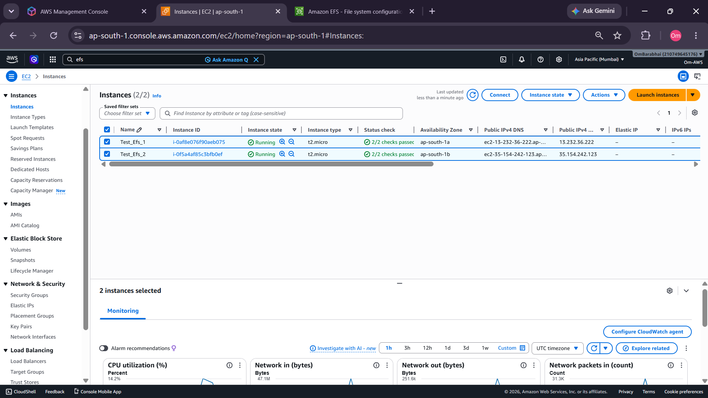
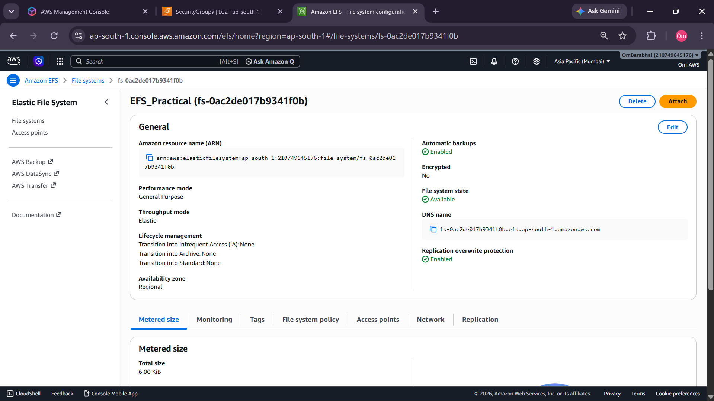
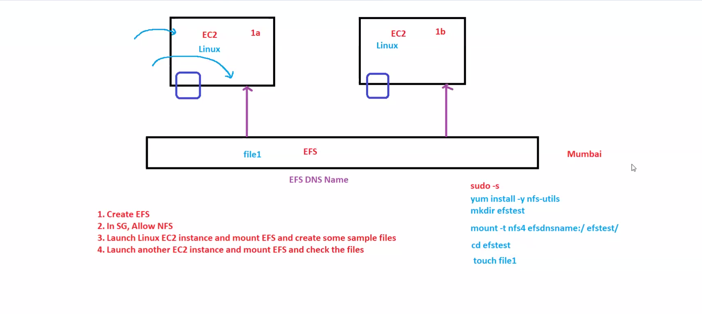
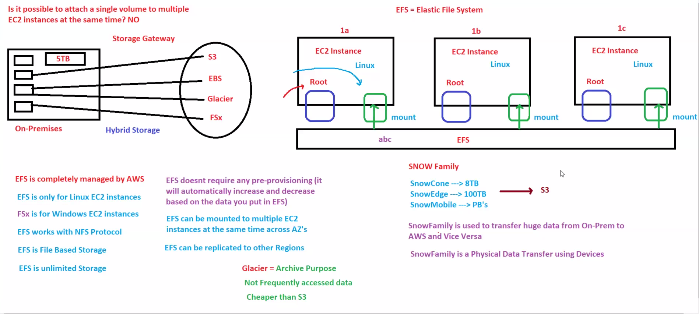
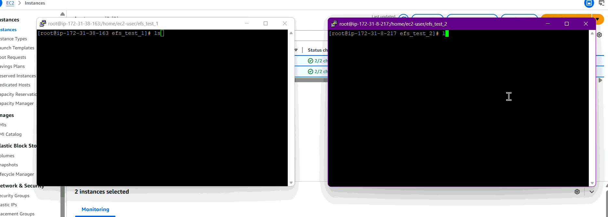
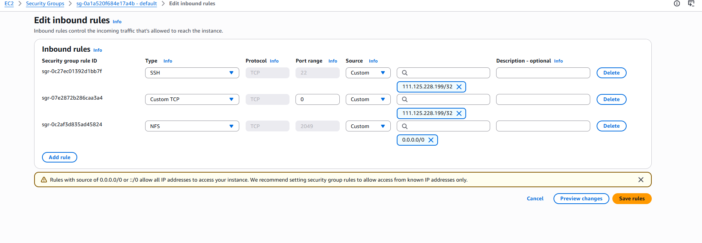

# ☁️ AWS EFS Practical - Elastic File System

# 📌 Objective

Learn and perform hands-on practicals on Amazon EFS including:

* Creating EFS File System
* Connecting EFS with EC2
* Mounting EFS on Multiple Instances
* Shared Storage Verification
* Security Group Configuration
* NFS Mounting
* Cross-Instance File Sharing

---

# 🧠 What is Amazon EFS?

Amazon EFS (Elastic File System) is a scalable shared file storage service provided by AWS.

It is used for:

* Shared storage between EC2 instances
* Centralized file systems
* Web server shared content
* Container persistent storage
* Big data workloads
* Multi-instance applications

---

# 🏗️ EFS Basic Terminologies

| Term           | Meaning                                     |
| -------------- | ------------------------------------------- |
| EFS            | Elastic File System                         |
| Mount Target   | Network endpoint used to connect EFS        |
| NFS            | Network File System protocol                |
| EC2            | Virtual machine in AWS                      |
| Shared Storage | Same files accessible from multiple servers |
| Security Group | Firewall rules controlling traffic          |

---

# 🧪 PRACTICAL TASKS

---

# ✅ TASK 1 - Create EC2 Instances

## Objective

Launch two EC2 instances for EFS mounting.

---

## Steps

1. Open AWS Console
2. Go to EC2
3. Launch 2 EC2 instances

Example:

```bash
Test_Efs_1
Test_Efs_2
```

4. Allow inbound rules:

* SSH (22)
* NFS (2049)

---

# 📷 EC2 Instances



---

# 📷 EC2 Connected


---

# ✅ TASK 2 - Create EFS File System

## Steps

1. Open AWS Console
2. Search:

```bash
EFS
```

3. Click:

```bash
Create File System
```

4. Configure:

* VPC
* Availability Zones
* Security Groups

5. Create EFS

---

## Result

EFS file system created successfully.

---

# 📷 EFS Created



---

# 📷 EFS Dashboard



---

# 📷 EFS Basics



---

# ✅ TASK 3 - Mount EFS on EC2 Instances

## Install NFS Utilities

### Amazon Linux / RHEL

```bash
yum install -y amazon-efs-utils
```

---

## Create Mount Directory

```bash
mkdir efs_test_1
mkdir efs_test_2
```

---

## Mount EFS

```bash
mount -t efs fs-xxxxxxxx:/ efs_test_1
```

---

## Verify Mount

```bash
df -h
```

---

# 🧠 Understanding

Both EC2 instances connect to the same shared storage.

Any file created in one instance becomes visible in the other instance.

---

# 📷 Mounted EFS on Multiple EC2


---

# 📷 EFS Terminal Demo



---

> 📂 Open Demo File:
> [View EFS Demo](./Demo/DEMOFILECREATED.gif)

---

# ✅ TASK 4 - Verify Shared File System

## Objective

Test real-time shared storage.

---

## Steps

### In EC2 Instance 1

```bash
touch demo.txt
```

---

### In EC2 Instance 2

```bash
ls
```

---

## Result

File becomes visible in second instance instantly.

---

# 🧠 Architecture

```text
EC2 Instance 1
        ↓
     Amazon EFS
        ↑
EC2 Instance 2
```

---

# ✅ Security Group Configuration

## Important Rule

EFS requires NFS port access.

Allow:

```bash
2049
```

Protocol:

```bash
TCP
```

---

# 📷 Security Group Configuration



---

# 🧠 Key Learnings

✅ Amazon EFS Basics
✅ Shared File Storage
✅ NFS Mounting
✅ EC2 + EFS Integration
✅ Multi-instance File Access
✅ Security Group Configuration
✅ Persistent Shared Storage
✅ Cloud Storage Concepts

---

# 🚀 Real World Use Cases

| Feature              | Use Case                  |
| -------------------- | ------------------------- |
| Shared Storage       | Multi-server applications |
| Persistent Files     | Container workloads       |
| Centralized Storage  | Web servers               |
| Scalable File System | Enterprise applications   |
| Multi-EC2 Access     | Distributed systems       |

---

# 📌 Final Conclusion

Amazon EFS provides scalable shared storage that can be mounted across multiple EC2 instances simultaneously.

This practical helped understand:

* shared cloud storage
* NFS mounting
* EC2 integration
* distributed file access
* centralized storage architecture

which are important concepts for AWS Cloud and DevOps interviews.

---
