# ☁️ AWS Transfer Family SFTP Integration with Amazon S3

## 📌 Project Overview

This project demonstrates a complete hands-on implementation of **AWS Transfer Family** using the **SFTP protocol** for secure file transfer between a local machine and an Amazon S3 bucket.

The practical covers:

* Amazon S3 bucket creation
* AWS Transfer Family server setup
* IAM role configuration
* SFTP user management
* SSH key authentication
* WinSCP client configuration
* Secure file upload to Amazon S3

---

# 🧠 What is AWS Transfer Family?

AWS Transfer Family is a fully managed AWS service that enables secure file transfers directly into and out of AWS storage services like:

* Amazon S3
* Amazon EFS

Supported protocols:

* SFTP
* FTPS
* FTP
* AS2

It eliminates the need to manage traditional file transfer infrastructure manually.

---

# 🏗️ Architecture Workflow

```text
Local Machine (WinSCP)
        │
        ▼
AWS Transfer Family Server (SFTP)
        │
        ▼
IAM Role & User Permissions
        │
        ▼
Amazon S3 Bucket
```

---

# 🧰 Technologies & Services Used

| Service / Tool          | Purpose                          |
| ----------------------- | -------------------------------- |
| AWS Transfer Family     | Managed SFTP service             |
| Amazon S3               | Cloud storage backend            |
| IAM                     | Access and permission management |
| SFTP                    | Secure file transfer             |
| PuTTYgen                | SSH key generation               |
| WinSCP                  | SFTP client                      |
| SSH Public/Private Keys | Authentication                   |

---


# ✅ Step 1 - Create Amazon S3 Bucket

Created an S3 bucket to store uploaded files from the SFTP server.

### Bucket Name

```text
om-file-transfer
```

## 📷 S3 Bucket Created

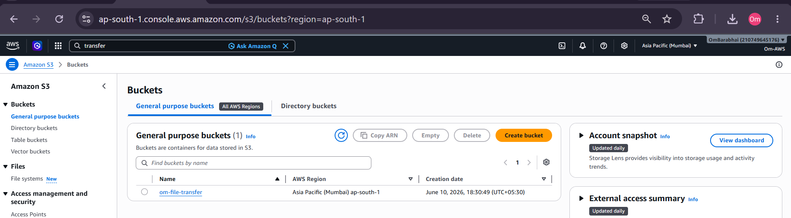

---

# ✅ Step 2 - Configure Bucket Policy

Configured S3 bucket permissions using AWS Policy Generator.

### Permissions Added

* s3:GetObject
* s3:PutObject
* s3:ListBucket

## 📷 Policy Generator

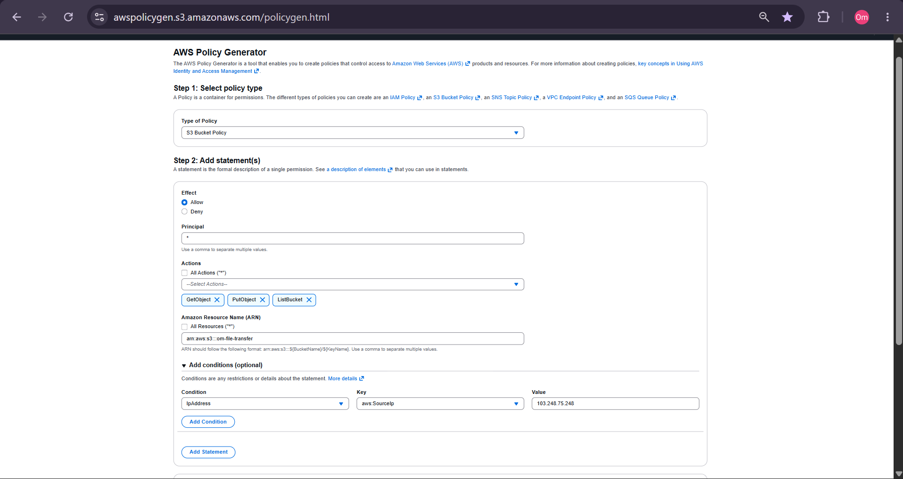

## 📷 Policy Statement Added

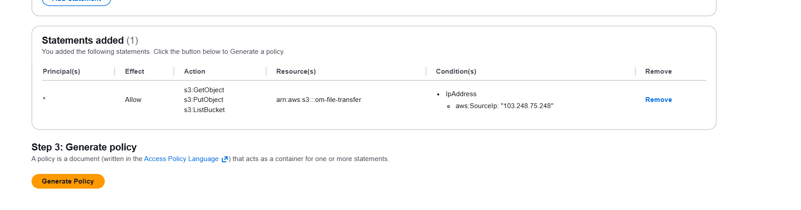

## 📷 Generated Policy JSON

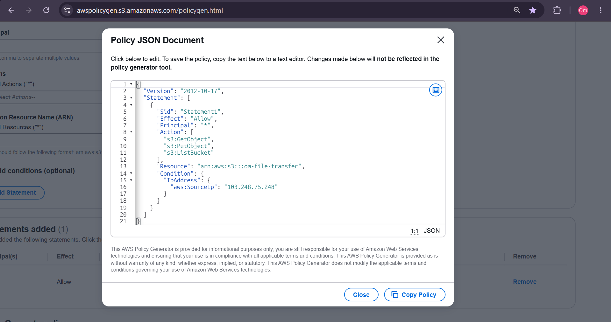

## 📷 Edited Bucket Policy

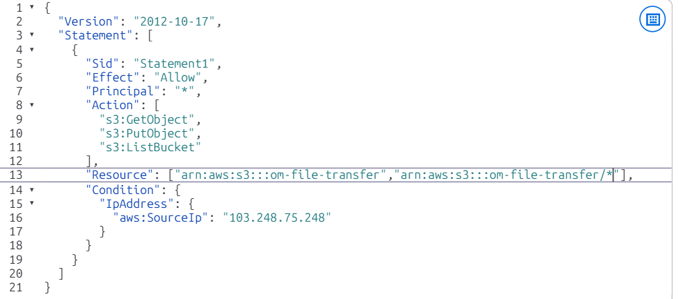

---

# ✅ Step 3 - Create AWS Transfer Family Server

Created a managed SFTP server using AWS Transfer Family.

### Protocol Used

```text
SFTP
```

## 📷 AWS Transfer Family Architecture

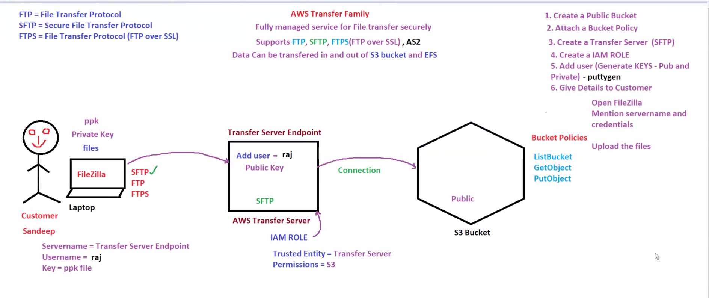

## 📷 Transfer Family Server Created

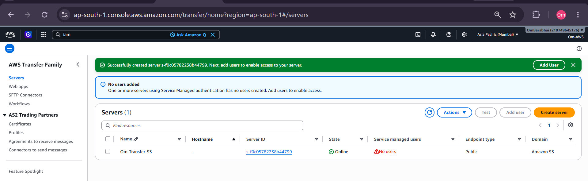

---

# ✅ Step 4 - Create IAM Role

Created an IAM role with required S3 access permissions for AWS Transfer Family users.

## 📷 IAM Role Creation

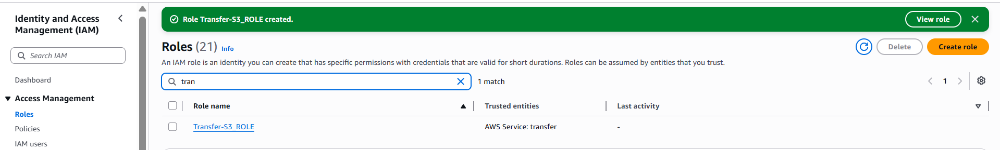

---

# ✅ Step 5 - Create SFTP User

Configured an SFTP user for secure login access.

### Username

```text
Om_S3
```

### Home Directory

```text
/om-file-transfer/Om_S3
```

## 📷 Add SFTP User

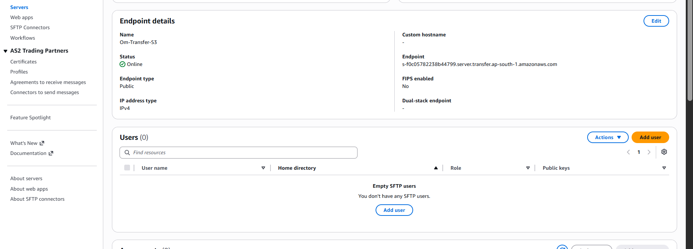

## 📷 Configure Role and Home Directory

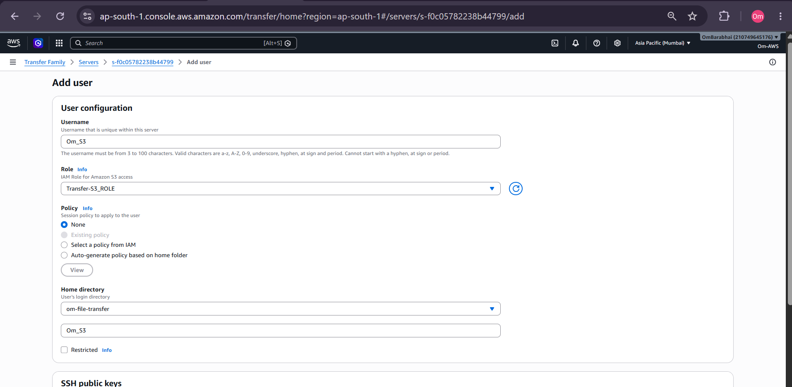

## 📷 User Successfully Added

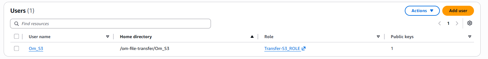

---

# ✅ Step 6 - Generate SSH Key Pair

Generated SSH public/private keys using PuTTYgen for authentication.

### Key Usage

| Key                | Purpose                       |
| ------------------ | ----------------------------- |
| Public Key         | Added to AWS Transfer Family  |
| Private Key (.ppk) | Used in WinSCP authentication |

## 📷 PuTTYgen Opened

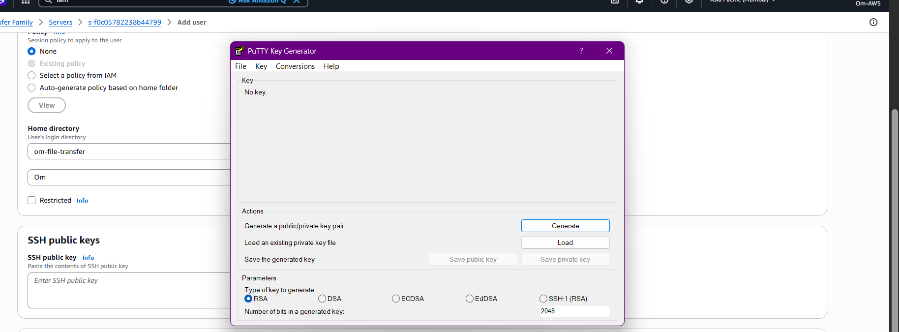

## 📷 Public Key Generated

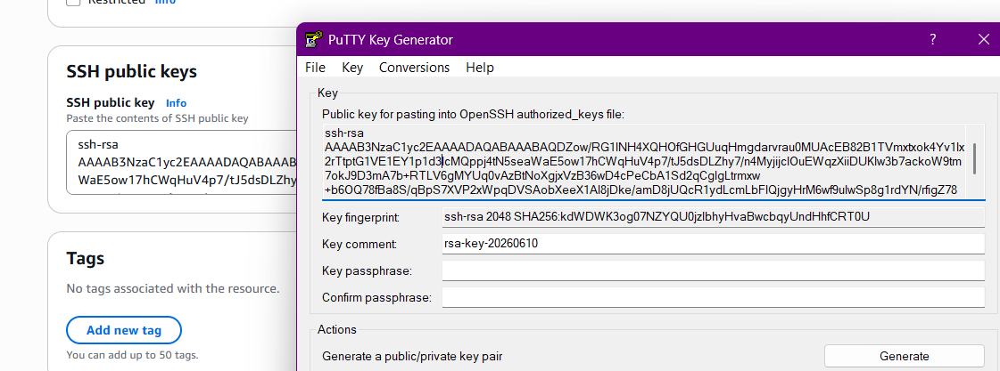

## 📷 Save Private Key

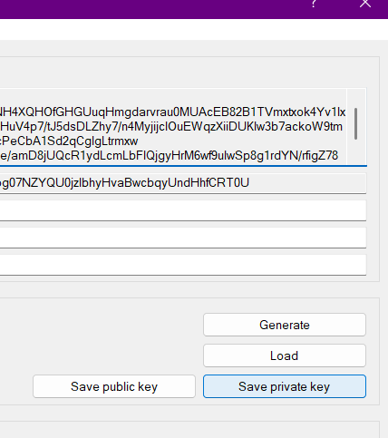

## 📷 User Configuration

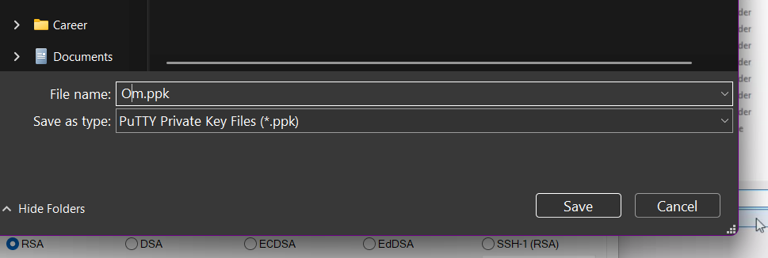

---

# ✅ Step 7 - Configure WinSCP

Connected local machine to AWS Transfer Family using WinSCP.

### Connection Details

| Setting        | Value              |
| -------------- | ------------------ |
| Protocol       | SFTP               |
| Port           | 22                 |
| Username       | Om_S3              |
| Authentication | Private Key (.ppk) |

## 📷 Configure Endpoint

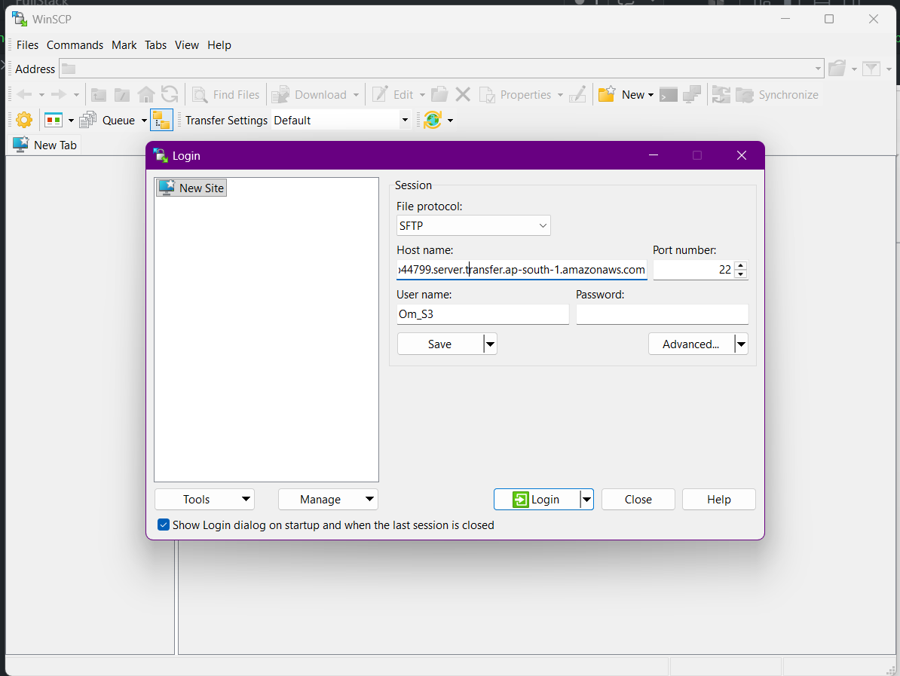

## 📷 Add PPK Key

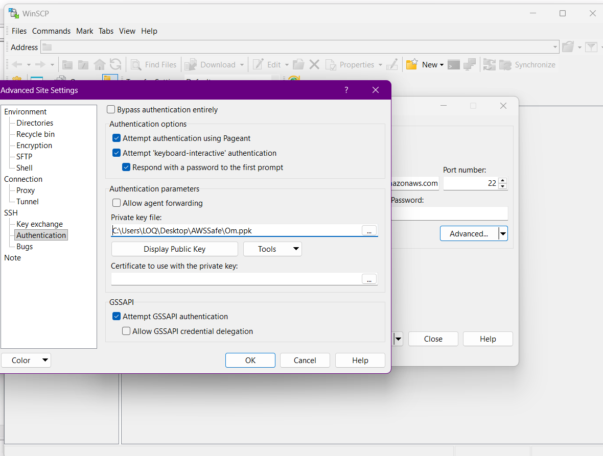

---

# ✅ Step 8 - Upload File to Amazon S3

Uploaded a local file securely to Amazon S3 using SFTP connection through WinSCP.

## 📷 File Uploaded Successfully

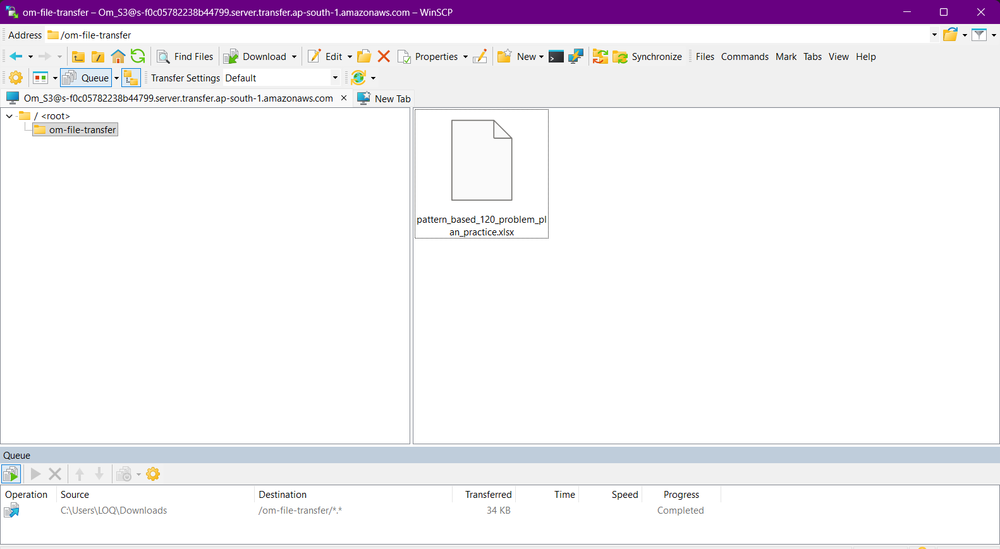

## 📷 File Verified in S3 Bucket

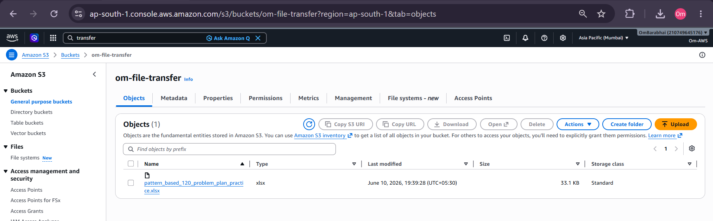

---

# 🔐 Security Concepts Learned

* SSH Key Authentication
* IAM Role-Based Access
* Secure File Transfer using SFTP
* Controlled S3 Bucket Access
* Managed AWS Transfer Infrastructure

---

# 🧠 Key Learnings

* AWS Transfer Family setup
* SFTP workflow implementation
* Amazon S3 integration
* IAM permission management
* SSH authentication setup
* WinSCP SFTP connection
* Enterprise-style secure file transfer architecture

---

# 🚀 Real-World Use Cases

| Use Case                 | Description                     |
| ------------------------ | ------------------------------- |
| Enterprise File Transfer | Secure partner/vendor uploads   |
| Backup Systems           | Automated secure cloud backups  |
| Financial Systems        | Secure document exchange        |
| Healthcare Data Transfer | HIPAA-compliant secure transfer |
| Data Migration           | Transfer files into AWS storage |

---

# 📌 Final Conclusion

This project demonstrates how AWS Transfer Family can be integrated with Amazon S3 to build a secure and scalable SFTP-based file transfer system.

The implementation includes:

* secure authentication
* IAM-based access control
* S3 integration
* SSH key-based login
* enterprise-grade managed file transfer workflow

This practical is highly useful for:

* AWS Cloud learning
* DevOps practice
* Infrastructure understanding
* Real-world SFTP architecture
* Interview preparation

---

# 📂 Project Structure

```text
Day_37/
│
├── Demo/
│   ├── 01-create-s3-bucket.png
│   ├── 02-policy-generator.png
│   ├── 03-policy-statement-added.png
│   ├── 04-policy-json-generated.png
│   ├── 05-policy-edited-for-access.png
│   ├── 06-create-transfer-family-server.png
│   ├── 07-create-iam-role.png
│   ├── 08-add-sftp-user.png
│   ├── 09-configure-home-directory.png
│   ├── 10-puttygen-generate-key.png
│   ├── 11-generated-public-key.png
│   ├── 12-save-private-key.png
│   ├── 13-user-created.png
│   ├── 14-user-added-successfully.png
│   ├── 15-configure-winscp-endpoint.png
│   ├── 16-add-ppk-key-winscp.png
│   ├── 17-file-uploaded-to-s3.png
│   └── 18-verify-file-in-s3.png
│
├── Notes/
│   └── AWS_TRANSFER_FAM.png
│
└── README.md
```

---
