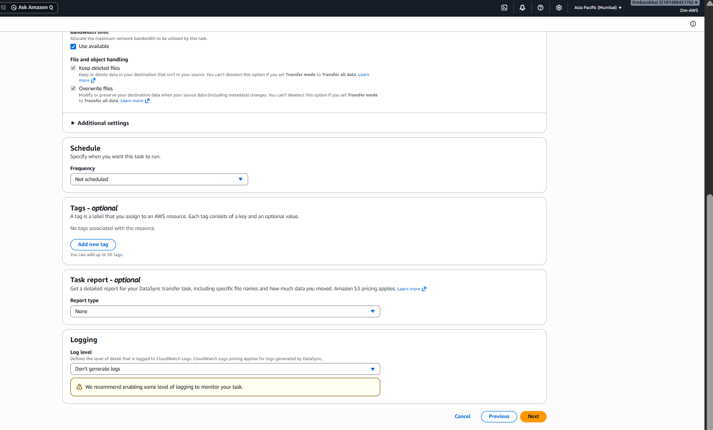
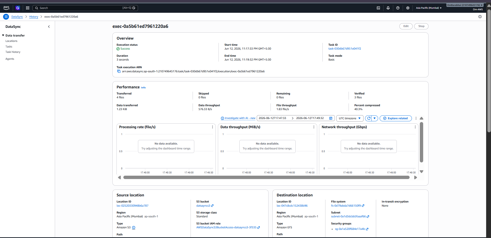
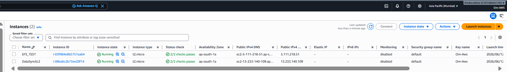
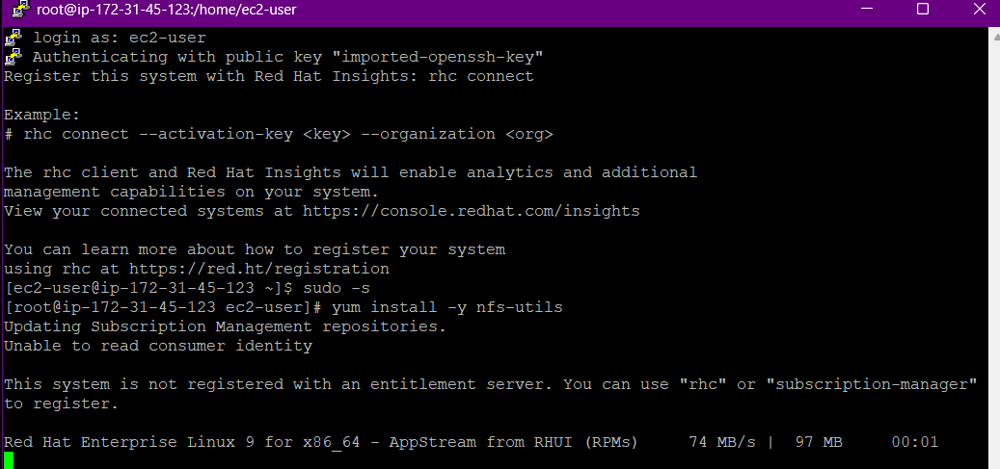
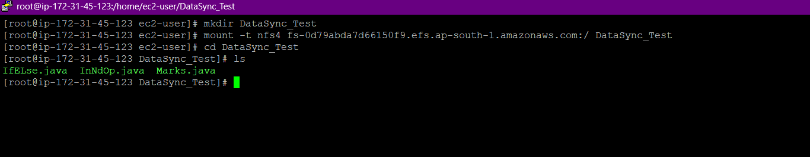

# ☁️ Day 38: AWS DataSync Practical — S3 to EFS Transfer

## 📌 Goal

Transfer files from Amazon S3 to Amazon EFS using AWS DataSync and verify the transferred files from an EC2 instance mounted to EFS.

---

## 🧭 Architecture Flow

```text
S3 Bucket
   ↓
DataSync Agent on EC2
   ↓
AWS DataSync Task
   ↓
Amazon EFS
    ↓
EC2 Verification Instance
```

### Visual Architecture


### Transfer Workflow

![S3 to EFS Transfer Workflow] (./Images/03-s3-to-efs-transfer-workflow.png)

---

## 🧠 What I Practiced

* Created a private S3 bucket
* Retrieved the latest DataSync Agent AMI
* Launched the DataSync Agent on EC2
* Fixed EFS security group access for NFS
* Created the EFS file system
* Configured source and destination locations
* Created and started the DataSync task
* Verified transferred files on an EC2 instance

---

## 🔩 Main Concepts

| Concept              | Meaning                             |
| -------------------- | ----------------------------------- |
| Source Location      | Storage where data comes from       |
| Destination Location | Storage where data goes to          |
| DataSync Agent       | EC2-based VM used for transfer      |
| Task                 | Transfer job created in DataSync    |
| EFS Mount Target     | Network endpoint used to access EFS |
| Security Group       | Firewall rule allowing NFS traffic  |

---

## 🧪 Practical Steps

### 1) Create Private S3 Bucket

Created a private S3 bucket and uploaded sample files.

"Private S3 Bucket" (./Demo/01-s3-private-bucket-created.png)

### 2) Get DataSync Agent AMI

Retrieved the latest AWS-managed DataSync Agent AMI.

"DataSync Agent AMI" (./Demo/02-datasync-agent-ami-generated.png)

```bash
aws ssm get-parameter --name /aws/service/datasync/ami --region ap-south-1 --query "Parameter.Value" --output text
```

### 3) Fix Security Group Access

Initial transfer failed because EFS blocked NFS traffic.

"Security Group Error" (./Demo/03-security-group-initial-error.png)

The fix was to allow **TCP 2049**.

"Security Group Fixed" (./Demo/04-security-group-fixed.png)

### 4) Create DataSync Agent

Created and activated the DataSync Agent on EC2.

"DataSync Agent Created" (./Demo/05-datasync-agent-created.png)

### 5) Register Activation Key

Connected the EC2 Agent to AWS DataSync.

"Activation Key Generated" (./Demo/06-agent-activation-key-generated.png)

### 6) Create EFS File System

Created Amazon EFS as the destination.

"EFS Created" (./Demo/07-efs-file-system-created.png)

### 7) Configure Source Location

Configured Amazon S3 as source.

"Source Location" (./Demo/08-datasync-source-location-s3.png)

### 8) Configure Destination Location

Configured Amazon EFS as destination.

"Destination Location" (./Demo/09-datasync-destination-efs.png)

### 9) Configure Task

Configured task settings.

"Task Configuration" (./Demo/10-datasync-task-configuration.png)

### 10) Review Task Options

Checked task mode and advanced settings before execution.



### 11) Create Task

Created the DataSync task.

"Task Created" (./Demo/12-datasync-task-created.png)

### 12) Start Task

Started the task with default options.

"Task Started" (./Demo/13-datasync-task-started.png)

### 13) Transfer Completed

The transfer completed successfully.



### 14) Launch EC2 for Verification

Launched a separate EC2 instance to verify the transferred files.



### 15) Login to EC2

Logged in to the EC2 instance and mounted EFS.



### 16) Verify Files on EFS

Verified the transferred files on the EFS mount.



---

## ⚠️ Troubleshooting I Faced

### Error

```text
Failed to connect to EFS mount target
```

### Root Cause

EFS security group did not allow **TCP 2049** from the DataSync Agent.

### Fix

Allowed NFS traffic on port **2049** in the EFS security group.

---

## ☁️ AWS Services Used

* Amazon S3
* Amazon EFS
* AWS DataSync
* Amazon EC2
* IAM
* Security Groups
* NFS

---

## 🎤 Interview Points

### What is AWS DataSync?

A managed service used to transfer data between storage systems quickly and securely.

### Why use DataSync here?

To move data from S3 to EFS without manual copy scripts.

### Why is EFS used?

EFS provides shared file storage that can be mounted on EC2 instances.

### What port is required for EFS?

**TCP 2049** for NFS.

### What does the DataSync Agent do?

It connects source and destination locations and performs the transfer.

### Why did the task fail first?

Because the EFS security group blocked the DataSync Agent.

---

## 📌 Key Takeaways

* DataSync simplifies storage migration and synchronization
* S3 works as the source location
* EFS works as the destination location
* Security groups must allow NFS access
* EC2 is used to host and verify the workflow
* Troubleshooting network rules is a big part of this practical

---

## 🚀 Resume-Ready Summary

**AWS DataSync: S3 to EFS File Transfer**
Implemented an end-to-end AWS DataSync workflow to transfer files from Amazon S3 to Amazon EFS using an EC2-based DataSync Agent. Configured source and destination locations, fixed security group issues, and verified successful file synchronization on a mounted EC2 instance.

---

## 🏁 Final Summary

This practical is a strong DevOps and AWS SAA portfolio project because it shows real AWS storage migration, EC2-based agent setup, NFS security, EFS verification, and troubleshooting in one complete workflow.
