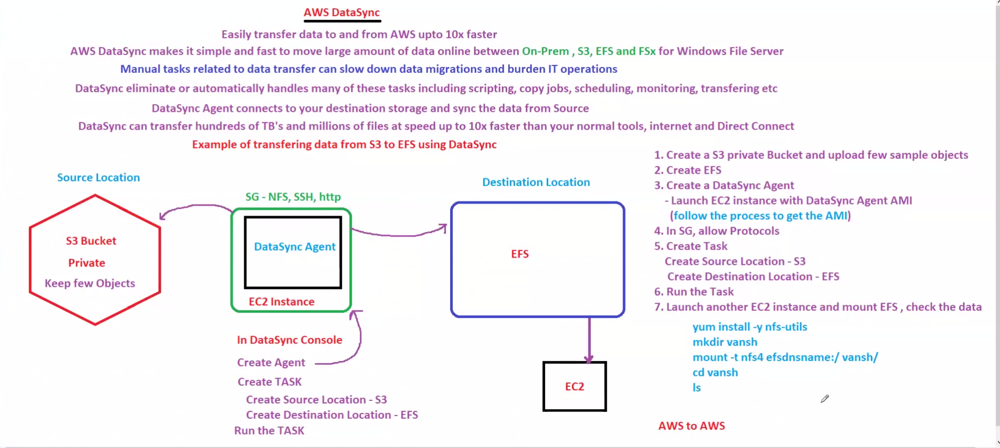
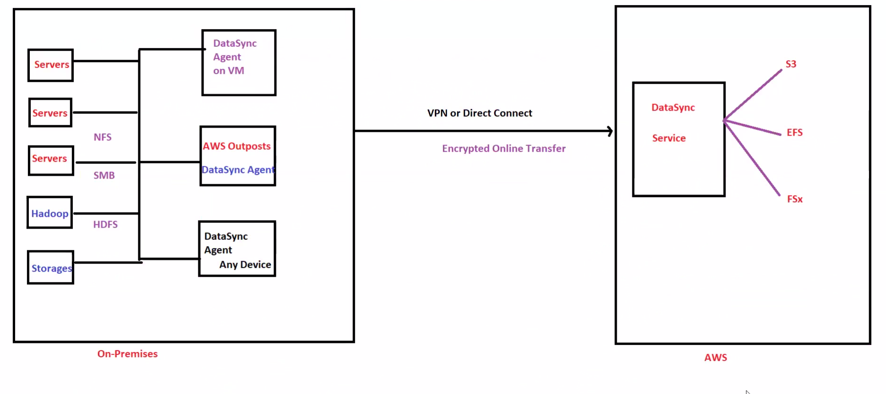

# DevOps Day 38: Data Transfer - AWS DataSync and Direct Connect

## 📖 Overview

Day 38 focuses on large-scale data transfer solutions for moving data between on-premises infrastructure and AWS. This covers AWS DataSync for automated, optimized transfers, and AWS Direct Connect for dedicated network connectivity, essential for enterprises managing significant data volumes.

---

## 🎯 Learning Objectives

✅ Understand DataSync architecture and capabilities  
✅ Configure DataSync for NFS and SMB transfers  
✅ Design Direct Connect solutions for dedicated connectivity  
✅ Implement data transfer validation and monitoring  
✅ Optimize transfer performance and costs

---

## 📚 Key Concepts

### **1. AWS DataSync**

AWS DataSync is a managed data transfer service used to move data between on-premises storage and AWS storage services.

### Supported Destinations

* Amazon S3
* Amazon EFS
* Amazon FSx

### Supported Sources

* NFS
* SMB
* HDFS
* Object Storage
* Amazon S3
* Amazon EFS
* Amazon FSx

### Key Features

* Automated Data Transfer
* Incremental Synchronization
* Data Validation
* Bandwidth Control
* Scheduling Support
* Transfer Monitoring
* Encryption in Transit

---

### DataSync Architecture

```text
Source Storage
      ↓
DataSync Agent
      ↓
AWS DataSync Service
      ↓
Destination Storage
```

### Practical Architecture Implemented

```text
Amazon S3
      ↓
DataSync Agent (EC2)
      ↓
AWS DataSync Task
      ↓
Amazon EFS
      ↓
EC2 Verification Instance
```

---

### Visual References

## Architecture Diagram



## Transfer Workflow



---

### Practical Performed

During this practical:

1. Created a private S3 bucket
2. Uploaded sample files
3. Retrieved latest DataSync Agent AMI
4. Launched DataSync Agent on EC2
5. Activated the DataSync Agent
6. Created Amazon EFS
7. Configured S3 as Source Location
8. Configured EFS as Destination Location
9. Created DataSync Task
10. Executed DataSync Task
11. Mounted EFS on EC2
12. Verified transferred files

---

### Important Command Used

Retrieve latest DataSync Agent AMI:

```bash
aws ssm get-parameter \
--name /aws/service/datasync/ami \
--region ap-south-1 \
--query "Parameter.Value" \
--output text
```

---

### Common Issue Faced

#### Error

```text
Failed to connect to EFS mount target
```

#### Root Cause

```text
TCP 2049 blocked by Security Group
```

#### Fix

Allow:

```text
NFS (TCP 2049)
```

in the EFS Security Group.

---

### Interview Questions

#### What is AWS DataSync?

A managed service used for secure and automated data transfer between storage systems.

#### What is a DataSync Agent?

A virtual machine that performs data transfers between source and destination locations.

#### Why was a DataSync Agent required?

The practical used an EC2-based DataSync Agent to connect and transfer data between S3 and EFS.

#### Which port is required for EFS communication?

```text
TCP 2049
```

#### What was the biggest troubleshooting issue?

Security Group configuration blocking NFS traffic.

---

### Key Takeaways

* DataSync simplifies large-scale storage migration.
* DataSync Agents can run on EC2.
* EFS communication requires TCP 2049.
* Security Groups are the most common failure point.
* DataSync supports automated and incremental transfers.
* Successful transfers should always be verified after execution.


AWS DataSync automates and accelerates data transfer to AWS. Key features include:

- **Automated Transfers**: Schedule or on-demand data synchronization
- **Protocol Support**: NFS, SMB, HDFS, and object storage endpoints
- **Performance Optimization**: Built-in bandwidth throttling, parallel transfers
- **Data Validation**: Automatic integrity checking and task reports
- **Incremental Transfers**: Only move changed data on subsequent runs
- **AWS Service Integration**: Native S3, EFS, FSx integration

### **2. AWS Direct Connect**

Direct Connect provides dedicated network connections between on-premises and AWS:

- **Dedicated Connection**: Consistent, low-latency connectivity
- **Higher Throughput**: Predictable performance for large-scale transfers
- **Reduced Costs**: Eliminate expensive internet connectivity for data transfer
- **Compliance**: Meet data residency and security requirements
- **VPC Associate**: Connect directly to AWS VPCs

---

## 🖼️ Visual References

- **Notes/AwsDataSync.png**: DataSync architecture and transfer workflow
- **Notes/TransferS3_TO_EFS.png**: Data transfer patterns between S3 and EFS
- **Notes/AWS_ACCESS_CLI.png**: AWS CLI patterns for data transfer operations

---

## 🔑 Key Takeaways

✨ DataSync automates large-scale data transfers with built-in optimization  
✨ Direct Connect provides the dedicated connectivity enterprise transfers require  
✨ Data validation ensures integrity throughout the transfer process  
✨ Proper cost analysis is critical-transfer methods have different cost profiles

---

## 📊 AWS Relevance

Data transfer solutions are critical for enterprise migration and operations:

- **AWS SAA Exam**: DataSync, Direct Connect, data transfer strategies, cost optimization
- **Migration Projects**: Essential for moving data from on-premises to AWS at scale
- **Operational Efficiency**: Automated transfers reduce manual effort
- **Cost Management**: Right transfer method significantly impacts TCO
- **Compliance**: Direct Connect meets data residency and security requirements

---

## 🚀 Next Steps

1. Study DataSync architecture and capabilities
2. Review Direct Connect options and connectivity models
3. Design your data transfer strategy based on volume and latency requirements
4. Configure DataSync agent for your source system
5. Create DataSync tasks for automated transfers
6. Monitor transfer performance and validate data integrity
7. Optimize transfer settings for your workload
8. Evaluate Direct Connect for dedicated connectivity needs
9. Document your data transfer architecture
10. Continue to Day 39: Storage Gateway

---

**Estimated Time**: 4-5 hours  
**Hands-On Required**: Partial - Design exercise and configuration
