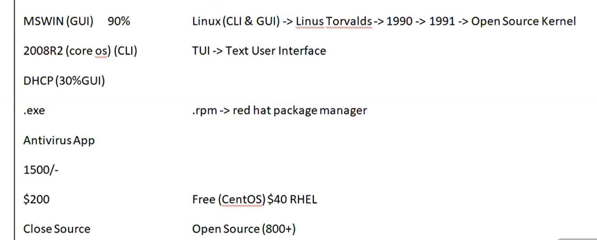

# 🐧 Linux Day 1 - Linux Introduction

> DevOps + RHCSA + Linux Beginner Journey 🚀

---

# 📚 Topics Covered

* What is Operating System?
* CLI vs GUI
* UNIX Basics
* Linux Basics
* Open Source vs Closed Source
* Linux vs Windows
* Kernel & Shell
* Linux in DevOps

---

# 🖼️ Notes Images

## 📷 OS Basics


---

## 📷 Linux vs Windows & UNIX



---

# 📌 What is Operating System (OS)?

Operating System is software that acts as an interface between:

```text
User
 ↓
Operating System
 ↓
Hardware
```

Examples:

* Linux
* Windows
* macOS

---

# 🌍 Real Life Example

| Real Life | Computer |
| --------- | -------- |
| Customer  | User     |
| Waiter    | OS       |
| Kitchen   | Hardware |

Customer → Waiter → Kitchen

User → OS → Hardware

---

# 📌 Types of Interface

## CLI (Command Line Interface)

User interacts using commands.

Examples:

```bash
ls
pwd
mkdir
```

### Advantages

* Fast
* Lightweight
* Server Friendly
* Used in DevOps

---

## GUI (Graphical User Interface)

User interacts using:

* Mouse
* Icons
* Windows

Examples:

* Windows
* Ubuntu Desktop

---

## TUI (Text User Interface)

Text-based interface that combines keyboard navigation with menus.

---

# 📌 UNIX

### Important Facts

* Developed in 1969
* Created at Bell Labs
* Mainly CLI Based

---

# 📌 Linux

### Created By

Linus Torvalds

### Released

1991

### Features

✅ Open Source

✅ Secure

✅ Multi User

✅ Multi Tasking

✅ Stable

✅ Free

---

# 📌 Open Source vs Closed Source

| Open Source         | Closed Source      |
| ------------------- | ------------------ |
| Source Code Visible | Source Code Hidden |
| Mostly Free         | Mostly Paid        |
| Linux               | Windows            |

---

# 📌 Linux vs Windows

| Linux         | Windows       |
| ------------- | ------------- |
| Open Source   | Closed Source |
| CLI Powerful  | GUI Focused   |
| More Secure   | Less Secure   |
| Mostly Free   | Paid          |
| .rpm Packages | .exe Packages |

---

# 📌 RPM

```text
RPM = Red Hat Package Manager
```

Used in:

* RHEL
* CentOS
* Rocky Linux

---

# 📌 Kernel

Kernel is the core part of the Operating System.

Responsibilities:

* Memory Management
* Process Management
* Device Management
* File System Management

---

# 📌 Shell

Shell acts as an interface between:

```text
User
 ↓
Shell
 ↓
Kernel
```

Used to execute commands.

---

# 📌 Basic Linux Architecture

```text
User
 ↓
Shell
 ↓
Kernel
 ↓
Hardware
```

---

# 📌 Linux in DevOps

Most DevOps technologies run on Linux:

* AWS EC2
* Docker
* Kubernetes
* Jenkins
* Ansible
* Terraform

---

# 🎤 Interview Questions

### What is an Operating System?

Operating System is software that acts as an interface between user and hardware.

---

### What is Linux?

Linux is an open-source UNIX-like operating system created by Linus Torvalds.

---

### What is Open Source?

Open Source means source code is publicly available and can be modified by anyone.

---

### What is Kernel?

Kernel is the core component of an operating system.

---

### What is Shell?

Shell is an interface between user and kernel.

---

### Difference Between Linux and Windows?

| Linux        | Windows       |
| ------------ | ------------- |
| Open Source  | Closed Source |
| CLI Friendly | GUI Focused   |
| More Secure  | Less Secure   |

---

# ⚡ Quick Revision

```text
OS      → Interface between User & Hardware

Linux   → Open Source OS

UNIX    → Developed in 1969

Kernel  → Core of OS

Shell   → Interface between User & Kernel

CLI     → Command Line Interface

GUI     → Graphical User Interface

RPM     → Red Hat Package Manager

Linux → AWS → Docker → Kubernetes
```

---

# 🚀 DevOps Connection

Linux is the foundation of:

* DevOps
* Cloud Computing
* AWS
* Docker
* Kubernetes
* Site Reliability Engineering (SRE)

Strong Linux Fundamentals = Strong DevOps Foundation 🚀
