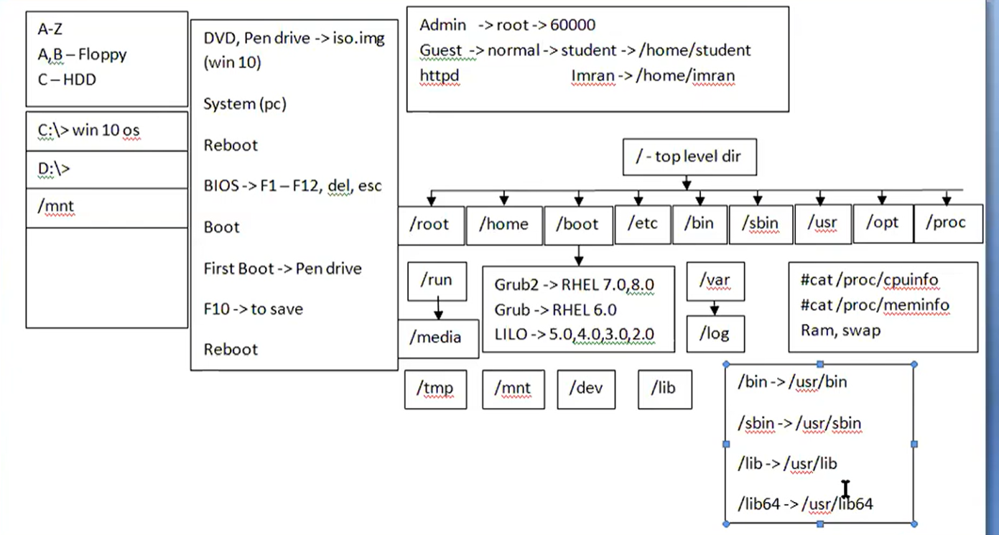

# 🐧 Linux Day 3 - Linux File System & Boot Process

> RHCSA + DevOps + Linux Fundamentals 🚀

---

# 🎯 Goal

Understand:

* Linux File System
* Important Directories
* Root User vs Normal User
* Linux Boot Process
* BIOS / UEFI
* GRUB2
* RAM & Swap
* Linux Paths

Used heavily in:

* Linux Administration
* DevOps
* AWS EC2
* Docker
* Kubernetes

---

# 🖼️ Architecture Diagram



---

# 📌 Linux Root Directory

Linux starts from:

```text
/
```

Also called:

```text
Root Directory
Top Level Directory
```

Everything in Linux exists under `/`.

---

# 📌 Linux File System Structure

```text
/
├── root
├── home
├── boot
├── etc
├── bin
├── sbin
├── usr
├── opt
├── proc
├── var
├── tmp
├── mnt
├── media
├── dev
└── lib
```

---

# 👤 Users in Linux

## Root User

```text
Username : root
UID      : 0
```

Features:

* Full permissions
* Full system access

Home Directory:

```text
/root
```

---

## Normal User

Examples:

```text
/home/om
/home/student
```

Used for daily work.

---

# 📂 Important Directories

## /home

Stores normal user files.

Example:

```text
/home/om
```

---

## /root

Home directory of root user.

---

## /boot

Contains:

* Kernel files
* GRUB files
* Boot information

---

## /etc

Stores configuration files.

Examples:

* Network Configuration
* User Configuration
* Service Configuration

---

## /bin

Contains basic user commands.

Examples:

```bash
ls
cat
cp
mv
pwd
```

---

## /sbin

Contains administrator commands.

Examples:

```bash
reboot
shutdown
fdisk
```

Mostly used by root user.

---

## /usr

Contains:

* Applications
* Libraries
* User Programs

---

## /opt

Used for:

* Third Party Software
* Optional Packages

---

## /proc

Virtual File System.

Contains:

* CPU Information
* Memory Information
* Running Process Information

---

### CPU Information

```bash
cat /proc/cpuinfo
```

---

### Memory Information

```bash
cat /proc/meminfo
```

---

## /var

Stores:

* Logs
* Cache
* Mail
* Dynamic Data

---

## /var/log

Stores system logs.

Important for:

* Monitoring
* Troubleshooting
* DevOps

---

## /tmp

Stores temporary files.

---

## /mnt

Used for manual mounting.

Examples:

* External Drives
* USB

---

## /media

Used for automatic mounting.

Examples:

* Pendrive
* DVD

---

## /dev

Contains device files.

Examples:

```text
Hard Disk
USB
Terminal
```

---

## /lib

Contains shared libraries required by programs.

---

# 📌 Modern Linux Structure

Modern Linux links:

```text
/bin    → /usr/bin
/sbin   → /usr/sbin
/lib    → /usr/lib
/lib64  → /usr/lib64
```

---

# 📌 RAM vs Swap

| RAM             | Swap           |
| --------------- | -------------- |
| Physical Memory | Virtual Memory |

Swap is used when RAM becomes full.

---

# 🚀 Linux Boot Process

```text
Power ON
   ↓
BIOS / UEFI
   ↓
GRUB2
   ↓
Kernel
   ↓
Systemd
   ↓
Login Screen
```

---

# 📌 Boot Loaders

| Boot Loader | Used In      |
| ----------- | ------------ |
| GRUB2       | RHEL 7/8/9   |
| GRUB        | Older Linux  |
| LILO        | Legacy Linux |

---

# 📌 BIOS Keys

| Key | Purpose    |
| --- | ---------- |
| F2  | BIOS Setup |
| F12 | Boot Menu  |
| DEL | BIOS Setup |
| ESC | Exit       |

---

# 📌 ISO File

```text
.iso
```

Contains:

* Operating System Installer
* Bootable Image

Examples:

* Ubuntu ISO
* Rocky Linux ISO
* Windows ISO

---

# 📌 Navigation Commands Practiced

## Current Directory

```bash
pwd
```

---

## List Files

```bash
ls
```

---

## Go Home

```bash
cd ~
```

---

## Go Back

```bash
cd ..
```

---

# 📌 Directory Commands Practiced

## Create Directory

```bash
mkdir practice
```

---

## Create Multiple Directories

```bash
mkdir aws docker kubernetes
```

---

## Change Directory

```bash
cd aws
```

---

# 📌 File Commands Practiced

## Create File

```bash
touch ec2.txt
```

---

## Create Multiple Files

```bash
touch ec2.txt rds.txt sns.txt
```

---

## Read File

```bash
cat ec2.txt
```

---

## Write Content

Overwrite:

```bash
echo "AWS EC2 Notes" > ec2.txt
```

Append:

```bash
echo "Linux Is Important For DevOps" >> ec2.txt
```

---

## Rename File

```bash
mv sns.txt notification.txt
```

---

## Copy File

```bash
cp ec2.txt ec2-backup.txt
```

---

## Delete File

```bash
rm rds.txt
```

---

# 📌 Important Linux Symbols

| Symbol | Meaning           |
| ------ | ----------------- |
| /      | Root Directory    |
| ~      | Home Directory    |
| .      | Current Directory |
| ..     | Parent Directory  |
| >      | Overwrite         |
| >>     | Append            |

---

# 📌 Linux is Case Sensitive

Different files:

```text
notes.txt
Notes.txt
NOTES.txt
```

Linux treats all three separately.

---

# 📌 Path Understanding

Example:

```text
/home/om/practice/aws
```

Meaning:

```text
/
 └── home
      └── om
           └── practice
                └── aws
```

---

# 🎤 Interview Questions

### What is Root Directory?

Root directory is the top-most directory represented by `/`.

---

### What is /proc?

Virtual file system containing system and process information.

---

### What is /etc?

Stores Linux configuration files.

---

### What is /var/log?

Stores system log files.

---

### What is GRUB2?

GRUB2 is the Linux boot loader.

---

### Difference Between /bin and /sbin?

| /bin          | /sbin          |
| ------------- | -------------- |
| User Commands | Admin Commands |

---

### What is Swap Memory?

Swap is virtual memory used when RAM becomes full.

---

# ⚡ Quick Revision

```text
/          → Root Directory
/home      → User Files
/root      → Root User Home
/etc       → Config Files
/boot      → Boot Files
/proc      → System Information
/var/log   → Logs
/tmp       → Temporary Files
/dev       → Device Files

GRUB2      → Boot Loader

RAM        → Physical Memory
Swap       → Virtual Memory

pwd        → Current Path
ls         → List Files
cd         → Change Directory
mkdir      → Create Directory
touch      → Create File
cp         → Copy
mv         → Move/Rename
rm         → Delete
```

---

# 🚀 DevOps Connection

These concepts are used daily in:

* AWS EC2
* Docker
* Kubernetes
* Linux Servers
* Monitoring
* Troubleshooting
* CI/CD Pipelines

Strong Linux File System knowledge = Strong DevOps Foundation 🚀
