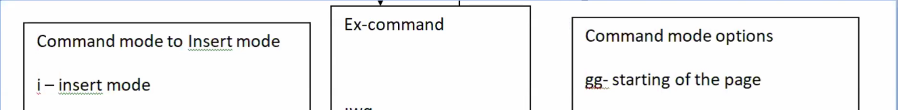
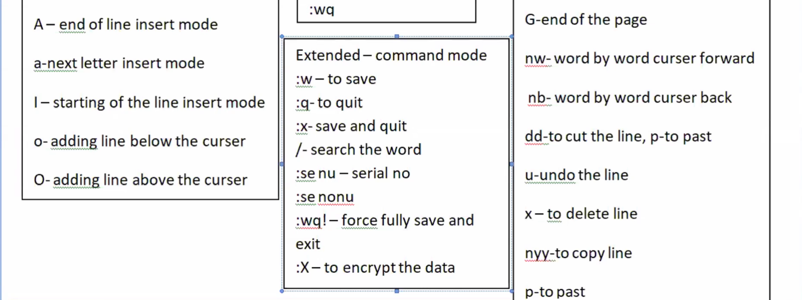

# 🐧 Linux Day 5 - Vim Editor Notes

---

# 📷 Vim Modes Diagram





---

# 📌 What is Vim?

Vim is a terminal-based text editor used in Linux.

Used for:

- editing files
- writing scripts
- changing configuration files
- DevOps server work

---

# 📌 Why Vim is Important?

- Most Linux servers use Vim
- Used in AWS EC2 servers
- Important for RHCSA
- Used in DevOps daily work

---

# 🧠 Vim Modes

```text
Insert Mode  → Writing text
Command Mode → Navigation & commands
Visual Mode  → Select text
Ex Mode      → Save/Quit commands
```

---

# 📌 Open File in Vim

```bash
vim file.txt
```

---

# 📌 Insert Mode Commands

| Key | Purpose              |
| --- | -------------------- |
| `i` | Insert mode          |
| `a` | Insert after cursor  |
| `I` | Start of line insert |
| `A` | End of line insert   |
| `o` | New line below       |
| `O` | New line above       |

---

# 📌 Exit Insert Mode

Press:

```text
Esc
```

Returns to command mode.

---

# 📌 Ex Mode Commands

| Command | Purpose             |
| ------- | ------------------- |
| `:w`    | Save                |
| `:q`    | Quit                |
| `:wq`   | Save and quit       |
| `:x`    | Save and exit       |
| `:q!`   | Force quit          |
| `:wq!`  | Force save and quit |

---

# 📌 Search Commands

## Search Word

```text
/word
```

Example:

```text
/linux
```

---

# 📌 Line Number Commands

## Show Line Numbers

```text
:set nu
```

---

## Hide Line Numbers

```text
:set nonu
```

---

# 📌 Navigation Commands

| Command | Purpose            |
| ------- | ------------------ |
| `gg`    | Top of file        |
| `G`     | Bottom of file     |
| `w`     | Move forward word  |
| `b`     | Move backward word |

---

# 📌 Editing Commands

| Command | Purpose          |
| ------- | ---------------- |
| `dd`    | Delete line      |
| `p`     | Paste            |
| `u`     | Undo             |
| `x`     | Delete character |

---

# 📌 Visual Mode

Press:

```text
v
```

Used for:

- selecting text
- copying
- deleting text

---

# 📌 Basic Vim Practice

## Create File

```bash
vim notes.txt
```

---

## Enter Insert Mode

Press:

```text
i
```

---

## Write Text

```text
Linux is important for DevOps
```

---

## Exit Insert Mode

Press:

```text
Esc
```

---

## Save and Exit

```text
:wq
```

---

# ❓ Interview Questions

## What is Vim?

→ Vim is a terminal-based text editor used in Linux systems.

---

## Why Vim is Important in DevOps?

Because DevOps engineers:

- edit configuration files
- update scripts
- manage servers remotely

---

## Difference Between Command Mode and Insert Mode?

| Mode         | Purpose                 |
| ------------ | ----------------------- |
| Command Mode | Navigation & operations |
| Insert Mode  | Typing text             |

---

# ⚡ Quick Revision

```text
i      → insert mode
Esc    → command mode
:wq    → save & quit
:q!    → force quit
dd     → delete line
u      → undo
gg     → top
G      → bottom
```

---

# 🚀 DevOps Connection

Vim is used in:

- Linux servers
- AWS EC2
- Docker containers
- Kubernetes nodes
- Shell scripting
- Configuration management

---

```

```
