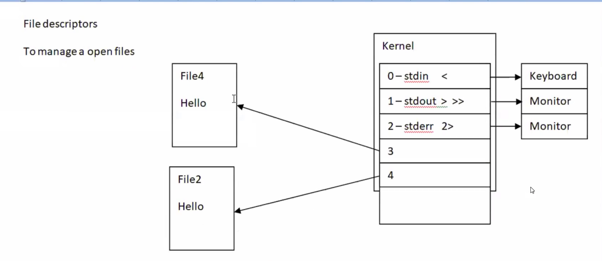

# 🐧 Linux Day 8 - File Descriptors & Redirection



---

# 🎯 Goal

Understand how Linux handles:

* Input
* Output
* Error Messages
* Redirection Operators

Used heavily in:

* Linux Administration
* Shell Scripting
* AWS EC2
* DevOps Automation
* CI/CD Pipelines

---

# 📌 Architecture

```text
                 Linux Kernel
                       │
      ┌────────────────┼────────────────┐
      │                │                │
      ▼                ▼                ▼

 FD 0 (stdin)     FD 1 (stdout)    FD 2 (stderr)

 Keyboard          Monitor          Monitor
    │                 │                │
    ▼                 ▼                ▼

   Input        Normal Output     Error Output
```

---

# 📌 What are File Descriptors?

Linux treats everything as a file.

Every running process automatically gets:

| FD | Name   | Default Device |
| -- | ------ | -------------- |
| 0  | stdin  | Keyboard       |
| 1  | stdout | Monitor        |
| 2  | stderr | Monitor        |

---

# 📌 stdin (Standard Input)

```bash
cat < file1
```

Reads input from a file.

Default source:

```text
Keyboard
```

---

# 📌 stdout (Standard Output)

```bash
ls > output.txt
```

Stores normal output in a file.

Default destination:

```text
Monitor
```

---

# 📌 stderr (Standard Error)

```bash
ls abc 2> error.txt
```

Stores error messages in a file.

Default destination:

```text
Monitor
```

---

# 📌 Real Command Flow

```bash
ls -l
```

```text
Keyboard
   │
stdin (0)
   │
 Linux Command
   │
stdout (1)
   │
Monitor
```

---

# 📌 Output Redirection

Overwrite:

```bash
ls > file1
```

Append:

```bash
ls >> file1
```

---

# 📌 Error Redirection

Overwrite errors:

```bash
find /root 2> error.txt
```

Append errors:

```bash
find /root 2>> error.txt
```

---

# 📌 Separate Output & Errors

```bash
find / -type b > output.txt 2> error.txt
```

```text
          find / -type b
                 │
      ┌──────────┴──────────┐
      │                     │

 stdout (1)           stderr (2)

 output.txt           error.txt
```

---

# 📌 /dev/null

Linux Trash Can

```bash
find / -name file1 2>/dev/null
```

Used to discard unwanted errors.

---

# 📌 Important Operators

| Operator  | Meaning           |
| --------- | ----------------- |
| >         | Overwrite Output  |
| >>        | Append Output     |
| <         | Input Redirection |
| 2>        | Error Redirection |
| 2>>       | Append Error      |
| |         | Pipe              |
| /dev/null | Discard Output    |

---

# 📌 DevOps Examples

Store command output:

```bash
ls -l > logs.txt
```

Store script errors:

```bash
bash deploy.sh 2> errors.txt
```

Hide permission errors:

```bash
find / -name "*.log" 2>/dev/null
```

---

# 🎤 Interview Questions

### What is stdin?

Standard Input (FD 0).

Default source is Keyboard.

---

### What is stdout?

Standard Output (FD 1).

Default destination is Monitor.

---

### What is stderr?

Standard Error (FD 2).

Used for error messages.

---

### Why use /dev/null?

To discard unwanted output or errors.

---

# ⚡ Quick Revision

```text
0 = stdin  = Keyboard

1 = stdout = Monitor

2 = stderr = Monitor

>    Output Redirect

>>   Append Output

<    Input Redirect

2>   Error Redirect

2>>  Append Error

/dev/null = Linux Trash Can
```

---

# 🚀 Why Important for DevOps?

Used daily in:

* Linux Servers
* AWS EC2
* Shell Scripting
* Jenkins
* Docker
* Kubernetes
* CI/CD Pipelines
* Log Monitoring

Mastering redirection is essential for Linux automation and DevOps work.
