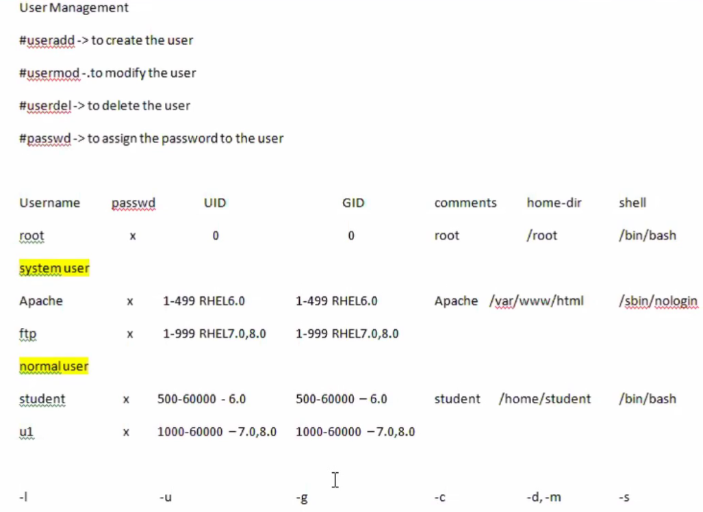
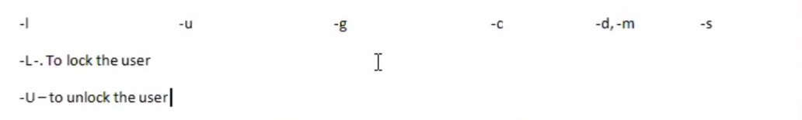

# 🐧 Linux Day 09 - User Management





---

# 🎯 Goal

Understand:

* Linux Users
* UID & GID
* User Creation
* User Modification
* Password Management
* User Lock / Unlock

Used in:

* Linux Administration
* RHCSA
* AWS EC2
* DevOps
* Server Management

---

# 📌 User Types

```text
                    Linux Users
                         │
      ┌──────────────────┼──────────────────┐
      │                  │                  │
      ▼                  ▼                  ▼

   Root User       System User       Normal User

    UID=0           UID 1-999         UID 1000+
```

| Type        | UID   | Purpose       |
| ----------- | ----- | ------------- |
| Root User   | 0     | Administrator |
| System User | 1-999 | Services      |
| Normal User | 1000+ | Human Login   |

Examples:

```text
root
apache
ftp
mysql
student
om
```

---

# 📌 Important Files

| File        | Purpose              |
| ----------- | -------------------- |
| /etc/passwd | User Information     |
| /etc/shadow | Password Information |
| /etc/group  | Group Information    |

---

# 📌 /etc/passwd Format

```text
username:x:UID:GID:comment:home:shell
```

Example:

```text
u1:x:1001:1001:Developer:/home/u1:/bin/bash
```

| Field    | Meaning                        |
| -------- | ------------------------------ |
| username | Login Name                     |
| x        | Password stored in shadow file |
| UID      | User ID                        |
| GID      | Group ID                       |
| comment  | Description                    |
| home     | Home Directory                 |
| shell    | Login Shell                    |

---

# 📌 User Management Commands

## Create User

```bash
useradd u1
```

---

## Show User Details

```bash
id u1
```

---

## Create User With Options

```bash
useradd u2 -u 2002 -c "HR" -d /home/demo -s /sbin/nologin
```

| Option | Meaning        |
| ------ | -------------- |
| -u     | UID            |
| -c     | Comment        |
| -d     | Home Directory |
| -s     | Shell          |

---

## Set Password

```bash
passwd u1
```

---

## Switch User

```bash
su - u1
```

---

# 📌 Modify User

## Change Shell

```bash
usermod -s /bin/bash u2
```

---

## Change Home Directory

```bash
usermod -m -d /home/u2 u2
```

---

## Rename User

```bash
usermod -l test-user u2
```

---

# 📌 Lock / Unlock User

## Lock

```bash
usermod -L u1
```

---

## Unlock

```bash
usermod -U u1
```

---

## Password Status

```bash
passwd -S u1
```

---

# 📌 User Management Flow

```text
useradd
   │
   ▼
User Created
   │
   ▼
passwd
   │
   ▼
Password Set
   │
   ▼
su - user
   │
   ▼
Login
```

---

# 📌 Commands Practiced

```bash
useradd u1

id u1

head /etc/passwd

tail /etc/passwd

useradd u2 -u 2002 -c "HR" -d /home/demo -s /sbin/nologin

usermod -s /bin/bash u2

usermod -m -d /home/u2 u2

usermod -l test-user u2

passwd u1

passwd -S u1

usermod -L u1

usermod -U u1

su - u1
```

---

# 🚀 DevOps Use Cases

Create deployment user:

```bash
useradd deploy
```

Create service account:

```bash
useradd jenkins -s /sbin/nologin
```

Disable employee access:

```bash
usermod -L employee1
```

---

# 🎤 Interview Questions

### What is UID?

Unique User Identifier.

---

### What is UID of root?

```text
0
```

---

### What is /etc/passwd?

Stores user account information.

---

### Difference Between useradd and usermod?

| useradd     | usermod     |
| ----------- | ----------- |
| Create User | Modify User |

---

### Why use /sbin/nologin?

Prevents interactive login.

Used for service accounts.

---

### Difference Between Root and Normal User?

| Root User   | Normal User    |
| ----------- | -------------- |
| UID = 0     | UID = 1000+    |
| Full Access | Limited Access |

---

# ⚡ Quick Revision

```text
useradd  → Create User

usermod  → Modify User

userdel  → Delete User

passwd   → Set Password

id       → User Details

su -     → Switch User

usermod -L → Lock User

usermod -U → Unlock User

/etc/passwd → User Database

/etc/shadow → Password Database

/etc/group → Group Database

UID 0 → Root User

UID 1000+ → Normal User
```

---

# 🏆 Day 09 Summary

✅ User Creation

✅ User Modification

✅ Password Management

✅ UID & GID

✅ User Lock / Unlock

✅ /etc/passwd

✅ /etc/shadow

✅ DevOps User Administration Basics

---

**Linux → Users → Permissions → Groups → Shell Scripting → AWS → DevOps 🚀**
# 📅 Linux Day 09 - Diary Notes

## 🎯 Today's Topic

User Management in Linux

---

## 📌 Important Files

```bash
/etc/passwd   → User Information

/etc/shadow   → Password Information

/etc/group    → Group Information
```

---

## 📌 User Types

```text
Root User   → UID 0

System User → UID 1-999

Normal User → UID 1000+

UID = User ID

GID = Group ID
```

---

## 📌 Commands Practiced

```bash
useradd u1

id u1

passwd u1

su - u1

whoami

head /etc/passwd

tail /etc/passwd

less /etc/passwd

usermod -s /bin/bash u2

usermod -m -d /home/u2 u2

usermod -l test-user u2

usermod -L u1

usermod -U u1

passwd -S u1
```

---

## 📌 usermod Options

```bash
-u  → Change UID

-g  → Change GID

-c  → Change Comment

-d  → Change Home Directory

-m  → Move Home Directory

-s  → Change Shell

-l  → Rename User

-L  → Lock User

-U  → Unlock User
```

---

## 📌 /etc/passwd Format

```text
username:x:UID:GID:comment:home:shell
```

Example:

```text
u1:x:1001:1001:Developer:/home/u1:/bin/bash
```

---

## 📌 Important Commands

```bash
head /etc/passwd
```

→ First lines of file

```bash
tail /etc/passwd
```

→ Last lines of file

```bash
less /etc/passwd
```

→ View file page by page

```bash
id u1
```

→ User information

```bash
whoami
```

→ Current logged-in user

```bash
passwd -S u1
```

→ Password status

---

## 🎤 Interview Revision

```text
UID of root = 0

UID = User ID

GID = Group ID

useradd = Create User

usermod = Modify User

userdel = Delete User

passwd = Set Password

id = User Details

whoami = Current User

su - = Switch User

/etc/passwd = User Database

/etc/shadow = Password Database

/etc/group = Group Database
```

---

## 🚀 DevOps Learning

```text
Create Users

Modify Users

Lock / Unlock Users

Manage Service Accounts

Understand UID & GID

Manage Linux User Accounts
```

---

## ✅ Completed

☑ User Creation

☑ User Modification

☑ Password Management

☑ UID & GID

☑ Lock & Unlock Users

☑ /etc/passwd Understanding

☑ User Administration Basics
