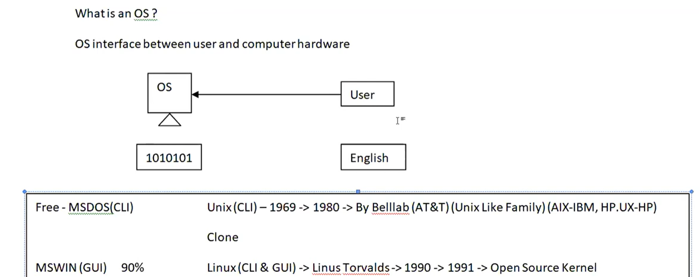

# 🐧 Linux Day 1 Notes
> Beginner Notes for DevOps + Development Journey  
> Current Level: Basics Started 🚀

---

# 📚 What I Learned Today

- What is Operating System
- OS works between User and Hardware
- CLI vs GUI
- Basic UNIX & Linux History
- Linux created by Linus Torvalds
- Open Source vs Closed Source
- Basic Linux Terms
- Windows vs Linux Basics

---

# 🖼️ Lecture Notes Images

## 📷 OS Basics




---

## 📷 Linux vs Windows + UNIX


---

# 🧠 What is Operating System (OS)?

## 📖 Definition

Operating System is software that works as interface between:

- User
- Computer Hardware

---

# 🔄 Simple Flow

```text
User → OS → Hardware
````

---

# 🌍 Real Life Example

Imagine:

| Real Life | Computer |
| --------- | -------- |
| Customer  | User     |
| Waiter    | OS       |
| Kitchen   | Hardware |

Customer gives order → Waiter tells kitchen.

Same:
User gives command → OS tells hardware.

---

# 💻 Types of Interface

---

# 1️⃣ CLI (Command Line Interface)

User types commands.

Example:

```bash
ls
pwd
mkdir
```

### ✅ Features

* Fast
* Lightweight
* Mostly used in Linux servers
* Important for DevOps

---

# 2️⃣ GUI (Graphical User Interface)

Uses:

* Mouse
* Icons
* Windows

Examples:

* Windows
* Ubuntu Desktop

---

# 3️⃣ TUI (Text User Interface)

Text-based screen interface.

---

# 🏛️ UNIX

## 📌 Important Points

* Developed in 1969
* Created at Bell Labs (AT&T)
* Mostly CLI based

---

# 🐧 Linux

## 👨 Created By

Linus Torvalds

## 📅 Released

1991

---

# 📖 What is Linux?

Linux is:

* Open Source
* UNIX-like OS
* Secure
* Powerful

---

# 🔓 Open Source vs Closed Source

| Open Source  | Closed Source |
| ------------ | ------------- |
| Code visible | Code hidden   |
| Mostly free  | Mostly paid   |
| Linux        | Windows       |

---

# 🪟 Windows vs Linux

| Windows       | Linux        |
| ------------- | ------------ |
| GUI focused   | CLI powerful |
| Closed source | Open source  |
| Paid          | Mostly free  |
| `.exe`        | `.rpm`       |

---

# 📦 RPM

```text
.rpm
```

RPM = Red Hat Package Manager

Used in:

* RHEL
* CentOS

---

# 📌 Important Terms

---

# 🧠 Kernel

Kernel is brain/core part of operating system.

Works between:

* Software
* Hardware

---

# 🐚 Shell

Shell helps user communicate with kernel.

---

# 🎯 Why Linux is Important?

Because:

* Servers use Linux
* AWS uses Linux
* Docker/Kubernetes use Linux
* DevOps tools mostly run on Linux

---

# 🧠 Interview Questions (Basics)

---

# ❓ What is OS?

> Operating System is software that acts as interface between user and hardware.

---

# ❓ What is Linux?

> Linux is an open-source UNIX-like operating system created by Linus Torvalds.

---

# ❓ What is Kernel?

> Kernel is core component of operating system.

---

# ❓ Difference Between Linux and Windows?

## Linux

* Open source
* Secure
* CLI powerful

## Windows

* Closed source
* GUI focused

---

# 🚀 My Learning Goal

* Linux
* DevOps
* Cloud
* Development
* Certifications

---

# 📅 Next Learning Plan

Tomorrow Learn:

* Linux Commands
* File System
* pwd
* ls
* cd
* mkdir
* touch

---

# 🏆 Day 1 Summary

Today I understood:
✅ What OS is
✅ Linux basics
✅ UNIX basics
✅ CLI vs GUI
✅ Kernel & Shell basics
✅ Open Source concept

---

```
