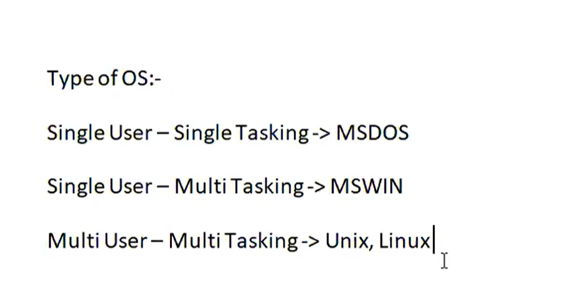
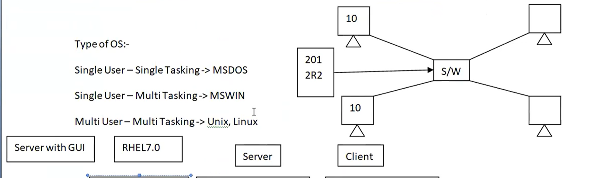
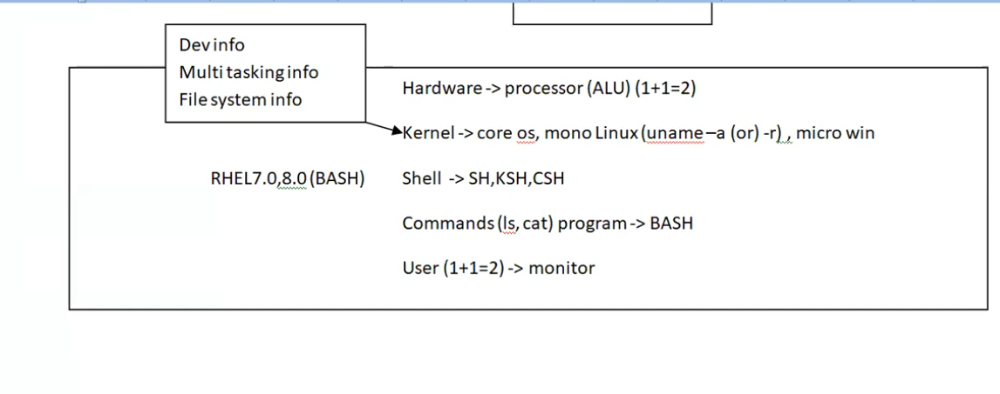
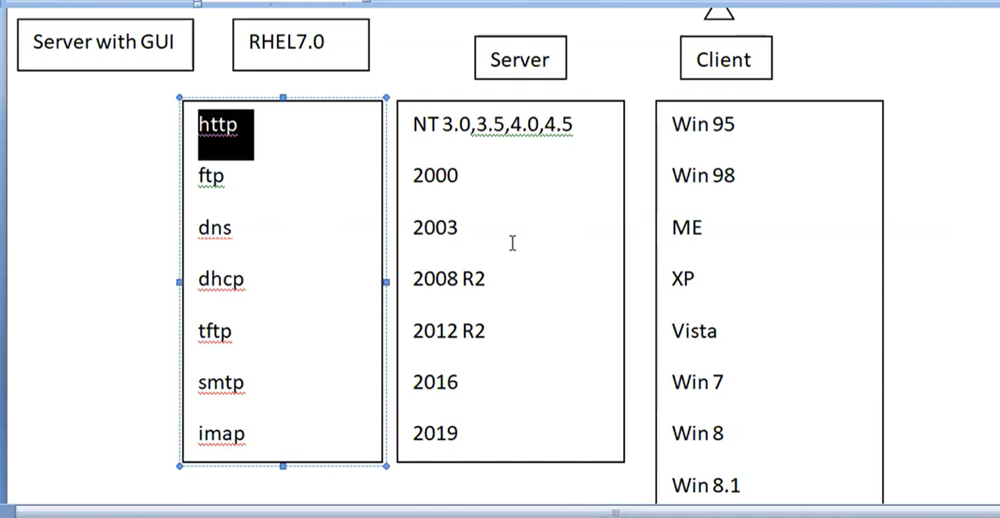

# 🐧 Linux Day 2 Notes

> DevOps + RHCSA + Linux Beginner Journey 🚀  
> Practical + Interview Revision Notes

---

# 📚 Topics Covered Today

- Types of Operating System
- Client vs Server
- Linux Architecture
- Kernel Basics
- Shell Basics
- Multi User & Multi Tasking
- Basic Networking Services

---

# 🖼️ Notes Images

## 📷 Types of Operating System



---

## 📷 Client Server Architecture



---

## 📷 Linux Architecture



---

## 📷 Server vs Client Difference



---

# 1️⃣ Types of Operating System

---

## 🖥️ Single User - Single Tasking

### 📌 Example

- MS-DOS

### 📖 Meaning

One user can perform:

- One task at a time

---

## 🖥️ Single User - Multi Tasking

### 📌 Example

- Windows

### 📖 Meaning

One user can perform:

- Multiple tasks simultaneously

### 📌 Example Tasks

- Browser
- VS Code
- Music

running together.

---

## 🖥️ Multi User - Multi Tasking

### 📌 Example

- UNIX
- Linux

### 📖 Meaning

Multiple users can:

- Access system
- Run multiple tasks

at the same time.

---

# 🎯 Why Linux is Powerful?

Linux supports:

✅ Multi User  
✅ Multi Tasking  
✅ Remote Access  
✅ Server Environment

---

# 2️⃣ Client vs Server

---

## 🧠 Client

Client requests services.

### 📌 Examples

- Laptop
- Mobile
- Browser

---

## 🧠 Server

Server provides services/resources.

### 📌 Examples

- Web Server
- Mail Server
- Database Server

---

# 🔄 Client Server Flow

```text
Client → Request → Server
Server → Response → Client
```

---

# 🌍 Real Life Example

| Real Life          | Computer |
| ------------------ | -------- |
| Customer           | Client   |
| Restaurant Kitchen | Server   |

---

# 🖥️ Client Operating Systems

### 📌 Examples

- Windows XP
- Windows 7
- Windows 10

### 📌 Used For

- Personal systems
- Desktop usage

---

# 🏢 Server Operating Systems

### 📌 Examples

- RHEL 7.0
- Windows Server 2008 R2
- Windows Server 2012

### 📌 Used For

- Hosting
- Networking
- Enterprise systems

---

# 📌 Important Server Services

| Service | Purpose                 |
| ------- | ----------------------- |
| HTTP    | Web Service             |
| FTP     | File Transfer           |
| DNS     | Domain Name Resolution  |
| DHCP    | Automatic IP Allocation |
| SMTP    | Send Emails             |
| IMAP    | Receive Emails          |

---

## 🌐 HTTP

Used for:

- Websites
- Web Applications

### 📌 Example

```text
google.com
```

---

## 📂 FTP

FTP = File Transfer Protocol

Used to:

- Transfer files between systems

---

## 🌍 DNS

DNS converts:

```text
google.com → IP Address
```

---

## 📡 DHCP

DHCP automatically provides:

- IP Address
- Network details

---

## 📧 SMTP

SMTP is used to:

- Send emails

---

## 📥 IMAP

IMAP is used to:

- Receive emails

---

# 3️⃣ Linux Architecture

---

# 📖 Linux Architecture Flow

```text
User
 ↓
Shell
 ↓
Kernel
 ↓
Hardware
```

---

## 👨 User

User gives commands.

### 📌 Example Commands

```bash
ls
pwd
cat
```

---

## 🐚 Shell

Shell acts as interface between:

- User
- Kernel

---

# 📌 Types of Shell

| Shell | Full Form          |
| ----- | ------------------ |
| SH    | Bourne Shell       |
| BASH  | Bourne Again Shell |
| KSH   | Korn Shell         |
| CSH   | C Shell            |

---

## 🧠 BASH

Most commonly used Linux shell.

Used for:

- Running commands
- Shell scripting

---

## ⚙️ Kernel

Kernel is the core part of Operating System.

### 📌 Responsibilities

- Memory Management
- Process Management
- Device Management
- File System Management

---

# 💻 Hardware

Includes:

- CPU
- RAM
- Hard Disk
- Devices

---

# 📌 Linux Uses Monolithic Kernel

```text
Linux → Monolithic Kernel
```

---

# 🛠️ Commands Learned Today

---

## 🔹 uname

Shows system information.

```bash
uname -a
```

---

## 🔹 ls

Lists files/directories.

```bash
ls
```

---

## 🔹 cat

Displays file content.

```bash
cat file.txt
```

---

# 🎯 Why Linux is Important in DevOps?

Because:

- AWS servers use Linux
- Docker runs on Linux
- Kubernetes uses Linux
- CI/CD tools mostly run on Linux

---

# 🧠 RHCSA / Interview Questions

---

## ❓ What is Multi User OS?

> Multi User OS allows multiple users to access system simultaneously.

---

## ❓ What is Multi Tasking?

> Ability to run multiple tasks at same time.

---

## ❓ What is Shell?

> Shell is interface between user and kernel.

---

## ❓ What is Kernel?

> Kernel is core component of operating system.

---

## ❓ What is DNS?

> DNS converts domain names into IP addresses.

---

## ❓ What is DHCP?

> DHCP automatically assigns IP addresses to devices.

---

## ❓ What is HTTP?

> HTTP is protocol used for web communication.

---

## ❓ What is FTP?

> FTP is protocol used for transferring files.

---

# 🏆 Day 2 Summary

Today I learned:

✅ Types of Operating System
✅ Multi User & Multi Tasking
✅ Client vs Server
✅ Linux Architecture
✅ Shell & Kernel
✅ Networking Services Basics

---

# 🚀 Next Learning Plan

Tomorrow Learn:

- pwd
- cd
- mkdir
- touch
- rm
- Linux File System
- Hidden Files

---

# 🎯 DevOps Roadmap

```text
Linux → Networking → Shell Scripting → AWS → Docker → Kubernetes
```

Strong Linux basics = Strong DevOps foundation 🚀

---

```

```
