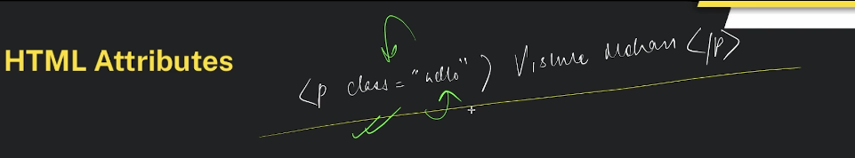
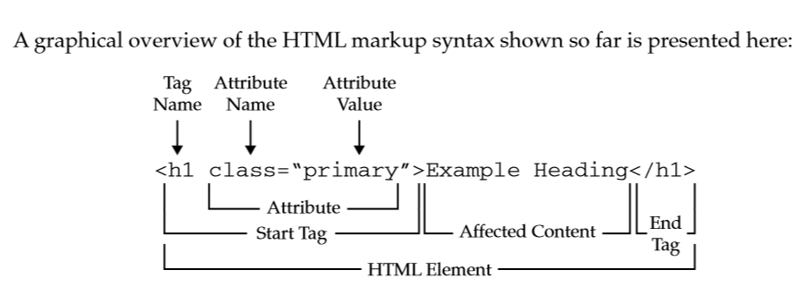
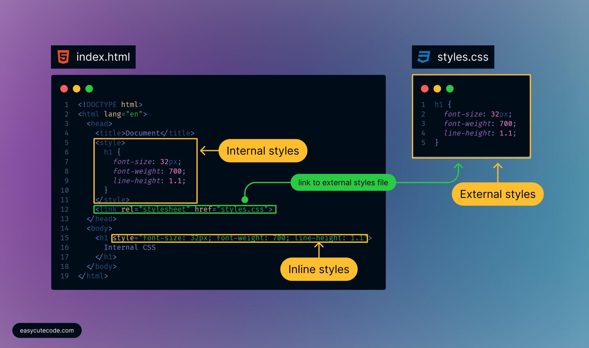
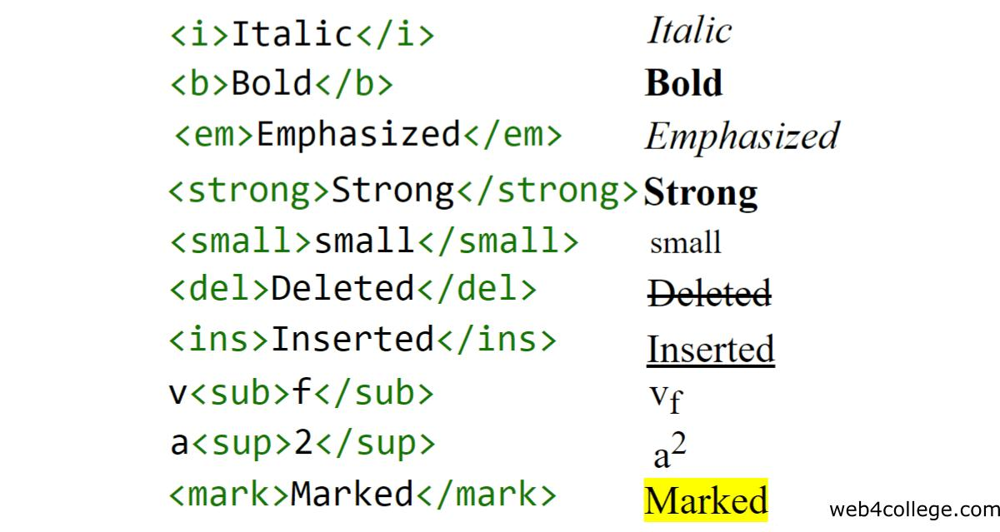
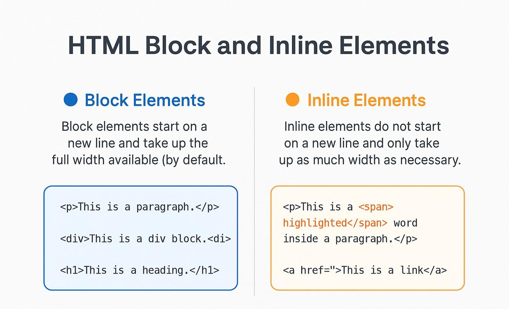
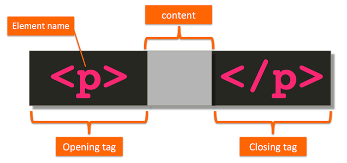

# HTML Fundamentals

## HTML Boilerplate


```html
<!DOCTYPE html>
<html lang="en">
<head>
  <meta charset="UTF-8" />
  <meta name="viewport" content="width=device-width, initial-scale=1.0" />
  <title>Document</title>
</head>
<body>
</body>
</html>
```

- `<!DOCTYPE html>` tells the browser this is HTML5.
- `<html>` is the root element.
- `<head>` contains metadata.
- `<body>` contains visible content.

## HTML Element




```html
<p>Hello World</p>
```

- Element = start tag + content + end tag.

## HTML Attributes





```html
<a href="https://example.com" title="Visit">Link</a>
```

- Attributes give extra information.
- `id` = unique
- `class` = group
- `title` = tooltip
- `style` = inline CSS
- `href` = link URL
- `src` = image source
- `alt` = image text

## Anchor Tag


```html
<a href="https://google.com" target="_blank" rel="noopener noreferrer">
  Open Google
</a>
```

- Used to create links.
- `target="_blank"` opens in a new tab.
- `rel="noopener noreferrer"` is for security.
- `mailto:` creates an email link.
- `tel:` creates a phone link.
- `#id` jumps to a section on the same page.

## CSS Types




```html
<p style="color: blue;">Text</p>

<style>
  p { color: yellow; }
</style>

<link rel="stylesheet" href="style.css" />
```

- Inline CSS: inside the tag.
- Internal CSS: inside `<style>`.
- External CSS: in a separate file.

## Formatting Tags




```html
<b>Bold</b>
<strong>Important</strong>
<i>Italic</i>
<em>Emphasis</em>
<u>Underline</u>
<mark>Highlight</mark>
<small>Small</small>
<del>Deleted</del>
<ins>Inserted</ins>
<sub>Subscript</sub>
<sup>Superscript</sup>
```

- `strong` and `em` add meaning.
- `b` and `i` are mainly visual.

## Inline vs Block Elements




### Inline Elements
- Do not start on a new line.
- Use only required width.
- Examples: `span`, `a`, `img`, `strong`

### Block Elements
- Start on a new line.
- Take full width.
- Examples: `div`, `p`, `h1`, `ul`

## Emmet



```html
!
div
ul>li
ul>li*3
h1+p
div.container
div#main
h1{Hello World}
input[type="text"]
ul>li.item$*3
div#app>ul.list>li.item$*3{Item $}
```

- `>` creates child elements.
- `+` creates sibling elements.
- `*` repeats elements.
- `.` adds class.
- `#` adds id.
- `{}` adds text.
- `[]` adds attributes.
- `$` adds numbering.

## Practice Files

### helloworld.html
- Boilerplate
- Attributes
- Formatting tags
- Inline CSS

### list.html
- Unordered list
- Nested list
- Anchor tag
