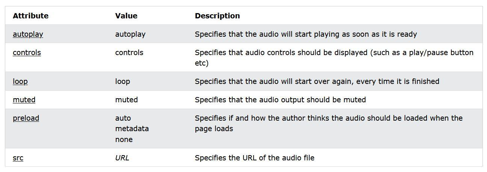

# 🌐 HTML Media & Embedding

---

# 🖼️ Image Tag (``)


## Definition

Used to display images on a webpage.

### Syntax

```html

```

### Example

```html

```

### Important Attributes

| Attribute | Purpose          |
| --------- | ---------------- |
| src       | Image source     |
| alt       | Alternative text |
| width     | Width of image   |
| height    | Height of image  |
| loading   | Lazy loading     |

---

# 🎵 Audio Tag (`<audio>`)


## Definition

Used to embed audio files.

### Syntax

```html
<audio controls>
  <source src="audio.mp3" type="audio/mpeg">
</audio>
```

### Example

```html
<audio controls>
  <source
    src="audio.mp3"
    type="audio/mpeg"
  >
</audio>
```

### Important Attributes

| Attribute | Purpose       |
| --------- | ------------- |
| controls  | Show controls |
| autoplay  | Auto play     |
| loop      | Repeat audio  |
| muted     | Mute audio    |

---

# 🎥 Video Tag (`<video>`)

## Definition

Used to embed video files.

### Syntax

```html
<video controls>
  <source src="video.mp4" type="video/mp4">
</video>
```

### Example

```html
<video width="400" controls>
  <source
    src="video.mp4"
    type="video/mp4"
  >
</video>
```

### Video Attributes



| Attribute | Purpose         |
| --------- | --------------- |
| controls  | Show controls   |
| autoplay  | Auto play       |
| loop      | Repeat video    |
| muted     | Mute video      |
| poster    | Thumbnail image |

---

# 🔄 Source Tag (`<source>`)

## Definition

Used inside audio and video elements to support multiple file formats.

### Example

```html
<video controls>

  <source
    src="video.mp4"
    type="video/mp4"
  >

  <source
    src="video.webm"
    type="video/webm"
  >

</video>
```

---

# 🌐 iFrame Tag (`<iframe>`)


## Definition

Used to embed another webpage inside a webpage.

### Syntax

```html
<iframe
  src="https://example.com">
</iframe>
```

### Example

```html
<iframe
  src="https://www.wikipedia.com"
  width="400"
  height="300"
>
</iframe>
```

---

## Important Attributes

| Attribute | Purpose          |
| --------- | ---------------- |
| src       | URL              |
| width     | Width            |
| height    | Height           |
| loading   | Lazy loading     |
| allow     | Permissions      |
| sandbox   | Restrict actions |

---

# 🔒 iFrame Security

### Example

```html
<iframe
  src="https://example.com"
  sandbox="allow-scripts"
  loading="lazy"
>
</iframe>
```

### Benefits

* Prevent XSS attacks
* Restrict malicious scripts
* Improve security

---

# 🛡️ Frame Ancestors

Used in Content Security Policy (CSP).

```http
Content-Security-Policy:
frame-ancestors 'none';
```

### Values

| Value  | Meaning          |
| ------ | ---------------- |
| 'none' | No embedding     |
| 'self' | Same domain only |
| URL    | Specific domains |

---

# 🎨 Canvas vs SVG

| Feature    | Canvas        | SVG              |
| ---------- | ------------- | ---------------- |
| Type       | Raster        | Vector           |
| Scaling    | Loses quality | No quality loss  |
| Styling    | JavaScript    | CSS + JavaScript |
| DOM Access | No            | Yes              |

---

# Quick Revision

## Image

* ``
* src
* alt
* width
* height

---

## Audio

* `<audio>`
* controls
* autoplay
* loop
* muted

---

## Video

* `<video>`
* controls
* poster
* autoplay
* loop

---

## Source

* `<source>`
* Multiple formats support

---

## iFrame

* `<iframe>`
* src
* width
* height
* sandbox

---

## Security

* sandbox
* frame-ancestors
* CSP

---

# Practice Files

## media.html

Concepts Covered

* Image Tag
* Video Tag
* Image Attributes

---

## audio.html

Concepts Covered

* Audio Tag
* Source Tag
* Audio Controls

---

## iframe.html

Concepts Covered

* iFrame
* Sandbox
* Loading
* Security Attributes
