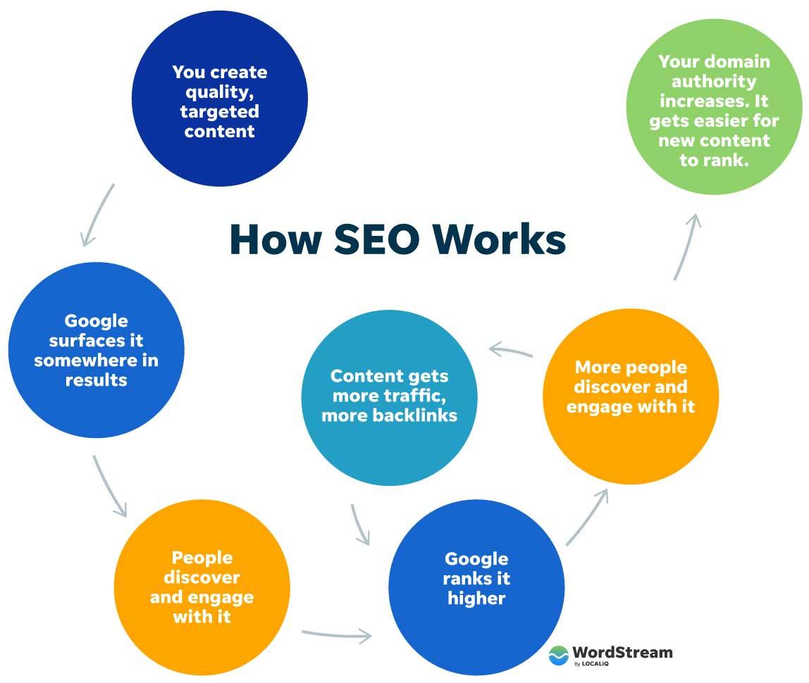
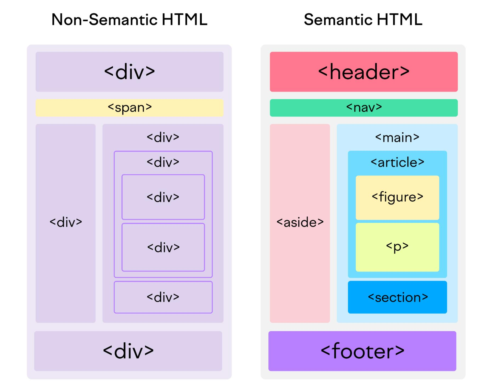
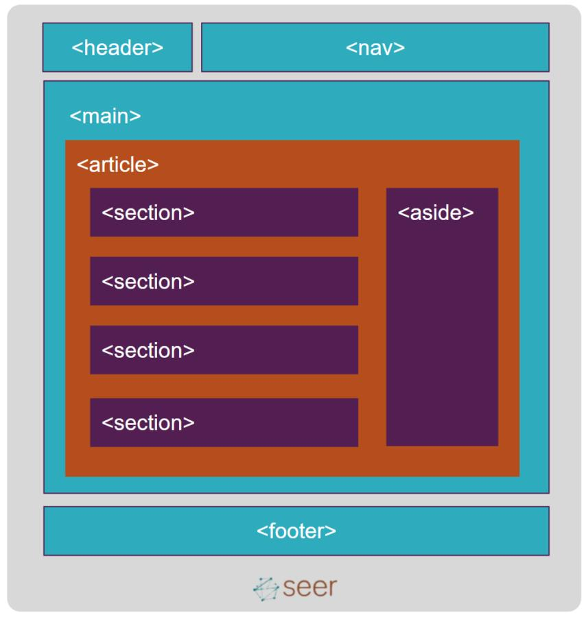
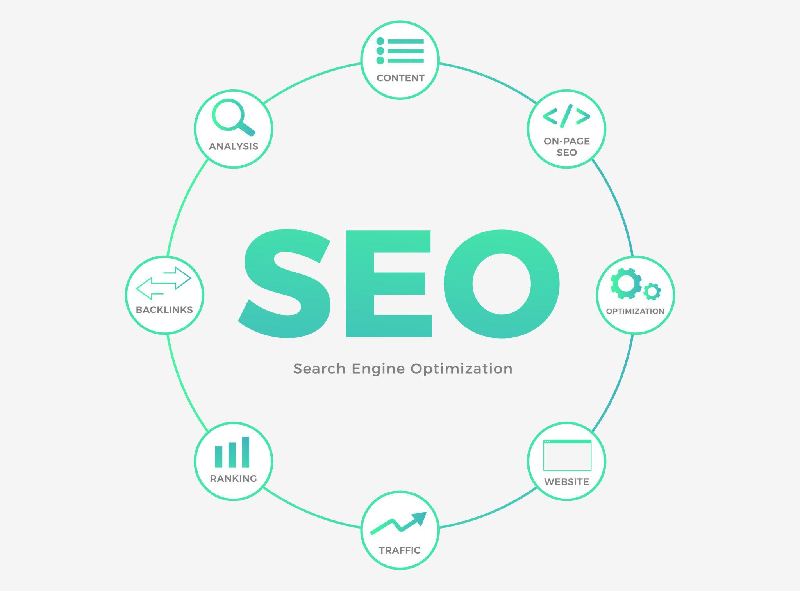
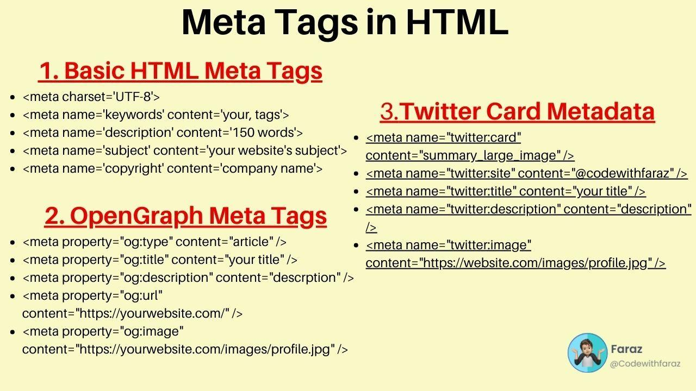
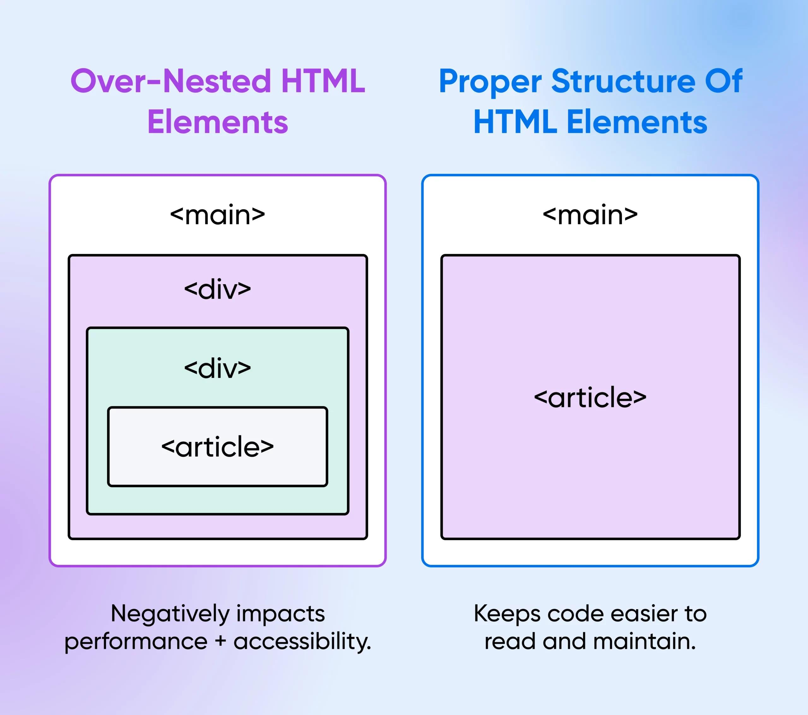

# 🌐 HTML SEO, Accessibility & Semantics

---

# ♿ Accessibility (a11y)



## Definition

Accessibility means making websites usable for everyone, including people with disabilities.

---

## Why Accessibility Matters

* Better user experience
* Improves SEO
* Helps screen readers
* Required in modern web development

---

## Alt Attribute

```html

```

Benefits:

* Screen reader support
* SEO improvement

---

## Labels

```html
<label for="email">
  Email
</label>

<input
  id="email"
  type="email"
>
```

Benefits:

* Better usability
* Better accessibility

---

## Semantic HTML





```html
<header></header>

<nav></nav>

<main></main>

<footer></footer>
```

Benefits:

* Better structure
* Better SEO
* Better accessibility

---

## ARIA Attributes

```html
<button
  aria-label="Close Menu"
>
  X
</button>
```

Used by assistive technologies.

---

## Keyboard Navigation

```html
<button tabindex="0">
  Click Me
</button>
```

Supports keyboard users.

---

# 🔍 SEO Basics



## What is SEO?

SEO (Search Engine Optimization) helps search engines understand and rank webpages.

---

## Important SEO Elements

### Title

```html
<title>
  My Website
</title>
```

---

### Description

```html
<meta
  name="description"
  content="Website Description"
>
```

---

### Viewport

```html
<meta
  name="viewport"
  content="width=device-width, initial-scale=1.0"
>
```

---

## Meta Tags



### Common Meta Tags

```html
<meta charset="UTF-8">

<meta
  name="viewport"
  content="width=device-width, initial-scale=1.0"
>

<meta
  name="description"
  content="Website Description"
>
```

---

# 🧾 HTML Entities



## Definition

Entities are used to display reserved and special characters.

---

## Common Entities

| Symbol | Entity    |
| ------ | --------- |
| <      | `&lt;`    |
| >      | `&gt;`    |
| &      | `&amp;`   |
| "      | `&quot;`  |
| ©      | `&copy;`  |
| ₹      | `&#8377;` |

---

## Example

```html
<p>
  5 &lt; 10
</p>

<p>
  &copy; 2026
</p>
```

---

# 🧠 Modern HTML5 Best Practices

## Use Semantic Tags

❌ Avoid

```html
<div></div>
```

✅ Prefer

```html
<section></section>
```

---

## Add Alt Attribute

```html

```

---

## Proper Heading Order

```html
<h1>Main</h1>

<h2>Section</h2>

<h3>Sub Section</h3>
```

---

## Clean Structure

* Proper indentation
* Meaningful names
* Avoid deep nesting

---

## Responsive Design

```html
<meta
  name="viewport"
  content="width=device-width, initial-scale=1.0"
>
```

---

# 🚀 HTML Final Revision

## HTML Basics

* HTML = Structure
* CSS = Styling
* JavaScript = Logic

---

## Important Tags

| Tag      | Purpose          |
| -------- | ---------------- |
| `<h1>`   | Heading          |
| `<p>`    | Paragraph        |
| `<a>`    | Link             |
| ``  | Image            |
| `<div>`  | Block Container  |
| `<span>` | Inline Container |

---

## Lists

```html
<ul>
  <li>Item</li>
</ul>

<ol>
  <li>Item</li>
</ol>
```

---

## Tables

```html
<table>
  <tr>
    <th>Name</th>
  </tr>

  <tr>
    <td>Om</td>
  </tr>
</table>
```

---

## Forms

```html
<form>

  <input
    type="text"
    required
  >

  <button>
    Submit
  </button>

</form>
```

---

## Media

```html


<audio>

<video>

<iframe>
```

---

## Semantic HTML

```html
<header>

<nav>

<main>

<footer>
```

---

## HTML Entities

```html
&lt;

&gt;

&amp;

&copy;
```

---

# Interview Revision

### What is HTML?

HTML is a markup language used to structure webpages.

---

### Difference Between Inline and Block Elements?

Inline elements take required width.

Block elements take full width.

---

### Why Use Semantic Tags?

* Better SEO
* Better Accessibility
* Better Readability

---

### Why is Alt Important?

* Accessibility
* SEO
* Screen Readers

---

### Difference Between GET and POST?

GET → Data visible in URL

POST → Data hidden from URL

---

### What Are HTML Entities?

Special codes used to display reserved characters.

---

# Quick Revision

* Accessibility
* SEO
* Meta Tags
* Semantic HTML
* HTML Entities
* Modern HTML5 Best Practices
* Interview Questions
