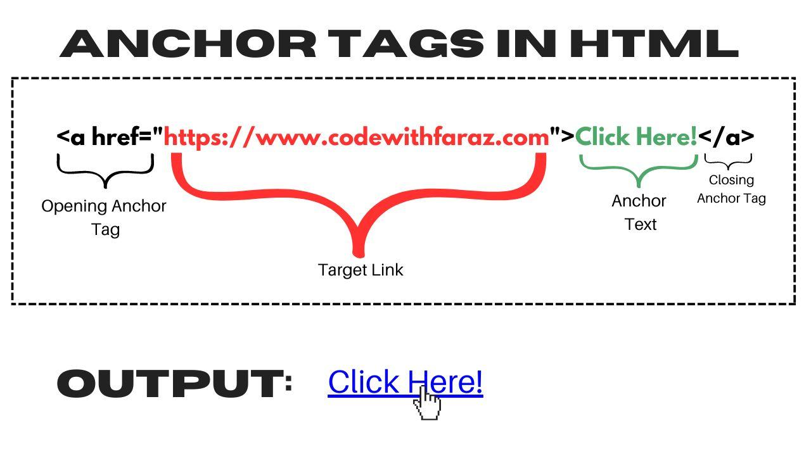

# 🌐 HTML Day 1 Notes

> Covers: Elements, Attributes, Formatting Tags, CSS Basics, Inline vs Block

---

# 🧩 HTML Structure


### 📌 Explanation

* HTML document starts with `<html>`
* Two main parts:

  * `<head>` → metadata
  * `<body>` → visible content

---

# 🧩 HTML Element


### ✅ Definition

An HTML element consists of:

```html
<start-tag> content </end-tag>
```

### 🔍 Example

```html
<p>Hello World</p>
```

---

# 🌍 HTML Attributes


### ✅ Common Attributes

* `id` → unique identifier
* `class` → group elements
* `title` → tooltip
* `style` → inline CSS
* `lang` → language

---

# 📘 HTML Attribute Reference


### 🔹 Important Attributes

| Attribute | Use          |
| --------- | ------------ |
| href      | Link URL     |
| src       | Image source |
| alt       | Image text   |
| style     | Inline CSS   |
| id        | Unique ID    |
| class     | Group        |
| title     | Tooltip      |

---

# 🔗 Attribute Structure


### ✅ Example

```html
<a href="https://example.com">Visit</a>
```

* `<a>` → element
* `href` → attribute
* `"URL"` → value
* `Visit` → content

---

# 🔗 Anchor Tag (`<a>`)



### 📌 Definition

The `<a>` (anchor) tag is used to create hyperlinks that connect one page to another.

---

### ✅ Syntax

```html
<a href="URL">Link Text</a>
```

---

### 🔍 Basic Example

```html
<a href="https://google.com">Visit Google</a>
```

---

### 🔹 Important Attributes

| Attribute  | Description                      |
| ---------- | -------------------------------- |
| `href`     | URL of the link                  |
| `target`   | Where to open the link           |
| `title`    | Tooltip text                     |
| `rel`      | Relationship with linked page    |
| `download` | Download file instead of opening |
| `id`       | Unique identifier                |
| `class`    | Group styling                    |

---

### 🎯 Target Attribute (Very Important)

| Value     | Meaning                    |
| --------- | -------------------------- |
| `_self`   | Open in same tab (default) |
| `_blank`  | Open in new tab            |
| `_parent` | Open in parent frame       |
| `_top`    | Open in full window        |

---

### 🔍 Example with Target

```html
<a href="https://google.com" target="_blank">Open Google</a>
```

---

### 🔹 rel Attribute (Security Important)

```html
<a href="https://google.com" target="_blank" rel="noopener noreferrer">
  Secure Link
</a>
```

👉 Prevents security issues when opening new tabs

---

### 🔹 Download Attribute

```html
<a href="file.pdf" download>Download PDF</a>
```

👉 Downloads file instead of opening

---

### 🔹 Email Link

```html
<a href="mailto:example@gmail.com">Send Email</a>
```

---

### 🔹 Phone Link

```html
<a href="tel:9876543210">Call Now</a>
```

---

### 🔹 Bookmark (Jump Link)

```html
<a href="#section1">Go to Section</a>

<h2 id="section1">Section 1</h2>
```

---

### 🧠 Interview Tips

* Anchor tag is used for navigation
* `href` is mandatory
* `target="_blank"` is commonly used
* Always use `rel="noopener noreferrer"` for security


---

# 🎨 CSS Types


---

### 🔹 1. Inline CSS

```html
<p style="color: blue;">Text</p>
```

---

### 🔹 2. Internal CSS

```html
<style>
p { color: yellow; }
</style>
```

---

### 🔹 3. External CSS

```html
<link rel="stylesheet" href="style.css">
```


---

# 📝 Formatting Tags


### 🔹 Text Formatting

```html
<b>Bold</b>
<strong>Important</strong>
<i>Italic</i>
<em>Emphasis</em>
<u>Underline</u>
<mark>Highlight</mark>
<small>Small</small>
<del>Deleted</del>
<ins>Inserted</ins>
<sub>Subscript</sub>
<sup>Superscript</sup>
```

---

# 📦 Inline vs Block Elements


---

## 🔹 Inline Elements

* Do NOT start on new line
* Take only required width

```html
<span></span>
<a></a>

<strong></strong>
```

---

## 🔹 Block Elements

* Start on new line
* Take full width

```html
<div></div>
<p></p>
<h1></h1>
<ul></ul>
```

---

# 🚀 Summary

* HTML is built using **elements**
* Attributes provide **extra information**
* CSS is used for **styling**
* Elements are:

  * Inline
  * Block

---

# ⭐ Pro Tip

👉 Always write clean HTML
👉 Don’t rely on browser auto-fix
👉 Practice daily

---

## 👨‍💻 Author

**OmBarabhai**
