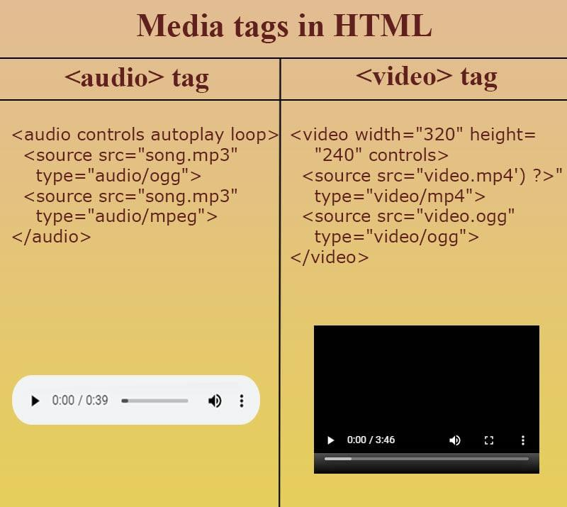

# 🌐 HTML Day 3 Notes

> Covers: Media Tags (Image, Audio, Video, iFrame, Canvas, SVG)

---

# 🖼️ Image Tag (``)


### 📌 Definition

Used to display images on a webpage.

### ✅ Syntax

```html

```

---

### 🔹 Important Attributes

| Attribute | Description                            |
| --------- | -------------------------------------- |
| src       | Image source                           |
| alt       | Alternative text (SEO + accessibility) |
| width     | Width of image                         |
| height    | Height of image                        |
| loading   | Lazy loading (`lazy`, `eager`)         |

---

# 🎵 Audio Tag (`<audio>`)



### 📌 Definition

Used to embed audio content.

### ✅ Example

```html
<audio controls>
  <source src="audio.mp3" type="audio/mpeg">
</audio>
```

---

### 🔹 Attributes

| Attribute | Use                |
| --------- | ------------------ |
| controls  | Show controls      |
| autoplay  | Play automatically |
| loop      | Repeat audio       |
| muted     | Mute sound         |

---

# 🎥 Video Tag (`<video>`)

### 📌 Definition

Used to embed video content.

### ✅ Example

```html
<video width="400" controls>
  <source src="video.mp4" type="video/mp4">
</video>
```

---

### 🔹 Attributes


| Attribute | Use             |
| --------- | --------------- |
| controls  | Show controls   |
| autoplay  | Auto play       |
| loop      | Repeat video    |
| muted     | Mute video      |
| poster    | Thumbnail image |

---

# 🔄 Source Tag (`<source>`)

### 📌 Use

Used inside `<audio>` and `<video>` to support multiple formats.

### ✅ Example

```html
<video controls>
  <source src="video.mp4" type="video/mp4">
  <source src="video.webm" type="video/webm">
</video>
```

---

# 🌐 iFrame Tag (`<iframe>`)


### 📌 Definition

Embeds another webpage inside your webpage.

### ✅ Example

```html
<iframe src="https://example.com" width="400" height="300"></iframe>
```

---

### 🔹 Important Attributes

| Attribute | Use                                   |
| --------- | ------------------------------------- |
| src       | Page URL                              |
| width     | Width                                 |
| height    | Height                                |
| loading   | Lazy loading                          |
| allow     | Permissions (camera, fullscreen etc.) |
| sandbox   | Restrict actions                      |

---

### 🔒 Security (VERY IMPORTANT)

```html
<iframe 
  src="https://example.com"
  sandbox="allow-scripts allow-same-origin"
  referrerpolicy="no-referrer"
></iframe>
```

👉 Prevents:

* XSS attacks
* Data leaks
* Malicious script execution

---

### 🛡️ frame-ancestors (ADVANCED SECURITY)

👉 Not an HTML attribute
👉 Used in **HTTP Headers (CSP)**

```http
Content-Security-Policy: frame-ancestors 'none';
```

---

### 📌 Meaning

| Value        | Meaning                       |
| ------------ | ----------------------------- |
| `'none'`     | No embedding allowed          |
| `'self'`     | Only same domain allowed      |
| specific URL | Only selected domains allowed |

---

### ⚠️ Why Important

👉 Prevents **Clickjacking attacks**

---

# 🎨 Canvas vs SVG

### 🔹 Difference Table

| Feature | Canvas  | SVG      |
| ------- | ------- | -------- |
| Type    | Raster  | Vector   |
| Scaling | Lossy   | No loss  |
| Control | JS only | JS + CSS |
| DOM     | No      | Yes      |

---

# 🧠 Interview Tips

* Always use `alt` in ``
* Use `<source>` for multiple formats
* Use `sandbox` in `<iframe>`
* Use CSP (`frame-ancestors`) for security
* Canvas = pixel-based
* SVG = vector-based

---

# 🚀 Summary

* `` → Images
* `<audio>` → Audio
* `<video>` → Video
* `<iframe>` → External pages
* Canvas / SVG → Graphics

---

## 👨‍💻 Author

**OmBarabhai**
