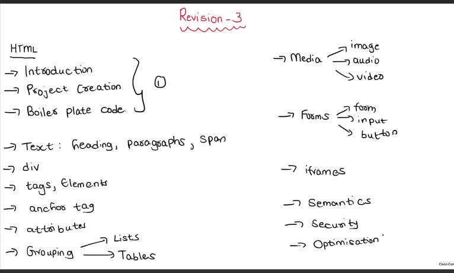
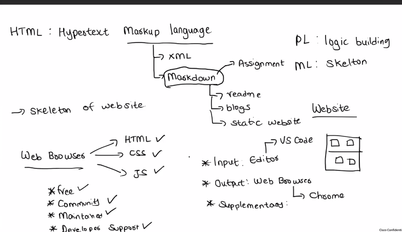
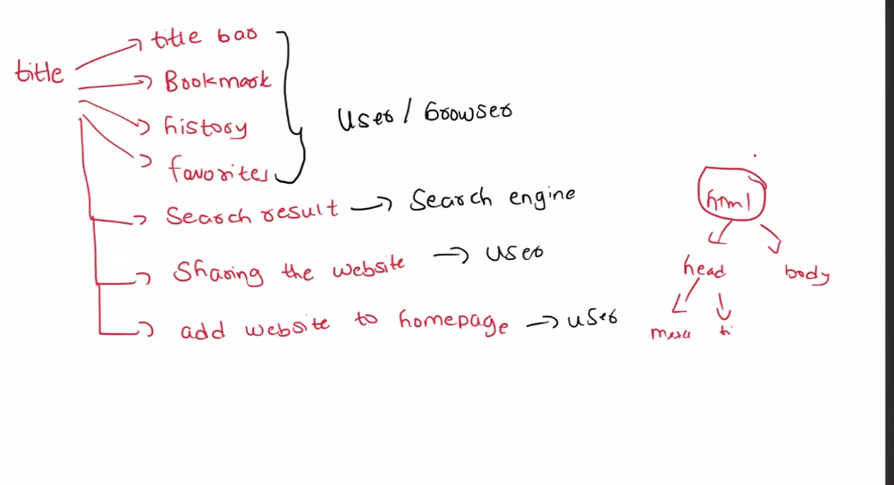
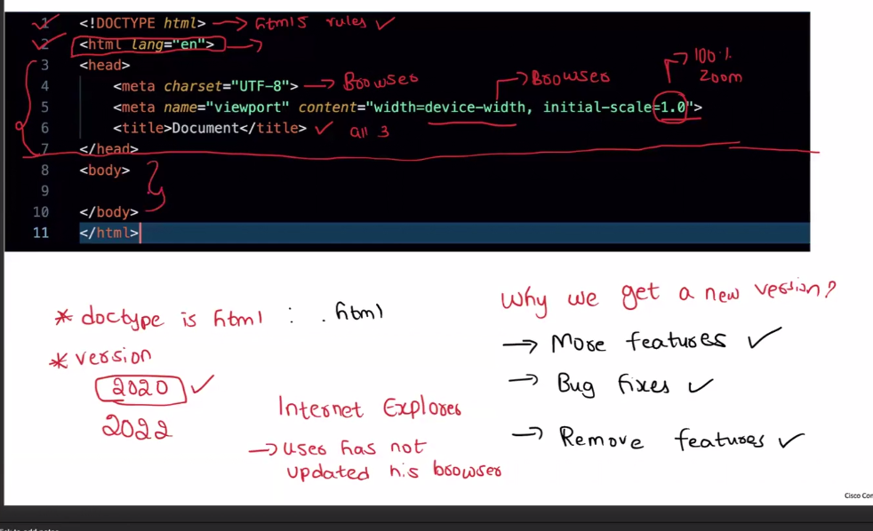
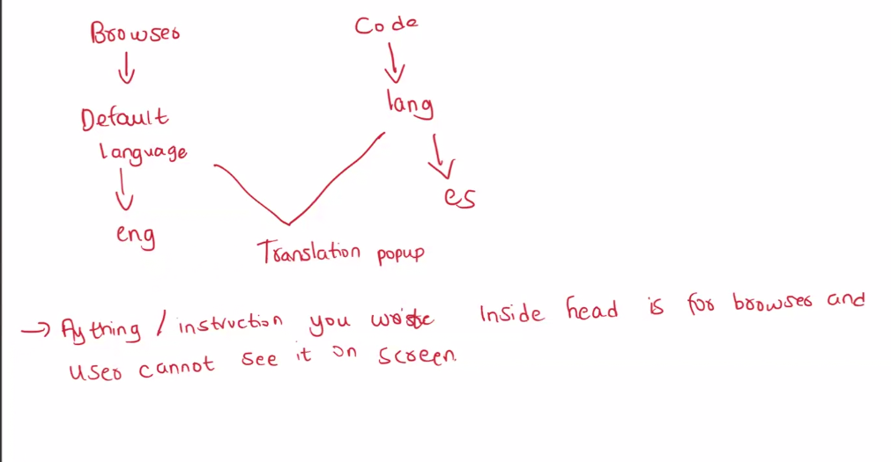

# 🖼️ Visual Revision Notes

## HTML Complete Roadmap



### Covers

* Introduction
* Boilerplate
* Text Elements
* Div & Span
* Tags & Elements
* Anchor Tags
* Attributes
* Lists
* Tables
* Media
* Forms
* iFrames
* Semantic HTML
* Accessibility
* SEO

---

## HTML Overview



### Key Points

* HTML = HyperText Markup Language
* HTML provides structure
* CSS provides styling
* JavaScript provides logic
* Browser renders webpages

---

## Charset & SEO


### Key Points

* UTF-8 supports:

  * Text
  * Numbers
  * Symbols
  * Emojis

* Meta Tags improve SEO

```html
<meta charset="UTF-8">

<meta
  name="viewport"
  content="width=device-width, initial-scale=1.0"
>
```

---

## HTML5 & DOCTYPE



```html
<!DOCTYPE html>
```

### Purpose

* Defines HTML5 document
* Enables modern browser support
* Supports backward compatibility

---

## HyperText



### Definition

HyperText means text containing links.

```html
<a href="https://example.com">
  Visit Website
</a>
```

---

## HTML Boilerplate



```html
<!DOCTYPE html>
<html lang="en">
<head>
  <meta charset="UTF-8">
  <meta name="viewport" content="width=device-width, initial-scale=1.0">
  <title>Document</title>
</head>
<body>

</body>
</html>
```

---

## HTML Navigation


### Concepts Covered

* index.html
* HTML file extensions
* Internal pages
* Website structure
* Backward compatibility
* Deprecated features

---

## Anchor Tag Navigation


### Types of Navigation

* Internal Link
* External Link
* Same Page Link
* Download Link

### Examples

```html
<a href="about.html">Internal Link</a>

<a href="https://google.com">
  External Link
</a>

<a href="#contact">
  Same Page Link
</a>

<a href="resume.pdf" download>
  Download Resume
</a>
```

### Anchor Tag Attributes

| Attribute                 | Purpose         |
| ------------------------- | --------------- |
| href                      | Destination URL |
| target="_blank"           | Open in New Tab |
| download                  | Download File   |
| rel="noopener noreferrer" | Security        |

---

## Rendering Flow


```text
HTML
 ↓
DOM
 ↓
Rendering Engine
 ↓
UI
```

---

## Accessibility & SEO


### Key Points

* Accessibility improves usability
* Accessibility improves SEO
* Semantic HTML improves structure
* Screen readers rely on semantic markup

### Accessibility = a11y

```text
Accessibility
a + 11 letters + y
= a11y
```

---
