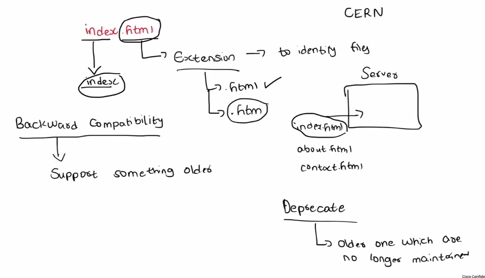
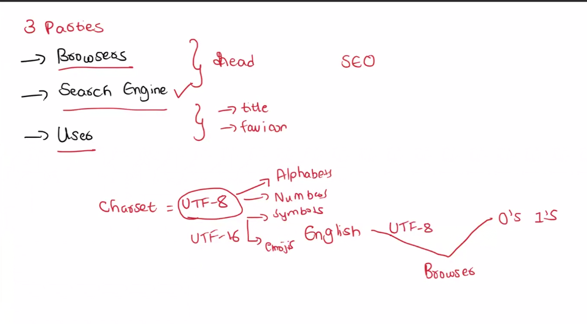
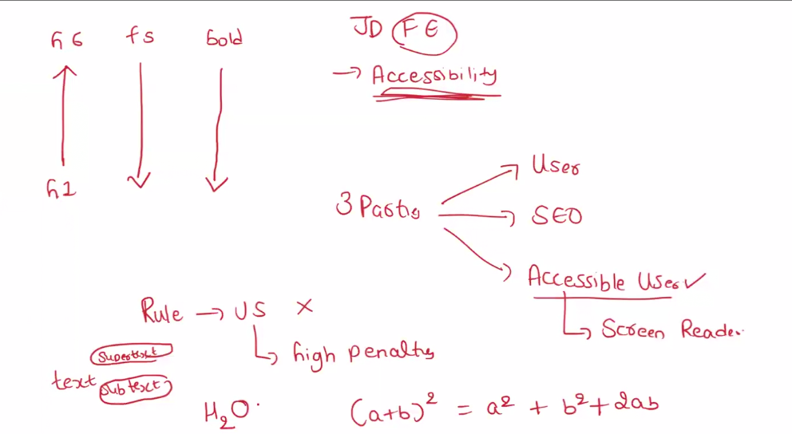
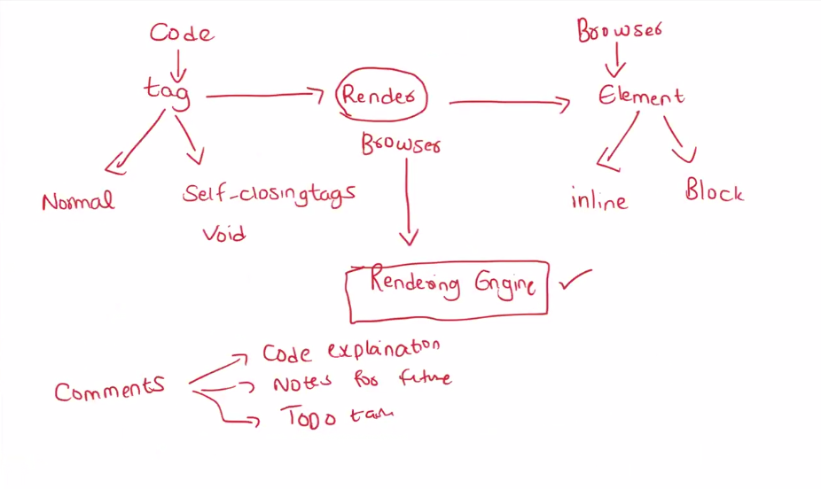
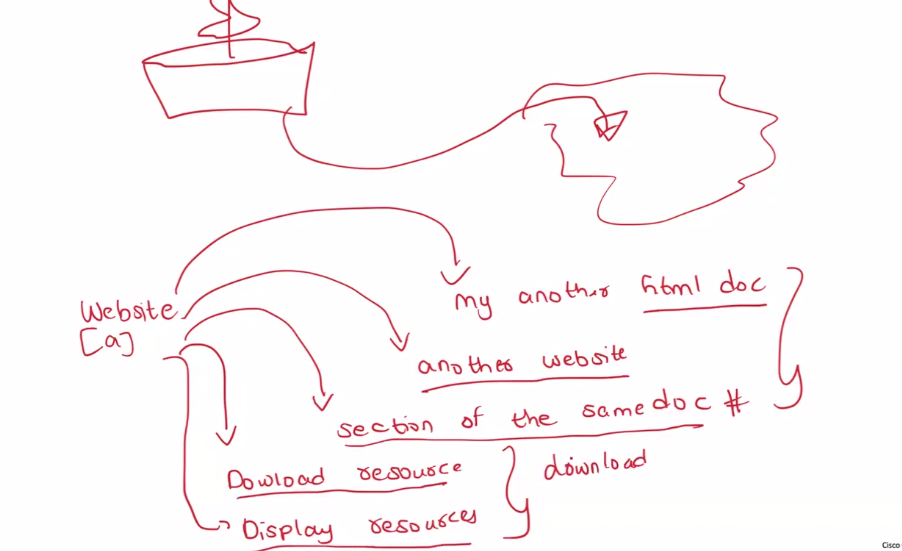

---

````md
# 🚀 HTML Complete Revision (Beginner → Interview Ready)

---

## 📌 What is HTML?

HTML (HyperText Markup Language) is used to create the structure of a website.

👉 HTML = Skeleton of website

---

## 🧠 What is HyperText?

HyperText means:
- Text that contains links
- Allows navigation between pages

👉 Example: Clicking a link takes you to another page

---

## 📝 What is Markdown?

Markdown is a lightweight markup language used to format text.

👉 Used in:
- README files
- Documentation
- Blogs

👉 Example:

# Heading  
**Bold**  
- List  

---

## 🧠 How Web Works

- You write code in editor (VS Code)
- Browser reads HTML
- Displays output

---

## 🧩 HTML vs CSS vs JS

- HTML → Structure  
- CSS → Styling  
- JS → Logic  

---

## 🏗️ Basic HTML Structure

```html
<!DOCTYPE html>
<html lang="en">
<head>
  <meta charset="UTF-8">
  <meta name="viewport" content="width=device-width, initial-scale=1.0">
  <title>Document</title>
</head>
<body>

</body>
</html>
````

---

## 🔍 Structure Explanation

* `<!DOCTYPE html>` → HTML5
* `<html>` → root
* `<head>` → browser info
* `<body>` → visible content

---

## 🔤 Charset & Language

```html
<meta charset="UTF-8">
<html lang="en">
```

👉 UTF-8 supports text, symbols, emoji

---

## 📄 Text Elements

* `<h1>` to `<h6>` → headings
* `<p>` → paragraph
* `<span>` → inline

---

## 🔗 Anchor Tag

```html
<a href="https://example.com">Visit</a>
```

👉 Used for navigation

---

## 🧱 Div & Span

* `<div>` → block
* `<span>` → inline

---

## 📋 Lists

```html
<ul><li>Item</li></ul>
<ol><li>Item</li></ol>
```

---

## 📊 Tables

```html
<table>
  <tr>
    <td>Data</td>
  </tr>
</table>
```

---

## 🖼️ Media

```html

<audio></audio>
<video></video>
```

---

## 📝 Forms

```html
<form>
  <input type="text">
  <button>Submit</button>
</form>
```

---

## 🌐 iFrame

```html
<iframe src="https://example.com"></iframe>
```

---

## 🧠 Semantic Tags

* `<header>`
* `<footer>`
* `<section>`

👉 Improves SEO

---

## 🔎 SEO Basics

* Title → search result
* Meta → browser + SEO

---

## ⚠️ Important Concepts

* Head → not visible
* Body → visible
* HTML is not a programming language
* index.html = default file

---

## 🖼️ Diagrams











---

# 🎤 Image-Based Interview Questions + Answers

---

## 🟢 Image 1 (Basics)

**Q1: What are HTML tags and elements?**
👉 Tag is `<p>`
👉 Element is `<p>Text</p>`

**Q2: Heading vs Paragraph?**
👉 Heading → titles
👉 Paragraph → content

**Q3: What is span?**
👉 Inline text grouping

---

## 🟡 Image 2 (Rendering)

**Q4: How browser renders HTML?**
👉 HTML → DOM → Rendering Engine → UI

**Q5: What is rendering engine?**
👉 Converts code to UI

**Q6: Block vs Inline?**
👉 Block → full width
👉 Inline → content width

**Q7: Self-closing tags?**
👉 ``, `<br>`

---

## 🟠 Image 3 (Navigation)

**Q8: Types of navigation?**
👉 Internal / External

**Q9: What is # navigation?**
👉 Jump within page

**Q10: Download attribute?**
👉 Forces file download

---

## 🔵 Image 4 (Code)

**Q11: Viewport meta?**
👉 Makes responsive

**Q12: Title tag?**
👉 Tab + SEO

**Q13: strong vs em vs mark vs u?**
👉 bold / italic / highlight / underline

---

## 🟣 Image 5 (Charset)

**Q14: UTF-8?**
👉 Character encoding

**Q15: Why charset?**
👉 Prevents errors

**Q16: SEO reading?**
👉 Tags + meta

---

## 🔴 Image 6 (Version)

**Q17: DOCTYPE?**
👉 HTML version

**Q18: HTML5?**
👉 Modern features

**Q19: Backward compatibility?**
👉 Supports older systems

---

## ⚫ Image 7 (HyperText)

**Q20: HyperText?**
👉 Linking

**Q21: Internal vs External links?**
👉 Same vs other site

---

## 🟤 Image 8 (Accessibility)

**Q22: Accessibility?**
👉 Usable for all

**Q23: Semantic tags?**
👉 Better SEO

**Q24: HTML & SEO?**
👉 Proper structure helps ranking


---

## 🟤 Image 8 (Accessibility + SEO + Headings)

**Q25: Why proper heading order (h1 → h6) is important?**  
👉 Helps SEO + improves readability  

**Q26: What are the 3 main priorities in HTML?**  
👉 User  
👉 SEO  
👉 Accessibility  

**Q27: What is accessibility?**  
👉 Making websites usable for everyone (including disabled users)  

**Q28: What is screen reader?**  
👉 Tool that reads content for visually impaired users  

**Q29: What happens if we ignore accessibility rules?**  
👉 Bad user experience + SEO penalty  

---

## 🟠 Image 9 (Rendering + Tags Deep Understanding)

**Q30: What is difference between tag and element?**  
👉 Tag → `<p>`  
👉 Element → `<p>Text</p>`  

**Q31: What are types of tags?**  
👉 Normal tags  
👉 Self-closing (void) tags  

---

**Q32: What is rendering?**  
👉 Process of converting HTML → visible UI  

---

**Q33: What is rendering engine?**  
👉 Browser component that displays content  

---

**Q34: What are block and inline elements?**  
👉 Block → takes full width  
👉 Inline → takes content width  

---

**Q35: Why comments are used in HTML?**  
👉 Code explanation  
👉 Notes for future  
👉 Debugging  

---

## 🔵 Image 10 (Navigation + Linking Deep)

**Q36: What are different types of links in HTML?**  
👉 Internal (same project)  
👉 External (other website)  
👉 Same page (#id)  
👉 File download  

---

**Q37: What is same-page navigation?**  
👉 Using `#id` to jump inside page  

---

**Q38: What is download attribute in anchor tag?**  
👉 Downloads file instead of opening  

---

**Q39: What happens when we click a link?**  
👉 Browser loads:
- Another HTML page  
- Another website  
- Section of same page  
- Resource (image/file)  

---

**Q40: What are resources in HTML?**  
👉 Files like images, PDFs, videos  

---

## 🎯 FINAL MASTER LINE (VERY IMPORTANT)

HTML is a markup language used to structure web pages. It works with browsers to render content and supports navigation, SEO, accessibility, and linking between resources.

---

## 🚀 Quick Revision

* HTML = structure
* Tags = building blocks
* HyperText = linking
* Head = metadata
* Body = content
