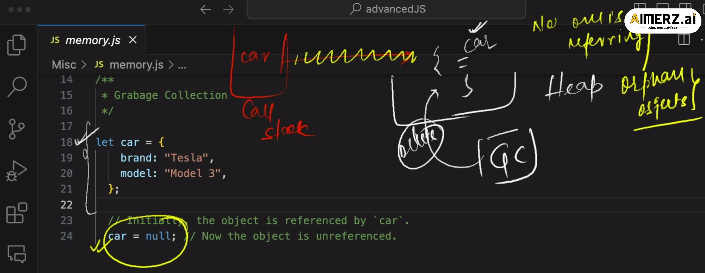
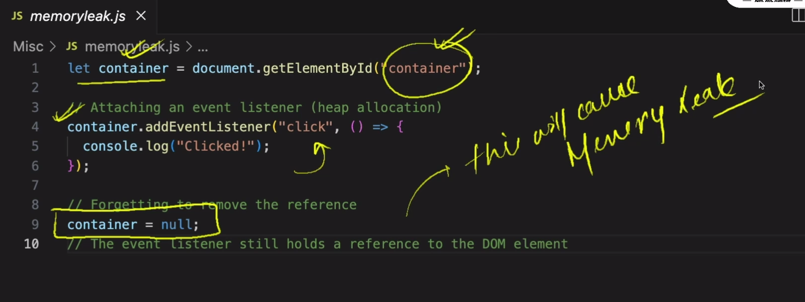

# JavaScript Garbage Collection (GC)



---

# What is Garbage Collection?

Garbage Collection (GC) is the process of automatically removing unused objects from memory.

JavaScript automatically manages memory using a Garbage Collector.

---

# Why Garbage Collection is Needed

Objects stored in heap memory occupy memory space.

If unused objects are not removed:

* memory usage increases
* application becomes slow
* memory leaks can occur

Garbage Collection helps free unused memory automatically.

---

# Core Idea of Garbage Collection

Garbage Collection works using:

```text id="x9m1q4"
Reachability
```

If an object can still be reached from variables or references:

```text id="v4n7k2"
object stays in memory
```

If no reference can reach it anymore:

```text id="j6m3x8"
object becomes unreachable
```

Then Garbage Collector removes it later.

---

# Stack vs Heap

| Stack Memory          | Heap Memory              |
| --------------------- | ------------------------ |
| Stores references     | Stores actual objects    |
| Organized             | Dynamic                  |
| Fast                  | Flexible                 |
| Automatically cleared | GC cleans unused objects |

---

# Example 1 — Reachable Object

```js id="w8m2k5"
let car = {
   brand: "Tesla",
   model: "Model 3"
};
```

---

# Memory Representation

## Stack

```text id="c4x9m7"
car → 0x101
```

---

# Heap

```text id="f7k2q1"
0x101 → {
   brand: "Tesla",
   model: "Model 3"
}
```

---

# Understanding

The variable `car` stores the reference in stack memory.

The actual object lives in heap memory.

Since:

```text id="u3m8v1"
car → object
```

JavaScript can still access the object.

So Garbage Collector will NOT remove it.

---

# Removing the Reference

```js id="n6x1q5"
car = null;
```

---

# Stack After null

```text id="r2m7k4"
car → null
```

---

# Heap Still Contains Object

```text id="b9v4x1"
0x101 → {
   brand: "Tesla",
   model: "Model 3"
}
```

---

# What Happened?

The object still exists temporarily in heap memory.

BUT:

```text id="q5m8n2"
No variable points to it anymore
```

Now object becomes:

```text id="y1v6k7"
Unreachable Object
```

Garbage Collector later removes it.

---

# Important Understanding 🔥

Garbage Collector removes objects ONLY when:

```text id="d7m4x9"
No reachable references exist
```

---

# Why JS Cannot Remove Object Earlier

Example:

```js id="m5q1k8"
let car = {
   brand: "Tesla"
};

console.log(car.brand);
```

As long as reference exists:

```text id="p8v3m2"
JS assumes object may still be needed
```

So it cannot remove memory.

---

# JavaScript Rule

```text id="z2x7n5"
Reachable object → Keep it

Unreachable object → Remove later
```

---

# Reachability Visualization

## Reachable

```text id="g6m1v8"
ROOT
 ↓
car → object
```

Object stays in memory ✅

---

# Unreachable

```js id="s9q4k2"
car = null;
```

```text id="x3m7v1"
ROOT

car → null


object ❌
```

No path exists to object.

GC removes it later 🗑️

---

# Example 2 — Multiple References

```js id="v1k8m5"
let user = {
   name: "Vishwa"
};

let admin = user;
```

---

# Memory Representation

```text id="q7m2x4"
user ─┐
      ├──→ object
admin ┘
```

---

# Remove One Reference

```js id="m4v9k1"
user = null;
```

Object is STILL reachable because:

```text id="r8x2m6"
admin → object
```

So GC cannot remove it.

---

# Remove All References

```js id="b5q1v7"
admin = null;
```

Now:

```text id="u2m8k4"
No references remain
```

Object becomes unreachable.

GC removes it later.

---

# Example 3 — Function Scope

```js id="x1m5q9"
function test() {

   let person = {
      name: "Alice"
   };

}

test();
```

---

# What Happens?

The object is reachable only inside the function.

After function execution finishes:

```text id="w6v2k8"
person variable destroyed
```

No references remain.

Heap object becomes unreachable.

GC removes it later.

---

# Mark and Sweep Algorithm

JavaScript engines use:

```text id="n7m3x1"
Mark and Sweep
```

---

# Step 1 — Mark Phase

JavaScript starts from ROOT references:

* global variables
* local variables
* active function references

Then marks all reachable objects.

---

# Step 2 — Sweep Phase

Objects NOT marked:

```text id="k1v8m4"
removed from heap memory
```

because they are unreachable.

---

# Does GC Remove Code?

NO ❌

Garbage Collector removes:

```text id="p6x2m9"
runtime objects from memory
```

NOT your JavaScript source code.

---

# Example

```js id="t8m4q1"
let car = {
   brand: "Tesla"
};

car = null;
```

GC removes:

```text id="f3v7k2"
{ brand: "Tesla" }
```

from heap memory later.

BUT this code still exists:

```js id="h9x1m6"
let car = {
   brand: "Tesla"
};

car = null;
```

---

# Real-Life Analogy 😂

Imagine a hostel locker.

As long as someone has the locker key:

```text id="y5m2k7"
locker is reachable
```

Hostel cannot clean it.

---

# Returning the Key

```text id="n4v8x1"
No one owns locker anymore
```

Hostel management says:

```text id="m7q3k5"
"This locker is unused"
```

Then later:

```text id="x2v6m9"
clean the locker 🧹
```

This is Garbage Collection.

---

# Memory Leaks

Memory leak happens when:

```text id="g8m1x4"
objects are still reachable
BUT no longer useful
```

GC cannot remove them.

Memory usage keeps increasing.

---

# Cricket Player Analogy 🏏😂

Imagine a cricket team keeps selecting a famous player.

BUT:

```text id="r5x2m8"
player gives no performance
```

Still:

* occupying team spot
* blocking new players
* reducing team performance

This is exactly like a Memory Leak.

---

# Mapping

| Cricket Team            | JavaScript              |
| ----------------------- | ----------------------- |
| Player still selected   | Object still referenced |
| No performance          | Object no longer useful |
| Occupying team position | Occupying memory        |
| Selector won't remove   | GC cannot remove        |
| Team becomes slow       | App becomes slow        |

---

# Example — Growing Array Leak

```js id="v3m7k1"
let cache = [];
```

```js id="w1x8m4"
function store(data) {

   cache.push(data);
}
```

Since:

```text id="p2v6k9"
cache still references objects
```

GC cannot clean memory.

Memory keeps growing.

---

# Common Causes of Memory Leaks

| Cause              | Example                |
| ------------------ | ---------------------- |
| Global variables   | Huge arrays            |
| Event listeners    | Not removed            |
| Timers             | setInterval            |
| Closures           | Unnecessary references |
| Detached DOM nodes | Hidden references      |

---

# Preventing Memory Leaks

* Remove unused references
* Clear intervals/timeouts
* Remove event listeners
* Avoid unnecessary globals
* Limit cache sizes

---

# Important Notes

* Garbage collection is automatic
* Developers cannot manually free memory
* Developers only remove references
* JavaScript decides when to clean memory

---

# Golden Interview Line

> JavaScript Garbage Collection works on reachability. Objects that cannot be reached from active references become eligible for garbage collection, while memory leaks happen when unnecessary objects remain reachable.

---
# JavaScript Memory Leaks



---

# What is a Memory Leak?

A memory leak happens when:

```text id="w3m8q1"
memory is no longer needed
BUT still cannot be removed
```

So memory usage keeps increasing over time.

---

# Simple Definition

> A memory leak occurs when objects remain reachable in memory even though they are no longer useful.

---

# Why Memory Leaks Are Dangerous

Memory leaks can cause:

* Increased RAM usage
* Slow applications
* Browser lag
* Frequent garbage collection
* App crashes

---

# Important Concept

Garbage Collector removes ONLY:

```text id="m5v2x7"
unreachable objects
```

If an object is still reachable:

```text id="k1q8m4"
GC cannot remove it
```

even if it is useless.

---

# Event Listener Memory Leak

```js id="p4m7x1"
let container = document.getElementById("container");

container.addEventListener("click", () => {
   console.log("Clicked!");
});

container = null;
```

---

# What Developers Think

Developer thinks:

```text id="v8m3q2"
"container = null means object removed"
```

BUT actually:

```text id="n6x1k5"
event listener still holds reference
```

So object is STILL reachable.

---

# Memory Leak Happens

Because:

```text id="f7m2v9"
event listener → DOM element
```

reference still exists.

Garbage Collector sees:

```text id="r4x8m1"
reachable object
```

So memory CANNOT be cleaned.

---

# Visualization

## Stack

```text id="u2m5k7"
container → null
```

---

# Heap

```text id="b9x1m4"
DOM Element
   ↓
Event Listener
   ↓
Callback Function
```

Still connected ✅

So GC keeps it.

---

# Why This Causes Leak

Even though:

```text id="x1q7m5"
developer no longer uses container
```

event listener still references it internally.

Object becomes:

```text id="g4m8v2"
reachable BUT useless
```

This is Memory Leak.

---

# Correct Way

Remove event listener before removing reference.

```js id="m8x2q1"
function handleClick() {
   console.log("Clicked!");
}

container.addEventListener("click", handleClick);

container.removeEventListener("click", handleClick);

container = null;
```

---

# Real-Life Analogy 😂

Imagine:

```text id="p7m1x4"
Hostel room vacated
```

BUT:

```text id="d5q8m2"
someone still has room key
```

Hostel management says:

```text id="y2m6v1"
"Room is still assigned"
```

So room cannot be cleaned.

This is exactly how memory leaks happen.

---

# Reachable But Useless 🔥

Most important concept:

```text id="v1x7m5"
Object is STILL reachable
BUT no longer useful
```

GC cannot remove it.

---

# Common Causes of Memory Leaks

| Cause              | Example                |
| ------------------ | ---------------------- |
| Event listeners    | Not removed            |
| Timers             | setInterval            |
| Global variables   | Huge arrays            |
| Closures           | Unnecessary references |
| Detached DOM nodes | Hidden references      |

---

# Symptoms of Memory Leaks

* RAM usage continuously increases
* Application slows over time
* Browser becomes sluggish
* Frequent GC pauses
* Crashes after long runtime

---

# How to Prevent Memory Leaks

* Remove event listeners
* Clear intervals/timeouts
* Remove unused references
* Avoid unnecessary globals
* Limit cache sizes

---

# Golden Interview Line

> Memory leaks occur when objects remain reachable in memory even though they are no longer needed, preventing Garbage Collection from freeing that memory.

---
